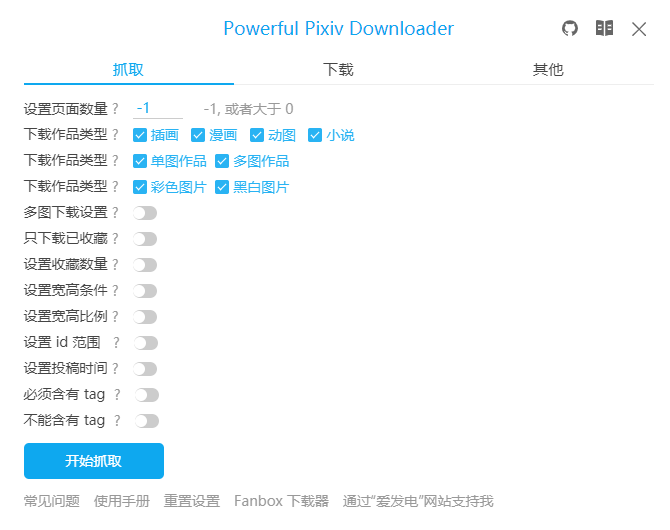

# 了解设置面板

安装本程序后，打开 Pixiv 页面，可以在网页右侧看到蓝色的下载按钮：

点击下载按钮可以打开设置面板：

设置面板分为 3 个功能区：

1. 抓取区域，可以设置抓取时的筛选条件，以及可用的抓取按钮。
2. 下载区域，负责文件的命名规则、下载控制。需要先完成抓取才可以进行下载。
3. 其他设置区域，这里显示的是不能归类到前两者里面的设置项、按钮。

使用时，按照顺序，先设置下载条件，然后开始抓取。抓取完毕后，再进行下载。

## 开启和关闭设置面板

有 3 种方法开关设置面板。

1. 点击网页右侧显示的下载按钮打开设置面板。

点击设置面板右上角的关闭按钮，可以关闭设置面板。

2. 点击本扩展的图标。

可以切换设置面板的打开/关闭状态。

3. 键盘快捷键 `Alt` + `x`。

可以切换设置面板的打开/关闭状态。

?>如果设置面板处于显示状态，点击页面空白区域可以关闭设置面板。
