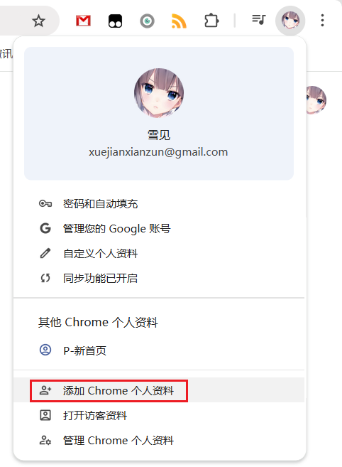
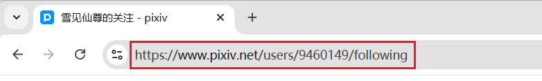

如果你经常大量抓取和下载作品（例如平均每天下载几千个作品），可能会导致你的 pixiv 账号被封禁。如果你有这种需求，建议使用小号来抓取。

?> 小号也可以抓取大号的公开收藏、关注的用户，只要打开对应的网址即可。因此你可以正常使用大号关注用户、收藏作品，并在需要时使用小号来下载。

## 注册小号

你可以使用多个邮箱地址来注册多个账号。

## 在独立的环境里使用小号

你可以使用多个浏览器，例如 Chrome 登录大号，Edge 登录小号。

不过我更推荐只使用一个浏览器，这样更方便。

点击浏览器右上角的头像按钮，即可新建一个配置（本地浏览器用户）。例如 Chrome 浏览器可以从这里添加新的个人资料：

当你使用新添加的浏览器用户时，Chrome 会打开一个独立的浏览器窗口，你可以在里面登录小号，并安装这个扩展程序来使用。

## 如何下载大号的数据

如果你想在大号的关注页面、收藏页面里下载，可以先用大号进入对应的页面，并复制地址栏里的 URL：

在小号的浏览器里粘贴 URL 并回车，就可以进入大号的对应页面里，进行抓取和下载。

