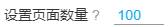

# 使用技巧

## 命名标记

合理使用命名标记或许会对你有帮助。

- 把 `{bmk}` 标记放到文件名的最前面，可以让下载后的文件按收藏数排序。 
- 在作品列表页，推荐使用 `{user}` 做文件夹名字。
- 在 tag 列表页和搜索页，推荐使用 `{p_tag}` 做文件夹名字。
- 在排行榜页面，可以把 `{rank}` 标记放到文件名的最前面，可以让下载的文件的文件里里附带排名。
- `{p_title}` 是万能的，所有页面都可以用。

## 建立文件夹

在命名规则里使用斜线 `/` ，斜线前面的部分会作为文件夹的名字。如：

`{user}/id`

`{p_title}/{id}-{user}-{tags}`

## 增量更新

所谓增量更新，是指以前下载过画师/或者某些页面里的作品，一段时间后，有了新的作品，想要只下载新的，不再重复下载以前下载过的作品。

### 使用“不下载重复文件”的功能

现在最新版本已经添加了“不下载重复文件”的功能，算是某种程度上实现了增量更新。从 6.6.0 版本开始，下载器会保存下载记录，如果这个文件有过下载记录，以后就可以识别出它是重复文件，从而避免重复下载。

----------

如果以前你下载过一些文件，但是没有下载记录，那么可以考虑使用“设置 id 范围” 或 “设置投稿时间” 的选项。

下面我来举一些详细例子。

### 1. 以前下载过某个画师的图片，想下载后来新投稿的作品

打开画师的作品列表页面，找到上次下载到的最后一个作品，进入这个作品的页面，使用按钮“从本页开始抓取新作品”，这样也会只下载新的作品。

你也可以使用 “设置 id 范围” 或 “设置投稿时间” 选项。

### 2. 以前下载过自己收藏里的图片，想下载后来收藏的作品

收藏页面不太好处理，因为里面的作品不是按 id 大小排序的，而是按收藏时间排序的。

从第 1 页往后翻，看看上次下载到了第几页。比如上次下载到了第 5 页，那么从第 1 页到第 5 页里是后来收藏的作品。

这时候回到第 1 页，在设置面板里设置“设置页面数量”为 5，也就是要下载的页面范围。这样可以只下载新收藏的作品。

### 其他情况

对于有页码的页面，并且作品是按照 id 顺序排列的（这表示作品也是按照投稿时间排列的）情况，你既可以使用 “设置 id 范围” 或 “设置投稿时间” 选项，也可以参考收藏页面，确定要下载的页数，设置页数下载。

- 举例 设置 id 范围：

检查你上次下载的文件的 id，比如最大的 id 是 65000000，想要下载在它之后投稿的作品，设置 “设置 id 范围” 大于 65000000，然后开始抓取即可。

- 举例 设置投稿时间：

如果你下载的文件名里包含投稿时间，比如上次下载时，最新的投稿日期是 2020 年 1 月 1 日，你可以设置 “设置投稿时间” 的起点为 2020 年 1 月 1 日，终点设置为现在，就可以只下载这段时间里更新的作品。

## 文件下载顺序

有些页面里，下载文件是有一定的顺序的。

- 在搜索页面里，下载器会先下载收藏数高的作品，后下载收藏数低的作品。这样如果下载中断，保留下来的是收藏数高的作品。你也可以中途停止下载，只保留收藏数高的作品。
- 在画师作品列表页面，会先下载新发布的作品，后下载旧发布的作品。
- 在收藏页面，会先下载较早收藏的作品，后下载最近收藏的作品。这样，下载后把文件按照下载的时间排序，可以大致和收藏顺序保持一致。

## 分批下载

如果你预料到要抓取的作品很多（大于三万个），那么你应该考虑分批抓取和下载。

这是因为抓取到的作品太多的话，下载器的抓取速度会越来越慢。

举个例子，如果你收藏的作品有几万个，那么在 [收藏页面](https://www.pixiv.net/bookmark.php) 抓取时，可以每次只抓取 100 页（或者更大一些）：

当你下载完之后，进入书签第 101 页，再次向下下载 100 页。

**提醒：**

你可以在地址栏输入页码地址，快速进入指定页面。形式如：

`https://www.pixiv.net/bookmark.php?rest=show&p=101`

在其他一些列表页，你也可以同样尝试分批下载。

## 转换动图时保持页面不被完全遮挡

下载器在转换动图时，如果当前页面被隐藏了，转换速度就会变得很慢。这是 Chrome 为了节省电量做出的限制。

转换动图时，如果你切换到了其他程序，请确保这个程序是窗口化的（不是最大化），让你**能够看到转换动图的页面的一部分**，这样就不会受到限制。

如果你要在转换期间切换到其他网页，可以先把转换动图的页面拖出来成为一个独立的窗口，然后把之前的浏览器窗口取消最大化，不要把转换的那个页面完全挡住。

---------

“隐藏”指这个页面被完全遮挡住，对用户来说是完全看不见的。例如：

- 用户切换到了另一个页面，导致页面看不到了
- 浏览器被最小化了，导致页面看不到了
- 浏览器被一个最大化的窗口遮挡了，导致页面看不到了

如果这个页面至少有一部分可以被用户看到，那么就不是隐藏状态。

## 修改抓取结果

可能在有的时候，当你抓取完毕之后，又想去修改某些抓取条件，但是由于抓取已经完成，此时修改并不会让抓取结果发生变化。

怎么对抓取结果应用你修改后的抓取条件呢？你可以先修改条件，然后导出抓取结果，最后导入抓取结果。

这是因为在导入抓取结果时，下载器会应用抓取条件，所以等到导入完成后，抓取结果就变化了，已经应用了你修改后的抓取条件。
