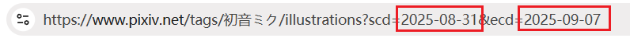

# 使用技巧

## 命名标记

合理使用命名标记可以帮助你对文件进行分类和排序。下面是一些简单的说明：

- 你可以使用斜线 `/` 建立文件夹，例如 `pixiv/{user}/{id}`。
- `{page_title}` 是作品标题，在所有页面里都可以使用。
- 在用户主页里，推荐使用 `{user}` 作为文件夹的名字。
- 在 Tag 列表页和搜索页，可以使用 `{page_tag}` 作为文件夹的名字。
- 在排行榜页面，可以把 `{rank}` 标记放到文件名的最前面，可以让下载的文件的文件里里附带排名。
- 把 `{bmk}` 标记放到文件名的最前面，可以让下载后的文件按收藏数排序。 
- 当你下载你的收藏时，可以在文件名最前面使用 `{bmk_id}`，这样文件下载之后，顺序就是你收藏它们的顺序。

你可以在这里查看详细说明：[命名规则](/zh-cn/设置-下载?id=命名规则)。

## 定时下载新作品

下载器有“定时抓取”功能，所以你可以在某些页面里每隔一定时间抓取和下载新作品。

你可以在这里查看详细说明：[定时抓取](/zh-cn/按钮-抓取?id=定时抓取)。

## 增量更新

如果你以前下载过某个用户或者某个页面里的作品，一段时间后想下载新增的作品，可以查看下面的说明。

首先我推荐你启用“更多”选项卡里的 [不下载重复文件](/zh-cn/设置-更多-下载?id=不下载重复文件) 功能，以避免不必要的重复下载。

下面是一些有助于抓取新作品的方法，你可以根据需要使用。

### 设置 ID 范围

有些页面里的作品是按从新到旧倒序排列的，也就是新发表的作品在前面，以前发表的作品在后面。

作品的 ID 和发布时间是正相关的。发布越晚的作品，ID 就越大。所以你可以在下载器的“抓取”选项卡里设置作品的 [ID 范围](/zh-cn/设置-抓取?id=id-范围)。

例如：上次你在某个用户的主页里下载过他的作品，并且文件名里最大的 ID 是 65000000。如果你想下载在它之后发表的作品，可以设置 ID 范围大于 65000000，然后开始抓取。

### 设置投稿时间

除了设置 ID 范围，你还可以设置 [投稿时间](/zh-cn/设置-抓取?id=投稿时间) 来抓取新发表的作品。

这两个设置的原理是相同的，只不过使用的筛选条件不同。

### 设置抓取的页数

你可以在许多有页码的页面里使用这个方法，下面讲的只是其中一种场景。

如果你想在收藏页面里抓取新收藏的作品，那么前两个设置是不合适的，因为收藏页面里的作品不是按照作品 ID 或发表时间排序的，而是按照你收藏它时的时间排序的。也就是最近收藏的作品在前面，以前收藏的作品在后面。

此时你可以手动设置要抓取的页数。例如：

你可以从第 1 页往后翻，检查上次下载到了第几页。比如上次下载到了第 5 页，那么从第 1 页到第 5 页里的作品就是新收藏的作品。

回到第 1 页，设置 [抓取多少页面](/zh-cn/设置-抓取?id=抓取多少页面) 的数量为 5，然后开始抓取。这样就可以只下载新收藏的作品。

?> 如果你经常需要在收藏页面里进行增量更新，那么可以考虑在文件名的前面添加 `{bmk_id}` 标记，让文件的排序与网页上显示的顺序续保持一致。这样便于你查看上次下载到了哪里。可以在这里查看详细说明：[反映时间顺序的标记](/zh-cn/设置-下载?id=反映时间顺序的标记)。

### 手动选择作品

如果新作品的数量很少，你可以使用 [手动选择作品](/zh-cn/按钮-抓取?id=手动选择作品) 功能下载它们。

例如：在某个用户的主页里，只有最新 10 个作品是没有下载的。你可以手动选择这 10 个作品，然后下载它们。

### 在排行榜页面里增量更新

如果你想每天都下载当天的排行榜，可以这样做：

1. 下载今天的排行榜的所有作品。
2. 以后每天都可以使用 [抓取首次登场作品](/zh-cn/按钮-抓取?id=抓取首次登场作品) 按钮，只抓取当天新增的作品。

## 批量收藏作品

如果你需要需要批量收藏多个作品，可以这样做：

1. 启用下载器的 [下载之后收藏作品](/zh-cn/设置-下载?id=下载之后收藏作品) 功能
2. 可选：如果你并不需要下载这些作品的原图，可以把下载时的 [图片尺寸](/zh-cn/设置-更多-下载?id=图片尺寸) 设置为 `小图` 以加快下载速度。
3. 抓取和下载这些作品。下载器会收藏它们。

在某些页面里（例如关注的用户的新作品页面），如果你想每隔一段时间就收藏新出现的作品，可以使用 [定时抓取](/zh-cn/按钮-抓取?id=定时抓取) 功能，并结合上面的方法一起使用。

## 获取已失效的收藏作品的 ID

你的收藏里可能有一些已经失效的作品，你无法查看或下载它们。例如：

如果你想获取它们的 ID，请查看这个功能的说明：[取消收藏所有已被删除的作品](/zh-cn/按钮-更多?id=取消收藏所有已被删除的作品)。

## 分批抓取和下载

如果你要抓取的页面很多，那么你应该考虑分批抓取，也就是每次只抓取一部分页面。

这是因为要抓取的作品很多的话，下载器需要很长时间才能抓取完毕，期间如果你不小心关闭了正在抓取的页面，就会丢失抓取进度。

另一个原因是抓取结果太多的话（例如有几十万个抓取结果），下载器的内存使用量也会比较多。

查看详细说明：[小技巧：拆分任务](/zh-cn/设置-抓取?id=小技巧：拆分任务)。

## 过滤/修改抓取结果

有些时候，当你抓取完成之后可能想修改过滤条件，但是由于抓取已经完成，此时修改并不会让抓取结果发生变化。

此时你可以这样做：

1. 设置过滤条件
2. 导出抓取结果
3. 导入抓取结果

下载器在导入抓取结果时会应用过滤条件，能够排除掉不符合过滤条件的抓取结果。

查看详细说明：[导入抓取结果](/zh-cn/按钮-下载?id=导入抓取结果)。

## 搜索标签时最多只能抓取 1000 页怎么办

当你在搜索页面里抓取时，也许不能抓取到所有作品，因为下载器只能抓取 1000 页或 5000 页。

**问题的原因：**
- 在搜索页面里，Pixiv 普通用户最多可以查看 1000 页里的作品。高级会员最多可以查看 5000 页。
- 你能查看多少页，下载器最多也只能下载多少页。
- 这是 Pixiv 的限制，下载器无法解决。

假如某个标签里的作品有 3000 页，但你只能查看 1000 页，就会出现无法全部抓取的问题。

**怎么解决这个问题？**

以下是一些可行的方法：

**购买 Pixiv 高级会员（Premium）**

因为 Pixiv 高级会员（Premium）可以查看 5000 页，所以不容易遇到这个问题。相比之下，普通用户只能查看 1000 页，更容易遇到这个问题。

?> 其他一些页面里，Pixiv 高级会员也比普通用户能看到的内容更多。例如在 [已关注用户的最新作品](https://www.pixiv.net/bookmark_new_illust.php) 页面里，普通用户最多只能查看 34 页，但是 Pixiv 高级会员应该可以查看 100 页。

**修改排序方式来抓取双倍作品**

搜索页面有两种排序方式：

默认的排序方式是从新到旧。你可以先抓取和下载 1000 或者 5000 页作品，然后回到第一页，点击“按旧排序”，这样就可以查看和下载早期的作品了。

使用这个方法，你最多可以下载 2000 或者 10000 页作品。但是如果这样还是不能下载到所有作品，就需要考虑其他办法了。

**按照投稿日期筛选所有作品**

你可以在搜索页面里点击“搜索条件”，然后设置“投稿期间”。例如你可以查看某一年里发表的作品：

你可以下载这一年里的作品，然后把投稿时间设置为前一年，下载里面的作品。

如果你多次执行此步骤，理论上可以抓取所有作品，但是操作比较麻烦。

**提示：**
- 这里设置的时间跨度最长为 1 年。当然，如果 1 年里的作品数量超过了 1000 页，你可以缩小时间段以减少页数，例如设置为 6 个月。
- 由于 Pixiv 自带的日期选择器效率很低，所以你可以修改网址里的日期来提高效率（特别是需要查看很早之前的作品时）。

你可以先随便设置一个时间段，之后地址栏的 URL 会变成包含日期的格式：

把日期修改成你需要的时间段，例如：

然后回车即可。Pixiv 会显示这一年里的作品。

?> 虽然你可以在 URL 里设置大于 1 年的时间跨度，但实际上是无效的，Pixiv 依然只会显示 1 年内的作品。
