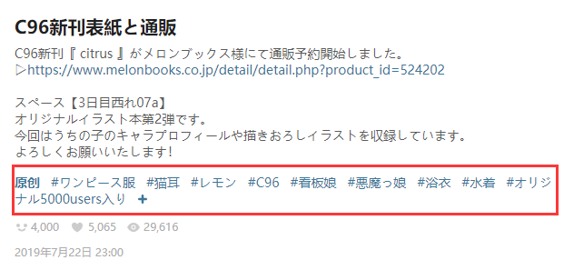

# 便捷功能

## 快速下载

快速下载按钮可以一键下载当前作品。


因为作品页面是经常需要进行下载的地方，所以我在作品页面右侧添加了快速下载按钮，也就是位于下方的那个按钮。

?>在作品页面里，你可以使用快捷键 `Alt` + `Q` 启动快速下载。

## 快速收藏

下载器会在作品下方添加一个五角星形状的按钮：


这个按钮就是**快速收藏**按钮，它和原来的收藏按钮有两个不同：

1. 快速收藏会自动点赞


有时候收藏了一个作品，却又嫌每次都点赞很麻烦，快速收藏帮您解决这个问题。

?>有时候收藏了却没点赞，还会感到愧疚呢！自动感谢太太们，心里再也没有压力。

2. 快速收藏可以帮你添加标签列表



标签指的是作品下方的这些标签，它是很有用的，我们可以通过搜索标签来寻找自己想要的内容。

Pixiv 的心形收藏按钮不会帮你添加标签，但是快速收藏按钮会自动添加所有的标签。

?>你可以在“下载器的收藏按钮 (✩)”设置里，设置快速收藏功能是否添加标签、是否公开收藏。

## 预览作品

当鼠标停留在作品的缩略图上时，下载器会显示更大尺寸的预览图。

?>预览作品时，可以按快捷键 `D` 下载这个作品。

效果如下图：


## 在缩略图上长按鼠标右键时显示大图

## 在作品缩略图上显示下载按钮

鼠标经过作品缩略图时，会在缩略图上显示一个下载按钮，点击它就可以直接下载这个作品。


缩略图上的快速下载按钮没有快捷键。

## 在作品缩略图上显示放大图标

鼠标经过作品缩略图时，会在缩略图上显示一个放大图标，点击它就可以打开图片查看器，查看作品的大图。

## 图片查看器

如果一个作品包含多张图片，那么在图片区域下面会出现一排缩略图，点击它们可以打开图片查看器：


像浏览相册一样查看图片很舒服。

中间显示的图片是原图，下面有个“1:1”按钮，点击它可以使用原始比例查看图片。

你还可以通过点击对应的按钮收藏这个作品，或者下载这个作品。

图片查看器可以使用的键盘操作：

* `ESC` 退出全屏模式；退出查看器
* `F` 启用原始比例；取消原始比例
* `D` 下载当前查看的作品
* `Alt + B` 收藏这个作品（使用下载器的快速收藏功能）
* `←` 切换到上一张图片
* `→` 切换到下一张图片
* `↑` 放大图片
* `↓` 缩小图片

## 快速筛选

在 tag 搜索页，如[『東方Project』](https://www.pixiv.net/search.php?s_mode=s_tag&word=%E6%9D%B1%E6%96%B9Project)，下载器会在页面顶部添加一些收藏数量的标签，如下：


```
100users入り 500users入り 1000users入り 3000users入り 5000users入り 10000users入り 20000users入り 30000users入り 50000users入り
```

点击任意一个，就会在当前搜索的 tag 后面加上收藏数量，查看收藏数量达到指定要求的作品。例如点击“10000users入り”，会自动搜索“東方Project 10000users入り”的结果，基本上都是收藏数大于 10000 的作品。

?>用这种方法来查找作品并不是百分之百准确，可能会有少数不符合要求的作品也被添加了这样的 tag。尽管如此，这个功能也确实很方便。

## 点击热门作品


在一些标签的搜索页面里会显示热门作品。如果你没有购买 Pixiv 会员，那么点击这个区域不会进入作品页面，而是会进入购买会员的页面。

下载器让你可以直接点击或下载这些作品。

## 给未分类的作品添加标签

在收藏页面，有一个按钮“给未分类的作品添加标签”。

如果有一些作品你收藏时没有添加标签，此功能可以把作品的标签自动添加到收藏里。

## 批量收藏

在搜索页面和画师页面里，下载面板的“更多”选项卡里有一个按钮“收藏本页面的所有作品”，可以批量收藏作品。
