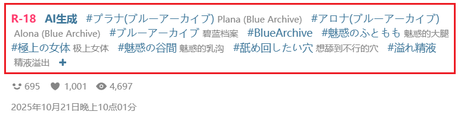
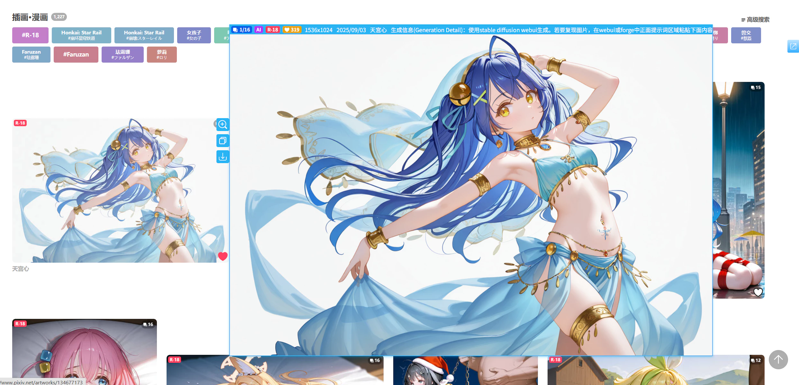
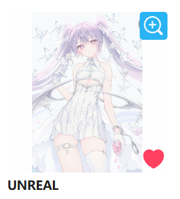
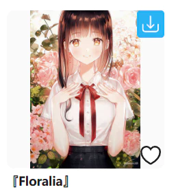
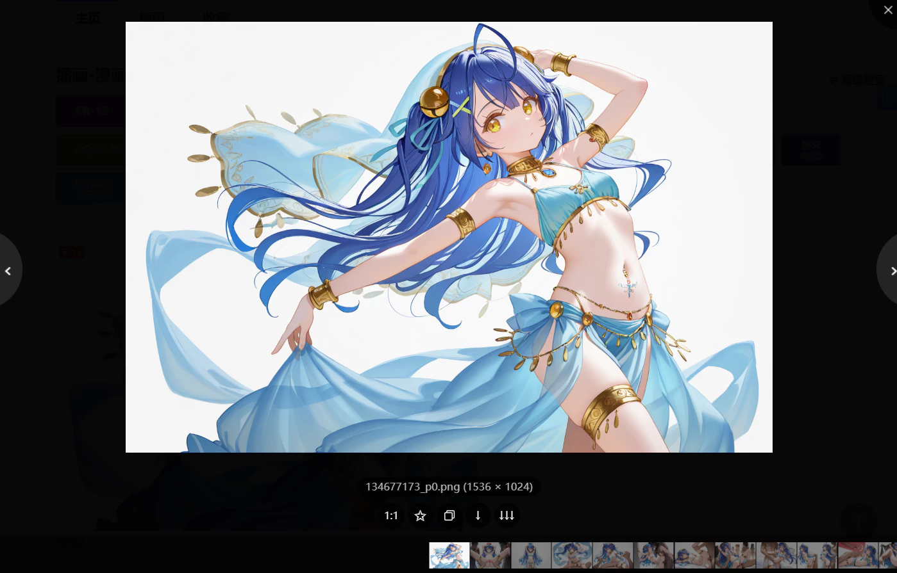
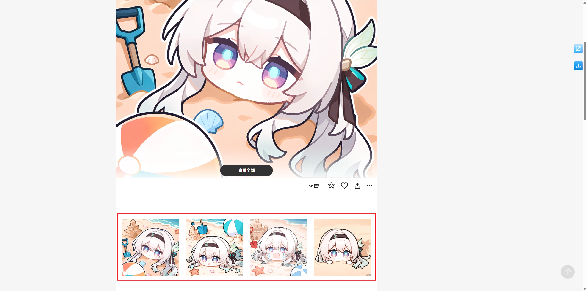
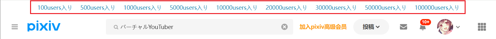

# 便捷功能

下载器有一些便捷功能，可以提高一些操作的效率。

## 快速下载

在作品页面里，下载器会在页面右侧添加一个快速下载按钮，也就是位于下方的那个：

点击它就可以一键下载当前作品（不需要打开下载器的设置面板）。

它的快捷键是 `Alt` + `Q`。

## 快速收藏

下载器会在作品下方添加一个五角星形状的收藏按钮：

?>它的快捷键是 `Alt` + `B`。

它和 Pixiv 的心形收藏按钮有一些区别：

**自动点赞：**

快速收藏会自动点赞这个作品。

**默认添加标签：**

标签指的是作品下方的这些标签：

当你使用 Pixiv 的心形按钮来添加收藏时，它不会添加作品的标签。但是快速收藏按钮默认会添加所有标签。

你可以在收藏页面里使用标签来筛选作品，所以这个功能是很有用的。

**可以取消收藏：**

如果这个作品已经收藏，点击这个按钮即可取消收藏。

也就是说这个按钮具有添加收藏和取消收藏两种功能，根据实际情况切换。

------------

另外，你可以在 [下载器的收藏按钮 (✩)](/zh-cn/设置-更多-增强?id=下载器的收藏按钮-✩) 设置里修改这个按钮的功能：是否添加标签、是否公开收藏。

## 预览作品

当鼠标停留在作品的缩略图上时，下载器会显示更大尺寸的预览图。效果如下：

预览作品时，按快捷键 `C` 可以下载当前正在预览的这张图片，按快捷键 `D` 可以下载这个作品。

查看详细说明：[预览作品](/zh-cn/设置-更多-增强?id=预览作品)

## 在缩略图上长按鼠标右键时显示大图

使用这个功能，你可以直接查看作品的原图，而无须进入作品页面，也不需要下载这张图片。

如果你想快速复制作品的原图（而无须下载），就可以使用这个功能，在原图显示之后，按鼠标右键，选择“复制图片”即可。

查看详细说明：[在缩略图上长按鼠标右键时查看大图](/zh-cn/设置-更多-增强?id=在缩略图上长按鼠标右键时查看大图)

## 在作品缩略图上显示放大图标

当鼠标经过作品缩略图时，下载器会在缩略图上显示一个放大镜图标，如下图所示：

点击放大镜图标可以打开图片查看器，查看这个作品里的每一张图片。

## 在作品缩略图上显示复制按钮

当鼠标经过作品缩略图时，下载器会在缩略图上显示一个复制按钮，如下图所示：

点击复制按钮就可以同时复制作品的图片和文字摘要，然后粘贴到其他软件里保存，或者分享给其他人。

查看详细说明：[复制按钮](/zh-cn/设置-更多-增强?id=复制按钮)

## 在作品缩略图上显示下载按钮

当鼠标经过作品缩略图时，下载器会在缩略图上显示一个下载按钮，如下图所示：

点击下载按钮就可以下载这个作品。

查看详细说明：[在作品缩略图上显示下载按钮](/zh-cn/设置-更多-增强?id=在作品缩略图上显示下载按钮)

## 图片查看器

下载器内置了一个图片查看器，效果如图所示：

?>如果这个作品里有多张图片，下载器会在底部显示所有图片的缩略图，点击缩略图就可以查看它的大图。

**功能按钮：**

图片查看器下方有 5 个按钮：
- `1:1`：点击这个按钮，图片会以 1:1 的比例显示。如果图片尺寸超出屏幕，你可以使用鼠标左键拖动图片。再次点击这个按钮，图片会恢复成自适应显示。它的快捷键是 `F`。
- `✩`：收藏这个作品（使用下载器的快速收藏功能）。它的快捷键是 `Alt` + `B`。
- 复制按钮：点击它就可以复制作品的图片和文字摘要。它的快捷键是 `Alt` + `C`。
- `↓` 下载当前显示的这张图片（而非这个作品里的所有图片）。它的快捷键是 `C`。
- `↓↓↓` 下载这个作品。它的快捷键是 `D`。

**退出图片查看器：**

有多种方式可以退出图片查看器：
- 点击空白区域（黑色背景区域）
- 点击右上角的关闭按钮
- 按下 `Esc` 键

**快捷键列表：**

- `F` 以原始尺寸显示；回到初始比例
- `Alt` + `B` 收藏这个作品
- `Alt` + `C` 点击复制按钮
- `C` 下载当前显示的图片
- `D` 下载当前查看的作品
- `←` 切换到上一张图片
- `→` 切换到下一张图片
- `↑` 放大图片。鼠标滚轮向上滚动也可以缩小图片
- `↓` 缩小图片。鼠标滚轮向下滚动也可以放大图片
- `ESC` 退出全屏模式；退出查看器

## 在多图作品页面里显示缩略图列表

当你位于**多图作品**页面里时（例如 [134821751](https://www.pixiv.net/artworks/134821751)），下载器会显示每一张图片的缩略图。例如：

你可以预览、下载每张图片。

查看详细说明：[在多图作品页面里显示缩略图列表](/zh-cn/设置-更多-增强?id=在多图作品页面里显示缩略图列表)

## 在搜索页面添加快捷搜索区域

下载器会在搜索页面的顶部添加一些特定收藏数量的按钮，例如：

点击这些按钮时，下载器会在当前标签后面添加这个收藏数量的标签，并进行搜索。

查看详细说明：[在搜索页面添加快捷搜索区域](/zh-cn/设置-更多-增强?id=在搜索页面添加快捷搜索区域)

## 点击热门作品

在搜索页面里，Pixiv 可能会显示一些热门作品，如图所示：

如果你没有购买 Pixiv 高级会员，那么点击作品时会进入购买会员的页面。

下载器优化了这个区域的体验，你可以点击作品进入作品页面，也可以直接预览和下载它们。

## 批量收藏

在用户主页和搜索页面里，下载器的“更多”选项卡里有一个按钮：

<button type="button" class="xzbtns hasRippleAnimation" style="background-color: rgb(20, 173, 39);">收藏本页面的所有作品</button>

点击它就可以把这一页的作品全部添加到收藏里。

查看详细说明：[收藏本页面的所有作品](/zh-cn/按钮-更多?id=收藏本页面的所有作品)

## 帮助你管理你的收藏

在收藏页面里，下载器的“更多”选项卡里有几个按钮，可以帮助你管理你的收藏。

例如：如果你在收藏作品时没有给它添加标签，下载器可以自动给它添加标签。

查看详细说明：[收藏页面的按钮](/zh-cn/按钮-更多?id=收藏页面)

