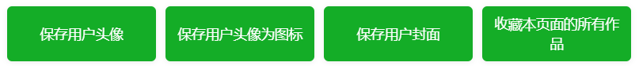
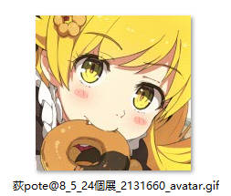
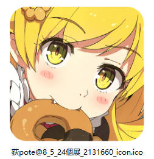
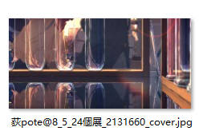
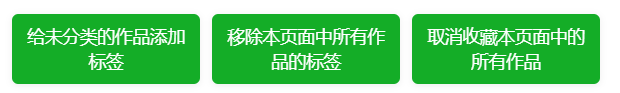

# 其他按钮

其他按钮指的是“更多”选项卡中的按钮。

## 首页

### 清空已保存的抓取结果

这个按钮只在首页出现，用于清空保存的用于断点续传的数据。

如果你在某些页面抓取之后没有进行下载，或者下载没有完毕，那么下载器就会保存抓取结果，用于断点续传。

如果你想要清空所有断点续传数据，可以使用这个按钮。

?>当你在抓取后点击停止下载按钮，或者下载完毕，下载器会自动清除这次任务的断点续传的数据。

## 用户页面

在用户的主页里，以及用户的作品列表页里，可以看到这些按钮：

以这个画师为例：[荻pote](https://www.pixiv.net/users/2131660 ':target=_blank')

### 保存用户头像

把用户头像的大图保存到下载目录里。

### 保存用户头像为图标

把用户头像保存为 256*256 像素的 ico 文件（图标文件）。

?>ico 文件可以设置成文件夹图标，所以你可以把画师文件夹的图标设置成画师的头像。

### 保存用户封面

把用户主页里的封面图片保存到下载目录里。

### 收藏本页面的所有作品

自动抓取当前页面的所有作品，然后自动添加收藏。

**注意：**
- 图片和小说页面都可以支持；
- 只抓取**当前**页面（1 页），不会抓取后续其他页面。
- 收藏所有作品，不会根据抓取条件进行过滤。
- 是否公开收藏，以及是否附带标签，遵从“下载器的收藏按钮 (✩)”设置。

?>执行过程中，这个按钮上会显示进度信息。

## 收藏页面

在自己的收藏页面里可以看到这些按钮：

它们在“更多”选项卡里。

### 给未分类的作品添加标签

如果你收藏的一些作品没有添加标签，那么你可以使用这个按钮，下载器会自动给它们添加标签。

?>添加的标签是作品自身的标签。你不能使用这个按钮来添加自定义的标签。

?>执行过程中，这个按钮上会显示进度信息。

### 移除本页面中所有作品的标签

如果你收藏的一些作品已经添加了标签，你现在想移除所有标签，可以使用这个按钮。

下载器会把这一页的所有作品的标签移除，使它们变成未分类状态。

这不会导致这些作品变成未收藏状态。

?>这个按钮只会处理当前页面里的作品，而非所有作品。

### 取消收藏本页面中的所有作品

如果你想把收藏的作品取消收藏，变成未收藏状态，可以使用这个按钮。

?>这个按钮只会处理当前页面里的作品，而非所有作品。
