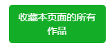

# 其他按钮

## 收藏本页面的所有作品

在用户页面或者搜索页面里，点击下载面板的“其他”选项卡，可以看到这个按钮。它会自动抓取当前页面的所有作品，自动收藏，自动添加 tag。

**注意：**
- 图片和小说页面都可以支持；
- 只抓取**当前**页面（1 页），不会抓取后续其他页面。
- 收藏时直接收藏所有作品，不会根据抓取条件进行过滤。

?>执行过程中，这个按钮上会显示进度信息。

### 给未分类作品添加 tag

>只有在自己的收藏页面里才有这个按钮。

在自己的收藏页面里，点击下载面板的“其他”选项卡，可以看到这个按钮。

如果你自己收藏的作品里有一些没有添加 tag，你可以使用这个按钮，给它们自动添加 tag。

?>执行过程中，这个按钮上会显示进度信息。

## 保存用户头像为图标

在用户页面或者作品页面里，点击下载面板的“其他”选项卡，可以看到这个按钮。你可以把该用户的头像保存为 ico 图标。

点击之后下载器会把用户头像保存为 256*256 像素的 ico 文件。

?>ico 文件可以设置成文件夹图标，所以你可以把画师文件夹的图标设置成画师的头像。

