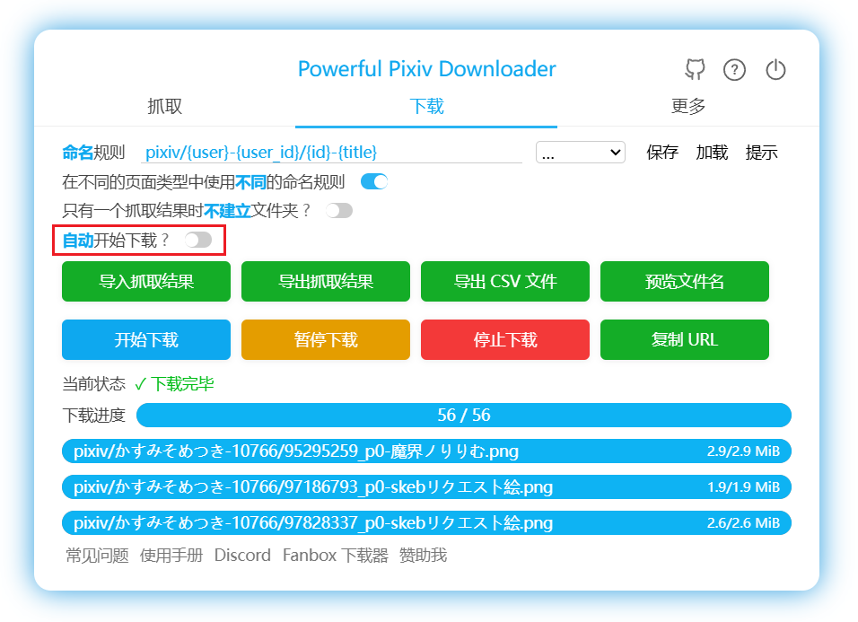

# 尝试初次下载

打开下面的测试页面：

[画师 まふゆ 的作品列表页面](https://www.pixiv.net/member_illust.php?id=5229572&type=illust ':target=_blank')

## 抓取和下载

打开下载器面板，然后点击**开始抓取**按钮：

本程序就会自动开始抓取作品。

抓取完成之后，下载器会自动开始下载文件。你可以在**下载**标签页里查看和管理下载：

如果你不想自动开始下载，可以关闭此开关：

?> 下载器可以断点续传。在下载过程中，如果页面崩溃或者你不小心关闭了页面，你可以重新打开这个页面，下载器会恢复下载进度，所以你可以继续下载。

在第一次批量下载时，浏览器可能会询问：是否允许此网站下载多个文件？

请选择允许。

## 日志

下载器执行任务时会在页面顶部显示日志，包含过滤条件、抓取进度、下载进度等信息。例如：

开始抓取 排除作品类型：漫画, 动图 排除标签：BL 从本页开始下载 1 页 正在抓取，请等待…… 当前有 48 个作品 开始获取作品信息 共抓取到 48 个作品 共抓取到 141 个文件 抓取完毕！  正在下载中 正在保存抓取结果 已保存抓取结果  141 / 141  ✓ 下载完毕  

在当前版本里，日志默认是隐藏的。你可以在页面顶部看到一个蓝色按钮，像是这样：

点击这个按钮可以显示日志。另外你也可以使用快捷键 `L` 来切换日志的显示与隐藏。

**日志级别：**

下载器有 4 种日志级别，它们会使用不同的颜色。示例如下：

- 0 normal 普通日志，颜色是黑色或白色（取决于下载器的颜色主题是浅色还是深色）。
- 1 success 用于显示任务开始和完成的日志，颜色是绿色。
- 2 warning 用于显示一些需要注意的提示，或者不严重的问题。颜色是棕色。
- 3 error 用于显示错误信息，颜色是红色。

## 标题栏里的状态

本程序在抓取开始之后，会在网页的标题前面添加一些符号，表示下载器的状态。例如：

前面的 `[↓]` 表示正在下载中；其后的数字 36 表示还剩下 36 个文件没有下载。

常用的状态如下：

- ↑ 抓取中
- ↓ 下载中
- √ 下载完毕

还有其他一些相对少见的状态：

- → 抓取完毕，等待下一步操作（搜索页面）
- ▶ 抓取完毕，可以开始下载（需要用户手动点击“开始下载”按钮才会开始下载）
- ║ 下载暂停
- ■ 下载停止
- ☑ 下载完毕，但在下载完成时，页面网址与开始抓取时的网址不同（这通常是因为用户点击一些链接进入了新的页面）

## 保存位置

下载的文件存放在**浏览器的下载目录**里。下载器会建立子文件夹保存文件，例如。

?>下载器不能把文件保存到浏览器的下载目录之外，这是浏览器的限制。如果你想保存到其他位置，需要修改浏览器的下载目录。

## 如果遇到问题

一个常见的问题是下载后的文件名异常，并且下载器也没有建立文件夹。如果你遇到了这个问题，可以查看[下载后的文件名异常的问题](/zh-cn/安装之后?id=下载后的文件名异常的问题)。

如果不是上面的问题，可以查看 [常见问题](zh-cn/常见问题) 页面。

如果你仍然没有找到原因，可以查看 [联系我](zh-cn/联系我) 页面。
