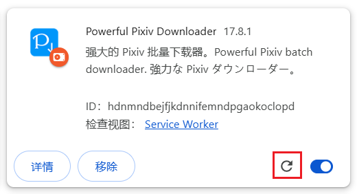

# 如何更新

## 自动更新

如果你是从浏览器的扩展商店里安装的本扩展程序，那么扩展程序会自动更新。

?>对于中国大陆用户，由于访问 Chrome Web Store 需要翻墙，所以需要开启代理软件才能让扩展程序自动更新。

## 手动更新

如果你是离线安装的本扩展程序，那么它不会自动更新。

你可以在本程序的 [releases 页面](https://github.com/xuejianxianzun/PixivBatchDownloader/releases ':target=_blank') 检查是否有新版本，如果有的话可以手动更新。

手动更新的大部分步骤与 [离线安装](/zh-cn/离线安装) 是一样的，只是由于你之前已经安装过了，所以有一个地方不同，就是需要覆盖旧版本的文件。

下面是大致步骤：

1. 下载最新版本的第一个 zip 文件，解压得到 powerfulpixivdownloader 文件夹。
2. 把 powerfulpixivdownloader 文件夹移动和旧版本相同的位置，覆盖旧版本的文件。
3. 在扩展管理里，点击本扩展程序的刷新按钮：

这样就成功加载了新版本的扩展程序。

?>上面的方法是覆盖安装，不会丢失下载器的设置。

?>更新本扩展程序之后，如果浏览器里有已经打开的 pixiv 页面，请刷新页面，这样才能使用新安装的扩展。你也可以直接重启浏览器。
