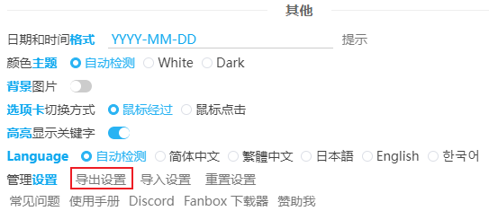

# 如何更新

## 在线安装的情况

如果你是从浏览器的扩展商店里安装的本扩展程序，那么扩展程序会自动更新。（前提是你的网络能够正常访问安装页面）

## 离线安装的情况

如果你是离线安装的本扩展程序，那么当 Github 上有新版本时，设置面板的右上角会显示一个蓝色的更新按钮：

此时你有两种选择：

1. 卸载本扩展程序，然后从扩展商店里安装新版本。
2. 下载安装包，手动更新。

为了防止一些意外操作导致你丢失下载器设置，在你进行上面两种操作之前，可以在“更多”选项卡里导出设置，以备以后使用。

-------

### 手动更新的说明

1. 打开本程序的 [GitHub releases 页面](https://github.com/xuejianxianzun/PixivBatchDownloader/releases ':target=_blank') 。
2. 下载最新版本的第一个 zip 文件，解压得到 powerfulpixivdownloader 文件夹。
3. 把 powerfulpixivdownloader 文件夹移动和旧版本相同的位置，覆盖旧版本的文件。
4. 重启浏览器。

当你重新打开浏览器时，就可以使用新版本了。
