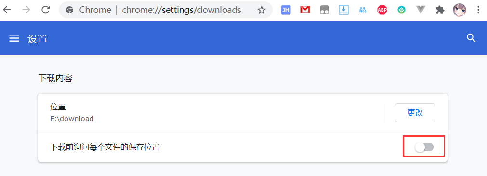
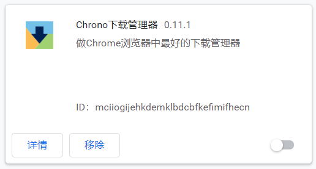
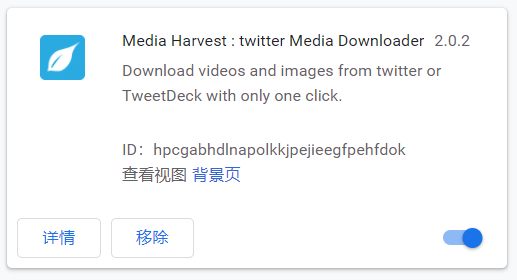
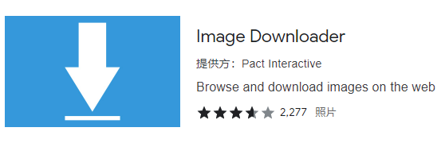
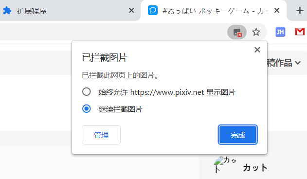

# 安装之后

## 登录 Pixiv 账号

你需要在 pixiv 处于登录状态，才能正常使用下载器。

不登录 pixiv 账号会无法使用下载器的大部分功能。

## 检查浏览器的下载设置

[进入下载设置](chrome://settings/downloads)

在浏览器的下载设置里，你可以确认：

1. 文件保存位置。下载器下载的文件会保存在这个目录里。

2. **关闭**“下载前询问每个文件的保存位置”。否则每下载一个文件就会弹出一次“另存为”对话框。

!>如果你没有开启第二项，但下载时还是出现了“另存为”对话框，可能是因为下载的文件有重名。请参考“常见问题”页面的“下载时弹出另存为对话框”条目。

## 留意有冲突的扩展程序

本程序下载文件时，可以设置文件名。但是有一些**管理下载**的扩展程序可能会修改文件名，导致文件名不符合用户预期。

请你在下载时，禁用这些有冲突的扩展程序。

下面是一些已知的会引起冲突的扩展程序：

- Chrono 下载管理器

- BitComet 扩展程序

- free Download Manager

- Media Harvest : twitter 多媒體下載器

- Image Downloader 

## 不要拦截 Pixiv 的图片

在 Chrome 中，用户可以设置拦截网页上的图片，这样 Chrome 不会下载和显示该网页上的图片。

当 Chrome 拦截了 Pixiv 的图片时，会在地址栏右侧显示一个拦截图标。

如果你拦截了 Pixiv 上的图片，会导致本程序无法下载图片。请不要拦截 Pixiv 的图片。
