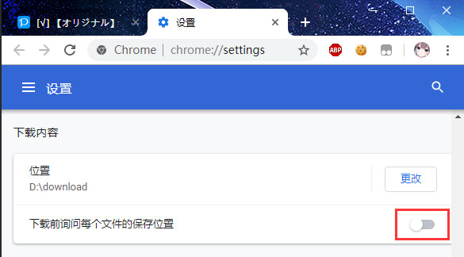

# 安装之后

## 检查浏览器的下载设置

在浏览器的下载设置里，你可以确认：

1. 文件保存位置。下载器下载的文件会保存在这个目录里。

2. **关闭**“下载前询问每个文件的保存位置”。否则每下一个文件就会弹出“另存为”对话框。

!>如果你没有开启第二项，但下载时还是出现了“另存为”对话框，可能是因为下载的文件有重名。请参考“常见问题”页面的“下载时弹出另存为对话框”条目。

## 留意有冲突的扩展程序

本程序下载文件时，可以自由设置文件名。但是这个功能和其他能够**管理下载任务**的扩展不兼容。例如：

- 迅雷下载支持（最近也可能不冲突了）

- Chrono 下载管理器

- 用于隐藏 Chrome 底部下载项目的扩展

诸如此类的下载管理扩展，会接管本程序的下载任务，那么文件名就会是一长串无意义的字符。如果你遇到了这种情况，就需要**在使用本程序时禁用有冲突的扩展程序**。

## 不要拦截 Pixiv 的图片

在 Chrome 中，用户可以设置拦截网页上的图片，这样 Chrome 不会下载和显示该网页上的图片。

当 Chrome 拦截了 Pixiv 的图片时，会在地址栏右侧显示一个拦截图标。

如果你拦截了 Pixiv 上的图片，会导致本程序无法下载图片。请不要拦截 Pixiv 的图片。
