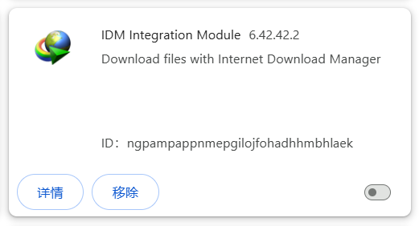

# 安装之后

## 检查浏览器的下载设置

打开浏览器的下载设置：

在浏览器的下载设置里，你可以确认：

1. 文件保存位置。下载器下载的文件会保存在这个目录里。

2. **关闭**“下载前询问每个文件的保存位置”，否则每下载一个文件就会弹出一次“另存为”对话框。

!>如果你已经关闭了第二项，但下载时还是出现了“另存为”对话框，可能是因为下载的文件有重名。请参考“常见问题”页面的 [下载时弹出另存为对话框](/zh-cn/常见问题?id=下载时弹出另存为对话框)。

## 如何使用

在 pixiv.net 的网页里才能使用这个扩展。如果你处于其他网站里，这个扩展程序不会生效。

安装本程序后，打开 Pixiv 的网页，可以在右侧看到一个蓝色的按钮：

点击按钮可以打开设置面板，开始抓取和下载。

## 登录 Pixiv 账号

你需要在 pixiv.net 里登录你的账号，因为不登录的话很多页面和作品都无法查看，下载器也就无法下载。

## 大量下载时的应对措施

下载器通常会先抓取作品数据，然后下载文件。这两个步骤都会从 Pixiv 的服务器请求数据。如果请求的数量太多，或者频率太密集，都可能会触发警告。

如果你经常大量下载文件，例如每天都下载几千、几万个作品，可能会被 Pixiv 警告。第一次触发警告时你会收到一封站内信，内容可能如下：

现在下载器每下载 100 个文件就会检测一次你是否收到了这种站内信。如果检测到了，就会暂停下载，避免事态变得更糟糕。

?> 如果你收到了这种站内信，可以把截图和内容发给我，这有助于让下载器更准确地检查这种站内信。你可以查看 [联系我](zh-cn/联系我) 页面，通过 Discord 或者 Github 给我发送信息。

如果你第二次触发警告，就会被封号。你的 Pixiv 账号会被直接删除，无法登录，并且其他用户也无法查看你的个人主页、收藏等数据。

?> 根据目前的经验，每天下载几百个作品的话通常不会被警告。

------------

下载器有一些设置可以降低被警告的可能性：
- 下载器默认会 [减慢抓取速度](/zh-cn/设置-更多-抓取?id=减慢抓取速度)。在抓取大量作品时，下载器会每隔一定时间发送一次请求。
- 当你需要下载大量文件时（例如超过 1000 个文件），你可以设置下载时的 [间隔时间](/zh-cn/设置-更多-下载?id=下载间隔)，降低下载频率。

但如果你每天都下载大量文件，上面的设置并不能完全保证安全。更安全的方法是注册小号来下载。大号只在日常浏览时下载少量文件，小号则专门用来进行大量下载。

具体方法可以查看：[使用小号下载](zh-cn/使用小号下载)。

!> 如果你的账号被封禁，我不会对此负责。

## 下载后的文件名异常的问题

本扩展可以对下载的文件设置自定义文件名，但是一些具有保存文件功能的扩展程序可能会导致文件名异常。

这些扩展的数量有很多（即使它们不在 Pixiv 和 Fanbox 上运行也可能会导致此问题）。在最近的反馈中，导致此问题的扩展通常是 Patreon Downloader、IDM Integration Module。

如果下载后的文件名文件名是一串随机的字母和数字，或者没有使用下载器设置里的命名规则，就表示发生了此问题。

### 处理方法

如果你遇到了这个问题，可以考虑下面的处理方法：

**方法 1：**

你可以新建一个浏览器本地用户来使用这个下载器。点击浏览器右上角的头像图标，可以创建新的个人资料或配置（不需要登录浏览器厂商的账号）。每个浏览器用户的配置都是独立的，你可以在新用户的窗口里只安装这个扩展程序。当你需要下载 Pixiv 的文件时，使用这个用户进行下载，这样就不会被其他扩展程序影响。

?>我的 Pixiv 下载器和 Fanbox 下载器不会导致文件名异常。如果你有需要的话，可以在新用户的窗口里同时安装这两个扩展程序。

**方法 2：**

你可以找出导致此问题的扩展程序，并在使用本下载器时临时**禁用它们**。

这些扩展程序通常具有下载文件、管理下载的功能，例如：IDM Integration Module、Chrono 下载管理器、mage Downloade 等。如果你不确定是哪个扩展导致的，可以先禁用所有扩展，然后一个一个启用，并使用下载器进行下载，这样就可以找出是哪个扩展导致了此问题。

如果你要禁用某个扩展，应该在浏览器的扩展程序管理页面里禁用它。例如你要禁用 IDM Integration Module 的话，应该点击其右下角的按钮来使它不再运行：

以下方法是**错误的**，它们对解决此问题毫无帮助：
- 在 IDM 的程序设置里排除 pixiv.net
- 在 pixiv.net 上点击 IDM Integration Module 的图标，使其不在该网站上生效：

如果你使用上面两种方法，IDM Integration Module 依然是在运行的，所以问题依然存在。

### 技术细节

某些扩展程序会监听 `chrome.downloads.onDeterminingFilename` 事件，这很容易导致预设的文件名丢失。

假设本下载器为某个文件设置了自定义文件名：user/image.jpg。

如果有其他扩展程序监听了 `onDeterminingFilename` 事件，浏览器会询问它对文件名的建议（使它有机会修改文件名）。问题在于：此时浏览器传递的文件名是默认的（也就是 URL 里的最后一段路径），而不是下载器设置的文件名。

所以下载器设置的文件名会丢失，并且文件名会变成 URL 里的最后一段路径。

?>下载器没有使用这个事件，所以不会影响其他扩展程序的文件名。

### 已知的有冲突的扩展程序

下面是一些已知的会引起冲突的扩展程序：

- IDM Integration Module

- Chrono 下载管理器

- BitComet 扩展程序

- free Download Manager

- Media Harvest : twitter 多媒體下載器

- Image Downloader 

- DownThemAll!

- Double-click Image Downloader

- Patreon Downloader

## 不要拦截 Pixiv 的图片

在 Chrome 中，用户可以设置拦截网页上的图片，这样 Chrome 不会下载和显示该网页上的图片。

当 Chrome 拦截了 Pixiv 的图片时，会在地址栏右侧显示一个拦截图标，例如：

请不要拦截 Pixiv 的图片，否则本程序无法下载图片。
