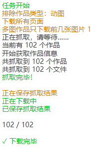

# 尝试初次下载

我们打开一个测试页面，这里是 [画师 まふゆ 的作品列表页面](https://www.pixiv.net/member_illust.php?id=5229572&type=illust ':target=_blank')：

## 开始抓取

打开下载器面板，然后点击“开始抓取”按钮，本程序就会自动开始抓取作品。

抓取完成之后，在默认设置下，下载器会自动开始下载文件。

?>第一次批量下载时，浏览器可能会询问：是否允许此网站下载多个文件？

请选择允许。

## 日志

本程序运行期间，会在页面顶部显示一些简单的提示，包含设置的条件和下载进度。例如：

## 标题栏里的状态

本程序在抓取开始之后，会在网页的标题前面添加一些符号，提示任务的状态。例如：

最前面的 `[↓]` 表示正在下载中；其后的数字 94 表示剩余的等待下载的文件数量。

常用的状态如下：

- ↑ 抓取中
- ↓ 下载中
- √ 下载完毕

还有一些不常用的状态：

- → 抓取完毕，等待下一步操作（搜索页面）
- ▶ 抓取完毕，可以开始下载（需要用户手动点击“开始下载”按钮才会开始下载）
- ║ 下载暂停
- ■ 下载停止

## 保存位置

下载的文件存放在**浏览器的下载目录**里。

## 下载不顺利？

如果下载时遇到了问题，请参阅 [常见问题](zh-cn/常见问题) 页面。

如果你仍然没有找到原因，请参阅 [联系我](zh-cn/联系我) 页面。
