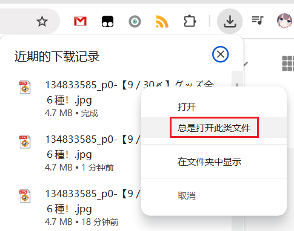
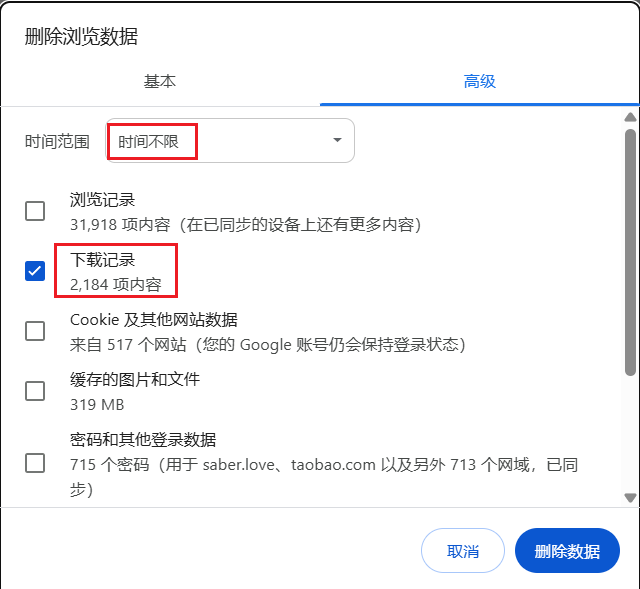
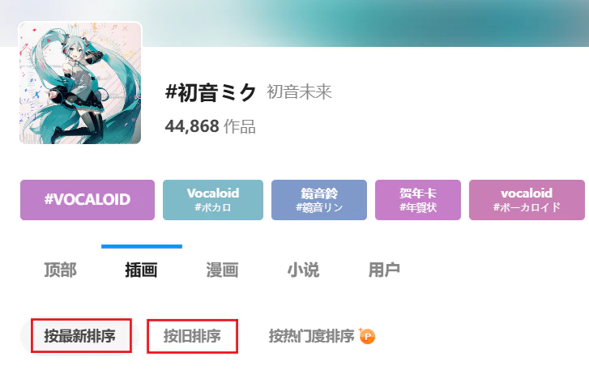
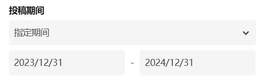
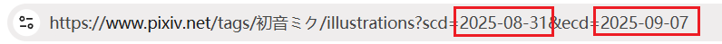
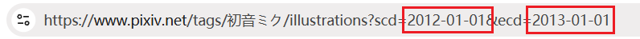

# 常见问题

?>你可以使用浏览器的搜索功能（快捷键是 `F3` 或 `Ctrl` + `F`），输入关键词在本页面上进行搜索，可能会更快的找到需要的内容。

## 查看帮助信息

- 下载器面板的左下角有一个“常见问题”按钮，可以查看一些简单的帮助信息。
- 你可以查看 [安装之后的设置](zh-cn/安装之后) 页面，检查一些原因。
- 如果你不清楚某个功能怎么使用，请查看本 wiki 里的相关内容。

## 检查常见原因

- 查看网页顶部的日志里是否显示了错误信息或相关提示。
- 如果你遇到的问题是浏览器启动时会卡住一段时间（无响应），这是因为浏览器的下载记录太多导致的，清空浏览器的下载记录即可解决。
- 如果你使用的浏览器不是 Chrome、Edge、Firefox，请使用其中一种浏览器安装本扩展程序，观察问题是否能够解决。我不对其他浏览器提供支持。
- 如果你的浏览器不是最新版本，请更新浏览器。
- 重启浏览器，然后重试之前的操作，观察问题是否已经解决。
- 如果本扩展程序不是最新版本，请更新到最新版本。你可以在浏览器的扩展程序商店里查看本扩展程序的版本号。如果你已安装的扩展不是最新版，通常只需要等待一段时间，浏览器就会自动更新。你也可以移除这个扩展程序，然后重新安装它（这会丢失下载器的设置，所以你可以先导出设置）。
- 可能是网络连接不畅，请检查网络连接。
- 系统分区（通常是 C 盘）的剩余空间可能不足。如果可用空间小于 4GB，可能无法下载一些体积较大的文件。这是浏览器的限制，此时请尝试清理系统分区的空间，然后重新启动浏览器。
- 中国大陆用户建议使用梯子（代理软件）访问 Pixiv，并检查线路是否有效。

?> 如果问题仍然不能解决，请查看 [联系我](zh-cn/联系我) 页面里的信息。

## 文件下载到了哪里

*文件保存位置/图片保存位置/保存路径*

下载的文件保存在浏览器的下载目录里。

## 能不能把文件保存到浏览器下载目录之外

**不能**，这是浏览器的限制。

下载器自动保存文件时，只能把文件保存到浏览器的下载目录里，这是浏览器的安全策略导致的。

## 怎么修改下载位置

*修改下载路径/下载文件夹*

如果你不想让文件保存到浏览器的下载目录里，那么你只能在浏览器的设置里修改下载位置。

请打开浏览器的设置页面，找到“下载”相关的设置，修改文件的默认保存位置。

如果你不想修改浏览器的文件保存位置，那就只能在文件下载之后把文件移动到其他位置。

## 怎么建立文件夹

*创建文件夹/建立目录*

在命名规则里使用斜线 `/` ，斜线前面的部分会作为文件夹的名字。

查看详细说明：[建立文件夹](/zh-cn/设置-下载?id=建立文件夹)

## 怎么把某个艺术家/用户的作品放到同一个文件夹里

*怎么把画师的作品放在一起？*

在命名规则里使用用户名建立文件夹就可以了。例如 `{user}/{id}`。

## 怎么把多图作品保存到单独的文件夹里

如果你需要这样的效果：

单图作品直接保存到用户的文件夹里，多图作品则额外建立一层文件夹。

例如：

```
Downloads
│
├─葛飾ぱち
│  │  99097921.png
│  │
│  └─99276627
│          99276627_p0.png
│          99276627_p1.png
```

首先在命名规则里确认你是否设置了使用用户名建立文件夹，例如：`{user}/{id}`。默认的命名规则 `pixiv/{user}-{user_id}/{id}-{title}` 也会使用用户名建立文件夹。

然后启用这个设置：[为每个作品建立单独的文件夹](/zh-cn/设置-更多-命名?id=为每个作品建立单独的文件夹) 即可。

## 抓取完毕，但没有找到符合筛选条件的作品

*抓取结果为0*

有时候抓取完成后你可能会看到一条提示消息：

<span class="log" style="color: rgb(210, 126, 0);">抓取完毕，但没有找到符合筛选条件的作品。</span>

这是因为本次抓取的所有作品都不符合过滤条件的要求。

你在“抓取”标签页里看到的设置，都是过滤器，例如作品类型、图片数量、收藏数量、发表日期、标签要求等。

如果你修改了过滤条件，可能会导致抓取结果为 0，并看到上面的提示消息。

例如：如果你取消选择了“插画”类型，而这次抓取的作品又全都是插画，那么抓取结果就会是 0。 

## 为什么抓取到的文件数量比作品数量多

有时候在抓取完成后你可能会看到像这样的日志：

<span class="log">共抓取到 10 个作品</span>

<span class="log">共抓取到 20 个文件</span>

这是因为有些作品可能含有多个图片。也就是说 1 个作品可能会产生多个文件，这是正常的。

## 下载后的文件名乱码

*文件名异常/文件名乱码/uuid*

如果你看到下载后的文件名是一串不知道什么意思的字符，类似这样：


请查看 [下载后的文件名异常的问题](/zh-cn/安装之后?id=下载后的文件名异常的问题)。

## 文件名是 jfif 格式

*文件名后缀名是 jfif*

可能的原因：
1. 受其他扩展影响。
2. 如果你在下载器的 [图片尺寸](/zh-cn/设置-更多-下载?id=图片尺寸) 设置里选择了“缩略图”，则有可能下载到 jifi 格式的文件，这是正常的。

## 是否支持断点续传

是的，下载器支持断点续传。

下载过程中，如果页面崩溃或者你不小心关闭了页面，你可以重新打开这个页面，下载器会恢复下载进度，所以你可以继续下载。

**工作原理：**

下载器在抓取完成后，会把本次下载任务的数据保存到 IndexedDB 里。下载完所有文件后，下载器会自动清除本次下载的数据。

如果下载未完成，下载器就可以使用保存的数据来恢复下载进度。但是有些操作会清除这些数据，导致页面被关闭后**无法恢复任务**。如下：
- 点击下载器的“停止下载”按钮。因为这表示你不需要下载后续文件了，所以下载器会自动清除本次任务的数据。
- 当你删除浏览器数据时，如果删除了浏览器为每个网站保存的数据，就会导致任务数据被清空。在 Chrome 中，这一项是“Cookie 及其他网站数据”。

## 怎么不下载重复文件

*怎么不下载以前已经下载过的作品？*

你可以启用 [不下载重复文件](/zh-cn/设置-更多-下载?id=不下载重复文件) 功能。

在某些情况下，你也可以考虑使用增量更新，只抓取最近新发布的作品。可以查看“使用技巧”页面的 [增量更新](/zh-cn/使用技巧?id=增量更新) 部分。

## 下载很慢

下载慢、下载没速度怎么办？

这主要是国内用户会遇到的问题，推荐使用靠谱的代理/翻墙软件，比如 ssr、v2ray、clash 等，并使用稳定的机场/路线。

你还可以尝试另一个办法：抓取完成后，使用 “复制 URL” 功能复制图片网址，然后使用其他软件如 IDM 等下载这些文件。这可能会提高下载速度，但是这些软件无法对文件重命名。

## 动图下载很慢

动图的体积通常比较大，下载耗时会更久一些，这是正常的。

另外由于 Pixiv 的动图源文件是 zip 格式，下载器把它转换成其他格式也会花费一定时间。

如果你确定是下载速度很慢（例如每秒钟只有几百 KB），请检查网络/机场线路的问题。

## 下载进度一直是 0

有些用户可能会遇到这个问题：文件的下载进度条已经满了，但是文件没有被保存，而且总进度条上显示的任务完成数量是 0。下载无法继续。如下图所示：


你可以尝试这些办法：

- 刷新页面，下载器应该可以重新开始下载。
- 请尝试重启浏览器、或者升级浏览器后再重试下载。
- 有些浏览器可能会因为兼容性问题而遇到这个问题。请使用 Chrome、Edge 或 Firefox 浏览器安装这个扩展程序。
- 如果问题依然存在，你可以找几个作品单独下载试试。如果有些能下载，但是出现问题的这个却不能下载，那么可能是文件名里含有非法字符，请尝试修改文件命名规则（移除某些命名规则），再重新下载。
- 如果问题依然无法解决，请查看 [联系我](zh-cn/联系我) 页面，向我报告问题。

## 任务卡住怎么办

*下载卡住/任务卡住*

这一般是网络问题，网络情况越差，越容易遇到这个问题。

如果你在抓取任务时卡住，可以尝试等待一段时间，看过一段时间之后是否能够继续抓取。如果不能，建议刷新页面重新抓取。

如果在下载时卡住，可以先点击“暂停任务”按钮，然后点击“开始下载”按钮尝试继续下载。你也可以关闭出现问题的页面，之后重新打开，尝试继续下载。

?>如果你的网络连接不稳定，或者下载速度慢，可以把同时下载数量设置的小一些，减小卡住的几率。

## 一直卡住，无法下载任何图片

*无法下载文件*

首先检查网络问题，如果网络没有问题（可以正常访问 Pixiv，下载速度也比较快），那么你可以检查一下系统盘（一般是 C 盘）剩余空间。

如果系统盘剩余空间比较小，Chrome 可能会阻止 XHR 请求下载一些比较大的文件，导致下载一直失败。请清理一下空间再尝试下载。这个原因是由 Reinford 找出来的。

## 下载卡住时会自动重试吗

会。

当网络状况较差时，下载可能会因为请求超时或者网络连接中断而卡住。下载器会自动重试。

## 下载到的图片是损坏的

下载的图片只能显示一半（或一部分），剩余部分没有图像。

这是因为下载时出现了网络问题，导致文件内容损坏。查看图片时，可能只能解码出一部分图像。

请重新下载损坏的图片/作品。你可以根据文件名里的作品 ID 打开它所在的页面，然后重新下载。

?> 图像作品的网址是固定的：在 `https://www.pixiv.net/artworks/` 后面加上作品 ID，然后在浏览器里打开这个网址即可进入作品页面。

如果重新下载的图片还是损坏的，可能是因为这个图片存在缓存。你可以清除浏览器的缓存后，然后刷新页面重新下载这个作品。或者点击下载器的“复制 URL”按钮，然后用其他下载软件（例如 IDM）下载这个文件。

**注意：**这个问题不应该经常发生。如果你经常遇到这个问题，说明你的网络存在问题。

对于中国大陆用户，如果你使用某些“机场”提供的翻墙服务来访问 Pixiv，并且经常遇到这个问题，那么应该更换质量更好的“机场”。

## 下载进度条变成红色是怎么回事

这表示这个进度条上的文件下载出现了错误。可能是网络原因导致的。

下载器会尝试重新下载它，你不需要做出处理。

你也可以查看网页顶部的日志，查看是否显示了帮助信息，并进行检查。

## 下载失败：USER_CANCELED

如果出现这样的错误提示，可能的原因有：

- 下载时弹出另存为对话框
- 文件名超长
- 下载被其他软件接管。下载器会让浏览器保存文件，但偶尔有些下载软件（例如 IDM）可能会接管下载，此时浏览器会取消下载这个文件，并且文件会由下载软件下载。如果你遇到了这种情况，请在其他下载软件的设置里取消对 pixiv 的文件的接管。
- 其他原因

前两种情况的解决方法在下面。

## 下载时弹出另存为对话框

*下载时弹出文件另存为对话框/另存为窗口/保存窗口*

如果下载时浏览器弹出了“另存为”对话框，请检查以下可能的原因：

**原因 1**：请确认你在浏览器设置里**关闭**了“下载前询问每个文件的保存位置”。

如果开启了这个设置，那么每个文件都会导致浏览器显示“另存为”对话框，所以你应该关闭这个设置。

**原因 2**：可能是下载的文件里有重复的文件名，请检查你的命名规则。

如果你的命名规则里带有 `{id}` 标记或者 `{id_num}` + `{p_num}`，那么应该不会有重名文件；否则就可能有重名文件。

比如作品 id 78279423，有三张图片，`{id}` 或者 `{p_num}` 标记会添加序号，这样就不会重名：

```
78279423_p0.jpg
78279423_p1.jpg
78279423_p2.jpg
```

如果不带序号，就会重名：

```
78279423.jpg
78279423.jpg
78279423.jpg
```

当命名规则里没有 `{id}` 或者 `{p_num}`，则要留意是否会出现重名问题。

**原因 3**：可能是因为文件名过长。

一般来说，大部分操作系统的文件名长度限制是 255 个字符。如果文件名很长，字符数量超出限制，则浏览器可能无法保存文件，就会显示“另存为”对话框，让用户进行操作。

如果你遇到了这个问题，请启用 [文件名长度限制](/zh-cn/设置-更多-命名?id=文件名长度限制) 功能，设置文件名的长度限制。

**原因 4**：可能是因为下载位置不存在

假如你的浏览器的下载位置是 `D:\downloads`，如果这个文件夹不存在了，也会弹出“另存为”对话框。

## 文件名太长怎么办

*文件名超长/文件名太长*

如果你因为文件名超长导致无法保存文件，可以启用 [文件名长度限制](/zh-cn/设置-更多-命名?id=文件名长度限制) 功能，设置文件名的长度限制。

## 为什么下载后会自动打开图片

*下载后自动打开图片/自动打开文件/自动打开 txt 文件*

下载的文件默认不会自动打开，但是浏览器提供了这个功能。

对于 Chrome 浏览器来说，你可以在右上角的下载列表里对任意文件点击鼠标右键，检查“总是打开此类文件”的设置：



如果它前面有个对号 ✔，说明你启用了这个功能。再次点击它取消勾选即可。

## 为什么在搜索页面不会自动开始下载

*没有自动开始下载*

如果你已经启用了“自动开始下载”，但是下载器在搜索页面里不会自动开始下载，那么你可以关闭 [预览搜索页面的筛选结果](zh-cn/设置-更多-增强?id=预览搜索页面的筛选结果) 功能。

## Date format error!

这是因为你在 [投稿时间](/zh-cn/设置-抓取?id=投稿时间) 里输入的时间格式不正确，导致下载器显示错误提示 `Date format error!`。

如下图所示，左边的值是错误的，因为它没有包含时间：


这种情况通常发生在你手动输入时间和日期的时候。别忘了设置时间。

## 无权访问某个作品

这是因为在获取某个作品时出现了无法处理的错误。

可能是因为这个作品是私密的，或者是网络问题导致的。

你可以打开这个作品的页面，如果能正常打开的话，你可以单独下载它。

## 如何下载 ID 列表

如果你有作品的 ID 列表，想让下载器下载这些作品，可以打开 Pixiv 主页，使用 [输入 ID 进行抓取](/zh-cn/按钮-抓取?id=输入-id-进行抓取) 功能或其他类似的功能。

## 浏览器启动时卡住

浏览器很卡/浏览器启动时无响应/浏览器卡住/浏览器卡死

这可能是你的浏览器的下载记录太多导致的。下载记录太多可能会导致浏览器卡顿，特别是浏览器刚启动时，以及打开下载记录页面时。

清空浏览器的下载记录即可解决此问题。

如果你使用 Chrome 浏览器的话，可以这样操作：

进入浏览器的设置页面，在“隐私与安全”分类里使用“删除浏览数据”功能：



把“时间范围”设置为“时间不限”，并选中“下载记录”，点击“删除数据”即可。

## 怎么分批下载

*分批抓取/分批下载/分成多次下载*

在一些页数较多的页面里，如果你预计到抓取结果数量很多，可以考虑分批抓取和下载。

请查看：[小技巧：拆分任务](/zh-cn/设置-抓取?id=小技巧：拆分任务)。

## 安卓系统里文件名的排序混乱

*安卓文件管理器排序错误/排序混乱/文件名排序错误/文件排序混乱*

这个问题通常发生在 Android 系统上的文件管理器里。

你可以启用 [在序号前面填充 0](/zh-cn/设置-更多-命名?id=在序号前面填充-0) 的功能来解决这个问题。

## 怎么让下载的文件按照网页上的顺序排序

*图片顺序/文件顺序*

怎么让下载的作品保持和网页上一样的顺序呢？

请查看：[使用命名标记排序](/zh-cn/设置-下载?id=使用命名标记排序)。

## 下载收藏的作品时怎么让文件按照收藏顺序排序

下载书签里的作品时，怎么让下载的文件和作品的收藏顺序一致？

之所以会有这个问题，是因为收藏里的作品的排序不是按照作品 ID 排序的，而是按照你收藏它的时间来排序的。在下载文件时，如果文件名以作品 ID 开头，就会和收藏顺序不一致。

你可以在文件名开头使用 `{bmk_id}` 标记。你可以在这里查看详细说明：[使用命名标记排序](/zh-cn/设置-下载?id=使用命名标记排序)。

## 搜索标签时最多只能抓取 1000 页怎么办

当你在搜索页面里抓取时，也许不能抓取到所有作品，因为下载器只能抓取 1000 页或 5000 页。

**问题的原因：**
- 在搜索页面里，Pixiv 普通用户最多可以查看 1000 页里的作品。高级会员最多可以查看 5000 页。
- 你能查看多少页，下载器最多也只能下载多少页。
- 这是 Pixiv 的限制，下载器无法解决。

假如某个标签里的作品有 3000 页，但你只能查看 1000 页，就会出现无法全部抓取的问题。

**怎么解决这个问题？**

以下是一些可行的方法：

**购买 Pixiv 高级会员（Premium）**

因为 Pixiv 高级会员（Premium）可以查看 5000 页，所以不容易遇到这个问题。相比之下，普通用户只能查看 1000 页，更容易遇到这个问题。

?> 其他一些页面里，Pixiv 高级会员也比普通用户能看到的内容更多。例如在 [已关注用户的最新作品](https://www.pixiv.net/bookmark_new_illust.php) 页面里，普通用户最多只能查看 34 页，但是 Pixiv 高级会员应该可以查看 100 页。

**修改排序方式来抓取双倍作品**

搜索页面有两种排序方式：



默认的排序方式是从新到旧。你可以先抓取和下载 1000 或者 5000 页作品，然后回到第一页，点击“按旧排序”，这样就可以查看和下载早期的作品了。

使用这个方法，你最多可以下载 2000 或者 10000 页作品。但是如果这样还是不能下载到所有作品，就需要考虑其他办法了。

**按照投稿日期筛选所有作品**

你可以在搜索页面里点击“搜索条件”，然后设置“投稿期间”。例如你可以查看某一年里发表的作品：



你可以下载这一年里的作品，然后把投稿时间设置为前一年，下载里面的作品。

如果你多次执行此步骤，理论上可以抓取所有作品，但是操作比较麻烦。

**提示：**
- 这里设置的时间跨度最长为 1 年。当然，如果 1 年里的作品数量超过了 1000 页，你可以缩小时间段以减少页数，例如设置为 6 个月。
- 由于 Pixiv 自带的日期选择器效率很低，所以你可以修改网址里的日期来提高效率（特别是需要查看很早之前的作品时）。

你可以先随便设置一个时间段，之后地址栏的 URL 会变成包含日期的格式：



把日期修改成你需要的时间段，例如：



然后回车即可。Pixiv 会显示这一年里的作品。

?> 虽然你可以在 URL 里设置大于 1 年的时间跨度，但实际上是无效的，Pixiv 依然只会显示 1 年内的作品。

## 下载时发生错误，状态码为 0

有些用户在下载时可能会遇到这个错误，下载器会在日志里显示 `下载时发生错误，状态码为 0`。

这是因为下载器发出的请求失败了。请查看日志里显示的帮助信息进行检查。

可能的原因：
- 系统磁盘的剩余空间不足。注意要看**系统盘**的剩余空间，而不是其他盘。如果系统盘的剩余空间小于 4 GB，就清理磁盘空间，然后重启浏览器，重试下载。
- 网络错误。特别是当你使用某些代理软件时，你可以尝试更改使用的路线，或者代理服务器。

## Pixiv 返回了空数据

在抓取作品时，你可能会在日志里看到这个错误信息：

<span class="log" style="color: #f00;">Pixiv 返回了空数据。下载器已暂停抓取，并且会在等待几分钟后继续抓取。(429)<br>这说明您的账号被 Pixiv 限制访问了，等待几分钟即可恢复正常。</span>

这是因为请求太频繁触发了 Pixiv 的反爬取机制（429 错误）。下载器会暂停抓取，并在几分钟后重试，所以你不需要手动处理。

## 作品总数为 0，Pixiv 可能拒绝了此次抓取

当你在搜索页面抓取作品时，你可能会看到这样的错误信息：

<span class="log" style="color: #f00;">作品总数为 0，Pixiv 可能拒绝了此次抓取。请稍后重试。</span>

原因同上。

## 什么是 429 错误

*429错误/429状态码/429限制*

Pixiv 有反爬取机制，推测采用的是令牌桶算法。

如果下载器在一定时间内发送的抓取请求比较多，用完了所有令牌，就会触发反爬取机制，表现为遇到 429 错误。

此限制会持续几分钟。在限制期间，下载器不能抓取，而且你也不能正常浏览作品、收藏作品。

当下载器遇到 429 错误时，会暂停抓取，并在几分钟后重试，所以你不需要手动处理。

另外，下载器现在默认启用了 [减慢抓取速度](/zh-cn/设置-更多-抓取?id=减慢抓取速度) 功能，可以降低触发 429 错误的概率，但是会增加抓取时间。

## 下载太多会被封号吗

*如果下载得太多会被 ban 吗？/账号会被封吗*

会。

如果你经常大量抓取和下载文件，可能会被 Pixiv 警告。如果触发第二次警告，Pixiv 会直接删除你的账号。

查看更详细的说明：[大量下载时的应对措施](/zh-cn/安装之后?id=大量下载时的应对措施)。

## 无法打开 EPUB 文件

*无法打开 EPUB 小说/小说的 EPUB 文件损坏*

如果无法打开下载器生成的 EPUB 小说，请更换小说阅读器。

很显然，WPS 不是一个合适的 EPUB 阅读器：


可能有些其他软件也是如此。

你可以搜索“epub 阅读器”来找到适合你的软件。

另外你可以在这个网站里在线阅读 EPUB 小说：

https://epub-reader.online/#

