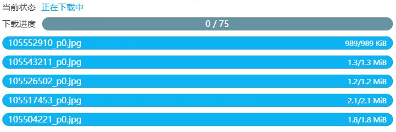
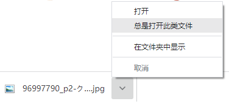
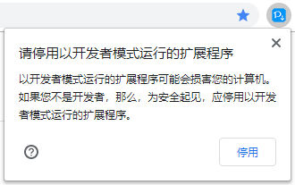
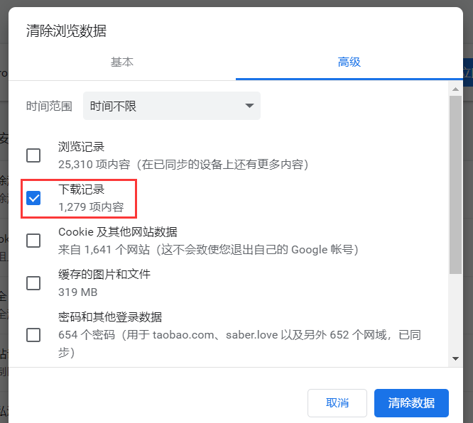
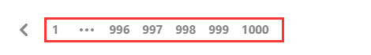
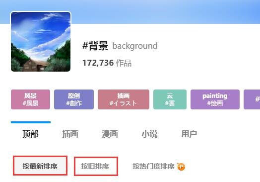
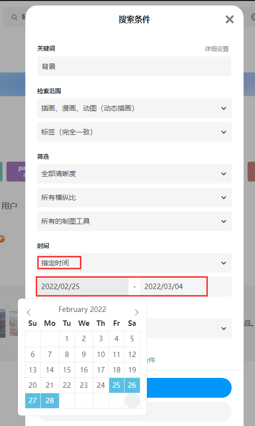
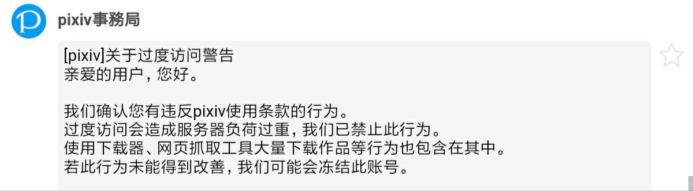
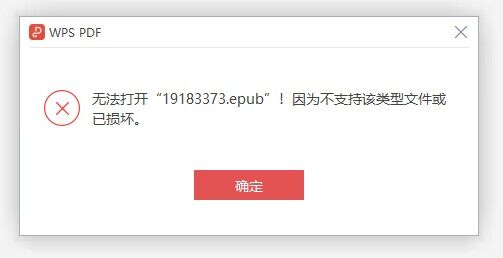
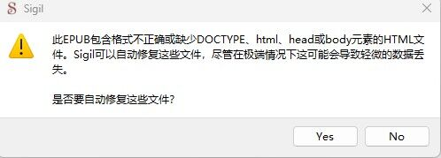

# 常见问题

?>你可以使用浏览器的搜索功能（快捷键是 `F3` 或 `Ctrl` + `F`），输入关键词在本页面上进行搜索，可能会更快的找到需要的内容。

## 查看帮助信息

- 下载器面板的左下角有一个“常见问题”按钮，可以查看一些简单的帮助信息。
- 你可以查看 [安装之后的设置](zh-cn/安装之后) 页面，检查一些原因。
- 如果你不清楚某个功能怎么使用，请查看本 wiki 里的相关内容。

## 检查常见的原因

- 查看网页顶部的日志里是否显示了错误信息或相关提示。
- 如果你遇到的问题是浏览器启动时会卡住一段时间（无响应），这是因为浏览器的下载记录太多导致的，清空浏览器的下载记录即可解决。
- 如果你使用的浏览器不是 Chrome、Edge、Firefox，请使用其中一种浏览器安装本扩展程序，观察问题是否能够解决。我不对其他浏览器提供支持。
- 如果你的浏览器不是最新版本，请更新浏览器。
- 重启浏览器，然后重试之前的操作，观察问题是否已经解决。
- 如果本扩展程序不是最新版本，请更新到最新版本。你可以在浏览器的扩展程序商店里查看本扩展程序的版本号。如果你已安装的扩展不是最新版，通常只需要等待一段时间，浏览器就会自动更新。你也可以移除这个扩展程序，然后重新安装它（这会丢失下载器的设置，所以你可以先导出设置）。
- 可能是网络连接不畅，请检查网络连接。
- 中国大陆用户建议使用梯子（代理软件）访问 Pixiv，并检查线路是否有效。
- 系统分区（通常是 C 盘）的剩余空间可能不足。如果可用空间小于 4GB，可能无法下载一些体积较大的文件。这是浏览器的限制，此时请尝试清理系统分区的空间，然后重新启动浏览器。

?> 如果问题仍然不能解决，请查看 [联系我](zh-cn/联系我) 页面里的信息。

## 文件下载到了哪里

*文件保存位置/图片保存位置/保存路径*

下载的文件保存在浏览器的下载目录里。

## 能不能把文件保存到浏览器下载目录之外

**不能**，这是浏览器的限制。

下载器自动保存文件时，只能把文件保存到浏览器的下载目录里，这是浏览器的安全策略导致的。

## 怎么修改下载位置

*修改下载路径/下载文件夹*

如果你不想让文件保存到浏览器的下载目录里，那么你只能在浏览器的设置里修改下载位置。

请打开浏览器的设置页面，找到“下载”相关的设置，修改文件的默认保存位置。

如果你不想修改浏览器的文件保存位置，那就只能在文件下载之后把文件移动到其他位置。

## 怎么建立文件夹

*创建文件夹*

在命名规则里使用斜线 `/` ，斜线前面的部分会作为文件夹的名字。

如 `{page_title}/{id}-{tags}-{user}` 会使用页面标题建立一个文件夹。

## 怎么把某个艺术家/用户的作品放到同一个文件夹里

*怎么把画师的作品放在一起？*

在命名规则里使用用户名建立文件夹就可以了。例如：

```
{user}/{id}
```

## 怎么把多图作品保存到单独的文件夹里

如果你需要这样的效果：

单图作品直接保存到用户的文件夹里，多图作品则额外建立一层文件夹。

例如：

```
Downloads
│
├─葛飾ぱち
│  │  99097921.png
│  │
│  └─99276627
│          99276627_p0.png
│          99276627_p1.png
```

首先在命名规则里确认你是否设置了使用用户名建立文件夹，例如：`{user}/{id}`。默认的命名规则 `pixiv/{user}-{user_id}/{id}-{title}` 也会使用用户名建立文件夹。

然后启用这个设置：[为每个作品建立单独的文件夹](/zh-cn/设置-更多-命名?id=为每个作品建立单独的文件夹) 即可。

## 抓取完毕，但没有找到符合筛选条件的作品

*抓取结果为0*

有时候抓取完成后你可能会看到一条提示消息：

<span class="log" style="color: rgb(210, 126, 0);">抓取完毕，但没有找到符合筛选条件的作品。</span>

这是因为本次抓取的所有作品都不符合过滤条件的要求。

你在“抓取”标签页里看到的设置，都是过滤器，例如作品类型、图片数量、收藏数量、发表日期、标签要求等。

如果你修改了过滤条件，可能会导致抓取结果为 0，并看到上面的提示消息。

例如：如果你取消选择了“插画”类型，而这次抓取的作品又全都是插画，那么抓取结果就会使 0。 

## 为什么抓取到的文件数量比作品数量多

有时候在抓取完成后你可能会看到像这样的日志：

<span class="log">共抓取到 10 个作品</span>

<span class="log">共抓取到 20 个文件</span>

这是因为有些作品可能含有多个图片。每个图片是一个文件，所以文件数量比作品数量多是很正常的。

## 下载后的文件名乱码

*文件名异常/文件名乱码/uuid*

如果你看到下载后的文件名是一串不知道什么意思的字符，类似这样：


请查看 [下载后的文件名异常的问题](/zh-cn/安装之后?id=下载后的文件名异常的问题)。

## 文件名是 jfif 格式

*文件名后缀名是 jfif*

可能的原因：
1. 受其他扩展影响。
2. 如果你在下载器的 [图片尺寸](/zh-cn/设置-更多-下载?id=图片尺寸) 设置里选择了“缩略图”，则有可能下载到 jifi 格式的文件，这是正常的。

## 是否支持断点续传

是的，下载器支持断点续传。

下载过程中，如果页面崩溃或者你不小心关闭了页面，你可以重新打开这个页面，下载器会恢复下载进度，所以你可以继续下载。

## 怎么不下载重复文件

*怎么不下载以前已经下载过的作品？*

你可以启用 [不下载重复文件](/zh-cn/设置-更多-下载?id=不下载重复文件) 功能。

在某些情况下，你也可以考虑使用增量更新，只抓取最近新发布的作品。可以查看“使用技巧”页面的 [增量更新](/zh-cn/使用技巧?id=增量更新) 部分。

## 下载很慢

下载慢、下载没速度怎么办？

这主要是国内用户会遇到的问题，推荐使用靠谱的代理/翻墙软件，比如 ssr、v2ray、clash 等，并使用稳定的机场/路线。

你还可以尝试另一个办法：抓取完成后，使用 “复制 URL” 功能复制图片网址，然后使用其他软件如 IDM 等下载这些文件。这可能会提高下载速度，但是这些软件无法对文件重命名。

## 动图下载很慢

动图的体积通常比较大，下载耗时会更久一些，这是正常的。

另外由于 Pixiv 的动图源文件是 zip 格式，下载器把它转换成其他格式也会花费一定时间。

如果你确定是下载速度很慢（例如每秒钟只有几百 KB），请检查网络/机场线路的问题。

## 下载进度一直是 0



有些用户可能会遇到这个问题，下面的下载进度条已经完成了，但是上面的总进度条上显示的任务完成数量却是 0，并且也没有继续下载后续图片。

请尝试以下操作：

1. 首先请刷新页面，然后重新/继续下载，检查问题是否解决。
2. 如果问题依然存在，一般是因为你使用了错误的浏览器引起的。有些浏览器是 Chrome 的套壳，它们不能正常使用下载器。请把你的浏览器换成 Chrome 或者 Edge 再试试。
3. 如果你的浏览器符合要求，请尝试重启浏览器、或者升级浏览器后再重新开始下载。
4. 如果问题依然存在，你可以随便找几个作品单独下载试试。如果有些能下载，但是出现问题的这个却不能下载，那么可能是文件名里含有非法字符，请尝试修改文件命名规则，再重新下载。
5. 如果问题依然无法解决，请参考本 Wiki 中的“联系我”页面，向我报告问题。

## 任务卡住怎么办

这一般是网络问题，网络情况越差，越容易遇到这个问题。

如果你在抓取任务时就卡住，可以尝试等待一段时间，看过一段时间之后是否能够继续抓取。如果不能，建议刷新页面重新抓取。

如果在下载时卡住，可以先暂停任务然后点击开始下载；或者关闭页面，之后再打开这个页面，继续下载。

?>如果你的网络情况比较差，可以把下载线程设置的小一些，减小卡住的几率。

## 下载卡住时会自动重试吗

会。

当网络状况较差时，下载可能会因为超时或者网络断开而卡住。本程序会自动重试下载出错的文件。

## 一直卡住，无法下载到任何图片

首先检查网络问题，如果网络没问题（可以正常访问 Pixiv，网速也很快），那么你可以检查一下系统盘（一般是 C 盘）剩余空间。

如果系统盘剩余空间比较小，Chrome 可能会阻止一些较大的 xhr 请求，导致下载一直失败。请清理一下空间再尝试下载。这个原因是由 Reinford 找出来的。

*备注：在这种情况下，Chrome 不会阻止 fetch 请求*

## 下载到的图片是损坏的

下载的图片只能显示一部分/一半，剩余部分没有图像。

这可能是下载时网络出现问题，图片加载到一半之后失败了。请重新下载损坏的图片/作品。

如果重新下载后还是损坏的，可能是这个图片存在缓存。请清除浏览器的缓存之后，刷新页面重新下载这个作品。

## 下载进度条变成红色是怎么回事

这表示这个进度条上的文件下载出现了错误，下载器会尝试重新下载它。

你不需要做出处理。

## 下载失败：USER_CANCELED

如果出现这样的错误提示，可能的原因有：

1. 下载时弹出另存为对话框
2. 文件名超长
3. 其他原因

前两条的解决方法写在下面。

## 下载时弹出另存为对话框

*下载时弹出文件另存为对话框/另存为窗口/保存窗口*

如果下载时浏览器弹出了“另存为”对话框，请检查以下可能的原因：

**原因 1**：请确认你在浏览器设置里**关闭**了“下载前询问每个文件的保存位置”。

如果开启了这个设置，那么每次下载都会出现“另存为”对话框，所以你应该关闭这个设置。

**原因 2**：可能是下载的文件里有重复的文件名，请检查你的命名规则。

如果你的命名规则里带有 `{id}` 标记或者 `{p_num}`，那么应该不会有重名文件；否则就可能有重名文件。

比如作品 id 78279423，有三张图片，`{id}` 或者 `{p_num}` 标记会添加序号，这样就不会重名：

```
78279423_p0.jpg
78279423_p1.jpg
78279423_p2.jpg
```

如果不带序号，就会重名：

```
78279423.jpg
78279423.jpg
78279423.jpg
```

当命名规则里没有 `{id}` 或者 `{p_num}`，则要留意是否会出现重名问题。

**原因 3**：可能是因为文件名过长。

一般来说，大部分操作系统的文件名长度限制是 255 个字符。如果文件名很长，字符数量超出限制，则浏览器可能无法保存文件，而是出现“另存为”对话框，让用户进行操作。

如果你是 Windows 操作系统，并且文件保存在本机硬盘上，应该不会遇到这个问题，因为在这种情况下，Chrome 会自动截断超出长度的字符，让文件能够成功保存。

但如果是其他情况，例如你使用的是某些 Linux 操作系统，或者文件的保存位置是网络位置（NAS），那么 Chrome 可能无法采取正确的措施，这会导致文件保存失败，有可能出现“另存为”对话框。

**原因 4**：可能是因为下载位置不存在

例如，你浏览器设置里的文件下载位置是 `D:\downloads`，如果这个位置不存在了，也会弹出另存为对话框。

## 文件名太长怎么办

*文件名超长/文件名太长*

如果你因为文件名超长导致无法保存文件，那么你可以打开下载器面板，在“更多”选项卡的“命名”部分，启用“文件名长度限制”。

“文件名长度限制”功能可以让你设置文件名的最大长度。如果文件名超出长度，下载器会截断多余的字符，让文件能够正常保存。

## 为什么下载后会自动打开图片

*下载后自动打开图片/自动打开文件/自动打开 txt 文件*

下载的文件默认不会自动打开。如果你发现某一类文件会在下载后自动打开，请检查你在下载此类文件时，是否在底部下载栏里勾选了“总是打开此类文件”。



如果你勾选了这个选项，就取消勾选即可。

## 为什么在搜索页面不会自动开始下载

你可以关闭“预览搜索页面的筛选结果”，并且启用“自动开始下载”，这样就可以自动开始下载了。

为什么启用了“预览搜索页面的筛选结果”就不会自动开始下载了呢？请查看这个选项的说明。

[预览搜索页面的筛选结果](zh-cn/设置-更多?id=预览搜索页面的筛选结果)

## 离线安装之后，浏览器启动时会出现提示

如果你离线安装了本程序，当浏览器启动时，可能会在右上角提示：请停止以开发者模式运行的扩展程序。



>Chrome 84 版本之后没有这个弹窗了。但是 Edge 浏览器目前还有。

如果你想消除这个提示，以下提供一些办法：

1. 如果你安装有火绒杀毒软件，你可以使用它的屏蔽弹窗功能，屏蔽这个弹窗。


注意只选择这个弹窗，不要把整个 chrome 都屏蔽了。

来源：[一届书生](https://www.cnblogs.com/52dxer/p/11067617.html ':target=_blank')

*在线安装本扩展不会出现弹窗警告。*

## Date format error!

如果启用了选项“设置投稿时间”，需要输入起始时间和结束时间。

如果输入的时间不能被解析为有效的时间，就会出现警告信息：`Date format error!`

## 无权访问某个作品

这是因为在获取某个作品时出现了无法处理的错误。

这是一个网络请求的错误，可能这个作品是私密的作品，或者只是单纯的网络问题。

你可以打开这个 id 的作品页面，如果它是正常的，你可以在这个页面直接下载它。

## 下载（抓取）按钮不显示

这可能是某些设置项的值有误，导致下载器出错。

你可以尝试打开下载面板-“更多”选项卡-管理设置-重置设置，然后刷新页面。

## 如何下载 ID 列表

如果你有作品的 id 列表，想根据 id 列表进行下载，需要打开 Pixiv 主页，然后打开下载器面板，可以看到这个按钮：

*输入id进行抓取*

点击这个按钮会出现一个输入框，把 id 列表复制进去就可以开始抓取了。

## 怎么停止抓取

怎么停止/中止/中断抓取？

目前没有控制按钮可以停止抓取。你可以刷新页面来强制停止抓取。

## 浏览器启动时卡住

Chrome很卡/卡顿/Chrome启动无响应/卡一会儿/浏览器卡顿/浏览器很卡

这可能是你的下载记录太多导致的。你可以在“清理浏览数据”界面查看下载记录的数量：



下载记录太多可能会导致浏览器卡顿，特别是浏览器刚启动时，以及打开下载管理页面时。

一般来说，如果下载记录的数量超过 10,000 个，你就可以清理了。

如果清理下载记录之后，问题依然没有解决，请考虑卸载和重装浏览器。

## 怎么分批下载

分批下载/分批抓取

在一些页数较多的页面里，如果你预计到抓取结果太多，可以考虑分批进行抓取和下载。

例如：

1. 在第 1 页，设置“抓取页数”为 100，然后开始抓取和下载。
2. 下载完成后，跳转到第 101 页，然后再次抓取 100 页。因为下载器会从当前页面开始计算页数，所以这样可以抓取 101 - 200 页。
3. 以此类推。

## 安卓系统里文件名的排序混乱

*安卓文件管理器排序错误/排序混乱/文件名排序错误/文件排序混乱*

pixiv 下载的文件是带有 id 和序号的，假设一个作品有很多张图片，并且 id 和序号在文件名的开头，像这样：

```
94495223_0
94495223_1
94495223_2
94495223_3
94495223_4
94495223_5
......
94495223_20
```

以上是序号 0 到序号 20 的示例。

我们通常希望下载下来的图片在资源管理器（文件管理器）里也能按序号排序。那么我们在资源管理器里选择“文件名”排序方式就可以了。

但是使用安卓系统的用户经常会发现他们所看到的排序是混乱的，例如（仅列出序号部分）：

```
0
1
10
11
12
13
14
15
16
17
18
19
2
20
3
4
5
6
7
8
9
```

这个问题的原因是：这个资源管理器把文件名作为字符串进行排序，结果就出现了这种情况。

如果把序号部分解析为数字再排序，就不会出现这个问题。

那么怎么解决安卓上的这个问题呢？你可以在下载器的“更多”选项卡--“命名”分类里，开启设置“**在序号前面填充 0**”。这样就能解决这个问题。

启用“在序号前面填充 0”之后，序号会变成下面这样：

```
000
001
002
003
004
005
006
007
008
009
010
011
012
013
014
015
016
017
018
019
020
```

因为在序号前面填充 0 之后，序号的长度都是一样的，所以在安卓上也能够按照正常的顺序排列了。

## 怎么让下载的文件按照网页上的顺序排序

*图片排序，作品排序，文件排序*

怎么让下载的作品保持和网页上一样的顺序呢？

在大部分页面里，作品都是按照作品 id 倒序排序的。越晚发表的作品，其 id 越大。

你在网页上看的作品排序可能是这样的：

```
96954935
96894692
96800281
96659987
96628297
```

下载器默认的命名规则会在文件名的开头使用 `{id}`。你可以让下载后的文件按照文件名排序，也就是使用作品 id 来排序。

不过资源管理器里的默认排序是正序排列的（从小到大），所以你看到的文件的顺序和网页上是相反的。如果你想让文件的顺序和网页上的一致，你可以在资源管理器里更改排序方式，让文件名倒序排列。

## 下载收藏的作品时怎么让文件按照收藏顺序排序

下载书签里的作品时，怎么让下载的文件和作品的收藏顺序一致？

之所以会有这个问题，是因为收藏/书签里的作品的排序不是按照作品 id 排序的，而是按照你收藏它的时间来排序的。

默认的，你最新收藏的作品会排在前面，最早收藏的作品会排在后面。怎么让下载后的文件按照收藏的顺序排列呢？

你可以修改命名规则，在文件名的开头使用 `{bmk_id}`，例如 `{bmk_id}-{id}`。

- `{bmk_id}` Bookmark Id。你收藏的每一个作品都会有一个 Bookmark Id。收藏的时间越晚，Bookmark Id 就越大。当你下载你的收藏时，可以使用 `{bmk_id}` 作为排序依据。

`{bmk_id}` 是一串数字，但它不是作品 id，而是你收藏这个作品时产生的一个数字。在文件名的开头使用这个数字，可以用来对文件进行排序。

不过资源管理器里的默认排序是正序排列的（从小到大），所以你看到的文件的顺序和网页上是相反的。如果你想让文件的顺序和网页上的一致，你可以在资源管理器里更改排序方式，让文件名倒序排列。

## 搜索标签时最多只能抓取 1000 页怎么办

搜索页面不能抓取所有作品怎么办？目前没有能够直接解决这个的办法，需要你多花点时间来手动解决。

有些 tag 的搜索结果很多，例如：

https://www.pixiv.net/tags/%E8%83%8C%E6%99%AF/artworks

“背景” tag 现在有 172,734 个作品。一页显示 60 个作品，总页数接近 2900 页。

但是你可能只能查看到 1000 页。当你位于第 1000 页时。底部的页码也到头了，没有后续的页码：

https://www.pixiv.net/tags/%E8%83%8C%E6%99%AF/artworks?p=1000https://www.pixiv.net/tags/%E8%83%8C%E6%99%AF/artworks?p=1000



抓取不完了，这是怎么回事呢？

1. 这是 pixiv 的限制，下载器无法破解。
2. pixiv 普通用户最多可以查看 1000 页，pixiv 高级会员最多可以查看 5000 页。
3. 你能够查看到多少页，下载器也就能下载到多少页。

**怎么解决这个问题**？以下是一些可行的方法：

- 方法 1：修改排序方式来抓取更多作品



默认情况下搜索结果的排序方式是从新到旧。你可以先正常抓取和下载 1000（或者 5000）页，下载完成之后，在第一页点击“按旧排序”，这样搜索结果的排序方式是从旧到新，这样你就能够下载到更多的作品了，最多可以下载到 2000（或者 10000）页的作品。但是如果这样还是不能下载到所有作品，那就需要考虑其他办法了。

- 方法 2：使用时间段筛选

你可以在搜索页面点击“搜索条件”，然后设置“时间”选项为“指定时间”。



例如，你可以设置时间范围为某一年，然后查看和下载这一年里发表的作品。

下载完成后，再搜索另一年里发表的作品，并下载它们。以此类推。

- 方法 3：购买 pixiv 高级会员（premium）

因为 pixiv 高级会员（premium）可以查看 5000 页，所以不容易遇到这个问题。相比之下，普通用户只能查看 1000 页，遇到这个问题的几率就比较高。

## 下载时发生错误，状态码为 0

有些用户可能会遇到下面的错误：

```
下载时发生错误，状态码为 0，请求未成功。可能的原因： 

1. 系统磁盘的剩余空间可能不足（建议剩余空间大于 4GB）。请尝试清理系统磁盘空间，然后重新启动浏览器，继续未完成的下载。 

2. 网络错误。可能是网络代理导致的问题。
```

这是因为对于下载器发出的请求，浏览器直接返回了 200 failed 状态（请求成功但返回了失败的结果。下载器内部 XHR 请求的 status 是 0）。

可能的原因以及解决方法：

1. 系统磁盘的剩余空间可能不足（建议剩余空间大于 4GB）。注意要看【系统盘】的剩余空间，而不是其他盘。如果系统盘的剩余空间小，就清理空间。
2. 网络错误。目前已知一些国内用户使用 Nginx 反代理上 p 站，或者 Apache 反代理上 p 站，有可能发生这个问题。请关闭这些反代理软件，换成使用梯子访问 p 站，就不会出现这个错误了。

## 怎么用梯子？

梯子就是俗称的翻墙软件。

目前小白很容易错误的购买一些收费的梯子（vpn）软件，但这些软件的大多是坑钱的，质量不佳。例如：蓝灯、蜂窝vpn、西部世界、猎豹加速器等。

在这些软件里，它的线路基本都是固定的一些线路，是软件开发商自己维护的。你不能换成别的机场的翻墙服务。如果这个软件自带的翻墙服务不好用，那你也没办法对它怎么样。

成熟的梯子是免费的，其软件只是一个工具，不自带翻墙功能。现在 Windows 上流行的软件是 V2rayN 和 Clash。手机上的话 Clash 似乎更方便一些。

有了梯子软件后，你需要去机场（提供翻墙服务的网站）购买翻墙服务，然后在梯子里使用。机场提供的线路不管是在数量上还是速度、稳定性上都比那些坑钱的软件更好。有些机场提供免费路线（免费的质量就差一些）。如果一个机场不好用了，你可以换成别的机场。

---------

有些新人不知道怎么用梯子，我在这里发个我现在用的梯子网站（机场）：

?>机场网址：[[TTK Cloud](https://www.ttkcloud.icu/#/register?code=6m4hMaPu)](https://www.ttkcloud.icu/#/register?code=6m4hMaPu ':target=_blank')

域名是塔塔开！ttk cloud。这个梯子我用了很久了，稳定，速度快，不易出错。

机场的使用方法是先购买流量套餐，之后获取订阅链接，最后到 ssr、v2ray、clash 里使用。网站里也有教程的，可以注册看下。

因为有很多国内用户遇到网络问题，所以在这里发一下，希望能有所帮助。

--------

很多机场的套餐一般都分包月的（到期的话就过期）或者按流量的（购买一定额度的流量，不用完就不会过期）。

这就像一些点卡游戏的月卡或者点卡一样，需要你根据自己的需求来选择。

所以如果你用的流量多，可以考虑月卡。用的流量少，就偏向于点卡。

## Pixiv 返回了空数据

当你在搜索页面进行抓取时，可能会在日志里看到提示：

```
Pixiv 返回了空数据。下载器已暂停抓取，并且会在等待几分钟后继续抓取。
```

这是因为 pixiv 最近做出了反爬取措施，如果短时间内抓取几百页，就会触发限制，pixiv 直接返回空数据，这将导致下载器什么都抓取不到。

所以当触发了这个限制之后，下载器必须等待一段时间（目前是 200 秒），等待限制解除之后再继续抓取。

## 作品总数为 0，Pixiv 可能拒绝了此次抓取

如果你在搜索页面已经被限制了抓取，此时再开始抓取，就会出现“作品数量为 0”的错误。

这是因为 pixiv 的反爬取措施导致的，请过几分钟后重试。

## 429 错误

*429 状态码*

抓取遇到429问题： 

短时间内抓取太多就会这样。 这是 pixiv 的反爬取措施，在几分钟内不能进行抓取。

即使出现了429，但是下载器依然可以抓取完毕，只是需要的时间比以前多。 

如果你不想遇到429，可以在下载器设置中启用“减慢抓取速度”。（但这会导致抓取需要更长的时间）

如果你想要最快的抓取速度，就不要开启“减慢抓取速度”，让下载器自动重试抓取即可。

## 会被封号吗

*如果下载得太多会被 ban 吗？*

如果你下载得太多，可能会收到 pixiv 的“过度访问警告”邮件，内容如下：



当你收到邮件之后，如果仍然大量下载，有可能会被 pixiv 永久封禁账户。

被封禁的账户无法收藏、点赞作品，也无法关注用户。但是仍然可以正常浏览和下载大部分内容。

如果你被封禁了，可以尝试注册新的账号。

?>下载器现在可以检测用户是否在最近收到了此信息，如果检测到，就会自动暂停下载，避免用户被封号。

## 无法打开 EPUB 文件

*无法打开 EPUB 小说；小说的 EPUB 文件损坏*

如果你在打开下载器生成的 EPUB 小说文件时出现错误，请尝试更换小说阅读器。



很显然，WPS 不是一个合适的 EPUB 阅读器。

有些软件也同样如此。



我建议你自行搜索“epub 阅读器”来找到真正适合阅读 EPUB 小说的软件。

这里是一些可以在浏览器里直接打开 EPUB 小说的网站：

https://www.neat-reader.cn/webapp#/

https://epub-reader.online/#

