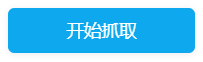
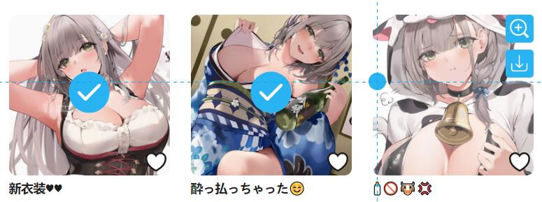
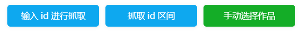
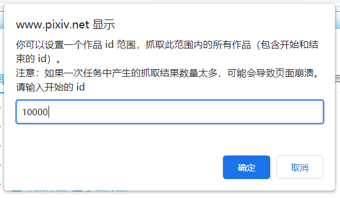
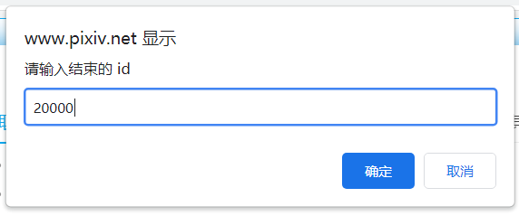
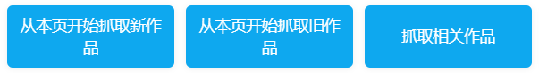
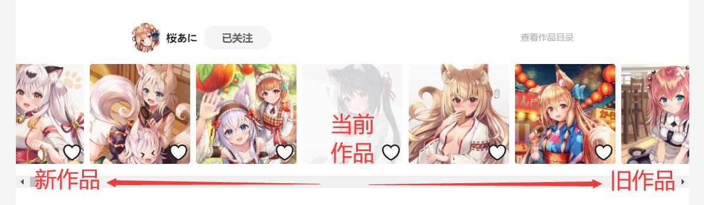
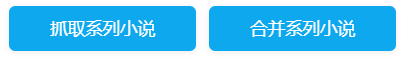
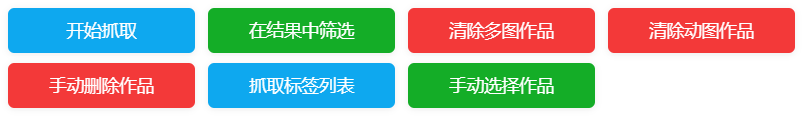
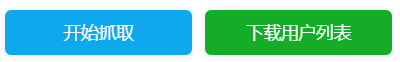

# 抓取按钮

抓取按钮指的是“抓取”选项卡中的按钮，用来启动抓取，或者筛选作品的按钮。

不同的页面可能有不同的按钮。

## 通用的按钮

有一些按钮可能会出现在多种页面里。

### 开始抓取

按照设定的条件开始抓取作品。

### 手动选择作品

?>查看视频教程：[手动选择作品](https://www.youtube.com/watch?v=wAUotRzs3Uw&list=PLO2Mj4AiZzWEpN6x_lAG8mzeNyJzd478d&index=11 ':target=_blank')

在大多数页面里都有这个按钮。你可以手动选择页面上的任意作品进行下载。

?>这个按钮对应的快捷键是 `Alt + S`。

进入选择模式之后，下载器会显示一个指示图标，并且跟随你的鼠标指针移动。你在作品上点击鼠标，就可以选择这个作品。被选择的作品上会被添加一个标记。

效果如下：

进入选择模式之后，还会显示一些新的控制按钮:

你可以暂停选择、继续选择。

当你选择完毕之后，点击“抓取选择的作品”按钮进行抓取。

你可以点击“清空选择的作品”来清除之前选择的作品数据，以开始一次新的选择。

**提示：**

- 你可以通过“暂停选择”、“继续选择”来进行多次选择，也可以在进入其他页面后继续选择。
- “抓取选择的作品”按钮会显示选择的作品数量。
- 下载器的过滤条件对手动选择的作品也会生效。所以你选择的某些作品可能不会被下载。
- 为防止误操作（因为点击作品链接会进入作品页面），进入选择模式之后，鼠标点击作品是不会进入作品页面的。如果你想进入作品页面，可以选择：1. 打开鼠标右键菜单，选择“在新标签页打开链接”；2. 点击“暂停选择”按钮（或按 `Esc` 键），停止选择作品。
- 当你进入其他页面时，**可能**会丢失选择的作品列表(*)。这时下载器会让浏览器提示你是否要离开此页面。如果你选择离开，就会丢失抓取的作品列表。

?>(*) 有时候进入某些页面是不需要重新加载网页的（浏览器的刷新按钮不会变化），这种情况下不会丢失已选择的作品。如果需要重新加载网页（浏览器的刷新按钮会发生变化），则会丢失已选择的作品。

## 首页

Pixiv 的首页内容繁杂，因此本程序不能一键下载主页上的所有作品。

在主页上有这些抓取按钮：

### 输入id进行抓取

点击这个按钮就会在页面顶部出现一个输入框，你可以输入或者粘贴作品的 id 列表：

如果有多个作品 id，用换行（回车键）分割，每行一个 id。

输入之后，再次打开设置面板，就可以抓取输入的 id。

?>此功能并不常用，但有时候很有用。如果你有一些 id 列表，这个方式就比较便捷。

**注意：**

当你在小说的首页 [https://www.pixiv.net/novel/](https://www.pixiv.net/novel/) 输入 id 时，本程序会把 id 当作小说的 id。

相对的，当你在图片的首页输入 id，本程序会把 id 当作图片的 id。

### 抓取 id 区间

点击此按钮之后，你可以设置一个作品 id 范围，下载器会自动抓取此范围内的所有作品（包含开始和结束的 id）。

示例：

?>建议一次不要抓取超过 100,000 个 id。（虽然你可以设置更多，但是不推荐那样做）。

**注意：**

1. 如果一次任务中产生的抓取结果数量太多，可能会因为内存使用量太多而导致页面崩溃。如果你设置了很多 id，请考虑使用过滤条件进行过滤，以减少抓取结果的数量。
2. 当抓取数量太多时，浏览器对网络请求的处理会逐渐变慢。即使网络请求的耗时没有变，但是随着抓取数量的增加，浏览器对网络请求的处理速度会越来越慢，所以不要一次任务中抓取太多 id。
3. 如果一次任务中抓取了太多 id，在抓取完成之后，下载器可能不会自动进入下载流程。你可以导出抓取结果，然后刷新页面，导入抓取结果，然后开始下载。

?>这个功能是对“输入id进行抓取”的补充。在你需要抓取许多 id 的时候（如 5,000,000 个），使用“输入id进行抓取”需要用户先生成 id 列表，然后粘贴到 id 列表输入框里。这样很不方便，所以我添加了抓取 id 范围的功能。

## 作品页面

当你处于作品页面内，比如 [99904686](https://www.pixiv.net/artworks/99904686 ':target=_blank')，可以看到这些按钮：

### 从本页开始抓取新作品

可以下载本页作品，以及比本作品更新的作品。

新作品指的是投稿时间比当前作品更晚的作品。在作品页面里，它们位于当前作品的左边。

示意图：

你可以通过“设置作品数量”的选项，设置下载多少个作品（含本页作品）。默认值的 -1 可以下载本页和更新的所有作品。

### 从本页开始抓取旧作品

可以下载本页作品，比本作品更早期的作品。

旧作品指的是投稿时间比当前作品更早的作品。在作品页面里，它们位于当前作品的右边。

你可以通过“设置作品数量”的选项，设置下载多少个作品（含本页作品）。默认值的 -1 可以下载本页和更早期的所有作品。

### 抓取相关作品

相关作品指的是作品页面底部的“相关作品”部分。

你可以通过“设置作品数量”的选项，设置下载多少个相关作品。默认值 -1 可以下载所有的相关作品。

?>相关作品最多有 180 个。

## 作品列表页

示例页面：[宮瀬まひろ](https://www.pixiv.net/member.php?id=544479)

画师的首页、插画作品列表、漫画作品列表、小说作品列表都是“作品列表页”。

### 开始抓取

在这些页面里，可以通过“开始抓取”按钮启动任务。

本程序**从当前页面开始**一直向下一页抓取。抓取页数可以通过“抓取多少页面”选项进行设置。默认值 -1 会向下抓取所有页面。

?>在作品列表页，本程序会按照作品 id 从大到小下载，也就是先下载近期作品，后下载早期作品。

## 收藏页面

你可以下载其他人收藏的公开作品，以及自己收藏的所有作品。

### 开始抓取

本程序**从当前页面开始**一直向下一页抓取。抓取页数可以通过“抓取多少页面”选项进行设置。默认值 -1 会向下抓取所有页面。

如果你设置了标签、公开或非公开等条件，下载器也会自动应用这些条件。

?>在收藏页面，本程序下载作品时，会按照收藏顺序下载作品。也就是先下载最早收藏的，后下载最晚收藏的。

## 系列小说页面

示例页面：[https://www.pixiv.net/novel/series/1090654](https://www.pixiv.net/novel/series/1090654)

### 抓取系列小说

自动抓取该系列内的所有小说。

### 合并系列小说

点击这个按钮，下载器会把这个系列里的多个小说合并到一个文件里，便于保存和阅读。

**提示：**

1. 此功能所下载的文件的名称是固定的格式：`系列名称 + 第一个小说的 tags + 用户名 + 系列 id`。这是因为下载的文件保存了多个小说，所以不能应用命名规则。
2. 合并系列小说时，下载器面板里不会出现进度条。因为此时下载的是一个合并的文件，没有经过正常的下载流程。
3. 合并系列小说时，下载器不会保存这次任务中的抓取记录。在文件下载之后，下载器也会清除这次的抓取数据。

## 搜索页

搜索页是指搜索某个标签的页面。

示例页面：[Fate/GrandOrder](https://www.pixiv.net/search.php?s_mode=s_tag&word=Fate%2FGrandOrder)

**提醒：**

1. 搜索页推荐使用 `{p_tag}` 作为文件夹名字。
2. 搜索页里有“快速筛选”功能。详见：[在搜索页面添加快捷搜索区域](/zh-cn/设置-更多-增强?id=在搜索页面添加快捷搜索区域)。
3. 如果启用“预览搜索页面的筛选结果”选项，下载器会把抓取到的符合要求的作品显示在页面里，方便查看。
4. 在搜索页，本程序会按照作品的收藏数，从高到低下载。也就是优先下载收藏数高的作品。
5. 对于非 Pixiv 高级会员（premium）来说，搜索页最多有 1000 页。高级会员则可以查看和搜索最多 5000 页。

### 开始抓取

本程序从当前页面开始抓取作品（含当前页面）。抓取的页数可以通过“抓取多少页面”选项进行设置。默认值 -1 会向下抓取所有页面。

抓取完成后，下载器会把作品按照收藏数量从高到低排序。

### 在结果中筛选

当第一次抓取完成之后，你可以改变设置选项，然后点击此按钮，从之前的抓取结果中删除不符合条件的作品。

### 删除作品的按钮

在图片搜索页面会出现这几个按钮。

这几个按钮是用来对抓取结果进行二次筛选的，所以**必须先进行抓取**，有了抓取结果之后，这几个按钮才能发挥作用。

#### 清除多图作品

清除抓取结果里的多图作品

#### 清除动图作品

清除抓取结果里的动图作品

#### 手动删除作品

你可以手动删除你不喜欢的作品，这样就不会下载它。

按下此按钮就会进入手动删除模式，点击作品就可以把它从作品列表里删除。

再次点击此按钮，可以退出手动删除模式。

### 抓取标签列表

这个功能可以让用户输入多个标签，然后全部抓取和下载（也就是一次性下载多个标签）。

点击这个按钮之后，页面顶部会出现一个输入区域，你可以输入要抓取的标签列表。多个标签之间使用换行（回车键）分割。

示例：

**提示：**
- 为了能够让每个标签的作品可以保存到对应的文件夹里，在抓取标签列表时，你可以使用 `{p_tag}` 或者 `{p_title}` 标记获取当前抓取的标签，用来建立文件夹。例如设置命名规则：`{p_tag}/{id}`。
- 此功能必须在搜索页面使用。下载器在抓取所有标签时都会应用当前页面的搜索条件。
- 下载器会依次对每个标签进行抓取和下载（总是会自动开始下载）。下载完一个标签的作品之后才会抓取下一个标签。
- 抓取标签列表时，请不要让当前页面跳转到其他页面。（不要点击页面上的链接）
- 此功能支持保存任务进度，即使关闭了页面或者浏览器，也可以重新打开页面，继续抓取未完成的标签。

## 排行榜

示例页面：[综合今日排行榜](https://www.pixiv.net/ranking.php)

### 抓取本排行榜作品

下载本排行榜作品。

你可以设置下载的作品数量。下载器会根据排名顺序下载指定数量的作品。

?>你可以在命名规则里使用 `{rank}` 标记保存作品的排名。

### 抓取首次登场作品

只下载本排行榜里“首次登场”的作品。（初登場、Debut）

?>有一些页面没有“首次登场”的标志，此时这个按钮应该不会显示。

?>如果你下载了某一天排行榜的全部作品，之后当你下载更新的排行榜时，只需要下载“首次登场”的作品就可以了。

## pixivision

pixivision 是一个单独的网站。本程序可以下载 pixivision 网站上的插画、漫画、cosplay 页面。

示例页面：[衣服下摆打结的插画特辑](https://www.pixivision.net/zh/a/4537)

?>因为这是单独的网站，获取作品信息不方便，而且 cosplay 页面不是 pixiv 上的作品，所以这个页面上少了很多的设置项。

!>在pixivision 里，文件名标记只有 `{p_title}` 和 `{id}` 会生效。

### 抓取该页面的图片

下载该页面的所有图片。

## 添加收藏后的页面

示例地址：[✿❀✿❀](https://www.pixiv.net/bookmark_detail.php?illust_id=63148723)

当你收藏作品时，在编辑了它的 Tag 之后会看到这个页面。不过这个也是时代的眼泪了，现在正常使用 Pixiv 应该很难看到这个页面了。

这个页面可以下载一些相似作品，也就是页面底部的“把这个作品加入收藏的用户也同时加了以下的作品”。

相似作品和作品页面下方的相关作品类似，但它们有一些区别：

- 相似作品可以获取很多个，比如 1000 个，相关作品只有 180 个。
- 相似作品的功能出现得很早，相关作品的功能出现的晚。

### 抓取相似图片

抓取此页面底部的相似图片。

## 发现页面

[进入发现页面](https://www.pixiv.net/discovery) 

在发现页面里， Pixiv 会根据你的收藏，推荐一些你可能会喜欢的作品。

### 抓取当前作品

下载当前页面上的已有作品

?>因为每次获取的数据都是不同的，所以为了保持用户下载到的作品和看到的作品一致，本程序只会下载发现页面的已有作品，不会自动抓取新的作品。

## 关注页面

关注页面也就是 following 页面，这个页面里显示的是你关注的所有用户。

从这个页面里，你还可以进入好友页面、粉丝页面。这些页面都可以进行抓取。

### 开始抓取

点击“开始抓取”按钮，即可一键抓取所有用户的所有作品。

下载器会根据你所在的页面，抓取对应的用户。

- 在关注页面里，会抓取你关注的用户。
- 在好友页面里，会抓取你的好友。
- 在粉丝页面里，会抓取你的粉丝。

?>如果需要抓取的用户数量很多，抓取可能需要花费很久的时间。在这种情况下建议你分批抓取。

### 下载用户列表

这会抓取当前页面类型里的用户列表，并且保存到一个 CSV 文件里。

抓取数量取决于你设置的页数；每一页最多有 24 个用户。

?>使用这个功能时，下载器只会抓取用户列表，不会抓取作品。
