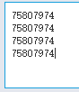
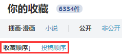
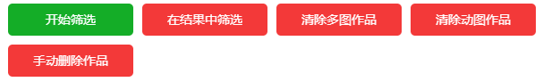

# 抓取按钮

启动抓取或筛选的按钮。不同的页面可能有不同的按钮。

## 首页

### 输入id进行抓取

Pixiv 的首页内容繁杂，因此本程序不能直接下载主页上的内容。在首页里只有一个抓取按钮：输入id进行抓取。

点击它之后，会出现一个输入框，可以输入或者粘贴作品的 id：

如果有多个作品 id，用换行（回车键）分割，每行一个 id。

输入之后，再次打开设置面板，就可以对输入的 id 进行下载。

>?此功能并不常用，但有时候很有用，因为它不需要先进入作品页面就可以进行下载。如果你有一些 id 列表，这样下载会更便捷。

**注意：**

当你在小说的首页 [https://www.pixiv.net/novel/](https://www.pixiv.net/novel/) 输入 id 时，本程序会把 id 当作小说的 id。

在图片的首页，本程序会把 id 当作图片的 id。

## 作品页面

### 从本页开始抓取新作品

可以下载本页作品，以及比本作品更新的作品。你可以通过“设置作品数量”的选项，设置下载多少个作品（含本页作品）。默认值的 -1 可以下载本页和更新的所有作品。

### 从本页开始抓取旧作品

可以下载本页作品，比本作品更早期的作品。你可以通过“设置作品数量”的选项，设置下载多少个作品（含本页作品）。默认值的 -1 可以下载本页和更早期的所有作品。

### 抓取相关作品

相关作品指的是作品页面底部的“相关作品”部分。

你可以通过“设置作品数量”的选项，设置下载多少个相关作品。默认值 -1 可以下载所有的相关作品。

?>相关作品最多有 180 个。

## 作品列表页

示例页面：[宮瀬まひろ](https://www.pixiv.net/member.php?id=544479)

画师的首页、插画作品列表、漫画作品列表、小说作品列表都是“作品列表页”。

### 开始抓取

在这些页面里，可以通过“开始抓取”按钮启动任务。

本程序从当前页面一直向下一页抓取。抓取页数可以通过“设置页面数量”选项进行设置。默认值 -1 会向下抓取所有页面。

?>在作品列表页，本程序会按照作品 id 从大到小下载，也就是先下载近期作品，后下载早期作品。

## 收藏页面

你可以下载其他人收藏的公开作品，以及自己收藏的所有作品。

### 开始抓取

本程序从当前页面一直向下一页抓取。抓取页数可以通过“设置页面数量”选项进行设置。默认值 -1 会向下抓取所有页面。

!>在下载页面里，本程序的抓取不受排序方式的影响。

在自己的收藏页面里可以修改排序方式：

**但这对本程序无效。** 本程序抓取收藏作品时，始终按照默认的顺序（即 收藏顺序↓，按收藏时间倒序排列）。

?>在收藏页面，本程序下载作品时，会按照收藏顺序下载作品。也就是先下载最早收藏的，后下载最晚收藏的。这是因为有用户提出，想让下载顺序和收藏顺序一致，这样，下载后，在资源管理器里以时间排序，就可以以收藏顺序来查看图片。

### 抓取推荐作品

抓取收藏页面底部的推荐作品。

?>因为推荐作品是滚动加载的，不会一次全部加载，所以本程序只下载已经加载出来的作品。

## tag 列表页

示例页面：[画师 まふゆ 的“小悪魔” tag](https://www.pixiv.net/member_illust.php?id=544479&tag=%E6%9D%B1%E6%96%B9)

你可以在画师的作品列表页、收藏页面里，点击某个 tag 进入 tag 列表页。设置面板里的按钮和作品列表页一致。

## 系列小说页面

示例页面：[https://www.pixiv.net/novel/series/1090654](https://www.pixiv.net/novel/series/1090654)

“抓取系列小说”按钮会自动抓取该系列内的所有小说。

## 搜索页

搜索页是指搜索某个 tag 的页面。

示例页面：[Fate/GrandOrder](https://www.pixiv.net/search.php?s_mode=s_tag&word=Fate%2FGrandOrder)

**提醒：**

1. 搜索页里有“快速筛选”功能，详情请参考前面的“便捷功能”条目。
2. 如果启用“预览搜索页面的筛选结果”选项，下载器会把抓取到的符合要求的作品显示在页面里，方便查看。
3. 在搜索页，本程序会按照作品的收藏数，从高到低下载。也就是优先下载收藏数高的作品。
4. 搜索页最多有 1000 页。
5. 搜索页推荐使用 `{p_tag}` 作为文件夹名字。

### 开始筛选

本程序从当前页面开始抓取作品（含当前页面）。抓取的页数可以通过“设置页面数量”选项进行设置。默认值 -1 会向下抓取所有页面。

抓取完成后，下载器会把作品按照收藏数量从高到低排序。

### 在结果中筛选

当第一次抓取完成之后，你可以改变设置选项，然后点击此按钮，从之前的抓取结果中删除不符合条件的作品。

### 其他按钮

请参考本页面的“删除作品的按钮”部分。

## 地区排行榜

示例页面：[北海道 排行榜](https://www.pixiv.net/ranking_area.php?type=state&no=0)

地区排行榜是时代的眼泪，曾经它在首页右侧的排行榜占有一席之地，后来被移除了，只能通过网址进入。

### 下载本页作品

此页面只有 50 个作品，也只有一个按钮——“下载本页作品”。

## 排行榜

示例页面：[综合今日排行榜](https://www.pixiv.net/ranking.php)

### 抓取本排行榜作品

下载本排行榜作品。

你可以设置下载的作品数量，这会根据排名顺序下载指定数量的作品。

?>你可以使用 `{rank}` 标记保存作品的排名。

### 抓取首次登场作品

只下载本排行榜里“首次登场”的作品。（初登場、Debut）

>有一些页面没有“首次登场”的标志，此时这个按钮应该不会显示。

?>如果某一天你下载了今天排行榜的全部作品，之后每天都只需要再下载“首次登场”的作品就行了。

## pixivision

pixivision 是一个单独的网站。本程序可以下载 pixivision 网站上的插画、漫画、cosplay 页面。

示例页面：[衣服下摆打结的插画特辑](https://www.pixivision.net/zh/a/4537)

?>因为这是单独的网站，获取作品信息不方便，所以这个页面上少了很多的设置项。

### 抓取该页面的图片

下载该页面的所有图片。

!>pixivision 里，文件名标记只有 `{p_title}` 和 `{id}` 会生效。

## 添加收藏后的页面

示例地址：[✿❀✿❀](https://www.pixiv.net/bookmark_detail.php?illust_id=63148723)

当你收藏作品时，在编辑了它的 tag 之后会看到这个页面。不过这个也是时代的眼泪了，现在正常使用 Pixiv 应该很难看到这个页面了。

这个页面可以下载一些相似作品。相似作品和作品页面下方的相关作品类似，但它们有一些区别：

- 相似作品可以获取很多个，比如 1000 个，相关作品只有 180 个。
- 相似作品的功能出现得很早，相关作品的功能出现的晚。

### 下载相似图片

下载此页面下方的相似图片。

## 大家/关注的新作品

示例页面：

[大家的最新作品](https://www.pixiv.net/new_illust.php)

[关注的新作品](https://www.pixiv.net/bookmark_new_illust.php)

?>关注的新作品只有 100 页。

### 开始抓取

从本页开始下载作品。

## 发现页面

[进入发现页面](https://www.pixiv.net/discovery) 

发现页面也是时间的眼泪了，现在没有入口，只能通过网址进入。

在发现页面里， Pixiv 会根据你的收藏，推荐一些你可能会喜欢的作品。

### 抓取当前作品

下载当前页面上的已有作品

?>因为每次获取的数据都是不同的，所以为了保持用户下载到的作品和看到的作品一致，本程序只会下载发现页面的已有作品，不会自动抓取新的作品。

### 其他按钮

请参考本页面的“删除作品的按钮”部分。

## 关注 页面

关注页面也就是 following 页面，这个页面里显示的是你关注的所有用户。

### 开始抓取

点击“开始抓取”按钮，即可一键抓取所有关注用户的所有作品。

?>如果你关注的用户很多，抓取可能需要花费很久的时间。

-----------

## 删除作品的按钮

### 清除多图作品

清除页面上的多图作品

### 清除动图作品

清除页面上的动图作品

### 手动删除作品

你可以手动删除你不喜欢的作品，这样就不会下载它。

按下此按钮就会进入手动删除模式，点击作品就可以把它从作品列表里删除。

再次点击此按钮，可以退出手动删除模式。