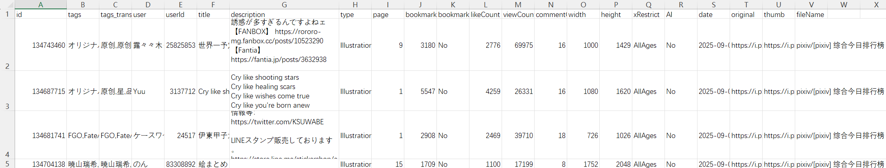
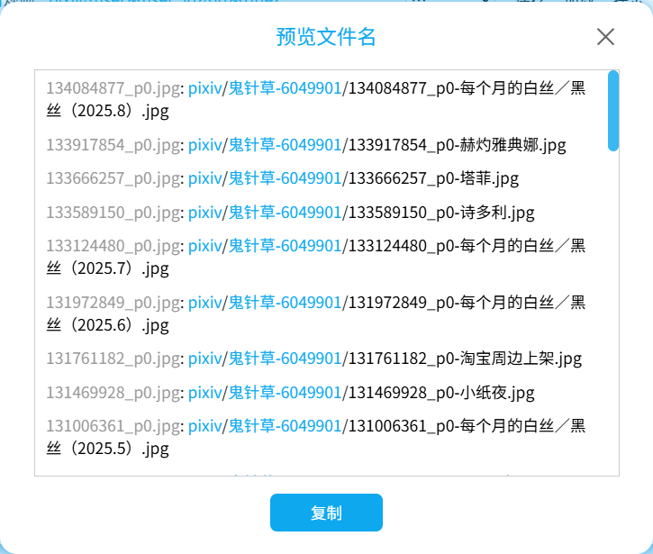
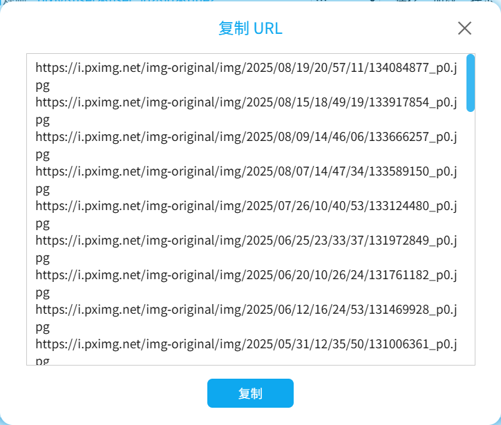

# 下载按钮

下载器的“下载”选项卡里有一些按钮，可以对抓取结果进行处理，以及管理下载。如图所示：


## 导入抓取结果

<button type="button" id="importCrawlResults" class="xzbtns hasRippleAnimation" style="background-color: rgb(20, 173, 39);"><span data-xztext="_导入抓取结果">导入抓取结果</span><span class="ripple"></span></button>

你可以使用这个按钮来导入抓取结果，它与 `导出抓取结果` 按钮是配合使用的。

如果你导入了抓取结果，下载器会跳过抓取阶段，直接下载里面的文件。

?> 这个按钮是始终显示的。其他按钮默认不会显示，当下载器抓取完成之后才会显示。

导入抓取结果时，下载器会应用大部分过滤条件，移除不符合要求的结果。但是以下这些设置不会被应用：
- 抓取多少作品/抓取多少页面
- 图片色彩：彩色图片/黑白图片
- 文件体积限制

?>如果导入的抓取结果很多（例如有几十万个），那么导入可能需要比较长的时间，请耐心等待。导入成功时，下载器会显示一个“导入成功”的消息框。

## 导出抓取结果

<button type="button" id="exportCrawlResultsJSON" class="xzbtns hasRippleAnimation" style="background-color: rgb(20, 173, 39); display: flex;"><span data-xztext="_导出抓取结果">导出抓取结果</span><span class="ripple"></span></button>

点击这个按钮之后，下载器会把当前抓取结果导出为一个 JSON 文件，保存到浏览器的下载目录里。

?> 这个按钮导出的抓取结果可以使用 `导入抓取结果` 按钮来导入，以恢复下载。但是 `导出 CSV 文件` 导出的 CSV 文件不能用来恢复下载。

**提示**：
- 抓取结果不是作品的原始数据。它是下载器根据作品的原始数据生成的内部数据。下载器只保留了一部分用到的数据，并且属性名也可能不同。如果你想知道各个属性的含义，可以查看源代码里的注释（只有中文）：[StoreType.d.ts](https://github.com/xuejianxianzun/PixivBatchDownloader/blob/master/src/ts/store/StoreType.d.ts)。
- 抓取结果里不包含进度信息，所以导入之后下载器会重新下载所有文件。但是你可以启用 [不下载重复文件](/zh-cn/设置-更多-下载?id=不下载重复文件) 功能来跳过重复文件，避免重复下载。
- 抓取结果里的数据是不会更新的。有些作品可能在导出抓取结果之后发生了更改（例如作者修改了作品的内容、标签，或者作品的收藏数量增加了）。下载器不会更新这些数据。
- 抓取结果里没有可以用于这些命名规则的数据：`{page_title}`, `{page_tag}`, `{task_date}`。在你导入抓取结果之后，下载器会根据当前页面的信息自动生成这些标记，但它们输出的内容可能和你导出抓取结果时的内容不一样。如果你没有使用这些命名规则就不需要在意这个问题。如果你使用了这些命名规则，最好在同一个网址里导出和导入抓取结果。
- 如果抓取结果很多（例如有几十万个），那么导出时页面可能会卡顿一会儿，期间无法进行操作。
- 如果你想让下载器在抓取后自动导出抓取结果，可以使用 [自动导出抓取结果](/zh-cn/设置-更多-抓取?id=自动导出抓取结果) 功能。

**一些可能的使用场景：**

- 如果你的抓取结果数量非常多，你可以导出抓取结果作为备用措施。如果下载时发生了意外情况，且无法恢复下载，你可以导入抓取结果来重新下载。
- 如果你在抓取完成之后想修改一些过滤条件（例如之前没有设置收藏数量，现在想筛选出收藏数量大于 1000 的作品），可以先导出抓取结果，然后修改设置，最后导入抓取结果。下载器会移除不符合要求的抓取结果。如果有需要的话，你可以多次执行这个操作。
- 你可以导出抓取结果然后分享给别人，这样他们不需要抓取，可以直接开始下载。当然，你也可以把下载后的文件分享给别人，但是分享抓取结果的话文件体积比较小，而且你也不需要实际下载这些文件。
- 你可以使用分析工具从抓取结果里提取数据。

## 导出 CSV 文件

<button type="button" id="exportCrawlResultsCSV" class="xzbtns hasRippleAnimation" style="background-color: rgb(20, 173, 39); display: flex;"><span data-xztext="_导出csv">导出 CSV 文件</span><span class="ripple"></span></button>

点击这个按钮之后，下载器会把当前抓取结果导出为一个 CSV 文件，保存到浏览器的下载目录里。

文件内容可能如下图所示：



**提示：**
- 导出 CSV 文件的目的是为了方便用户查看每个作品的关键数据，以及对数据进行操作。
- 一个多图作品在下载时可能产生多个文件，但是在 CSV 文件里只会保存一条记录（使用第一张图片的数据）。这是为了避免让用户看到大量重复的数据。
- 导出的 CSV 文件**不能**用于导入抓取结果。如果你想导入抓取结果的话，应该使用 `导出抓取结果` 按钮导出的 JSON 文件。
- 如果你只有 CSV 文件的话，如果想下载里面的作品，可以复制 `id` 列里的作品 ID 列表，然后在 pixiv 首页使用 [输入 ID 进行抓取](/zh-cn/按钮-抓取?id=输入-id-进行抓取) 功能，重新抓取这些作品。
- 如果你想让下载器在抓取后自动导出抓取结果，可以使用 [自动导出抓取结果](/zh-cn/设置-更多-抓取?id=自动导出抓取结果) 功能。

## 预览文件名

<button type="button" id="previewFileName" class="xzbtns hasRippleAnimation" style="background-color: rgb(20, 173, 39); display: flex;"><span data-xztext="_预览文件名">预览文件名</span><span class="ripple"></span></button>

预览每个抓取结果的文件名。看起来像是这样：



下载器会为抓取每个抓取结果生成一条文本，格式为 `默认的文件名: 根据命名规则生成的文件名`，例如：

<p class="result"><span class="color999">134084877_p0.jpg</span>: <span class="colorFolder">pixiv</span>/<span class="colorFolder">鬼针草-6049901</span>/<span class="color000">134084877_p0-每个月的白丝／黑丝（2025.8）.jpg</span></p>

?> 文件名里的蓝色文字表示这是一个文件夹。

你可以点击 `复制` 按钮，下载器会把输入内容存入剪贴板。

?>如果抓取结果的数量太多，出于性能考虑，下载器会把输出内容保存到一个 TXT 文件里，并保存到浏览器的下载目录里。

这个功能对于预览文件名、编写重命名脚本都很有用。

如果你之前下载过一些文件，想把它们的名字改为下载器的命名规则生成的名字，可以先抓取它们，并复制 `预览文件名` 里的内容。然后把左侧的默认文件命修改为旧的文件名，右侧则是新的文件名（但是可能需要去掉文件夹部分），并修改为重命名命令。

举个例子，在 windows 上，你可以这样编写重命名的命令。首先复制预览的一条结果，如下：

<p class="result"><span class="color999">134084877_p0.jpg</span>: <span class="colorFolder">pixiv</span>/<span class="colorFolder">鬼针草-6049901</span>/<span class="color000">134084877_p0-每个月的白丝／黑丝（2025.8）.jpg</span></p>

可以修改成这样：

```
ren old_name.jpg 134084877_p0-每个月的白丝／黑丝（2025.8）.jpg
```

然后在该文件的目录里执行这个命令即可重命名这个文件。

?> 在批量编辑时，你可以使用一些有多行编辑模式的编辑器（例如 VS Code），提高效率。

## 开始下载

<button id="startDownload" class="xzbtns startDownload hasRippleAnimation" type="button" style="background:#0ea8ef;"><span data-xztext="_开始下载">开始下载</span><span class="ripple"></span></button>

当下载器抓取完成后，你可以点击这个按钮，让下载器开始下载。

?>下载器默认启用了 [自动开始下载](/zh-cn/设置-下载?id=自动开始下载) 功能，此时你不需要手动点击这个按钮。

## 暂停下载

<button id="pauseDownload" class="xzbtns pauseDownload hasRippleAnimation" type="button" style="background:#e49d00;"><span data-xztext="_暂停下载">暂停下载</span><span class="ripple"></span></button>

在下载过程中，你可以点击这个按钮来暂停下载。

暂停下载时，下载器会保存下载进度。这意味着：
- 之后你可以点击 `开始下载` 按钮继续下载。
- 刷新页面或重新进入该页面时，下载器会恢复下载进度。

## 停止下载

<button id="stopDownload" class="xzbtns stopDownload hasRippleAnimation" type="button" style="background:#f33939;"><span data-xztext="_停止下载">停止下载</span><span class="ripple"></span></button>

当你点击这个按钮时，下载器会停止下载。

这个按钮不依赖于下载状态，它始终可以生效。不管下载器有没有开始下载、是否下载完了所有文件，它都会生效。

**注意：**停止下载时，下载器会重置下载进度，并清空这次任务的断点续传数据。这意味着：
- 如果你之后点击 `开始下载` 按钮，下载器会重新开始下载（从第一个文件开始下载）。
- 刷新页面或重新进入该页面时，会丢失之前的抓取结果。你不能继续下载之前的文件。

?> 如果你想临时停止下载，之后继续下载，应该使用 `暂停下载` 按钮而不是 `停止下载` 按钮。

通常来说，你只应该在这种情况下使用 `停止下载` 按钮：文件尚未下载完毕，但你已经确定不再需要下载它们。

## 复制 URL

<button id="copyURLs" class="xzbtns copyUrl hasRippleAnimation" type="button" style="background:#14ad27;"><span data-xztext="_复制url">复制 URL</span><span class="ripple"></span></button>

点击这个按钮，下载器会输出抓取结果里的 URL。看起来像是这样：



你可以点击 `复制` 按钮，下载器会把输入内容存入剪贴板。

如果有需要的话，你可以复制 URL 并使用其他下载软件下载。

**注意：**

下载器只会输出抓取结果里的图片的 URL。以下是对其他情况的说明：
- 对于动图作品，下载器输出的 URL 是它的原文件（Zip 文件）的网址。虽然下载器可以把动图转换成其他格式（如 WebM 视频），但转换后的文件是动态生成的，所以没有可供其他软件下载的 URL。
- 小说没有 URL，所以下载器不会输出小说的 URL。实际上 Pixiv 的服务器上并没有每个小说的 TXT 文件。下载器保存小说时，是根据小说内容动态生成文件的，所以没有可供其他软件下载的 URL。
- 有些文件不在抓取结果里，所以下载器不会输出它们的 URL。主要有两种情况：1. 有些功能会生成额外的文件，例如保存作品简介、保存作品的元数据等。它们是下载器在下载阶段动态生成的。2. 小说的封面图片、内嵌图片等，它们不是独立的抓取结果，而是小说的附属数据。


?>如果抓取结果的数量太多，出于性能考虑，下载器会把输出内容保存到一个 TXT 文件里，并保存到浏览器的下载目录里。
