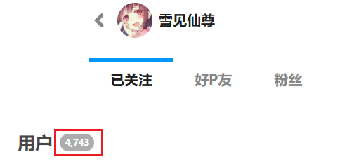
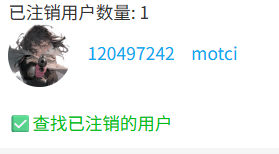

## 开始抓取

<button id="startCrawlingInFollowingPage" type="button" class="hasRippleAnimation settingsPanelActionBtn" data-btn-emphasis="primary" data-btn-intent="brand" data-xztitle="_默认下载多页" title="Start crawl, if there are multiple pages, the default will be downloaded."><span data-xztext="_开始抓取">开始抓取</span><span class="ripple"></span></button>

点击该按钮，下载器会根据你所在的子页面（已关注、好友、粉丝），抓取该分类下的用户的所有作品。

?> 抓取多少个用户取决于“抓取多少页面”的数量。每页最多有 24 个用户。

**注意：**

如果你关注了很多用户，他们的全部作品数量可能会非常多。

假设每个用户有 50 个作品，我关注了 4,730 个用户，那么作品总数会是 236,500。实际上可能更多。

此时你可以设置“抓取多少页面”，例如每次抓取 10 页，分多次抓取。可以参考：[小技巧：拆分任务](/zh-cn/设置-抓取?id=小技巧：拆分任务)。

## 导出关注的用户列表（CSV）

<button id="exportFollowingListCSV" type="button" class="hasRippleAnimation settingsPanelActionBtn" data-btn-emphasis="secondary" data-btn-intent="brand"><span data-xztext="_导出关注列表CSV">导出关注的用户列表（CSV）</span><span class="ripple"></span></button>


点击该按钮，下载器会根据你所在的子页面（已关注、好友、粉丝），抓取该分类下的用户的数据，并生成一个 CSV 文件，保存到浏览器的下载目录里。

你可以导出自己的关注列表作为备份，以备不时之需。

?> 虽然这个按钮里写的是“关注的用户”，但实际上也可以导出你的好友和粉丝列表。

?> 抓取多少个用户取决于“抓取多少页面”的数量。每页最多有 24 个用户。

?>使用这个功能时，下载器只会抓取用户列表，不会抓取作品。

CSV 文件里包含每个用户的以下数据：

- 用户 ID
- 用户名
- 用户主页的网址
- 用户简介
- 用户头像图片的网址

**注意：** 下载器导出的用户数量可能比网页上显示的数量少，这不是 Bug，而是因为某些用户已经注销了，所以下载器无法获取他们的数据。

例如我的关注页面里显示有 4,743 个用户：



有些用户已经注销了，但是 Pixiv 没有从总数里减去他们，这有一定误导性。不过你也许可以发现端倪：通常每页会显示 24 个用户，但有些页面里可能只有 23 个或更少的用户，这就是因为有些用户已经不存在了。

下载器在抓取数据时更容易观察到这种情况：下载器每次请求 100 个用户的数据，但 Pixiv 返回的用户数量经常是 90 多个。在抓取完成后，下载器只获得了 4,668 个用户的数据，比 Pixiv 显示的数量少了 75 个。至于被注销的用户，我无法获取他们的数据。

## 导出关注的用户列表（JSON）

<button id="exportFollowingListJSON" type="button" class="hasRippleAnimation settingsPanelActionBtn" data-btn-emphasis="secondary" data-btn-intent="brand"><span data-xztext="_导出关注列表JSON">导出关注的用户列表（JSON）</span><span class="ripple"></span></button>


这个按钮的作用与上一个按钮类似，只不过它导出的是 JSON 文件。

JSON 文件里保存了你关注的用户列表。以前的版本只包含用户 ID，例如：

```json
[
  "107901226",
  "89923302",
  "108815429",
  "9013106"
]
```

从 18.6.0 版本开始，JSON 文件里会保存每个用户的详细数据，例如：

```json
[
  {
    "userId": "56604890",
    "userName": "micho",
    "profileImageUrl": "https://i.pximg.net/user-profile/img/2025/08/06/00/00/15/27711443_3167190746034c5bb05001829981a29d_170.jpg",
    "profileImageSmallUrl": "https://i.pximg.net/user-profile/img/2025/08/06/00/00/15/27711443_3167190746034c5bb05001829981a29d_50.jpg",
    "userComment": "短髪と可愛いものが好きです！\nＸ：komehina_micho",
    "premium": false,
    "following": true,
    "followed": false,
    "isBlocking": false,
    "isMypixiv": false,
    "illusts": [],
    "novels": [],
    "commission": null
  }
]
```

这两种数据都可以用于批量关注用户。

**导出 CSV 和 JSON 格式的区别：**

导出的 JSON 文件可以用于导入（批量关注用户），而 CSV 文件不可以。但如果你只有 CSV 文件，也可以从 CSV 文件里复制用户 ID 列表，并制作成符合格式的 JSON 文件。

**注意：** 下载器导出的用户数量可能比网页上显示的数量少。原因已经在上一个条目里解释过了。

## 批量关注用户（JSON）

<button id="batchFollowUser" type="button" class="hasRippleAnimation settingsPanelActionBtn" data-btn-emphasis="secondary" data-btn-intent="brand"><span data-xztext="_批量关注用户">批量关注用户（JSON）</span><span class="ripple"></span></button>


点击这个按钮，你可以选择之前导出的关注列表（JSON 文件），然后批量关注里面的所有用户（由下载器自动执行）。

**一些细节：**
- 下载器会先抓取你当前关注的用户，如果某个用户已经关注过了，下载器在添加关注时就会跳过它，这样可以避免重复添加关注。不过这个步骤是可以调整的：因为下载器会从当前页面开始抓取，所以如果你想跳过这个步骤以节约时间，可以跳转到关注列表的最后一页再执行此功能，此时下载器只会抓取最后一页的用户，约等于跳过了这个步骤。
- 在关注用户时，你可以决定把它们添加为**公开**关注或者**非公开**关注。这取决于你所在的页面：如果你在公开关注页面里，那么下载器就会把用户添加为公开关注。如果你在非公开关注页面里，那么下载器就会把用户添加为非公开关注。

**可能的使用场景：**
- 你可以导出其他用户的公开关注列表，然后导入到自己的账号里，使自己也关注这些用户。
- 你可以导出自己的关注列表，然后用小号批量导入，这样小号就有了和大号相同的关注列表。但是我不推荐你这么做，因为这不是必须的：小号可以直接下载大号的公开关注的用户的作品，只要打开对应的网址即可。但如果你的大号被封禁，那么可能无法查看关注列表。所以你可以不定期导出你的关注列表，以备不时之需。
- 你可以把公开关注的用户批量转换为非公开的关注，或者反过来。做法很简单：你可以先导出公开关注的用户，然后进入非公开关注的页面，执行批量关注，这样这些用户会被重新添加为非公开关注。当然你也可以反过来做。

**小技巧：** 

你可以进入其他用户的公开关注列表页面，并使用下载器抓取和导出他关注的用户。

你可以先打开一个用户的主页，网址例如：

https://www.pixiv.net/users/1113943

然后在后面添加 `/following` 并回车，就可以查看他的公开关注列表：

https://www.pixiv.net/users/1113943/following

!>**风险警告：**Pixiv 对批量关注用户的限制很严格。例如每天关注超过 1000 个用户可能会导致你被 Pixiv 警告。如果一个账号触发了第二次警告，就会被 Pixiv 封禁，甚至直接删除账号。如果你的账号被封禁，我不会承担任何责任。

为了降低风险，下载器在批量关注用户时添加了间隔时间，并且每添加 1000 个用户就会自动暂停。如果你遇到了这种情况，可以关闭关注页面，第二天再打开，重新执行批量关注任务。下载器会跳过已经关注的用户，继续之前的进度。

如果你确实要导入很多用户，这样做更加稳妥：分批抓取，每次只抓取一部分页面。例如 20 页，这会导出 480 个用户 ID。如果用户数量很多，最后会产生多个 JSON 文件。你可以每天导入一个文件。

## 查找已注销的用户

<button id="findDeactivatedUsers" type="button" class="hasRippleAnimation settingsPanelActionBtn" data-btn-emphasis="secondary" data-btn-intent="brand"><span data-xztext="_查找已注销的用户">查找已注销的用户</span><span class="ripple"></span></button>


你可以查找你的关注列表里已注销的用户。

**工作原理：**
- 从该功能推出之后（2026 年 3 月），当你使用下载器时，下载器会获取一次你的关注列表并保存所有用户的数据，包括 ID、用户名、头像。该数据保存在本地，当你移除下载器时会被浏览器自动清除。
- 之后当你点击这个按钮时，下载器会重新获取你的关注列表，并与之前保存的历史数据进行比较，找出现在比之前少了哪些用户。
- 下载器逐一获取这些用户的数据，检查他们是否注销了。下载器会在顶部日志里显示进度信息。
- 检查结束后，显示结果。如果有已注销的用户，下载器会输出他们的列表，看起来可能是这样的：



**注意：**
这个功能不能查找以前注销的用户，只能查找下载器保存了历史关注数据之后注销的用户。

