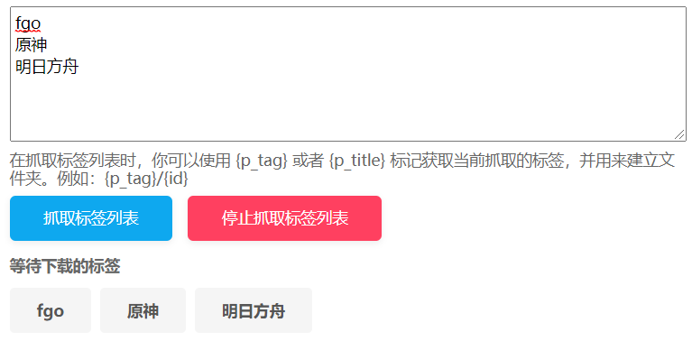

## 抓取标签列表

<button id="crawlTagList" type="button" class="hasRippleAnimation settingsPanelActionBtn" data-btn-emphasis="secondary" data-btn-intent="brand">抓取标签列表</button>

点击这个按钮之后，下载器会在网页顶部显示一个输入区域。你可以输入多个标签，下载器会依次抓取每个标签里的作品，并自动下载。

示例：

**提示：**

- 多个标签使用换行分割，即每行一个标签。
- 下载器会依次对每个标签进行抓取和下载（总是会自动开始下载）。下载完一个标签的作品之后才会抓取下一个标签。
- 为了能够让每个标签的作品可以保存到对应的文件夹里，在抓取标签列表时，你可以使用 `{page_tag}` 标记获取当前抓取的标签，用来建立文件夹。命名规则可以参考：`{page_tag}/{id}`。
- 抓取每个标签里的作品时，下载器都会应用当前的抓取条件。
- 抓取标签列表时，不要让当前页面跳转到其他页面。（不要点击页面上的链接）
- 在抓取标签列表时，下载器不会在网页上添加抓取到的作品，也就是不能预览抓取结果。
- 下载器会保存任务状态。如果任务未完成时关闭了页面或浏览器，重新打开页面后下载器可以继续抓取剩余的标签。

## 在结果中筛选

<button id="filterResults" type="button" class="hasRippleAnimation settingsPanelActionBtn" data-btn-emphasis="secondary" data-btn-intent="brand" data-xztitle="_在结果中筛选说明" title="You can change the settings and screen again in the results.">在结果中筛选</button>

如果有必要，你可以修改抓取条件（过滤器），然后点击此按钮，下载器会对抓取结果进行检查，移除不符合条件的作品。例如你可以在抓取后提高作品的收藏数量要求，然后进行筛选。

## 清除多图作品

<button id="clearMultiImageWork" type="button" class="hasRippleAnimation settingsPanelActionBtn" data-btn-emphasis="secondary" data-btn-intent="danger">清除多图作品</button>

清除抓取结果里的所有多图作品。

## 清除动图作品

<button id="clearUgoiraWork" type="button" class="hasRippleAnimation settingsPanelActionBtn" data-btn-emphasis="secondary" data-btn-intent="danger">清除动图作品</button>

清除抓取结果里的所有动图作品。

## 手动删除作品

<button id="manuallyDeleteWork" type="button" class="hasRippleAnimation settingsPanelActionBtn" data-btn-emphasis="secondary" data-btn-intent="danger" data-xztitle="_手动删除作品Title" title="You can manually delete unwanted work before downloading">手动删除作品</button>

你可以手动删除你不喜欢的作品。点击这个按钮就会进入手动删除模式，此时鼠标光标下面会显示一个红色的圆形。你可以点击想要删除的作品，下载器会从抓取结果里移除它。再次点击此按钮可以退出手动删除模式。

?>这些筛选按钮只会在插画、漫画的搜索页面里才会出现，在小说的搜索页面里不会出现，因为下载器不能预览小说的抓取结果。

