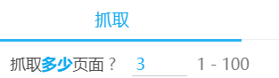
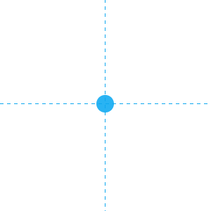
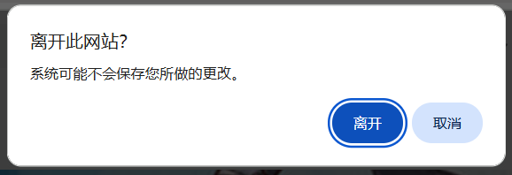

## 开始抓取

<button id="startCrawling" type="button" class="hasRippleAnimation settingsPanelActionBtn" data-btn-emphasis="primary" data-btn-intent="brand" data-xztitle="_默认下载多页" title="Start crawl, if there are multiple pages, the default will be downloaded.">开始抓取</button>

## 停止抓取

<button id="stopCrawling" type="button" class="hasRippleAnimation settingsPanelActionBtn" data-btn-emphasis="secondary" data-btn-intent="danger">停止抓取</button>

当你点击 `开始抓取` 按钮之后，下载器会显示 `停止抓取` 按钮，点击它可以停止抓取。

停止抓取时，如果下载器已经抓取到了一些作品，下载器会保留它们，并准备开始下载。

**注意：**

点击`停止抓取`按钮时，如果下载器尚未产生抓取结果，就只是单纯的停止抓取，不会准备开始下载。

这是因为下载器的抓取通常分为两个阶段：
1. 下载器会先获取作品的 ID 列表，在这个阶段里，下载器只保存了作品的 ID，没有详细数据。所以如果你在这个阶段点击 `停止抓取` 按钮，下载器里是没有抓取结果的，也就不能开始下载。
2. 下载器获取完作品 ID 列表之后，会获取每个作品的详细数据，并产生抓取结果。顶部日志里会显示“开始获取作品信息”。如果你在这个阶段点击 `停止抓取` 按钮，下载器会保留抓取结果（如果有），并准备开始下载。

## 定时抓取

<button id="scheduleCrawling" type="button" class="hasRippleAnimation settingsPanelActionBtn" data-btn-emphasis="secondary" data-btn-intent="brand" data-xztitle="_定时抓取说明" title="Automatically start crawling and downloading at regular intervals.">定时抓取</button>

在一些页面里，随着时间推移可能会出现新的作品，例如：

- 用户主页
- 已关注用户的新作页面
- 大家的新作页面
- 自己的收藏页面
- 搜索页面

在这些页面里，如果你希望每隔一段时间就抓取一次新的作品并自动下载，就可以使用定时抓取功能。

**示例：**

如果你想定时抓取已关注的用户的新作品，可以这样做：

1. 打开 [已关注用户的作品](https://www.pixiv.net/bookmark_new_illust.php) 的页面。

2. 设置每次抓取多少页：

这个页数需要结合“间隔时间”考虑。假如你想每隔 120 分钟进行一次抓取，并且该页面在 120 分钟的新作品数量不会超过 3 页，那么就可以设置为 `3`。

3. 点击 `定时抓取` 按钮，下载器会显示一个输入框，让你设置间隔时间：

定时抓取的间隔时间 (分钟)

<input class="XZInput" placeholder="" type="text" value="120" style="flex-basis: 500px;"><button class="XZInputButton hasRippleAnimation">
      提交
      
    </button><button class="XZInputButton cancel hasRippleAnimation">
      取消
      
    </button>

默认值是 120 分钟，你可以根据需要修改这个值。

点击 `提交` 按钮，下载器就会启动定时抓取任务，并且会在日志里显示提示：

定时抓取已启动，间隔时间：120 分钟。 如果你想修改间隔时间，可以在“更多”选项卡里修改设置：定时抓取的间隔时间。 

**提示：**

- 下载器不会立刻开始抓取，而是等到设定的时间之后才会开始第一次抓取。
- 推荐启用“更多”选项卡里的 [不下载重复文件](/zh-cn/设置-更多-下载?id=不下载重复文件) 功能，以避免不必要的重复下载。
- 间隔时间不宜太短，因为抓取和下载需要一定时间。

-----------

使用定时抓取功能时，有一些需要注意的地方：

1. 不要关闭当前标签页。你可以切换到其他标签页，继续使用浏览器。
2. 不要改变当前标签页的 URL。例如当你在用户主页执行定时抓取时，如果点击某个作品进入了作品页面，就会导致定时抓取任务被取消。
3. 建议启用 [不下载重复文件](/zh-cn/设置-更多-下载?id=不下载重复文件) 功能，以避免下载重复的文件。
4. 如果这个扩展程序自动更新了，那么这个页面将不能正常下载文件（需要刷新页面来恢复正常）。所以如果你想长期执行定时抓取任务，建议离线安装本扩展程序，以免因为扩展程序自动更新而导致无法继续下载。可以参考 [离线安装](/zh-cn/离线安装) 页面。
5. 抓取页数可以设置的少一些，以避免抓取到太多重复的作品。例如在搜索页面抓取时，最多可以抓取 1000 页，但是没有必要每次都抓取这么多页。你可以设置为抓取 10 页或更少，只要在每次抓取的间隔时间里，新内容的页数不会超过 10 页就没有问题。
6. 在搜索页面执行定时抓取时，抓取到的作品不会显示在页面上（也就是不能预览搜索结果）。
7. 定时抓取总是会自动开始下载。
8. 在点击 `定时抓取` 按钮时，下载器会让你设置每次抓取的间隔时间。这个时间会与 [定时抓取的间隔时间](/zh-cn/设置-更多-抓取?id=定时抓取的间隔时间) 设置保持一致。
9. 下载器总是会使用任务开始时的间隔时间。假如你设置了每隔 10 分钟进行一次抓取，那么之后修改这个时间不会影响定时抓取任务。如果你想让修改生效，需要先点击 `取消定时抓取` 按钮，然后点击 `定时抓取` 按钮，这样下载器才会使用新的间隔时间。

## 取消定时抓取

<button id="cancelScheduledCrawling" type="button" class="hasRippleAnimation settingsPanelActionBtn" data-btn-emphasis="secondary" data-btn-intent="warning">取消定时抓取</button>

开始定时抓取之后，下载器会显示 `取消定时抓取` 按钮。如果你想取消定时抓取，可以点击这个按钮，或者关闭这个页面（执行定时抓取任务的网页）。

## 手动选择作品

<button id="manuallySelectWork" type="button" class="hasRippleAnimation settingsPanelActionBtn" data-btn-emphasis="secondary" data-btn-intent="brand" title="Alt + S">手动选择作品</button>

你可以使用这个按钮来手动选择页面上的任意作品，然后抓取它们。

?>这个功能的快捷键是 `Alt` + `S`。按下即可进入/退出手动选择模式。

?>查看视频教程：[手动选择作品](https://www.youtube.com/watch?v=wAUotRzs3Uw&list=PLO2Mj4AiZzWEpN6x_lAG8mzeNyJzd478d&index=11 ':target=_blank')

点击这个按钮会进入选择模式。此时鼠标光标下面会显示一个蓝色的圆形，并且有十字形的辅助线。如图所示：

此时你可以在任意作品上点击鼠标左键来选择它。下载器会在它上面添加一个对号标记，表示已经选择了它。效果如下：

你可以稍后抓取已选择的作品。

?>如果当前页面有页码（例如在用户主页里时），你可以在多个页码里选择作品。例如你可以在第 1 页里选择 2 个作品，然后进入第 2 页，选择 3 个作品。这样一共选择了 5 个作品，可以一次性抓取它们。

?>当下载器处于手动选择模式时，点击作品不会打开它的链接，这是为了防止页面内容发生变化。如果你想查看作品页面，可以选择以下方法之一：1. 按住 `Ctrl` 键，并点击作品。2. 在作品缩略图上按鼠标右键，选择“在新标签页种打开链接”。3. 退出手动选择模式（快捷键是 `Esc`）。

---------

当你点击 `手动选择作品` 按钮之后，下载器会显示这 3 个按钮：

<button type="button" class="xzbtns hasRippleAnimation" style="background-color: rgb(20, 173, 39);" title="Alt + S">暂停选择</button><button type="button" class="xzbtns hasRippleAnimation" style="background-color: rgb(243, 57, 57);">清空选择的作品</button><button type="button" class="xzbtns hasRippleAnimation" style="background-color: rgb(14, 168, 239);">抓取选择的作品</button>

## 清空选择的作品

<button id="clearSelectedWork" type="button" class="hasRippleAnimation settingsPanelActionBtn" data-btn-emphasis="secondary" data-btn-intent="danger">清空选择的作品</button>

退出手动选择模式，并且清空已选择的作品。如果你已经不需要之前选择的作品的话，可以点击这个按钮。

## 抓取选择的作品

<button id="crawlSelectedWork" type="button" class="hasRippleAnimation settingsPanelActionBtn" data-btn-emphasis="secondary" data-btn-intent="brand">抓取选择的作品</button>

抓取已选择的作品。下载器会保留已选择的作品。

当你选择了想要抓取的作品之后，点击 `抓取选择的作品` 的按钮即可抓取和下载它们。

-----------

**提示：**

- 如果有需要，你可以通过点击 `暂停选择` 按钮和 `继续选择` 来进行多次选择。每次开始选择时，下载器不会清空之前选择的作品，所以选择的作品会累加到一起。
- 按下 `Esc` 键可以退出手动选择模式。
- 如果你选择了一些作品，下载器会在 `抓取选择的作品` 按钮上显示作品数量。
- 下载器的过滤条件对手动选择的作品也会生效，所以某些作品可能会在抓取时被排除。
- 下载器不会自动清空选择的作品，除非你点击了 `清空选择的作品` 按钮。

-------

当你进入其他页面时，**可能**会丢失选择的作品列表，这取决于当前页面内容是否被丢弃。

例如从用户主页进入作品页面是无刷新加载的，就不会丢失选择的作品。

但是进入某些页面时（例如排行榜），或者刷新页面，就会导致当前页面内容被丢弃。此时下载器会让浏览器显示一个确认窗口，如下：

如果你选择离开此页面，就会丢失选择的作品。如果取消页面跳转，就不会丢失选择的作品。

总之你不需要担心不小心丢失选择的作品，因为你有机会进行选择。

