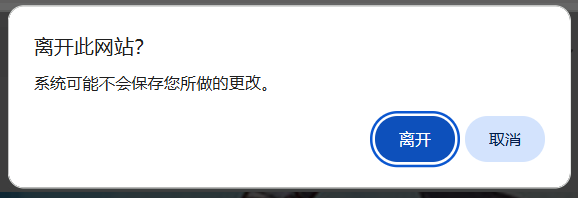

# 抓取按钮

下载器的“抓取”选项卡里有一些按钮，主要用于开始抓取。

?>不同的页面类型里可能有不同的按钮。

## 通用的按钮

有一些按钮会出现在多种页面类型里。

### 开始抓取

<button type="button" id="startCrawling" class="xzbtns hasRippleAnimation" data-xztitle="_默认下载多页" style="background-color: rgb(14, 168, 239);" title="开始抓取, 如有多页，默认会下载全部。"><span data-xztext="_开始抓取">开始抓取</span><span class="ripple"></span></button>

按照用户设定的抓取条件（过滤器）开始抓取作品。

根据页面类型不同，下载器可能会在“抓取”标签页里显示 [抓取多少作品](/zh-cn/设置-抓取?id=抓取多少作品) 或者 [抓取多少页面](/zh-cn/设置-抓取?id=抓取多少页面) 设置。点击链接可以查看它们的详细说明。

### 停止抓取

<button type="button" id="stopCrawling" class="xzbtns hasRippleAnimation" style="background-color: rgb(243, 57, 57); display: flex;"><span data-xztext="_停止抓取">停止抓取</span><span class="ripple"></span></button>

当你点击 `开始抓取` 按钮之后，下载器会显示 `停止抓取` 按钮，点击它可以停止抓取。

停止抓取时，如果下载器已经抓取到了一些作品，下载器会保留它们，并准备开始下载。

**注意：**

点击`停止抓取`按钮时，如果下载器尚未产生抓取结果，就只是单纯的停止抓取，不会准备开始下载。

这是因为下载器的抓取通常分为两个阶段：
1. 下载器会先获取作品的 ID 列表，在这个阶段里，下载器只保存了作品的 ID，没有详细数据。所以如果你在这个阶段点击 `停止抓取` 按钮，下载器里是没有抓取结果的，也就不能开始下载。
2. 下载器获取完作品 ID 列表之后，会获取每个作品的详细数据，并产生抓取结果。顶部日志里会显示“开始获取作品信息”。如果你在这个阶段点击 `停止抓取` 按钮，下载器会保留抓取结果（如果有），并准备开始下载。

### 定时抓取

<button type="button" id="scheduleCrawling" class="xzbtns hasRippleAnimation" data-xztitle="_定时抓取说明" style="background-color: rgb(14, 168, 239);" title="每隔一定时间，自动开始抓取和下载。"><span data-xztext="_定时抓取">定时抓取</span><span class="ripple"></span></button>

在一些页面里，随着时间推移可能会出现新的作品，例如：

- 用户主页
- 已关注用户的新作页面
- 大家的新作页面
- 自己的收藏页面
- 搜索页面

在这些页面里，如果你希望每隔一段时间就抓取一次新的作品并自动下载，就可以使用定时抓取功能。

**示例：**

如果你想定时抓取已关注的用户的新作品，可以这样做：

1. 打开 [已关注用户的作品](https://www.pixiv.net/bookmark_new_illust.php) 的页面。

2. 设置每次抓取多少页：


这个页数需要结合“间隔时间”考虑。假如你想每隔 120 分钟进行一次抓取，并且该页面在 120 分钟的新作品数量不会超过 3 页，那么就可以设置为 `3`。

3. 点击 `定时抓取` 按钮，下载器会显示一个输入框，让你设置间隔时间：

<div class="XZInputWrap" id="input1757240375255"><p class="XZInputInstruction">定时抓取的间隔时间 (分钟)</p><div class="XZInputContainer"><input class="XZInput" placeholder="" type="text" value="120" style="flex-basis: 500px;"><button class="XZInputButton hasRippleAnimation">
      <span>提交</span>
      <span class="ripple"></span>
    </button><button class="XZInputButton cancel hasRippleAnimation">
      <span>取消</span>
      <span class="ripple"></span>
    </button></div></div>

默认值是 120 分钟，你可以根据需要修改这个值。

点击 `提交` 按钮，下载器就会启动定时抓取任务，并且会在日志里显示提示：

<span class="log" style="color: rgb(0, 189, 23);">定时抓取已启动，间隔时间：120 分钟。<br>如果你想修改间隔时间，可以在“更多”选项卡里修改设置：定时抓取的间隔时间。<br></span>

**提示：**

- 下载器不会立刻开始抓取，而是等到设定的时间之后才会开始第一次抓取。
- 推荐启用“更多”选项卡里的 [不下载重复文件](/zh-cn/设置-更多-下载?id=不下载重复文件) 功能，以避免不必要的重复下载。
- 间隔时间不宜太短，因为抓取和下载需要一定时间。

-----------

使用定时抓取功能时，有一些需要注意的地方：

1. 不要关闭当前标签页。你可以切换到其他标签页，继续使用浏览器。
2. 不要改变当前标签页的 URL。例如当你在用户主页执行定时抓取时，如果点击某个作品进入了作品页面，就会导致定时抓取任务被取消。
3. 建议启用 [不下载重复文件](/zh-cn/设置-更多-下载?id=不下载重复文件) 功能，以避免下载重复的文件。
4. 如果这个扩展程序自动更新了，那么这个页面将不能正常下载文件（需要刷新页面来恢复正常）。所以如果你想长期执行定时抓取任务，建议离线安装本扩展程序，以免因为扩展程序自动更新而导致无法继续下载。可以参考 [离线安装](/zh-cn/离线安装) 页面。
5. 抓取页数可以设置的少一些，以避免抓取到太多重复的作品。例如在搜索页面抓取时，最多可以抓取 1000 页，但是没有必要每次都抓取这么多页。你可以设置为抓取 10 页或更少，只要在每次抓取的间隔时间里，新内容的页数不会超过 10 页就没有问题。
6. 在搜索页面执行定时抓取时，抓取到的作品不会显示在页面上（也就是不能预览搜索结果）。
7. 定时抓取总是会自动开始下载。
8. 在点击 `定时抓取` 按钮时，下载器会让你设置每次抓取的间隔时间。这个时间会与 [定时抓取的间隔时间](/zh-cn/设置-更多-抓取?id=定时抓取的间隔时间) 设置保持一致。
9. 下载器总是会使用任务开始时的间隔时间。假如你设置了每隔 10 分钟进行一次抓取，那么之后修改这个时间不会影响定时抓取任务。如果你想让修改生效，需要先点击 `取消定时抓取` 按钮，然后点击 `定时抓取` 按钮，这样下载器才会使用新的间隔时间。

### 取消定时抓取

<button type="button" id="cancelScheduledCrawling" class="xzbtns hasRippleAnimation" style="background-color: rgb(228, 157, 0); display: flex;"><span data-xztext="_取消定时抓取">取消定时抓取</span><span class="ripple"></span></button>

开始定时抓取之后，下载器会显示 `取消定时抓取` 按钮。如果你想取消定时抓取，可以点击这个按钮，或者关闭这个页面（执行定时抓取任务的网页）。

### 手动选择作品

<button type="button" id="manuallySelectWork" class="xzbtns hasRippleAnimation" style="background-color: rgb(20, 173, 39);" title="Alt + S"><span data-xztext="_手动选择作品">手动选择作品</span><span class="ripple"></span></button>

你可以使用这个按钮来手动选择页面上的任意作品，然后抓取它们。

?>这个功能的快捷键是 `Alt` + `S`。按下即可进入/退出手动选择模式。

?>查看视频教程：[手动选择作品](https://www.youtube.com/watch?v=wAUotRzs3Uw&list=PLO2Mj4AiZzWEpN6x_lAG8mzeNyJzd478d&index=11 ':target=_blank')

点击这个按钮会进入选择模式。此时鼠标光标下面会显示一个蓝色的圆形，并且有十字形的辅助线。如图所示：


此时你可以在任意作品上点击鼠标左键来选择它。下载器会在它上面添加一个对号标记，表示已经选择了它。效果如下：


你可以稍后抓取已选择的作品。

?>如果当前页面有页码（例如在用户主页里时），你可以在多个页码里选择作品。例如你可以在第 1 页里选择 2 个作品，然后进入第 2 页，选择 3 个作品。这样一共选择了 5 个作品，可以一次性抓取它们。

?>当下载器处于手动选择模式时，点击作品不会打开它的链接，这是为了防止页面内容发生变化。如果你想查看作品页面，可以选择以下方法之一：1. 按住 `Ctrl` 键，并点击作品。2. 在作品缩略图上按鼠标右键，选择“在新标签页种打开链接”。3. 退出手动选择模式（快捷键是 `Esc`）。

---------

当你点击 `手动选择作品` 按钮之后，下载器会显示这 3 个按钮：

<p class="btnsWrap"><button type="button" class="xzbtns hasRippleAnimation" style="background-color: rgb(20, 173, 39);" title="Alt + S"><span data-xztext="_暂停选择">暂停选择</span><span class="ripple"></span></button><button type="button" class="xzbtns hasRippleAnimation" style="background-color: rgb(243, 57, 57);"><span data-xztext="_清空选择的作品">清空选择的作品</span><span class="ripple"></span></button><button type="button" class="xzbtns hasRippleAnimation" style="background-color: rgb(14, 168, 239);"><span data-xztext="_抓取选择的作品">抓取选择的作品</span><span class="ripple"></span></button></p>

### 暂停选择

<p class="btnsWrap"><button type="button" class="xzbtns hasRippleAnimation" style="background-color: rgb(20, 173, 39);" title="Alt + S"><span data-xztext="_暂停选择">暂停选择</span><span class="ripple"></span></button></p>

退出手动选择模式。下载器会保留已选择的作品。当你点击 `暂停选择` 按钮之后，它会变成 `继续选择` 按钮，你可以点击它来继续选择作品。另外你也可以使用快捷键 `Alt` + `S`，它的效果等同于点击这个按钮。

### 清空选择的作品

<p class="btnsWrap"><button type="button" id="clearSelectedWork" class="xzbtns hasRippleAnimation" style="background-color: rgb(243, 57, 57);"><span data-xztext="_清空选择的作品">清空选择的作品</span><span class="ripple"></span></button></p>

退出手动选择模式，并且清空已选择的作品。如果你已经不需要之前选择的作品的话，可以点击这个按钮。

### 抓取选择的作品

<p class="btnsWrap"><button type="button" id="crawlSelectedWork" class="xzbtns hasRippleAnimation" style="background-color: rgb(14, 168, 239);"><span data-xztext="_抓取选择的作品">抓取选择的作品</span><span class="ripple"></span></button></p>

抓取已选择的作品。下载器会保留已选择的作品。

当你选择了想要抓取的作品之后，点击 `抓取选择的作品` 的按钮即可抓取和下载它们。

-----------

**提示：**

- 如果有需要，你可以通过点击 `暂停选择` 按钮和 `继续选择` 来进行多次选择。每次开始选择时，下载器不会清空之前选择的作品，所以选择的作品会累加到一起。
- 按下 `Esc` 键可以退出手动选择模式。
- 如果你选择了一些作品，下载器会在 `抓取选择的作品` 按钮上显示作品数量。
- 下载器的过滤条件对手动选择的作品也会生效，所以某些作品可能会在抓取时被排除。
- 下载器不会自动清空选择的作品，除非你点击了 `清空选择的作品` 按钮。

-------

当你进入其他页面时，**可能**会丢失选择的作品列表，这取决于当前页面内容是否被丢弃。

例如从用户主页进入作品页面是无刷新加载的，就不会丢失选择的作品。

但是进入某些页面时（例如排行榜），或者刷新页面，就会导致当前页面内容被丢弃。此时下载器会让浏览器显示一个确认窗口，如下：



如果你选择离开此页面，就会丢失选择的作品。如果取消页面跳转，就不会丢失选择的作品。

总之你不需要担心不小心丢失选择的作品，因为你有机会进行选择。

## 首页

Pixiv 的首页内容繁杂，所以我没有为它添加 `开始抓取` 按钮。也就是不能一键下载首页里的所有作品。

我在首页里添加了通用的 `手动选择作品` 按钮，此外还有 3 个抓取按钮：

### 输入 ID 进行抓取

<button type="button" id="crawlById" class="xzbtns hasRippleAnimation" style="background-color: rgb(14, 168, 239);"><span data-xztext="_输入id进行抓取">输入 ID 进行抓取</span><span class="ripple"></span></button>

点击这个按钮之后，下载器会显示一个输入框，你可以输入或者粘贴作品的 ID 列表：

<div class="XZInputWrap" id="input1757090876229" style="width: 584px; opacity: 1;"><p class="XZInputInstruction">请输入作品 id。如果有多个 id，则以换行分割（即每行一个id）。<br><br>因为这个标签页展示的是图像，所以输入的 ID 会被视为图像作品的 ID。</p><div class="XZInputContainer"><textarea class="XZInput" placeholder="10000
10001
10002
10003" rows="10" style="flex-basis: 400px;"></textarea><button class="XZInputButton hasRippleAnimation">
      <span>提交</span>
      <span class="ripple"></span>
    </button><button class="XZInputButton cancel hasRippleAnimation">
      <span>取消</span>
      <span class="ripple"></span>
    </button></div></div>

如果有多个 ID，则以换行分割（即每行一个ID）。

之后点击“提交”按钮，下载器就会抓取这些作品。

?> 你不能指定作品的类型；下载器会依据当前页面自动决定作品类型。当你在小说的首页 [https://www.pixiv.net/novel/](https://www.pixiv.net/novel/) 使用这个功能时，下载器会把输入的 ID 视为小说作品的 ID。在其他首页里，下载器会把输入的 ID 视为图片作品的 ID。

### 抓取 ID 区间

<button type="button" id="crawlIdRange" class="xzbtns hasRippleAnimation" style="background-color: rgb(14, 168, 239);"><span data-xztext="_抓取id区间">抓取 ID 区间</span><span class="ripple"></span></button>

点击这个按钮之后，下载器会依次显示两个输入框。你可以设置一个 ID 范围让下载器抓取，例如 `10000` - `20000`。

先输入开始的 ID：

<div class="XZInputWrap" id="input1757091219116" style="width: 584px; opacity: 1;"><p class="XZInputInstruction">你可以设置一个作品 ID 范围，抓取此范围内的所有作品（包含开始和结束的 id）。<br>注意：如果一次任务中产生的抓取结果数量太多，可能会导致页面崩溃。<br>如果你需要抓取很多 ID，请考虑拆分成多个任务。我建议每批抓取的 ID 数量不要超过 100,000 个。<br><br>因为这个标签页展示的是图像，所以输入的 ID 会被视为图像作品的 ID。<br><br>请输入开始的 ID: </p><div class="XZInputContainer"><input class="XZInput" placeholder="10000" type="text" value="" style="flex-basis: 400px;"><button class="XZInputButton hasRippleAnimation">
      <span>提交</span>
      <span class="ripple"></span>
    </button><button class="XZInputButton cancel hasRippleAnimation">
      <span>取消</span>
      <span class="ripple"></span>
    </button></div></div>

然后输入结束的 ID：

<div class="XZInputWrap" id="input1757091349171" style="width: 584px; opacity: 1;"><p class="XZInputInstruction">请输入结束的 ID: </p><div class="XZInputContainer"><input class="XZInput" placeholder="20000" type="text" value="" style="flex-basis: 400px;"><button class="XZInputButton hasRippleAnimation">
      <span>提交</span>
      <span class="ripple"></span>
    </button><button class="XZInputButton cancel hasRippleAnimation">
      <span>取消</span>
      <span class="ripple"></span>
    </button></div></div>

点击“提交”按钮，下载器就会抓取这些作品（包含开始和结束的 ID）。你可以在顶部日志里查看抓取进度。

?> 你不能指定作品的类型；下载器会依据当前页面自动决定作品类型。当你在小说的首页 [https://www.pixiv.net/novel/](https://www.pixiv.net/novel/) 使用这个功能时，下载器会把输入的 ID 视为小说作品的 ID。在其他首页里，下载器会把输入的 ID 视为图片作品的 ID。

**大量抓取时的提示：**

随着抓取到的作品数量增加，该页面使用的内存也会增加，而且浏览器对网络请求的处理也会逐渐变慢。所以不要在一次任务中抓取太多作品。

如果你要抓取很多作品，可以分割成多次任务，依次抓取。

### 导入 ID 列表

<button type="button" id="importIDList" class="xzbtns hasRippleAnimation" style="background-color: rgb(20, 173, 39);"><span data-xztext="_导入ID列表">导入 ID 列表</span><span class="ripple"></span></button>

点击这个按钮之后，你可以选择一个包含作品 ID 列表的 JSON 文件，让下载器抓取它们。

这个 JSON 文件的内容格式如下：

```json
[
  { "id": "130827095", "type": "illusts" },
  { "id": "130816057", "type": "illusts" },
  { "id": "130811075", "type": "novel" },
  { "id": "130808918", "type": "novel" }
]
```

`id` 是作品的 ID，`type` 是作品类型，可以是 `"illusts"` 或 `"novel"`。

?> 这个 JSON 文件可以由 [获取作品 ID 列表后导出 ID 列表，并停止任务](/zh-cn/设置-更多-抓取?id=获取作品-id-列表后导出-id-列表，并停止任务) 功能生成。这两个功能就是为了配合使用的。不过你也可以自己创建这个 ID 列表，只要内容格式符合要求即可。

## 作品页面

当你处于作品页面里（例如 [99904686](https://www.pixiv.net/artworks/99904686 ':target=_blank')），除了通用的 `手动选择作品` 按钮，还有 3 个抓取按钮：

### 从本页开始抓取新作品

<button type="button" id="startCrawlingFromCurrentPageNew" class="xzbtns hasRippleAnimation" style="background-color: rgb(14, 168, 239);"><span data-xztext="_从本页开始抓取new">从本页开始抓取新作品</span><span class="ripple"></span></button>

点击这个按钮，下载器会抓取本页作品，以及比它新的作品。

你可以在第一个抓取条件 `抓取多少作品` 里设置抓取多少个作品（含本页作品）。默认值 `-1` 会抓取本页和所有比它新的作品。

--------

“新作品”指的是投稿时间比当前作品更晚的作品。在作品页面里，它们位于当前作品的左侧。

示意图：


左边的是新作品，右边的是旧作品。

### 从本页开始抓取旧作品

<button type="button" id="startCrawlingFromCurrentPageOld" class="xzbtns hasRippleAnimation" style="background-color: rgb(14, 168, 239);"><span data-xztext="_从本页开始抓取old">从本页开始抓取旧作品</span><span class="ripple"></span></button>

点击这个按钮，下载器会抓取本页作品，以及比它旧的作品。

你可以在第一个抓取条件 `抓取多少作品` 里设置抓取多少个作品（含本页作品）。默认值 `-1` 会抓取本页和所有比它旧的作品。

“旧作品”指的是投稿时间比当前作品更早的作品。在作品页面里，它们位于当前作品的右侧。

### 抓取相关作品

<button id="crawlRelatedWork" type="button" class="xzbtns hasRippleAnimation" style="background-color: rgb(14, 168, 239);"><span data-xztext="_抓取相关作品">抓取相关作品</span><span class="ripple"></span></button>

相关作品指的是作品页面底部的“相关作品”区域。

你可以在第一个抓取条件 `抓取多少作品` 里设置抓取多少个相关作品（含本页作品）。默认值 `-1` 会抓取所有的相关作品。

?>相关作品最多有 180 个。

### 下载推荐作品

<button class="blueTextBtn hasRippleAnimation" id="downloadRecommendedWorks" type="button">
  <span data-xztext="_下载推荐作品">下载推荐作品</span><span class="ripple"></span>
</button>

当你点击收藏按钮之后，Pixiv 会显示推荐作品。此时下载器会显示这个按钮，如图所示：


点击这个按钮就可以抓取推荐作品了。

你可以在第一个抓取条件 `抓取多少作品` 里设置抓取多少个推荐作品。默认值 `-1` 会抓取所有的推荐作品。

?> 推荐作品最多有 20 个。

?> 下载推荐作品时，下载器总是会自动开始下载。

## 系列小说页面

系列小说页面是小说目录页，例如：[https://www.pixiv.net/novel/series/1090654](https://www.pixiv.net/novel/series/1090654)

### 抓取系列小说

<button type="button" id="crawlSeriesNovel" class="xzbtns hasRippleAnimation" style="background-color: rgb(14, 168, 239);"><span data-xztext="_抓取系列小说">抓取系列小说</span><span class="ripple"></span></button>

抓取这个系列里的所有小说。

?>此时你不能设置抓取数量，下载器总是会抓取所有小说。

### 合并系列小说

<button type="button" id="mergeSeriesNovel" class="xzbtns hasRippleAnimation" style="background-color: rgb(14, 168, 239);"><span data-xztext="_合并系列小说">合并系列小说</span><span class="ripple"></span></button>

抓取这个系列里的所有小说，然后合并到一个文件里。

**提示：**

- 根据 [小说保存格式](/zh-cn/设置-更多-下载?id=小说保存格式) 的设置，下载器会生成一个 TXT 或 EPUB 文件。
- 生成的文件名是**固定的格式**：`系列名称 + 用户名 + 系列 ID + 第一个小说的 tags `，并且直接保存到浏览器的下载目录里。这是因为这个文件里保存了多个小说的内容，所以不能应用针对单个文件设计的命名规则。以后我打算添加一个针对该文件的命名规则。
- 合并系列小说时，下载器面板里不会出现进度条。不过你可以在日志里查看一些进度信息。

## 搜索页面

搜索页面是搜索某个标签的页面，例如：[バーチャルYouTuber](https://www.pixiv.net/tags/%E3%83%90%E3%83%BC%E3%83%81%E3%83%A3%E3%83%ABYouTuber/artworks?s_mode=s_tag)

**提醒：**

- 搜索页面里可以使用 `{page_tag}`（搜索的这个标签）作为文件夹的名字。
- 在搜索页面里，下载器默认会按照作品的收藏数量从高到低下载。也就是优先下载收藏数高的作品。
- 你可以设置 [抓取多少页面](/zh-cn/设置-抓取?id=抓取多少页面)。对于非 Pixiv 高级会员（premium）来说，搜索页面最多可以查看 1000 页，高级会员则可以查看 5000 页。下载器能抓取的页数与你能查看的页数相同。

在搜索页面里，除了一些通用的抓取按钮，还有两种抓取按钮：

### 抓取标签列表

<button type="button" id="crawlTagList" class="xzbtns hasRippleAnimation" style="background-color: rgb(14, 168, 239);"><span data-xztext="_抓取标签列表">抓取标签列表</span><span class="ripple"></span></button>

点击这个按钮之后，下载器会在网页顶部显示一个输入区域。你可以输入多个标签，下载器会依次抓取每个标签里的作品，并自动下载。

示例：


**提示：**

- 多个标签使用换行分割，即每行一个标签。
- 下载器会依次对每个标签进行抓取和下载（总是会自动开始下载）。下载完一个标签的作品之后才会抓取下一个标签。
- 为了能够让每个标签的作品可以保存到对应的文件夹里，在抓取标签列表时，你可以使用 `{page_tag}` 标记获取当前抓取的标签，用来建立文件夹。命名规则可以参考：`{page_tag}/{id}`。
- 抓取每个标签里的作品时，下载器都会应用当前的抓取条件。
- 抓取标签列表时，不要让当前页面跳转到其他页面。（不要点击页面上的链接）
- 在抓取标签列表时，下载器不会在网页上添加抓取到的作品，也就是不能预览抓取结果。
- 下载器会保存任务状态。如果任务未完成时关闭了页面或浏览器，重新打开页面后下载器可以继续抓取剩余的标签。

### 筛选抓取结果的按钮

如果你启用了 [预览搜索页面的筛选结果](/zh-cn/设置-更多-增强?id=预览搜索页面的筛选结果) 功能，下载器会把抓取到的图像作品按照收藏数量排序，显示在页面里。并且此时下载器不会自动开始下载，这样用户就可以先预览和筛选抓取结果，然后再开始下载。

有 4 个按钮可以用于筛选抓取结果，它们在抓取完成后才可以使用：

<p class="btnsWrap"><button type="button" class="xzbtns hasRippleAnimation" data-xztitle="_在结果中筛选说明" style="background-color: rgb(20, 173, 39);" title="您可以改变设置，并在结果中再次筛选。"><span data-xztext="_在结果中筛选">在结果中筛选</span><span class="ripple"></span></button><button type="button" class="xzbtns hasRippleAnimation" style="background-color: rgb(243, 57, 57);"><span data-xztext="_清除多图作品">清除多图作品</span><span class="ripple"></span></button><button type="button" class="xzbtns hasRippleAnimation" style="background-color: rgb(243, 57, 57);"><span data-xztext="_清除动图作品">清除动图作品</span><span class="ripple"></span></button><button type="button" class="xzbtns hasRippleAnimation" data-xztitle="_手动删除作品Title" style="background-color: rgb(243, 57, 57);" title="可以在下载前手动删除不需要的作品"><span data-xztext="_手动删除作品">手动删除作品</span><span class="ripple"></span></button></p>

### 在结果中筛选

<p class="btnsWrap"><button id="filterResults" type="button" class="xzbtns hasRippleAnimation" style="background-color: rgb(20, 173, 39);" ><span>在结果中筛选</span><span class="ripple"></span></button></p>

如果有必要，你可以修改抓取条件（过滤器），然后点击此按钮，下载器会对抓取结果进行检查，移除不符合条件的作品。例如你可以在抓取后提高作品的收藏数量要求，然后进行筛选。

### 清除多图作品

<p class="btnsWrap"><button id="clearMultiImageWork" type="button" class="xzbtns hasRippleAnimation" style="background-color: rgb(243, 57, 57);" ><span>清除多图作品</span><span class="ripple"></span></button></p>

清除抓取结果里的所有多图作品。

### 清除动图作品

<p class="btnsWrap"><button id="clearUgoiraWork" type="button" class="xzbtns hasRippleAnimation" style="background-color: rgb(243, 57, 57);" ><span>清除动图作品</span><span class="ripple"></span></button></p>

清除抓取结果里的所有动图作品。

### 手动删除作品

<p class="btnsWrap"><button id="manuallyDeleteWork" type="button" class="xzbtns hasRippleAnimation" style="background-color: rgb(243, 57, 57);" ><span>手动删除作品</span><span class="ripple"></span></button></p>

你可以手动删除你不喜欢的作品。点击这个按钮就会进入手动删除模式，此时鼠标光标下面会显示一个红色的圆形。你可以点击想要删除的作品，下载器会从抓取结果里移除它。再次点击此按钮可以退出手动删除模式。

?>这些筛选按钮只会在插画、漫画的搜索页面里才会出现，在小说的搜索页面里不会出现，因为下载器不能预览小说的抓取结果。

## 排行榜

示例页面：[综合今日排行榜](https://www.pixiv.net/ranking.php)

在排行榜页面里，除了通用的 `手动选择作品` 按钮，还有两个抓取按钮。

### 抓取本排行榜作品

<button type="button" id="crawlRankingWork" class="xzbtns hasRippleAnimation" data-xztitle="_抓取本排行榜作品Title" style="background-color: rgb(14, 168, 239);" title="抓取本排行榜的所有作品，包括现在尚未加载出来的。"><span data-xztext="_抓取本排行榜作品">抓取本排行榜作品</span><span class="ripple"></span></button>

抓取这个排行榜里的作品。

你可以设置“抓取多少作品”，下载器会根据排名顺序下载指定数量的作品。例如设置为 `50` 的话，下载器会抓取第 1 名到第 50 名的作品。

?>你可以在命名规则里使用 `{rank}` 标记保存作品的排名。

### 抓取首次登场作品

<button type="button" id="crawlDebutWork" class="xzbtns hasRippleAnimation" data-xztitle="_抓取首次登场的作品Title" style="background-color: rgb(14, 168, 239);" title="只下载首次登场的作品"><span data-xztext="_抓取首次登场的作品">抓取首次登场作品</span><span class="ripple"></span></button>

只下载本排行榜里首次登场的作品。

?>有些作品有 `首次登场`标记。根据 Pixiv 的显示语言不同，也有可能是 `首次登場`、`初登場`、`Debut`、`첫 등장`。

**小技巧：**

如果你下载了某一天的排行榜里的所有作品，之后当你下载第二天的排行榜时，只需要下载 `首次登场` 的作品就可以了，因为只有这些作品是今天新上榜的。

## 发现页面

在发现页面里，Pixiv 会推荐一些你可能会喜欢的作品。

[进入发现页面](https://www.pixiv.net/discovery) 

### 抓取当前作品

<button type="button" id="crawlCurrentWork" class="xzbtns hasRippleAnimation" data-xztitle="_抓取当前作品Title" style="background-color: rgb(14, 168, 239);" title="抓取当前列表里的所有作品"><span data-xztext="_抓取当前作品">抓取当前作品</span><span class="ripple"></span></button>

下载当前页面上的所有作品。

?>发现页面里的作品是不固定的，你每次刷新时都会显示不同的作品。为了让用户下载的作品与看到的作品一致，本程序只会下载当前页面上已有的作品。

## 关注页面

关注页面也就是 following 页面，这个页面里显示了该用户关注的用户、好友、粉丝。

例如：[雪见仙尊的关注](https://www.pixiv.net/users/9460149/following)

?>你既可以查看自己的关注页面，也可以查看其他用户的关注页面（通过替换网址里的用户 ID）。

### 开始抓取

<button type="button" id="startCrawlingInFollowingPage" class="xzbtns hasRippleAnimation" data-xztitle="_默认下载多页" style="background-color: rgb(14, 168, 239);" title="开始抓取, 如有多页，默认会下载全部。"><span data-xztext="_开始抓取">开始抓取</span><span class="ripple"></span></button>

点击该按钮，下载器会根据你所在的子页面（已关注、好友、粉丝），抓取该分类下的用户的所有作品。

?> 抓取多少个用户取决于“抓取多少页面”的数量。每页最多有 24 个用户。

**注意：**

如果你关注了很多用户，他们的全部作品数量可能会非常多。

假设每个用户有 50 个作品，我关注了 4,730 个用户，那么作品总数会是 236,500。实际上可能更多。

此时你可以设置“抓取多少页面”，例如每次抓取 10 页，分多次抓取。可以参考：[小技巧：拆分任务](/zh-cn/设置-抓取?id=小技巧：拆分任务)。

### 导出关注的用户列表（CSV）

<button type="button" id="exportFollowingListCSV" class="xzbtns hasRippleAnimation" style="background-color: rgb(20, 173, 39);"><span data-xztext="_导出关注列表CSV">导出关注的用户列表（CSV）</span><span class="ripple"></span></button>

点击该按钮，下载器会根据你所在的子页面（已关注、好友、粉丝），抓取该分类下的用户的数据，并生成一个 CSV 文件，保存到浏览器的下载目录里。

你可以导出自己的关注列表作为备份，以备不时之需。

?> 虽然这个按钮里写的是“关注的用户”，但实际上也可以导出你的好友和粉丝列表。

?> 抓取多少个用户取决于“抓取多少页面”的数量。每页最多有 24 个用户。

?>使用这个功能时，下载器只会抓取用户列表，不会抓取作品。

CSV 文件里包含每个用户的以下数据：

- 用户 ID
- 用户名
- 用户主页的网址
- 用户简介
- 用户头像图片的网址

**注意：** 下载器导出的用户数量可能比网页上显示的数量少，这不是 Bug，而是因为某些用户已经注销了，所以下载器无法获取他们的数据。

例如我的关注页面里显示有 4,743 个用户：


有些用户已经注销了，但是 Pixiv 没有从总数里减去他们，这有一定误导性。不过你也许可以发现端倪：通常每页会显示 24 个用户，但有些页面里可能只有 23 个或更少的用户，这就是因为有些用户已经不存在了。

下载器在抓取数据时更容易观察到这种情况：下载器每次请求 100 个用户的数据，但 Pixiv 返回的用户数量经常是 90 多个。在抓取完成后，下载器只获得了 4,668 个用户的数据，比 Pixiv 显示的数量少了 75 个。至于被注销的用户，我无法获取他们的数据。

### 导出关注的用户列表（JSON）

<button type="button" id="exportFollowingListJSON" class="xzbtns hasRippleAnimation" style="background-color: rgb(20, 173, 39);"><span data-xztext="_导出关注列表">导出关注的用户列表（JSON）</span><span class="ripple"></span></button>

这个按钮的作用与上一个按钮类似，只不过它导出的是 JSON 文件。

导出的 JSON 文件里只保存了用户 ID 列表，例如：

```json
[
  "107901226",
  "89923302",
  "108815429",
  "9013106"
]
```

**导出 CSV 和 JSON 格式的区别：**

导出的 JSON 文件可以用于导入（批量关注用户），而 CSV 文件不可以。但如果你只有 CSV 文件，也可以从 CSV 文件里复制用户 ID 列表，并制作成符合格式的 JSON 文件。

**注意：** 下载器导出的用户数量可能比网页上显示的数量少。原因已经在上一个条目里解释过了。

### 批量关注用户（JSON）

<button type="button" id="batchFollowUser" class="xzbtns hasRippleAnimation" style="background-color: rgb(20, 173, 39);"><span data-xztext="_批量关注用户">批量关注用户（JSON）</span><span class="ripple"></span></button>

点击这个按钮，你可以选择之前导出的关注列表（JSON 文件），然后批量关注里面的所有用户（由下载器自动执行）。

**一些细节：**
- 下载器会先抓取你当前关注的用户，如果某个用户已经关注过了，下载器在添加关注时就会跳过它，这样可以避免重复添加关注。不过这个步骤是可以调整的：因为下载器会从当前页面开始抓取，所以如果你想跳过这个步骤以节约时间，可以跳转到关注列表的最后一页再执行此功能，此时下载器只会抓取最后一页的用户，约等于跳过了这个步骤。
- 在关注用户时，你可以决定把它们添加为**公开**关注或者**非公开**关注。这取决于你所在的页面：如果你在公开关注页面里，那么下载器就会把用户添加为公开关注。如果你在非公开关注页面里，那么下载器就会把用户添加为非公开关注。

**可能的使用场景：**
- 你可以导出其他用户的公开关注列表，然后导入到自己的账号里，使自己也关注这些用户。
- 你可以导出自己的关注列表，然后用小号批量导入，这样小号就有了和大号相同的关注列表。但是我不推荐你这么做，因为这不是必须的：小号可以直接下载大号的公开关注的用户的作品，只要打开对应的网址即可。但如果你的大号被封禁，那么可能无法查看关注列表。所以你可以不定期导出你的关注列表，以备不时之需。
- 你可以把公开关注的用户批量转换为非公开的关注，或者反过来。做法很简单：你可以先导出公开关注的用户，然后进入非公开关注的页面，执行批量关注，这样这些用户会被重新添加为非公开关注。当然你也可以反过来做。

**小技巧：** 

你可以进入其他用户的公开关注列表页面，并使用下载器抓取和导出他关注的用户。

你可以先打开一个用户的主页，网址例如：

https://www.pixiv.net/users/1113943

然后在后面添加 `/following` 并回车，就可以查看他的公开关注列表：

https://www.pixiv.net/users/1113943/following

!>**风险警告：**Pixiv 对批量关注用户的限制很严格。例如每天关注超过 1000 个用户可能会导致你被 Pixiv 警告。如果一个账号触发了第二次警告，就会被 Pixiv 封禁，甚至直接删除账号。如果你的账号被封禁，我不会承担任何责任。

为了降低风险，下载器在批量关注用户时添加了间隔时间，并且每添加 1000 个用户就会自动暂停。如果你遇到了这种情况，可以关闭关注页面，第二天再打开，重新执行批量关注任务。下载器会跳过已经关注的用户，继续之前的进度。

如果你确实要导入很多用户，这样做更加稳妥：分批抓取，每次只抓取一部分页面。例如 20 页，这会导出 480 个用户 ID。如果用户数量很多，最后会产生多个 JSON 文件。你可以每天导入一个文件。

## 比赛页面

示例地址：[https://www.pixiv.net/contest/gf2](https://www.pixiv.net/contest/gf2)

比赛页面是区分插画和小说的，一个页面里的作品要么全部是插画（和漫画），要么全部是小说。

比赛里的投稿作品就是应募作品。一些已结束的比赛还会有获奖作品。下载器可以分别抓取它们。

### 抓取应募作品

<button id="crawlApplicationWork" type="button" class="xzbtns hasRippleAnimation" style="background-color: rgb(14, 168, 239);"><span data-xztext="_抓取应募作品">抓取应募作品</span><span class="ripple"></span></button>

点击此按钮即可抓取应募作品。

默认会全部抓取。如果你只想抓取一部分，可以修改“抓取多少页面”的设置，1 页包含 50 个作品。

### 抓取获奖作品

<button id="crawlWinningWork" type="button" class="xzbtns hasRippleAnimation" style="background-color: rgb(14, 168, 239);"><span data-xztext="_抓取获奖作品">抓取获奖作品</span><span class="ripple"></span></button>

点击此按钮即可抓取获奖作品。

**提示：**
- 获奖作品的数量通常不多，所以下载器没有做范围限制，总是会全部抓取。
- 只有已结束的比赛才会有获奖作品。如果你在未结束的比赛里抓取获奖作品，抓取结果会是空的。

## 我的作品（仪表盘）

示例地址：[https://www.pixiv.net/dashboard/works](https://www.pixiv.net/dashboard/works)

这个页面显示了你的投稿和数据分析，例如：


在顶部可以切换全部、插画、漫画、小说四种分类。

### 导出作品数据（CSV）

<button id="exportDashboardData" type="button" class="xzbtns hasRippleAnimation" style="background-color: rgb(20, 173, 39);"><span data-xztext="_导出作品数据CSV">导出作品数据（CSV）</span><span class="ripple"></span></button>

点击这个按钮，下载器会获取当前分类里的分析数据，并导出为一个 CSV 文件，保存到浏览器的下载目录里。文件的内容示例如下：


## 添加收藏后的页面

示例地址：[✿❀✿❀](https://www.pixiv.net/bookmark_detail.php?illust_id=63148723)

?> 当你收藏一个作品并且修改了它的标签之后可能会进入这个页面。这个页面在好几年前可能会经常使用，但是现在基本上用不到了。

### 抓取相似图片

<button type="button" id="crawlSimilarImage" class="xzbtns hasRippleAnimation" data-xztitle="_抓取相似图片" style="background-color: rgb(14, 168, 239);" title="抓取相似图片"><span data-xztext="_抓取相似图片">抓取相似图片</span><span class="ripple"></span></button>

点击这个按钮可以抓取相似作品。

你可以设置“抓取多少作品”，下载器只会抓取最前面的指定数量的作品。

?>相似作品指的是这个页面底部的作品列表，也就是“把这个作品加入收藏的用户也同时加了以下的作品”区域。

?>这里的相似作品最多可以获取 1000 个，它不同于作品页面下方的相关作品，后者最多只有 180 个。

## pixivision

pixivision.net 是一个单独的网站。本程序可以下载 pixivision 网站上的插画、漫画、cosplay 页面。

示例页面：[衣服下摆打结的插画特辑](https://www.pixivision.net/zh/a/4537)

**注意：**在 pixivision 里，命名标记里只有 `{page_title}` 和 `{id}` 会生效。在首次下载前，你应该修改命名规则，例如改为 `pixivision/{page_title}/{id}`。

?>因为 pixivision.net 是一个单独的网站，很多设置不可用，所以下载器在这个网站上会隐藏很多设置项。

### 抓取该页面的图片

<button type="button" id="crawlImagesOnThisPage" class="xzbtns hasRippleAnimation" style="background-color: rgb(14, 168, 239);"><span data-xztext="_抓取该页面的图片">抓取该页面的图片</span><span class="ripple"></span></button>

下载该页面上的主要图片。
