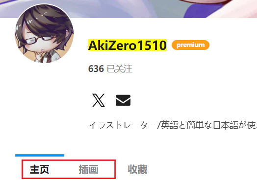
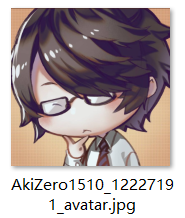
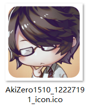
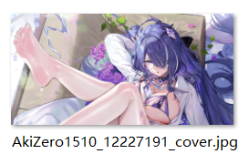
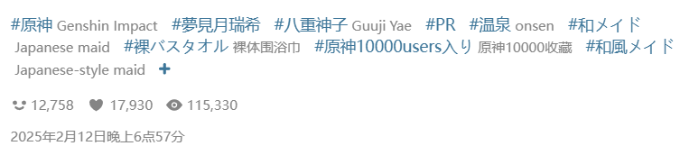
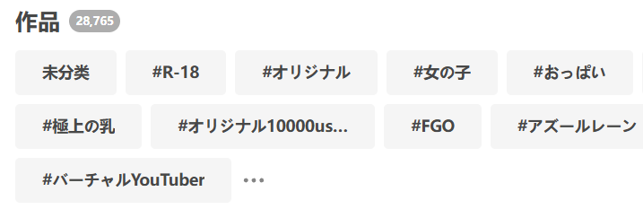
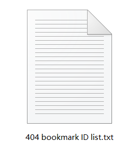

# 更多按钮

下载器的“更多”选项卡里通常是没有按钮的，但是在少数页面类型里会显示一些功能按钮。

## 首页

### 清空已保存的抓取结果

<button type="button" id="clearSavedCrawlResult" class="xzbtns hasRippleAnimation" style="background-color: rgb(20, 173, 39);">清空已保存的抓取结果</button>

点击这个按钮，你可以清空下载器保存的用于断点续传的数据。

?> 下载器在抓取完毕后会保存抓取结果，用于断点续传。这样，如果用户不小心关闭了页面，可以重新打开这个页面并继续下载。当下载完毕时，或者你点击了“停止下载”按钮，下载器会清除这次任务保存的数据。

如果你不需要恢复任何未完成的下载任务，可以点击这个按钮，下载器会清空**所有页面**里的断点续传数据。不过通常也没有太大必要使用这个功能。

## 用户页面

用户页面指的是用户的主页，以及他的插画、漫画、小说页面（但是不包括“收藏”页面）。

例如：[AkiZero1510](https://www.pixiv.net/users/12227191)

在这些页面里，“更多”选项卡里有 4 个按钮：

<button type="button" class="xzbtns hasRippleAnimation" style="background-color: rgb(20, 173, 39);">保存用户头像</button><button type="button" class="xzbtns hasRippleAnimation" data-xztitle="_保存用户头像为图标说明" style="background-color: rgb(20, 173, 39);" title="把用户头像保存为 ico 文件，可以手动设置成文件夹的图标。">保存用户头像为图标</button><button type="button" class="xzbtns hasRippleAnimation" style="background-color: rgb(20, 173, 39);">保存用户封面</button><button type="button" class="xzbtns hasRippleAnimation" style="background-color: rgb(20, 173, 39);">收藏本页面的所有作品</button>

### 保存用户头像

<button id="saveUserAvatar" type="button" class="xzbtns hasRippleAnimation" style="background-color: rgb(20, 173, 39);">保存用户头像</button>

下载器会把用户头像的大图保存到下载目录里。

### 保存用户头像为图标

<button id="saveUserAvatarAsIcon" type="button" class="xzbtns hasRippleAnimation" style="background-color: rgb(20, 173, 39);">保存用户头像为图标</button>

下载器会从用户头像生成一个 256*256 像素的 ico 文件，保存到下载目录里。

?>ico 文件可以设置成文件夹图标，所以你可以把该用户的文件夹的图标设置成他的头像。

### 保存用户封面

<button id="saveUserCoverImage" type="button" class="xzbtns hasRippleAnimation" style="background-color: rgb(20, 173, 39);">保存用户封面</button>

下载器会把用户主页的封面图片保存到下载目录里。

?> 有些用户没有设置封面图片，此时这个按钮不会产生效果。

### 收藏本页面的所有作品

<button id="bookmarkAllWorksOnPage" type="button" class="xzbtns hasRippleAnimation" style="background-color: rgb(20, 173, 39);">收藏本页面的所有作品</button>

下载器会抓取当前页面里的所有作品，然后自动添加收藏。

**说明：**
- 这个功能在图片和小说的分类页面里都可以使用。
- 下载器只会抓取当前页面（仅 1 页），不会抓取后续页面。
- 使用此功能添加收藏时，是否公开、是否附带标签，遵从 [下载器的收藏按钮 (✩)](/zh-cn/设置-更多-增强?id=下载器的收藏按钮-✩) 设置。
- 使用此功能时，下载器不会应用过滤条件。假如你设置了收藏数量，即使有些作品的收藏数量低于要求，下载器依然会收藏它们。如果你希望应用过滤条件，那么不应该使用此功能，而是应该正常抓取和下载作品，并启用 [下载之后收藏作品](/zh-cn/设置-下载?id=下载之后收藏作品) 功能。

当你使用这个功能时，按钮上会显示进度信息。下载器会先显示抓取作品的进度，然后显示添加收藏的进度。例如：

<button type="button" class="xzbtns hasRippleAnimation" style="background-color: rgb(20, 173, 39);" disabled="disabled">Get data 30 / 48</button>

<button type="button" class="xzbtns hasRippleAnimation" style="background-color: rgb(20, 173, 39);" disabled="disabled">Add bookmark 4 / 48</button>

## 搜索页面

### 收藏本页面的所有作品

<button type="button" class="xzbtns hasRippleAnimation" style="background-color: rgb(20, 173, 39);">收藏本页面的所有作品</button>

当你处于搜索标签的页面时可以看到这个按钮。例如这个页面：[バーチャルYouTuber](https://www.pixiv.net/tags/%E3%83%90%E3%83%BC%E3%83%81%E3%83%A3%E3%83%ABYouTuber/artworks?s_mode=s_tag)

用户主页里也有这个按钮，它们的功能是相同的，所以你可以参考前面的说明。

## 收藏页面

在收藏页面里有这些按钮：

<button type="button" class="xzbtns hasRippleAnimation" style="background-color: rgb(20, 173, 39);">给未分类的作品添加标签</button><button type="button" class="xzbtns hasRippleAnimation" style="background-color: rgb(228, 157, 0);">移除本页面中所有作品的标签</button><button type="button" class="xzbtns hasRippleAnimation" style="background-color: rgb(243, 57, 57);">取消收藏本页面中的所有作品</button><button type="button" class="xzbtns hasRippleAnimation" style="background-color: rgb(243, 57, 57);">取消收藏所有已被删除的作品</button><button type="button" class="xzbtns hasRippleAnimation" style="background-color: rgb(20, 173, 39);">导出收藏列表（JSON）</button><button type="button" class="xzbtns hasRippleAnimation" style="background-color: rgb(20, 173, 39);">导入收藏列表（批量添加收藏）</button>

收藏页面又分为两种情况：
- 自己的收藏页面：此时你可以看到所有按钮。
- 别人的收藏页面：此时你只能看到最后 2 个按钮。因为你没有权限编辑其他人的收藏，所以下载器不会显示前 4 个按钮。

### 给未分类的作品添加标签

<button id="addTagToUnmarkedWork" type="button" class="xzbtns hasRippleAnimation" style="background-color: rgb(20, 173, 39);">给未分类的作品添加标签</button>

点击这个按钮，下载器会抓取你收藏里的所有未分类作品，并为它们添加标签。

当你使用这个功能时，按钮上会显示进度信息，例如：

<button type="button" class="xzbtns hasRippleAnimation" style="background-color: rgb(20, 173, 39);" disabled="disabled">3 / 912</button>

?>当这个任务开始执行后，如果你想中止任务，需要关闭当前页面。

**附加说明：**

- 该功能会抓取**所有**未分类作品，你无法设置抓取的数量。
- 下载器会为未分类作品添加**它们本身的标签**，也就是你在它们的作品页面里看到的标签，例如：

**什么是未分类作品？**

当你添加收藏时，可以为它们添加标签（可以使自定义的标签），但这不是必须的。而且当你点击 Pixiv 的收藏按钮来添加收藏时，也是不会添加标签的。

“未分类的作品”指的是你的收藏里没有添加任何标签的作品。

?>收藏里的作品的标签是独立的，与它本身的标签无关。假如一个作品本身有 10 个标签，但是你在添加收藏时没有为它添加标签，那么它就是“未分类作品”。

**小知识：**在你的收藏页面里，Pixiv 会显示一些标签列表，例如：

这些标签就是收藏里的作品所具有的标签，按照使用次数排列。

有一个特殊的标签包含了所有未分类作品，它就是 `未分類`（这个标签名是固定的）。

### 移除本页面中所有作品的标签

<button id="removeTagsFromAllWorksOnPage" type="button" class="xzbtns hasRippleAnimation" style="background-color: rgb(228, 157, 0);">移除本页面中所有作品的标签</button>

这个按钮的作用与上一个按钮相反。点击这个按钮，下载器会抓取**当前页面**里的所有作品（仅 1 页），并移除它们的标签，使它们变成未分类作品。

?> 这不会导致这些作品变成未收藏状态，只是移除了它们附加的标签。

?> 使用这个功能时，下载器会在页面顶部的日志里显示进度信息。

### 取消收藏本页面中的所有作品

<button id="unBookmarkAllWorksOnPage" type="button" class="xzbtns hasRippleAnimation" style="background-color: rgb(243, 57, 57);">取消收藏本页面中的所有作品</button>

点击这个按钮，下载器会抓取**当前页面**里的所有作品（仅 1 页），并把它们从你的收藏里删除。

?> 为了防止误操作，这个按钮每次只会处理 1 页作品。

?> 使用这个功能时，下载器会在页面顶部的日志里显示进度信息。

### 取消收藏所有已被删除的作品

<button id="unBookmarkAll404Works" type="button" class="xzbtns hasRippleAnimation" style="background-color: rgb(243, 57, 57);">取消收藏所有已被删除的作品</button>

你的收藏里可能有一些已经失效的作品，你无法查看或下载它们。例如：

点击这个按钮，下载器会抓取你的收藏列表（此时不需要抓取每个作品的详细数据，所以不会花费太多时间）。然后下载器会找出**所有**已经失效的作品，并把它们从你的收藏里删除。

?> 使用这个功能时，下载器会在页面顶部的日志里显示进度信息。此时日志里的作品数量如“当前有 1585 个作品”指的是下载器统计到的已失效的作品的数量。

**导出已失效的作品的 ID 列表：**

当下载器获取了所有已失效的作品之后，会导出它们的 ID 列表，保存到下载目录里，例如：

对于有些用户来说，导出 ID 列表的功能很有用，因为有了作品 ID，他们就有可能从其他插画网站上找到这些作品的存档。

?> 下载器只导出了作品 ID，没有包含用户 ID 等其他信息，是因为已失效的作品的数据里只有作品 ID 有意义，其他数据全部被 Pixiv 设置成了无效信息。

### 导出收藏列表（JSON）

<button id="exportBookmarkList" type="button" class="xzbtns hasRippleAnimation" style="background-color: rgb(20, 173, 39);">导出收藏列表（JSON）</button>

你可以导出自己或其他用户的收藏列表（取决于你在自己还是其他用户的收藏页面里）。下载器会生成一个 JSON 文件，保存在浏览器的下载目录里。

你可以导出自己的收藏列表作为备份，也可以导出其他用户的收藏列表，然后添加到自己的收藏里。

--------

使用这个功能时，下载器会执行这些步骤：
1. 抓取收藏列表页（但不会抓取每个作品的详细数据）
2. 应用**部分**过滤条件（因为列表页的数据比较简略，只包含部分信息，所以无法使用某些过滤条件）
3. 导出符合条件的作品的数据（只包含必须的信息）。

对此功能有效的过滤条件如下：
- [抓取多少页面](/zh-cn/设置-抓取?id=抓取多少页面)（你可以设置抓取的范围）
- [年龄限制](/zh-cn/设置-抓取?id=年龄限制)
- [AI 作品](/zh-cn/设置-抓取?id=ai-作品)
- [收藏状态](/zh-cn/设置-抓取?id=收藏状态)
- [ID 范围](/zh-cn/设置-抓取?id=id-范围)
- [投稿时间](/zh-cn/设置-抓取?id=投稿时间)
- [必须含有标签](/zh-cn/设置-抓取?id=必须含有标签)
- [不能含有标签](/zh-cn/设置-抓取?id=不能含有标签)
- [用户阻止名单](/zh-cn/设置-更多-抓取?id=用户阻止名单)

### 导入收藏列表（批量添加收藏）

<button id="importBookmarkList" type="button" class="xzbtns hasRippleAnimation" style="background-color: rgb(20, 173, 39);">导入收藏列表（批量添加收藏）</button>

点击这个按钮，你可以选择之前导出的收藏列表（JSON 文件），把里面的作品添加到自己的收藏里。

**提示：**
- 你可以导出其他用户的收藏列表，然后导入到自己的收藏里。
- 当你处于其他用户的收藏页面里时，也可以使用这个功能。下载器总是会把导入的作品添加到你的收藏里。
- 如果导入的列表里含有一些你已经收藏过的作品，那么任务执行完毕后，你的收藏数量可能会小于预期，这是正常的。假如你导入了 48 个作品，其中有 20 个已经收藏过，那么执行完毕后，你的收藏数量只会增加 28 个。

?> 使用这个功能时，下载器会在页面顶部的日志里显示进度信息，例如“收藏作品 5/48”。

