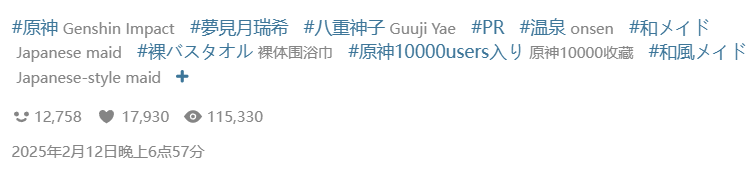
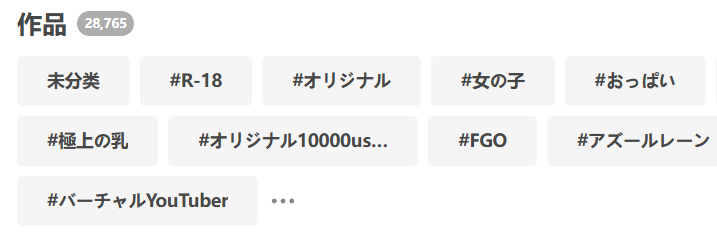
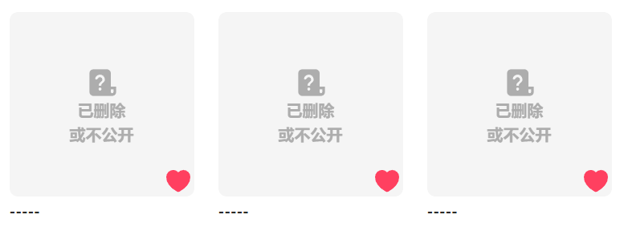

## 给未分类的作品添加标签

<button id="addTagToUnmarkedWork" type="button" class="hasRippleAnimation settingsPanelActionBtn" data-btn-emphasis="secondary" data-btn-intent="brand">给未分类的作品添加标签</button>

点击这个按钮，下载器会抓取你收藏里的所有未分类作品，并为它们添加标签。

当你使用这个功能时，按钮上会显示进度信息，例如：

<button id="addTagToUnmarkedWork" type="button" class="hasRippleAnimation settingsPanelActionBtn" data-btn-emphasis="secondary" data-btn-intent="brand" disabled="disabled">2 / 1330</button>

?>当这个任务开始执行后，如果你想中止任务，需要关闭当前页面。

**附加说明：**

- 该功能会抓取**所有**未分类作品，你无法设置抓取的数量。
- 下载器会为未分类作品添加**它们本身的标签**，也就是你在它们的作品页面里看到的标签，例如：

**什么是未分类作品？**

当你添加收藏时，可以为它们添加标签（可以使自定义的标签），但这不是必须的。而且当你点击 Pixiv 的收藏按钮来添加收藏时，也是不会添加标签的。

“未分类的作品”指的是你的收藏里没有添加任何标签的作品。

?>收藏里的作品的标签是独立的，与它本身的标签无关。假如一个作品本身有 10 个标签，但是你在添加收藏时没有为它添加标签，那么它就是“未分类作品”。

**小知识：**在你的收藏页面里，Pixiv 会显示一些标签列表，例如：

这些标签就是收藏里的作品所具有的标签，按照使用次数排列。

有一个特殊的标签包含了所有未分类作品，它就是 `未分類`（这个标签名是固定的）。

## 移除本页面中所有作品的标签

<button id="removeTagsFromAllWorksOnPage" type="button" class="hasRippleAnimation settingsPanelActionBtn" data-btn-emphasis="secondary" data-btn-intent="warning">移除本页面中所有作品的标签</button>

这个按钮的作用与上一个按钮相反。点击这个按钮，下载器会抓取**当前页面**里的所有作品（仅 1 页），并移除它们的标签，使它们变成未分类作品。

?> 这不会导致这些作品变成未收藏状态，只是移除了它们附加的标签。

?> 使用这个功能时，下载器会在页面顶部的日志里显示进度信息。

## 取消收藏本页面中的所有作品

<button id="unBookmarkAllWorksOnPage" type="button" class="hasRippleAnimation settingsPanelActionBtn" data-btn-emphasis="secondary" data-btn-intent="danger">取消收藏本页面中的所有作品</button>

点击这个按钮，下载器会抓取**当前页面**里的所有作品（仅 1 页），并把它们从你的收藏里删除。

?> 为了防止误操作，这个按钮每次只会处理 1 页作品。

?> 使用这个功能时，下载器会在页面顶部的日志里显示进度信息。

## 查找所有已被删除的作品

<button id="findBookmark404Works" type="button" class="hasRippleAnimation settingsPanelActionBtn" data-btn-emphasis="secondary" data-btn-intent="brand">查找所有已被删除的作品</button>

你的收藏里可能有一些已经失效的作品，你无法查看或下载它们。例如：

点击这个按钮，下载器会抓取你的收藏列表（此时不需要抓取每个作品的详细数据，所以不会花费太多时间）。然后下载器会找出**所有**已经失效的作品，并导出它们的 ID 列表到下载目录里，例如：

对于有些用户来说，导出 ID 列表的功能很有用，因为有了作品 ID，他们就有可能从其他插画网站上找到这些作品的存档。

?> 下载器只导出了作品 ID，没有包含用户 ID 等其他信息，是因为已失效的作品的数据里只有作品 ID 有意义，其他数据全部被 Pixiv 设置成了无效信息。

?> 使用这个功能时，下载器会在页面顶部的日志里显示进度信息。此时日志里的作品数量如“当前有 1585 个作品”指的是下载器统计到的已失效的作品的数量。

## 取消收藏所有已被删除的作品

<button id="unBookmarkAll404Works" type="button" class="hasRippleAnimation settingsPanelActionBtn" data-btn-emphasis="secondary" data-btn-intent="danger">取消收藏所有已被删除的作品</button>

查找所有已被删除的作品，并把它们从你的收藏里删除。

## 导出收藏列表（JSON）

<button id="exportBookmarkList" type="button" class="hasRippleAnimation settingsPanelActionBtn" data-btn-emphasis="secondary" data-btn-intent="brand">导出收藏列表（JSON）</button>

你可以导出自己或其他用户的收藏列表（取决于你在自己还是其他用户的收藏页面里）。下载器会生成一个 JSON 文件，保存在浏览器的下载目录里。

你可以导出自己的收藏列表作为备份，也可以导出其他用户的收藏列表，然后添加到自己的收藏里。

--------

使用这个功能时，下载器会执行这些步骤：
1. 抓取收藏列表页（但不会抓取每个作品的详细数据）
2. 应用**部分**过滤条件（因为列表页的数据比较简略，只包含部分信息，所以无法使用某些过滤条件）
3. 导出符合条件的作品的数据（只包含必须的信息）。

## 导入收藏列表（批量添加收藏）

<button id="importBookmarkList" type="button" class="hasRippleAnimation settingsPanelActionBtn" data-btn-emphasis="secondary" data-btn-intent="brand">导入收藏列表（批量添加收藏）</button>

点击这个按钮，你可以选择之前导出的收藏列表（JSON 文件），把里面的作品添加到自己的收藏里。

**提示：**
- 你可以导出其他用户的收藏列表，然后导入到自己的收藏里。
- 当你处于其他用户的收藏页面里时，也可以使用这个功能。下载器总是会把导入的作品添加到你的收藏里。
- 导入收藏时会根据 [下载器的收藏功能 (✩) ](/zh-cn/设置-更多-增强?id=下载器的收藏功能-✩) 的设置来决定是否添加标签、是否公开收藏。该设置的默认值是添加标签、公开收藏。如果你想使用不同的设置，可以在导入之前修改这些设置。
- 如果导入的列表里含有一些你已经收藏过的作品，那么任务执行完毕后，你的收藏数量可能会小于预期，这是正常的。假如你导入了 48 个作品，其中有 20 个已经收藏过，那么执行完毕后，你的收藏数量只会增加 28 个。

?> 使用这个功能时，下载器会在页面顶部的日志里显示进度信息，例如“收藏作品 5/48”。

