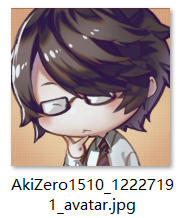
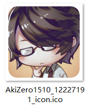
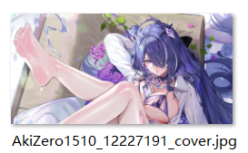

## 保存用户头像

<button id="saveUserAvatar" type="button" class="hasRippleAnimation settingsPanelActionBtn" data-btn-emphasis="secondary" data-btn-intent="brand">保存用户头像</button>

下载器会把用户头像的大图保存到下载目录里。

## 保存用户头像为图标

<button id="saveUserAvatarAsIcon" type="button" class="hasRippleAnimation settingsPanelActionBtn" data-btn-emphasis="secondary" data-btn-intent="brand" data-xztitle="_保存用户头像为图标说明" title="Save user avatar as icon">保存用户头像为图标</button>

下载器会从用户头像生成一个 256*256 像素的 ico 文件，保存到下载目录里。

?>ico 文件可以设置成文件夹图标，所以你可以把该用户的文件夹的图标设置成他的头像。

## 保存用户封面

<button id="saveUserCoverImage" type="button" class="hasRippleAnimation settingsPanelActionBtn" data-btn-emphasis="secondary" data-btn-intent="brand">保存用户封面</button>

下载器会把用户主页的封面图片保存到下载目录里。

?> 有些用户没有设置封面图片，此时这个按钮不会产生效果。

## 收藏本页面的所有作品

<button id="bookmarkAllWorksOnPage" type="button" class="hasRippleAnimation settingsPanelActionBtn" data-btn-emphasis="secondary" data-btn-intent="brand">收藏本页面的所有作品</button>

