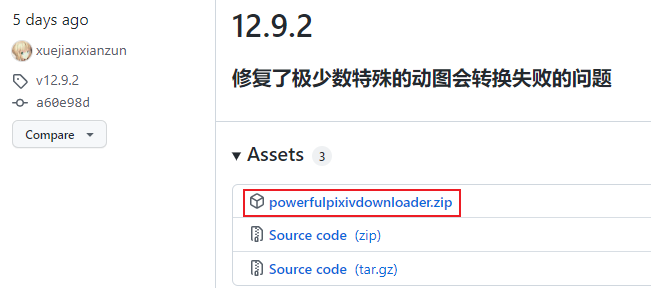
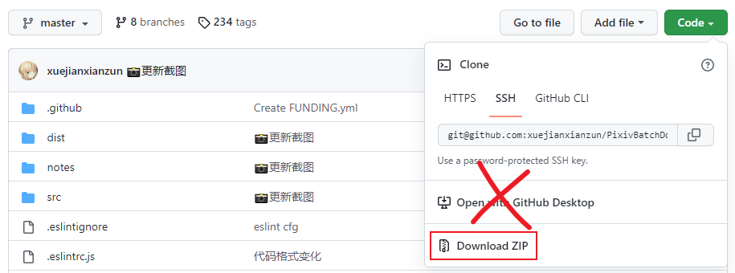
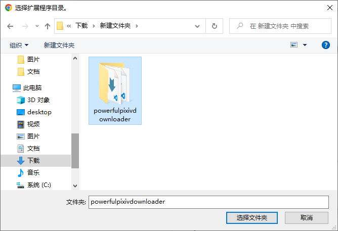
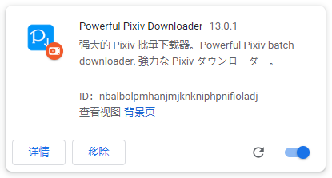

# 离线安装

如果您不能从浏览器的扩展商店安装，那就只能离线安装。

又或者您需要某个特定版本的下载器，那么也需要离线安装。

?>离线安装本扩展程序之后，它不会自动更新，需要你手动进行更新。

!>不要同时运行本程序的多个版本。如果你同时安装了多个版本，请删除比较旧的那个。

## 下载文件

打开本程序的 [ GitHub releases 页面](https://github.com/xuejianxianzun/PixivBatchDownloader/releases ':target=_blank')，可以看到本程序的释出版本：

排在第一位的就是最新版本，点击红框处，下载本程序的 zip 压缩包。

**注意：**不能下载 “Source code” 压缩包，也不能在本项目仓库的主页直接下载整个项目的压缩包！

因为只有仓库里的 dist 目录是扩展程序文件，其他的部分都是开发文件，所以你不能把整个源代码作为扩展程序来安装。

## 解压文件

解压下载的文件，得到 powerfulpixivdownloader 文件夹：

你可以把这个文件夹移动到其他地方。

## 加载扩展
  
你可以输入网址进入（chrome://extensions/），或者从菜单打开：

扩展管理页面：

首先我们需要启用右上角的 **开发者模式**，默认情况下它没有启用，需要点击开关来启用它。

之后点击 **加载已解压的扩展程序**，选择 powerfulpixivdownloader 文件夹：

**注意：**是选择整个文件夹。不需要进入这个文件夹里面。

## 完成

现在，扩展程序里已经出现这个扩展了：

它的图标旁有一个橘红色的硬盘图标，表示这是本地扩展。它在使用体验上与在线安装版本没有区别，但不能自动更新。

完成离线安装之后，如果浏览器里有打开的 pixiv 页面，请刷新页面，这样才能使用新安装的扩展。

## Kiwi 浏览器离线安装本扩展

进入 Kiwi 浏览器的“扩展程序”菜单，点击 `+(from .zip)`，然后选择本扩展程序的离线安装包（zip 格式）即可。
