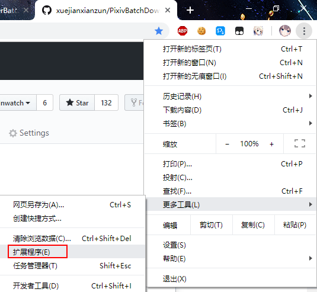
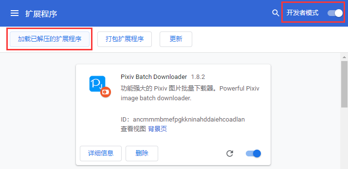
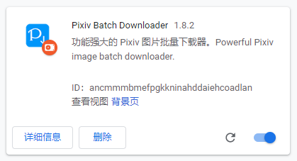

# 离线安装

如果您不能从浏览器的扩展商店安装，或者扩展商店上的不是最新版本，您可以进行离线安装。

?>离线安装的扩展程序不会自动更新，需要手动更新。

?>只有 PC 上的浏览器可以离线安装，Android 上的 Yandex 浏览器不能离线安装。

!>不要同时运行本程序的多个版本。如果你同时安装了多个版本，请删除比较旧的那个。

## 下载文件

打开本程序的 [ GitHub releases 页面](https://github.com/xuejianxianzun/PixivBatchDownloader/releases ':target=_blank')，可以看到本程序的释出版本：

排在第一位的就是最新版本，点击红框处，下载本程序的 zip 压缩包。

## 解压文件

解压下载的文件，得到 powerfulpixivdownloader 文件夹：

你可以把这个文件夹移动到其他地方。

## 加载扩展
  
你可以输入网址进入（chrome://extensions/），或者从菜单打开：

扩展管理页面：

首先我们需要启用右上角的 **开发者模式**，默认情况下它没有启用，需要点击开关来启用它。

之后点击 **加载已解压的扩展程序**，选择 powerfulpixivdownloader 文件夹：

## 完成

现在，扩展程序里已经出现这个扩展了：

它的图标旁有一个橘红色的硬盘图标，表示这是本地扩展。它在使用体验上与在线安装版本没有区别，但不能自动更新。