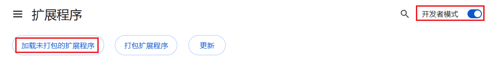

# 离线安装

!>在离线安装之前，你应该在扩展管理页面里检查是否已经安装了这个扩展程序。有些用户可能已经在线安装了这个扩展程序，此时应该先把它禁用掉，然后再安装离线版本，以避免同时运行多个本扩展程序。

?> 下面的步骤讲的是在 PC 上进行安装。如果你想要在 Android 上安装，请查看：[在 Microsoft Edge Canary 浏览器上安装](/zh-cn/MicrosoftEdgeCanary.md)

## 下载文件

打开本程序的 [GitHub releases 页面](https://github.com/xuejianxianzun/PixivBatchDownloader/releases ':target=_blank')，可以看到本程序的释出版本，例如：

排在第一位的就是最新版本，下载 Assets 里的 `powerfulpixivdownloader.zip
`：

**注意：** 不能下载 “Source code” 压缩包，也不能在本项目仓库的主页直接下载整个项目的源代码。

因为源代码不是浏览器扩展程序，不能直接安装。实际上只有 dist 目录是扩展程序，你可以加载 dist 目录，但这样还不如直接下载 `powerfulpixivdownloader.zip` 更简单。

## 解压文件

把 `powerfulpixivdownloader.zip` 解压到 powerfulpixivdownloader 文件夹：

?>你可以把这个文件夹移动到其他地方。

**提示：** 这个 zip 文件里没有一个总文件夹来包含所有文件，所以你需要在解压时为其生成一个文件夹。解压软件通常会提供此功能。

这是压缩包内的文件结构：

## 加载扩展
  
此部分以 Chrome 浏览器为例。

你可以输入网址进入 `chrome://extensions/` 扩展管理页面，或者从菜单进入：

扩展管理页面的顶部可能是这样的：

我们需要启用右上角的 **开发者模式**。默认情况下它没有启用，需要点击开关来启用它。

之后点击 **加载未打包的扩展程序**，选择 powerfulpixivdownloader 文件夹：

**注意：**点击这个文件夹即可，不需要进入这个文件夹里面。

## 完成

现在扩展程序里应该已经出现这个扩展了：

它的图标旁有一个橘红色的硬盘图标，表示这是本地扩展。它在使用体验上与在线安装版本没有区别，但**不能自动更新**。

?>离线安装之后，如果浏览器里有已经打开的 pixiv 页面，请刷新页面，这样才能使用新安装的扩展。
