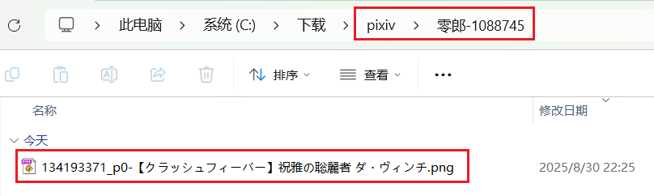
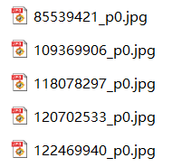
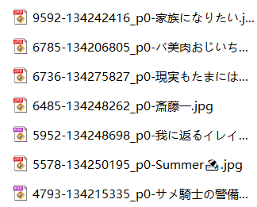
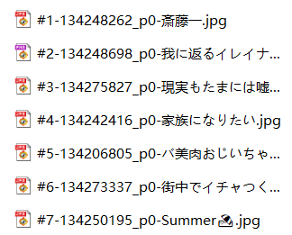
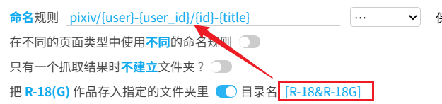
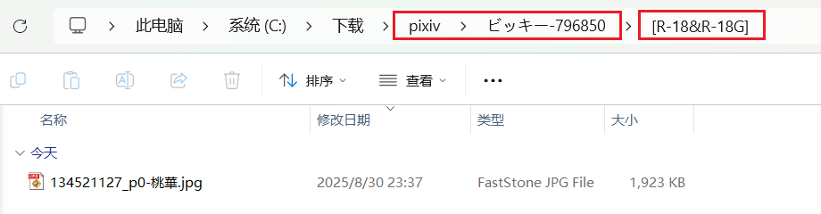
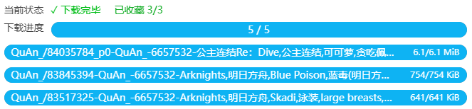

# 设置-下载

## 命名规则

    命名规则
    <input type="text" name="userSetName" class="setinput_style1 blue fileNameRule" value="pixiv/{user}-{user_id}/{id}-{title}">
    &nbsp;
    <select name="fileNameSelect" class="beautify_scrollbar">
      <option value="default">…</option>
      <option value="{id}">{id}</option>
      <option value="{user}">{user}</option>
      <option value="{user_id}">{user_id}</option>
      <option value="{title}">{title}</option>
      <option value="{page_title}">{page_title}</option>
      <option value="{tags}">{tags}</option>
      <option value="{tags_translate}">{tags_translate}</option>
      <option value="{tags_transl_only}">{tags_transl_only}</option>
      <option value="{page_tag}">{page_tag}</option>
      <option value="{type}">{type}</option>
      <option value="{AI}">{AI}</option>
      <option value="{like}">{like}</option>
      <option value="{bmk}">{bmk}</option>
      <option value="{bmk_1000}">{bmk_1000}</option>
      <option value="{bmk_id}">{bmk_id}</option>
      <option value="{view}">{view}</option>
      <option value="{rank}">{rank}</option>
      <option value="{date}">{date}</option>
      <option value="{upload_date}">{upload_date}</option>
      <option value="{task_date}">{task_date}</option>
      <option value="{px}">{px}</option>
      <option value="{series_title}">{series_title}</option>
      <option value="{series_order}">{series_order}</option>
      <option value="{series_id}">{series_id}</option>
      <option value="{id_num}">{id_num}</option>
      <option value="{p_num}">{p_num}</option>
      </select>
    &nbsp;
    <slot data-name="saveNamingRule">
  <button class="nameSave textButton has_tip" type="button" data-xztip="_保存命名规则提示" data-xztext="_保存" data-tip="保存命名规则，最多 20 个">保存</button>
  <button class="nameLoad textButton" type="button" data-xztext="_加载">加载</button>
  <button class="nameLoad textButton" type="button" data-xztext="_提示">提示</button>
  </slot>
    

这是很重要的功能，你可以在这里设置下载器保存的**文件名**，也可以**建立文件夹**来分类。

下载器在保存文件时会替换命名规则里的标记并生成文件名。例如 `{id}` 会被替换成作品 ID，形式如 `75863159_p0`。

提示：你可以根据需要修改命名规则。只有 `{id}` 是必须的，因为它是每个文件的唯一标记。

?>你可以从输入框右侧的下拉框里快速插入要使用的标记：点击某个标记就可以把它添加到命名规则里。不过这里是 Wiki，所以没有效果。

?>下拉框右侧的 `保存` 按钮可以保存当前命名规则；`加载` 按钮则会显示保存过的命名规则。使用这两个按钮，你可以保存多个常用的命名标记，并方便的切换。

?>这个设置的右侧有一个 `提示` 按钮，点击它可以查看所有标记及其作用。不过这里是 Wiki，所以没有效果。

### 建立文件夹

你可以使用斜线 `/` 建立文件夹。有需要的话，可以使用多个斜线`/` 建立多层文件夹。

默认的命名规则 `pixiv/{user}-{user_id}/{id}-{title}` 会建立两层文件夹：
- 先建立 `pixiv` 文件夹
- 在里面建立用户名和用户 ID 的文件夹
- 在里面保存作品，文件名为作品 ID 和标题。

效果示例：

?>`/` 并不是必须的，如果你不想建立文件夹，也可以不使用 `/`。例如把命名规则设置为 `{id}` 的话，文件会直接保存到浏览器的下载目录里，不会建立子文件夹。

### 标记列表

?>* 有些标记并不总是可用，有时它们可能什么都不输出。

- `{id}` 文件的 id，也就是默认文件名。附带序号，如 `44920385_p0`
- `{user}` 用户（画师）名字
- `{user_id}` 用户（画师） ID，是纯数字
- `{title}` 作品标题
- `{tags}` 作品的标签列表
- `{tags_translate}` 作品的标签列表，附带翻译后的标签（如果有）
- `tags_transl_only` 翻译后的标签列表
- `{page_title}` 开始抓取时的页面标题
- *`{page_tag}` 如果页面里的作品属于同一个标签，则输出这个标签。否则什么都不输出。
- `{type}` 作品类型，分为 `Illustration`, `Manga`, `Ugoira`, `Novel`
- *`{AI}` 如果作品是由 AI 生成的，则输出 `AI`。否则什么都不输出。
- `{like}` Like count，作品的点赞数。
- `{bmk}` Bookmark count，作品的收藏数。把它放在最前面可以让文件按收藏数排序。
- `{bmk_1000}` 作品收藏数的简化显示。例如：`0+`、`1000+`、`2000+`、`3000+` ……
- `{bmk_id}` Bookmark ID。你收藏的每一个作品都会有一个 Bookmark ID。收藏的时间越晚，Bookmark ID 就越大。当你下载你的收藏时，可以使用 {bmk_id} 作为排序依据。
- `{view}` View count，作品的浏览量。
- *`{rank}` 作品在排行榜中的排名。如 `#1`、`#2` …… 只能在排行榜页面使用。
- `{date}` 作品的创建时间，如 `2019-08-29`。
- `{upload_date}` 作品内容最后一次被修改的时间。如 `2019-08-30`。
- `{task_date}` 本次任务抓取完成时的时间。如 2020-10-21
- `{px}` 宽度和高度。例如：`600x900`
- *`{series_title}` 系列标题。当作品属于一个系列时可用。
- *`{series_order}` 作品在系列中的序号，如 `#1` `#2`。 当作品属于一个系列时可用。
- *`{series_id}` 系列 ID。 当作品属于一个系列时可用。
- `{id_num}` 数字 id，如 `44920385`
- `{p_num}` 图片在作品内的序号，如 `0`、`1`、`2` …… 每个作品都会重新计数。

### 附加说明

- 你可以使用多个标记；多个标记之间建议添加分割符号，如 `{id}-{tags}-{user}`，以免多个标记的内容挨在一起，难以分辨。分割符号没有固定要求，随你喜欢就好。
- 除了预设的标记，你也可以输入自定义文字，例如 `标题 {title} 标签 {tags}`。这些非预设标记的文字会原样保留。
- 没有后缀名标记，因为后缀名是下载器自动添加到文件末尾的。
- 如果生成的文件名里含有不能作为文件名的特殊字符，会被替换成近似的全角符号。例如一些标签里含有斜线 `/`，但斜线不能用在文件名里，所以下载器会把它替换成全角的 `／`。
- 如果你使用了 `{tags_translate}`，就没有必要使用 `{tags}`，因为前者包含它。翻译的内容根据你在 pixiv 的语言设置有所不同。例如，如果你的 pixiv 界面是中文的，那么标签的翻译一般也是中文的。
- `{tags_transl_only}` 只保存翻译后的标签，不保存原本的日文标签。但是如果某个标签没有翻译，则会保存原本的日文标签。
- 文件名里必须要含有作品的**唯一标记**，用于防止文件名重复。文件名重复会导致下载的文件互相覆盖，或者出现另存为窗口。
- 默认命名规则里的 `{id}` 就是唯一标记。有些用户可能想去掉 `{id}`，使用 `{id_num}` 和 `{p_num}` 代替。这是可以的，但必须同时使用，也就是同时包含 `{id_num}` 和 `{p_num}`，不能只使用其中一个。这是因为多图作品里有多张图片，它们的 `{id_num}` 是相同的，必须加上 `{p_num}` 才能使它们的名字不同。
- `{bmk_1000}` 不会显示具体的收藏数量，而是以 1000 为计算单位，显示一个整数，并在最后显示一个加号 `+`（1000 以下会显示为 `0+`）。这样可以让收藏数显得不那么杂乱。
- 保存文件时，如果已存在同名文件，下载器会让浏览器覆盖文件，而不是在后面添加序号。PC 上的浏览器都会这样做，但是 Android 上的 Edge canary 不会覆盖旧文件，而是会添加序号。
- 文件名的长度有可能会超出操作系统允许的长度限制。这经常是由于文件名里含有作品的标签导致的，比如 `{tags}`。如果文件名超长，这个文件可能无法自动保存，此时浏览器会弹出另存为对话框，让用户手动操作。如果你遇到了文件名超长的问题，可以启用下载器的“更多”标签页里“命名”分类下的“文件名长度限制”功能。
- 当文件名超长时，浏览器可能会自动截断超出的部分，使文件可以正常保存。但这是分情况的。据我所知，Windows 上的 Chrome 浏览器会这样做，但 Linux 和 Android 上的浏览器可能不会这样做。另外如果你把文件保存到远程位置（如网络驱动器），浏览器可能也不会截断文件名（即便是 Chrome 也会如此）。

### 使用命名标记排序

有些命名标记是有规律的，如果把它们设置为文件名的**第一部分**，就可以在资源管理器里按文件名排序。

#### 反映时间顺序的标记

`{id}`（作品 ID）是递增的。发布时间较早的作品的 ID 小，发布时间晚的作品的 ID 大。按文件名排序可以反映作品的发布顺序。默认的命名规则里，文件名部分是 `{id}-{title}`，就可以把文件按 ID 大小排序，例如：

`{date}`（作品发布时间）也有类似的作用。

`{bmk_id}` 可以反映你收藏作品的时间顺序。

#### 反映数量多少的标记

有些标记是数字，例如 `{like}`、`{view} `、`{bmk}`、`{bmk_1000}`、`{rank}`。

示例：把作品按照 `{bmk}`（收藏数量）顺序倒序排列，可以把高质量作品排在前面：

示例：在排行榜页面里下载时，可以按照 `{rank}` 顺序：

## 在不同的页面类型中使用不同的命名规则

    在不同的页面类型中使用不同的命名规则
    <input type="checkbox" name="setNameRuleForEachPageType" class="need_beautify checkbox_switch">
    
    

上面的“命名规则”设置是对所有页面生效的，也就是所有页面类型里都会使用同一个命名规则。

如果你想为每个页面设置独立的命名规则，可以启用这个设置。

**应用场景示例：**

- 在用户主页下载时，设置为 `{user}/{id}`，使用用户名建立文件夹。
- 在搜索页面设置为 `{page_tag}/{id}`，使用这个页面的标签建立文件夹。
- 在排行榜页面设置为 `{rank}-{id}`，保存作品在排行榜中的排名。

**注意：**
- 启用这个设置之后，下载器会使用为该页面类型预设的规则覆盖当前命名规则。你可以把它们修改成你需要的规则。

- 启用这个设置之后，如果你在下载时切换了页面类型，可能会导致命名规则发生变化，从而都只文件名或文件夹名也发生变化。这可能不是预期的行为，所以在下载时，不要把当前页面切换到其他页面类型（但可以切换到同一页面类型）。

举个例子，如果你在用户主页下载，就不要使当前页面切换到搜索页面。如果你在作品页面内下载，就不要切换到用户主页或者搜索页面。

## 只有一个抓取结果时不建立文件夹

    
    只有一个抓取结果时不建立文件夹
     ? 
    
    <input type="checkbox" name="notFolderWhenOneFile" class="need_beautify checkbox_switch">
    
    

有时候用户希望在下载单个文件时不建立文件夹，直接保存到下载目录里，所以我添加了这个选项。

启用之后，如果抓取结果里**一共**只有一个文件，那么下载器就不会建立文件夹（即使用户在命名规则里设置了文件夹）。

**注意：**

这个选项的生效条件是只有一个抓取结果，即**总数**只有 1 个。

有些用户会误以为这是“如果某个作品里只有一个文件需要下载，就不建立文件夹”的意思，这是错误的。关键在于抓取结果的总数是不是 1。

假设抓取 10 个作品，每个作品里有 1 个图片，最后产生了 10 个抓取结果。此时这个选项不会生效。

## 把 R-18(G) 作品存入指定的文件夹里

    把 R-18(G) 作品存入指定的文件夹里
    <input type="checkbox" name="r18Folder" class="need_beautify checkbox_switch">
    
    
    目录名
    <input type="text" name="r18FolderName" class="setinput_style1 blue" style="width:150px;min-width: 150px;" value="[R-18&amp;R-18G]">
    
    

如果你启用了这个设置，下载器在下载文件时，会把 R-18(G) 作品统一存放到一个**子文件夹**里。

下载器会把这个设置里的目录名**插入**到文件名字之前：

如果命名规则原本就会建立文件夹，那么这个选项里的文件夹就是最深的一个文件夹，示例：

**提示：**

1. R-18 和 R-18G 作品会放到同一个文件夹里；不能分开放到两个文件夹里。
2. 你可以修改文件夹的名字。可以使用命名规则里的标记。

## 同时下载数量

    
    同时下载数量
    
    <input type="text" name="downloadThread" class="has_tip setinput_style1 blue" data-xztip="_下载线程的说明" value="3" data-tip="你可以输入 1-6 之间的数字，设置同时下载的数量">
    

你可以输入 1-6 之间的数字，设置同时下载的数量。默认值是 3。

**提醒：**

- 同时下载多个文件有助于提高下载速度。
- 如果你下载的速度慢，可以减少同时下载的数量，比如设置为 2。否则可能有一些下载进度超时，导致下载失败。
- 如果你的下载速度比较快，可以把下载线程设置的多一些。最大值是 6。

!>如果你下载大量文件，并且下载速度很快，建议设置较小的同时下载数量，例如 1。这是因为太过频繁的下载会增加你的账号被封禁的风险。

怎样查看下载速度呢？以 Chrome 浏览器为例，按 `Shift` + `Esc` 键打开它的任务管理器，然后找到进行下载的页面，就可以看到它的下载速度。

如果下载速度达到 1 MB/s，一般就不会出现下载问题了。如果速度比较慢，建议把同时下载的数量设置的小一些。

## 自动开始下载

    
    自动开始下载
     ? 
    
    <input type="checkbox" name="autoStartDownload" id="setQuietDownload" class="need_beautify checkbox_switch" checked="">
    
    

当抓取完成后，可以开始下载时，下载器会自动开始下载。

如果关闭此选项，那么下载器在抓取完成之后不会自动开始下载，而是会显示设置面板。用户需要手动点击“开始下载”按钮才会开始下载。

**注意：**

一些**快捷下载**方式总是会自动开始下载（即使你关闭了这个选项），例如：
- 在作品页面里时，点击页面右侧的快速下载按钮
- 点击作品缩略图上的下载按钮
- 点击图片查看器里的下载按钮
- 预览作品时，按快捷键 `C` 或 `D` 下载作品
- 抓取手动选择的作品

还有一种情况不会自动开始下载：

当你在**搜索页面**进行抓取，并且启用了“预览搜索页面的筛选结果”（默认启用），那么抓取完成后也不会自动开始下载。这是为了让用户能够在抓取完成之后调整抓取结果，满意之后再开始下载。

## 下载之后收藏作品

    
    下载之后收藏作品
     ? 
    
    <input type="checkbox" name="bmkAfterDL" class="need_beautify checkbox_switch">
    
    

启用这个选项之后，下载器每下载一个文件，就会收藏它所属的作品。

收藏作品的进度会显示在下载进度区域。格式如： `已收藏 1/3`

当你下载完毕之后，如果看到收藏进度的提示里的两个数字是相同的，如 `已收藏 3/3` 就说明收藏完了。如果不相同请等待收藏完毕。

**注意：** 

1. 如果一个作品因为“不下载重复文件”的设置而被跳过下载，那么它依然会被视为下载成功，所以也会进行收藏。
2. 一个作品可能有多个文件，但只会进行一次收藏。如果你看到的收藏数量比文件数量少，这是正常的，因为收藏数量是作品总数，而非文件总数。
3. 当你下载大量文件时，收藏进度可能增加的比较慢。这是因为下载器会每隔几秒收藏一个作品，而非快速、连续的收藏作品。如果不设置一定的间隔时间，就容易触发 429 限制（在一定时间，pixiv 拒绝提供服务，所以浏览作品、抓取作品、收藏作品都会被影响）。
