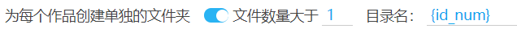
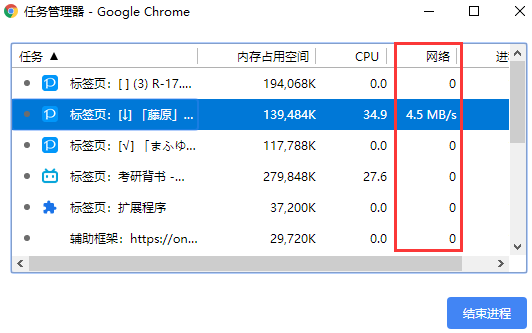

# 设置-下载

## 命名规则


这是很重要的功能，你可以在这里设置文件的**命名规则**，也可以**建立文件夹**。

### 标记说明

每一个标记都会在下载时进行替换，比如 `{id}` 会被替换成类似于 `75863159_p0` 的结果。

?>这项设置的右侧有一个提示按钮，点击它就可以查看标记的含义。

- `{id}` 作品的 id，附带序号，如 44920385_p0
- `{user}` 画师名字
- `{user_id}` 画师 id
- `{title}` 作品标题
- `{p_title}` 当前页面的标题
- `{tags}` 作品的标签列表
- `{tags_translate}` 作品的标签列表，附带翻译后的标签（如果有）
- `tags_transl_only` 翻译后的标签列表
- `{p_tag}` 当前页面的标签。当前页面没有标签时不可用。
- `{type}` 作品类型，分为 illustration、manga、ugoira
- `{like}` Like count，作品的点赞数。
- `{bmk}` bookmark-count，作品的收藏数。把它放在最前面可以让文件按收藏数排序。
- `{bmk_1000}` 作品收藏数的简化显示。例如：0+、1000+、2000+、15000+。
- `{view}` View count，作品的浏览量。
- `{rank}` 作品在排行榜中的排名。如 #1、#2 …… 只能在排行榜页面使用。
- `{date}` 作品的创建日期，格式为 yyyy-MM-dd。如 2019-08-29
- `{task_date}` 这次任务抓取完成时的时间。如 2020-10-21
- `{px}` 宽度和高度
- `{series_title}` 系列标题（可能为空）
- `{series_order}` 作品在系列中的序号，如 #1 #2
- `{id_num}` 数字 id，如 44920385
- `{p_num}` 图片在作品内的序号，如 0、1、2 …… 每个作品都会重新计数。

**注意：**

- 下载时如果文件已存在，新文件会覆盖旧文件，而不是在后面添加序号。
- 你可以使用多个标记；多个标记之间建议添加分割符号，如 `{id}-{tags}-{user}`，免得各个标记的内容挨在一起，难以分辨。
- 在某些情况下，会有一些标记不可用。不可用的标记不会出现在文件名里。
- 如果生成的文件名里有一些特殊字符，不能在下载时使用，会被替换成近似的字符。
- 如果文件名超长，Chrome 会自动截断超出的部分。
- 除了预设的标记，你也可以自行输入文字。
- 没有后缀名标记，因为后缀名是程序自动添加到文件末尾的。
- 如果你使用了 `{tags_translate}`，就没有必要使用 `{tags}`，因为前者包含它。翻译的内容根据你在 pixiv 的语言设置有所不同。例如，如果你的 pixiv 界面是中文的，那么标签的翻译一般也是中文的。你可以在首页底部修改你要是用的语言。
- `{tags_transl_only}` 只保存翻译后的标签，不保存原本的日文标签。但是如果某个标签没有翻译，则会保存原本的标签。
- 文件名里必须要含有 id（`{id_num}`） 和序号（`{p_num}`）部分，或者直接使用 `{id}`。不然多图作品里的图片的文件名相同，会导致下载时互相覆盖。
- `{bmk_1000}` 不会显示具体的收藏数量，而是以 1000 为计算单位，显示一个整数，并在最后显示一个加号 `+`（1000 以下会被替换为 0）。这样可以让收藏数显得不那么杂乱。

### 建立文件夹

**使用斜线 `/` 可以建立文件夹**。例如 `{p_title}/{id}-{tags}-{user}` 会把 `{p_title}` 作为文件夹的名字，后续内容作为文件名。就像这样：


如果有需要，你也可以使用多个斜线，这样可以建立多层文件夹。

## 在不同的页面类型中使用不同的命名规则


如果你想要在某些页面里使用与其他页面不同的命名规则，可以使用这个设置。

应用场景示例：

- 在用户的作品列表页面设置为 `{user}/{id}`，使用用户名建立文件夹。
- 在搜索标签的页面设置为 `{p_tag}/{id}`，使用这个页面的标签建立文件夹。
- 在排行榜页面设置为 `{p_title}/{rank}-{id}`，在文件名的前面添加它在排行榜中的编号。

**注意：**
- 启用这个设置之后，在各种页面里的命名规则都会变成下载器预设的规则。你可以把它们修改成你需要的规则。
- 启用这个设置之后，如果你在下载时切换了页面类型，导致命名规则发生变化，那么文件名也可能会发生变化。

## 添加命名标记前缀


默认未启用。

当用户在命名规则里使用了多个标记时，文件名里储存了多种信息，它们之间可能难以区分开来。

如果启用了这个设置，本程序会在一些标记前面添加一些前缀。详细情况如下：

- `{title}` 生成结果时，前面加上了 `titl`e_ 字符。
- `{tags}` 和 `{tags_translate}` 生成结果时，前面加上了 `tags`_ 字符。
- `{user}` 生成结果时，前面加上了 `user`_ 字符。
- `{userid}` 生成结果时，前面加上了 `uid_` 字符。
- `{bmk}` 生成结果时，前面加上了 `bmk_` 字符。

其他标记没有添加说明文字。

如果你有需要，你可以在命名规则里手动输入你要使用的字符。

## 第一张图不带序号


默认未启用。

如果你使用 `{id}` 命名，每个作品的 id 后面都会带序号，如：

```
80447108_p0
80447108_p1
80447108_p2
```

这个选项会去掉第一张图的序号部分，变成这样：

```
80447108
80447108_p1
80447108_p2
```

这个设置对命名标记 `{p_num}` 也会生效。

## 在序号前面填充 0


默认未启用。

插画和漫画作品因为可能有多张图片，所以是有序号的。

下载器默认不会在序号前添加 0，但是一些软件对于文件名排序不正确，在这种情况下需要添加 0。

开启这个设置后，序号的形式可能如下：

```
001
002
003
...
010
011
012
...
```

你可以在子选项里设置填充后的长度，默认为 3。（因为插画和漫画最多可以有 200 p，所以长度应该设置为 3）。

## 根据作品类型自动创建文件夹

```
根据作品类型自动创建文件夹  ✓插画  ✓漫画  ✓动图  ✓小说
```

默认未启用。

你可以勾选其中**任意多个**选项，这样下载器会根据作品类型自动创建文件夹。

- 如果勾选了*插画*，插画作品会被存入 `Illustration` 文件夹
- 如果勾选了*漫画*，漫画作品会被存入 `Manga` 文件夹
- 如果勾选了*动图*，动图作品会被存入 `Ugoira` 文件夹
- 如果勾选了*小说*，小说作品会被存入 `Novel` 文件夹


这个设置可以代替命名标记 `{type}`。`{type}` 总是会为所有类型的作品创建文件夹。使用这个设置，你可以自由选择需要处理的作品类型。

## 使用第一个匹配的标签建立文件夹 


默认未启用。

启用这个设置之后，用户可以输入标签列表。

在下载时，如果作品的标签列表中含有用户设置的标签，就会使用这个标签建立一个文件夹（仅限第一个匹配到的标签）。

## 把 R-18(G) 作品存入指定的文件夹里


开启这个选项之后，下载器会把本次下载任务里的 R-18(G) 作品统一存放到一个文件夹里。

默认未启用。

**提示：**

1. R-18 和 R-18G 作品会放到同一个文件夹里；不能分开放到两个文件夹里。
2. 你可以修改文件夹的名字。可以使用命名规则里的标记。

## 为每个作品创建单独的文件夹



下载器可以为每个作品创建单独的目录，把这个作品里的文件保存进去。

默认未启用。

### 文件数量大于

当作品里的图片数量大于设置值的时候，才会为这个作品创建单独的文件夹。

默认值为 1，也就是只会为多图作品建立文件夹。

如果设置为 0，那么对于单图作品也会创建文件夹。

### 目录名

你可以设置此功能创建的文件夹的名称。

**提示：** 

- 这里可以使用命名规则里的标记。
- 这里可以使用斜线 `/` 来建立子文件夹。
- 这里不应该使用 `{id}` 标记，请使用 `{id_num}` 代替它。

-----------

以作品 [79239641](https://www.pixiv.net/artworks/79239641 ':target=_blank') 为例，它有 3 张图片。若命名规则为 `{id}`，在未开启此功能时，文件名结果如下：

```
79239641_p0.jpg
79239641_p1.jpg
79239641_p2.jpg
```

开启此功能后，默认会把图片放进以作品的 id 命名的目录里，如下：

```
79239641/
  |---- 79239641_p0.jpg
  |---- 79239641_p1.jpg
  |---- 79239641_p2.jpg
```

## 设置下载线程


下载线程是指同时进行几个下载任务，也就是有几个下载进度条。

**提醒：**

- 下载线程设置的多一些，一般有助于提高下载速度，但决定性的因素依然取决于你的网络情况。
- 如果你下载的速度慢，可以适当减少一些下载线程，比如设置为 3。否则可能有一些下载进度超时，导致卡住。
- 如果你的下载速度比较快，可以把下载线程设置的多一些。最大值是 6。

怎样查看下载速度呢？以 Chrome 浏览器为例，按 `Shift` + `Esc` 键打开它的任务管理器，然后找到进行下载的页面，就可以看到它的下载速度。



如果下载速度达到 1 MB/s，一般就不会出现下载问题了。如果速度比较慢，那么我建议你把下载进程设置的小一些。

## 自动开始下载


默认开启。

当抓取作品完成，可以进行下载时，自动开始下载。

如果关闭此选项，那么抓取完成之后，下载器会弹出设置面板，需要用户手动点击下载按钮才会开始下载。

## 下载之后收藏作品


启用这个选项之后，每当下载完一个文件，下载器就会自动收藏这个作品。

默认未启用。

收藏作品的进度会显示在下载进度区域。格式如： `已收藏 99/100`

当你下载完成之后，如果看到收藏进度的提示里的两个数字是相同的，如 `已收藏 100/100` 就说明收藏完了。如果不相同就等待一下。

**注意：** 

1. 如果一个作品因为“不下载重复文件”的设置而被跳过下载，那么它也会被视为下载成功，所以也会进行收藏。
2. 一个作品可能有多个文件，但只会进行一次收藏。如果你看到的收藏数量比文件数量少，这是正常的。

## 下载完成后显示通知


如果启用这个设置，下载器在每次下载完所有文件后就会显示一条系统通知。

默认未启用。

效果如下：


