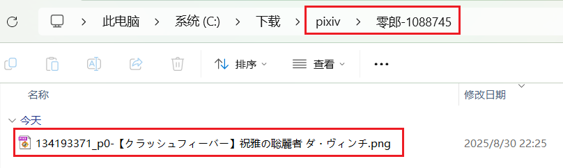
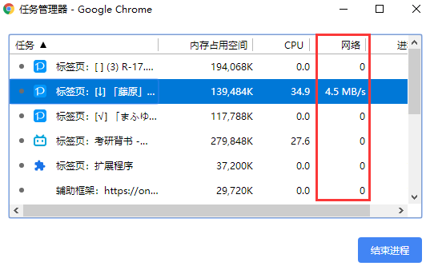
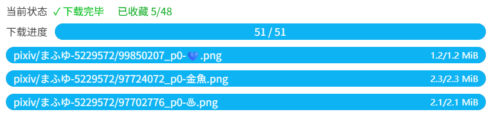

# 设置-下载

## 图像作品的命名规则

<div class="option" data-no="13" style="display: flex;"><button type="button" class="pinButton" data-title="_置顶">📌</button>
      <span class="fileNameRuleLine1">
        <a href="https://xuejianxianzun.github.io/PBDWiki/#/zh-cn/设置-下载?flag=13" target="_blank" class="settingNameStyle" data-xztext="_图像作品的命名规则">图像作品的<span class="key">命名</span>规则</a>
        <span class="fileNameRuleBtnsArea">
          <slot data-name="saveNamingRuleForArtwork"><div class="saveNamingRuleWrap theme-white">
    <button class="nameSave textButton has_tip" type="button" data-xztip="_保存命名规则提示" data-xztext="_保存" data-tip="保存命名规则，最多 20 个">保存</button>
    <button class="nameLoad textButton" type="button" data-xztext="_加载">加载</button>
  </div></slot>
          <button type="button" class="showFileNameTip textButton toggleArea" data-toggle-target="#fileNameTip" data-for-no="13" data-xztext="_提示">提示</button>
          &nbsp;
          <select name="fileNameSelect" class="beautify_scrollbar">
            <option value="default">…</option>
            <option value="{id}">{id}</option>
<option value="{pid}">{pid}</option>
<option value="{p}">{p}</option>
<option value="{user}">{user}</option>
<option value="{user_id}">{user_id}</option>
<option value="{title}">{title}</option>
<option value="{page_title}">{page_title}</option>
<option value="{tags}">{tags}</option>
<option value="{tags_translate}">{tags_translate}</option>
<option value="{tags_transl_only}">{tags_transl_only}</option>
<option value="{page_tag}">{page_tag}</option>
<option value="{type}">{type}</option>
<option value="{type_illust}">{type_illust}</option>
<option value="{type_manga}">{type_manga}</option>
<option value="{type_ugoira}">{type_ugoira}</option>
<option value="{type_novel}">{type_novel}</option>
<option value="{AI}">{AI}</option>
<option value="{age}">{age}</option>
<option value="{age_r}">{age_r}</option>
<option value="{like}">{like}</option>
<option value="{bmk}">{bmk}</option>
<option value="{bmk_1000}">{bmk_1000}</option>
<option value="{bmk_id}">{bmk_id}</option>
<option value="{view}">{view}</option>
<option value="{rank}">{rank}</option>
<option value="{date}">{date}</option>
<option value="{upload_date}">{upload_date}</option>
<option value="{task_date}">{task_date}</option>
<option value="{px}">{px}</option>
<option value="{char_count}">{char_count}</option>
<option value="{series_title}">{series_title}</option>
<option value="{series_order}">{series_order}</option>
<option value="{series_id}">{series_id}</option>
<option value="{sl}">{sl}</option>
<option value="{multi_image_folder}">{multi_image_folder}</option>
<option value="{r18_g_folder}">{r18_g_folder}</option>
<option value="{match_tag_folder1}">{match_tag_folder1}</option>
<option value="{match_tag_folder2}">{match_tag_folder2}</option>
          </select>
        </span>
      </span>
      <textarea class="centerPanelTextArea beautify_scrollbar grow fileNameRule" name="userSetName" rows="1" placeholder="pixiv/{user}-{user_id}/{id}-{title}">pixiv/{user}-{user_id}/{id}-{title}</textarea>
    </div>

这是很重要的功能，你可以在这里设置下载器保存的**文件名**，也可以**建立文件夹**来分类。

下载器在保存文件时会替换命名规则里的标记并生成文件名。例如 `{id}` 会被替换成作品 ID，形式如 `75863159_p0`。

?> 你可以根据需要修改命名规则。只有 `{id}` 是必须的，因为它是每个文件的唯一标记。

**一些功能按钮：**

`保存` 按钮可以保存当前命名规则；`加载` 按钮则会显示保存过的命名规则。使用这两个按钮，你可以保存多个常用的命名标记，并方便的切换。

`提示` 按钮：点击它可以查看所有标记及其说明。不过这里是 Wiki，所以没有效果。

下拉选择框：点击它会显示所有标记，点击一个标记即可把它插入到光标位置。不过这里是 Wiki，所以没有效果。

### 建立文件夹

你可以使用斜线 `/` 建立文件夹。有需要的话，可以使用多个斜线`/` 建立多层文件夹。

默认的命名规则 `pixiv/{user}-{user_id}/{id}-{title}` 会建立两层文件夹：
- 先建立 `pixiv` 文件夹
- 在里面建立用户名和用户 ID 的文件夹
- 在里面保存作品，文件名为作品 ID 和标题。

效果示例：



?>`/` 并不是必须的，如果你不想建立文件夹，也可以不使用 `/`。例如把命名规则设置为 `{id}` 的话，文件会直接保存到浏览器的下载目录里，不会建立子文件夹。

### 附加说明

- 你可以使用多个标记；多个标记之间建议添加分割符号，如 `{id}-{tags}-{user}`，以免多个标记的内容挨在一起，难以分辨。分割符号没有固定要求，随你喜欢就好。
- 除了预设的标记，你也可以输入自定义文字，例如 `标题 {title} 标签 {tags}`。这些非预设标记的文字会原样保留。
- 没有后缀名标记，因为后缀名是下载器自动添加到文件末尾的。
- 如果生成的文件名里含有不能作为文件名的特殊字符，会被替换成近似的全角符号。例如一些标签里含有斜线 `/`，但斜线不能用在文件名里，所以下载器会把它替换成全角的 `／`。
- 如果你使用了 `{tags_translate}`，就没有必要使用 `{tags}`，因为前者包含它。翻译的内容根据你在 pixiv 的语言设置有所不同。例如，如果你的 pixiv 界面是中文的，那么标签的翻译一般也是中文的。
- `{tags_transl_only}` 只保存翻译后的标签，不保存原本的日文标签。但是如果某个标签没有翻译，则会保存原本的日文标签。
- 文件名里必须要含有作品的**唯一标记**，用于防止文件名重复。文件名重复会导致下载的文件互相覆盖，或者出现另存为窗口。
- 默认命名规则里的 `{id}` 就是唯一标记。有些用户可能想去掉 `{id}`，使用 `{pid}` 和 `{p}` 代替。这是可以的，但必须同时使用，也就是同时包含 `{pid}` 和 `{p}`，不能只使用其中一个。这是因为多图作品里有多张图片，它们的 `{pid}` 是相同的，必须加上 `{p}` 才能使它们的名字不同。
- `{bmk_1000}` 不会显示具体的收藏数量，而是以 1000 为计算单位，显示一个整数，并在最后显示一个加号 `+`（1000 以下会显示为 `0+`）。这样可以让收藏数显得不那么杂乱。
- 保存文件时，如果已存在同名文件，下载器会让浏览器覆盖文件，而不是在后面添加序号。PC 上的浏览器都会这样做，但是 Android 上的 Edge canary 不会覆盖旧文件，而是会添加序号。
- 文件名的长度有可能会超出操作系统允许的长度限制。这经常是由于文件名里含有作品的标签导致的，比如 `{tags}`。如果文件名超长，这个文件可能无法自动保存，此时浏览器会弹出另存为对话框，让用户手动操作。如果你遇到了文件名超长的问题，可以启用下载器的“更多”标签页里“命名”分类下的“文件名长度限制”功能。
- 当文件名超长时，浏览器可能会自动截断超出的部分，使文件可以正常保存。但这是分情况的。据我所知，Windows 上的 Chrome 浏览器会这样做，但 Linux 和 Android 上的浏览器可能不会这样做。另外如果你把文件保存到远程位置（如网络驱动器），浏览器可能也不会截断文件名（即便是 Chrome 也会如此）。

### 一些示例

#### 去掉 {id} 里的 p 标记

`{id}` 带有序号，例如 `44920385_p0`。如果你想移除 `_p`，可以把 `{id}` 替换为 `{pid} {p}`，这样生成的字符是 `44920385 0`。

?>注意：如果你想替换 `{id}`，那么命名规则里必须同时含有 `{pid}` 和 `{p}`，这是为了防止文件名重复。

#### 去掉每个作品第一张图片里的序号

如果你觉得第一张图片不需要序号，想把 `44920385_p0` 变成 `44920385`，可以启用 [第一张图不带序号](/zh-cn/设置-更多-命名?id=第一张图不带序号) 的选项。

#### 其他人使用的命名规则

以下是一些用户使用的命名规则，你可以参考：

```
{user}/{title}{id}
{user}/{title}{date}/{id}
{user_id}_{user}/{type}/{date} {title}/{id}
{user_id}-{user}/{title}-{id}
{user} (id={user_id})/{id}
{user} {user_id}/{id} {title} {upload_date}
{user}_{date}_{title}_{id}
{id}_{title}_{user_id}_{user}
{id}{user}-{user_id}-{title}{tags}{tags_translate}{page_tag}-{like}-{bmk}-{upload_date}
```

**注意：**最后一个命名标记不是个好主意，因为它生成的文件名很容易超长（大于 256 个字符），并导致文件名被截断，所以实际的文件名可能只有前半部分。

有些作品的标签列表字数很多，所以在文件名中使用 `{tags}`、`{tags_translate}`、`{tags_transl_only}` 的话可能会导致文件名超长。如果你想使用这些命名标记，建议把它们放在文件名的末尾，以避免其他命名标记的内容被截断。

### 使用命名标记排序

有些命名标记是有规律的，如果把它们设置为文件名的**第一部分**，就可以在资源管理器里按文件名排序。

#### 反映时间顺序的标记

在大部分页面里，作品都是按照作品 ID 倒序排序的。越晚发表的作品，其 ID 越大，并且显示在最前面。

`{id}`（作品 ID）是递增的。在文件名的开头使用 `{id}`，并把文件按照 ID 大小倒序排序，就可以使其与网页上显示的顺序一致。例如：


`{date}`（作品发布时间）也有类似的作用。

--------

`{bmk_id}` 可以反映你收藏作品的时间顺序。把它放在文件名开头，如 `{bmk_id}-{id}`，并按文件名倒序排列，就可以让你文件顺序与你的收藏保持一致。

例如这是网页上的顺序：


这是使用 `{bmk_id}` 排序的效果：


#### 反映数量多少的标记

有些标记是数字，例如 `{like}`、`{view} `、`{bmk}`、`{bmk_1000}`、`{rank}`。

示例：把作品按照 `{bmk}`（收藏数量）顺序倒序排列，可以把高质量作品排在前面：


示例：在排行榜页面里下载时，可以按照 `{rank}` 顺序：


## 小说的命名规则

<div class="option new" data-no="106" style="display: flex;"><button type="button" class="pinButton" data-title="_置顶">📌</button>
      <span class="fileNameRuleLine1">
        <a href="https://xuejianxianzun.github.io/PBDWiki/#/zh-cn/设置-下载?flag=106" target="_blank" class="settingNameStyle" data-xztext="_小说的命名规则">小说的<span class="key">命名</span>规则</a>
        <span class="fileNameRuleBtnsArea">
          <slot data-name="saveNamingRuleForNovel"><div class="saveNamingRuleWrap theme-white">
    <button class="nameSave textButton has_tip" type="button" data-xztip="_保存命名规则提示" data-xztext="_保存" data-tip="保存命名规则，最多 20 个">保存</button>
    <button class="nameLoad textButton" type="button" data-xztext="_加载">加载</button>
  </div></slot>
          <button type="button" class="showFileNameTip textButton toggleArea" data-toggle-target="#fileNameTipForNovel" data-for-no="106" data-xztext="_提示">提示</button>
          &nbsp;
          <select name="fileNameSelectForNovel" class="beautify_scrollbar">
            <option value="default">…</option>
            <option value="{id}">{id}</option>
<option value="{pid}">{pid}</option>
<option value="{p}">{p}</option>
<option value="{user}">{user}</option>
<option value="{user_id}">{user_id}</option>
<option value="{title}">{title}</option>
<option value="{page_title}">{page_title}</option>
<option value="{tags}">{tags}</option>
<option value="{tags_translate}">{tags_translate}</option>
<option value="{tags_transl_only}">{tags_transl_only}</option>
<option value="{page_tag}">{page_tag}</option>
<option value="{type}">{type}</option>
<option value="{type_illust}">{type_illust}</option>
<option value="{type_manga}">{type_manga}</option>
<option value="{type_ugoira}">{type_ugoira}</option>
<option value="{type_novel}">{type_novel}</option>
<option value="{AI}">{AI}</option>
<option value="{age}">{age}</option>
<option value="{age_r}">{age_r}</option>
<option value="{like}">{like}</option>
<option value="{bmk}">{bmk}</option>
<option value="{bmk_1000}">{bmk_1000}</option>
<option value="{bmk_id}">{bmk_id}</option>
<option value="{view}">{view}</option>
<option value="{rank}">{rank}</option>
<option value="{date}">{date}</option>
<option value="{upload_date}">{upload_date}</option>
<option value="{task_date}">{task_date}</option>
<option value="{px}">{px}</option>
<option value="{char_count}">{char_count}</option>
<option value="{series_title}">{series_title}</option>
<option value="{series_order}">{series_order}</option>
<option value="{series_id}">{series_id}</option>
<option value="{sl}">{sl}</option>
<option value="{multi_image_folder}">{multi_image_folder}</option>
<option value="{r18_g_folder}">{r18_g_folder}</option>
<option value="{match_tag_folder1}">{match_tag_folder1}</option>
<option value="{match_tag_folder2}">{match_tag_folder2}</option>
            <option value="{follow_artwork}">{follow_artwork}</option>
          </select>
        </span>
      </span>
      <textarea class="centerPanelTextArea beautify_scrollbar grow fileNameRule" name="userSetNameForNovel" rows="1" placeholder="{follow_artwork}">{follow_artwork}</textarea>
    </div>

小说可以使用的命名标记与图像作品相同，并且有一个特殊的标记：

`{follow_artwork}` 跟随图像作品的命名规则。它也是默认值，表示小说使用与图像作品相同的命名规则。如果你想为小说设置独立的命名规则，可以移除这个标记，并根据自己的需要设置命名规则。

PS：这个设置只影响单篇小说的文件名，不会影响合并系列小说生成的合集文件的文件名。后者有个单独的命名设置。

## 在不同的页面类型中使用不同的命名规则

<p class="option" data-no="50" style="display: flex;">
    <span class="settingNameStyle1" data-xztext="_在不同的页面类型中使用不同的命名规则">在不同的页面类型中使用<span class="key">不同</span>的命名规则</span>
    <input type="checkbox" name="setNameRuleForEachPageType" class="need_beautify checkbox_switch">
    <span class="beautify_switch" tabindex="0"></span>
    </p>

上面的“命名规则”设置是对所有页面生效的，也就是所有页面类型里都会使用同一个命名规则。

如果你想为每个页面设置独立的命名规则，可以启用这个设置。

**应用场景示例：**

- 在用户主页下载时，设置为 `{user}/{id}`，使用用户名建立文件夹。
- 在搜索页面设置为 `{page_tag}/{id}`，使用这个页面的标签建立文件夹。
- 在排行榜页面设置为 `{rank}-{id}`，保存作品在排行榜中的排名。

**注意：**
- 启用这个设置之后，下载器会使用为该页面类型预设的规则覆盖当前命名规则。你可以把它们修改成你需要的规则。

- 启用这个设置之后，如果你在下载时切换了页面类型，可能会导致命名规则发生变化，从而导致文件名或文件夹名也发生变化。这可能不是预期的行为，所以在下载时，不要把当前页面切换到其他页面类型（但可以切换到同一页面类型）。

举个例子，如果你在用户主页下载，就不要使当前页面切换到搜索页面。如果你在作品页面内下载，就不要切换到用户主页或者搜索页面。

## 不创建文件夹

<div class="option new" data-no="64" style="display: flex;">
      <a href="https://xuejianxianzun.github.io/PBDWiki/#/zh-cn/设置-下载?flag=64" target="_blank" class="settingNameStyle">
        <span data-xztext="_不创建文件夹"><span class="key">不创建</span>文件夹</span>
      </a>
      <input type="checkbox" name="noFolderSwitch" class="need_beautify checkbox_switch">
      <span class="beautify_switch" tabindex="0"></span>
      <button type="button" class="gray1 textButton showMsgBtn" data-title="_不创建文件夹" data-msg="_不创建文件夹的帮助内容" data-xztext="_帮助">帮助</button>
      <span class="subOptionWrap noGrow" data-show="noFolderSwitch" style="display: none;">
        <input type="checkbox" name="noFolderWhenDownload1Image" id="noFolderWhenDownload1Image" class="need_beautify checkbox_common" checked="">
        <span class="beautify_checkbox" tabindex="0"></span>
        <label for="noFolderWhenDownload1Image" data-xztext="_从插画漫画里下载1张图片时" class="active">从插画、漫画里下载 1 张图片时</label>
        <input type="checkbox" name="noFolderWhenDownloadMultipleImages" id="noFolderWhenDownloadMultipleImages" class="need_beautify checkbox_common">
        <span class="beautify_checkbox" tabindex="0"></span>
        <label for="noFolderWhenDownloadMultipleImages" data-xztext="_从插画漫画里下载多张图片时">从插画、漫画里下载多张图片时</label>
        <input type="checkbox" name="noFolderWhenUgoira" id="noFolderWhenUgoira" class="need_beautify checkbox_common" checked="">
        <span class="beautify_checkbox" tabindex="0"></span>
        <label for="noFolderWhenUgoira" data-xztext="_动图" class="active">动图</label>
        <input type="checkbox" name="noFolderWhenNovel" id="noFolderWhenNovel" class="need_beautify checkbox_common">
        <span class="beautify_checkbox" tabindex="0"></span>
        <label for="noFolderWhenNovel" data-xztext="_小说">小说</label>
      </span>
    </div>

如果你设置的命名规则会建立文件夹，同时你又希望下载某些文件时不建立文件夹，而是直接保存到下载目录里，可以启用这个设置。

该设置有多个子选项，可以根据作品类型、从作品里下载的图片数量来决定是否不建立文件夹。点击该设置右侧的帮助按钮可以查看详细说明。

## 同时下载数量

<p class="option" data-no="16" style="display: flex;">
    <span class="settingNameStyle1" "="">
    <span data-xztext="_下载线程">同时下载<span class="key">数量</span></span>
    </span>
    <input type="text" name="downloadThread" class="has_tip setinput_style1 blue" data-xztip="_下载线程的说明" value="3" data-tip="你可以输入 1-6 之间的数字，设置同时下载的数量">
    </p>

你可以输入 1-6 之间的数字，设置同时下载的数量。默认值是 3。

**提醒：**

- 同时下载多个文件有助于提高下载速度。
- 如果你下载的速度慢，可以减少同时下载的数量，比如设置为 2。否则可能有一些下载进度超时，导致下载失败。
- 如果你的下载速度比较快，可以增加同时下载的数量。

!>当你下载大量文件时，如果下载速度很快（例如每秒可以下载 5 个文件），建议设置较小的同时下载数量，例如 1。这是因为太过频繁的下载会增加你的账号被封禁的风险。

怎样查看下载速度呢？以 Chrome 浏览器为例，按 `Shift` + `Esc` 键打开它的任务管理器，然后找到进行下载的页面，就可以看到它的下载速度。



如果下载速度达到 1 MB/s，一般就不会出现下载问题了。如果速度比较慢，建议把同时下载的数量设置的小一些。

## 自动开始下载

<div class="option" data-no="17" style="display: flex;"><button type="button" class="pinButton" data-title="_置顶">📌</button>
      <a href="https://xuejianxianzun.github.io/PBDWiki/#/zh-cn/设置-下载?flag=17" target="_blank" class="settingNameStyle">
        <span data-xztext="_自动开始下载"><span class="key">自动</span>开始下载</span>
      </a>
      <input type="checkbox" name="autoStartDownload" class="need_beautify checkbox_switch" checked="">
      <span class="beautify_switch" tabindex="0"></span>
      <button type="button" class="gray1 textButton showMsgBtn" data-title="_自动开始下载" data-msg="_自动开始下载的帮助内容" data-xztext="_帮助">帮助</button>
    </div>

当抓取完成后，可以开始下载时，下载器会自动开始下载。

如果关闭此选项，那么下载器在抓取完成之后不会自动开始下载，而是会显示设置面板。用户需要手动点击“开始下载”按钮才会开始下载。

?>有一种情况**不会**自动开始下载：

当你在**搜索页面**进行抓取，并且启用了 [预览搜索页面的筛选结果](/zh-cn/设置-更多-增强?id=预览搜索页面的筛选结果) 功能（默认启用），那么抓取完成后不会自动开始下载。这是为了让用户能够在抓取完成之后调整抓取结果，满意之后再开始下载。

?>一些**快捷下载**方式总是会自动开始下载（即使你关闭了这个选项），例如：

- 在作品页面里时，点击页面右侧的快速下载按钮
- 点击作品缩略图上的下载按钮
- 点击图片查看器里的下载按钮
- 预览作品时，按快捷键 `C` 或 `D` 下载作品
- 抓取手动选择的作品

## 下载之后收藏作品

<p class="option" data-no="33" style="display: flex;">
    <span class="has_tip settingNameStyle1" data-xztip="_下载之后收藏作品的提示" data-tip="下载文件之后，自动收藏这个作品。">
    <span data-xztext="_下载之后收藏作品">下载之后<span class="key">收藏</span>作品</span>
    <span class="gray1"> ? </span>
    </span>
    <input type="checkbox" name="bmkAfterDL" class="need_beautify checkbox_switch">
    <span class="beautify_switch" tabindex="0"></span>
    </p>

启用这个选项之后，下载器每下载一个文件，就会收藏它所属的作品。

收藏作品的进度会显示在下载进度区域。格式如： `已收藏 1/3`



当你下载完毕之后，如果看到收藏进度的提示里的两个数字是相同的，如 `已收藏 3/3` 就说明收藏完了。如果不相同请等待收藏完毕。

**注意：** 

1. 如果一个作品因为“不下载重复文件”的设置而被跳过下载，那么它依然会被视为下载成功，所以也会进行收藏。
2. 一个作品可能有多个文件，但只会进行一次收藏。如果你看到的收藏数量比文件数量少，这是正常的，因为收藏数量是作品总数，而非文件总数。
3. 当你下载大量文件时，收藏进度可能增加的比较慢。这是因为下载器会每隔几秒收藏一个作品（使用 [减慢抓取速度](/zh-cn/设置-更多-抓取?id=减慢抓取速度) 里的间隔时间，而非快速、连续的收藏作品。这是为了减少触发 429 限制的可能性。

如果你想设置收藏作品时的公开状态，以及是否添加标签，请查看这个设置：[下载器的收藏功能 (✩)](/zh-cn/设置-更多-增强?id=下载器的收藏功能-✩)。

