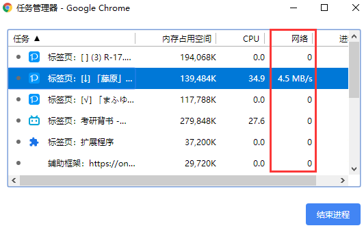
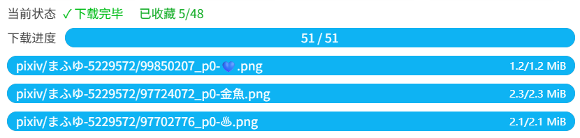

## 同时下载数量

  <a href="http://localhost:3000/#/zh-cn/设置-下载/下载行为?flag=51" target="_blank" class="settingNameStyle" data-bind-click="true">
    同时下载数量
  </a>
  <input type="text" name="downloadThread" class="has_tip setinput_style blue" data-xztip="_下载线程的说明" value="24" data-tip="你可以输入 1-6 之间的数字，设置同时下载的数量">

你可以输入 1-6 之间的数字，设置同时下载的数量。默认值是 3。

**提醒：**

- 同时下载多个文件有助于提高下载速度。
- 如果你下载的速度慢，可以减少同时下载的数量，比如设置为 2。否则可能有一些下载进度超时，导致下载失败。
- 如果你的下载速度比较快，可以增加同时下载的数量。

!>当你下载大量文件时，如果下载速度很快（例如每秒可以下载 5 个文件），建议设置较小的同时下载数量，例如 1。这是因为太过频繁的下载会增加你的账号被封禁的风险。

怎样查看下载速度呢？以 Chrome 浏览器为例，按 `Shift` + `Esc` 键打开它的任务管理器，然后找到进行下载的页面，就可以看到它的下载速度。

如果下载速度达到 1 MB/s，一般就不会出现下载问题了。如果速度比较慢，建议把同时下载的数量设置的小一些。

## 自动开始下载

  <a href="http://localhost:3000/#/zh-cn/设置-下载/下载行为?flag=52" target="_blank" class="settingNameStyle" data-bind-click="true">
    自动开始下载
  </a>
  <input type="checkbox" name="autoStartDownload" class="need_beautify checkbox_switch" checked="">
  
  <button type="button" class="gray1 textButton showMsgBtn" data-title="_自动开始下载" data-msg="_自动开始下载的帮助内容" data-xztext="_帮助">帮助</button>

当抓取完成后，可以开始下载时，下载器会自动开始下载。

如果关闭此选项，那么下载器在抓取完成之后不会自动开始下载，而是会显示设置面板。用户需要手动点击“开始下载”按钮才会开始下载。

?>有一种情况**不会**自动开始下载：

当你在**搜索页面**进行抓取，并且启用了 [预览搜索页面的筛选结果](/zh-cn/设置-更多-增强?id=预览搜索页面的筛选结果) 功能（默认启用），那么抓取完成后不会自动开始下载。这是为了让用户能够在抓取完成之后调整抓取结果，满意之后再开始下载。

?>一些**快捷下载**方式总是会自动开始下载（即使你关闭了这个选项），例如：

- 在作品页面里时，点击页面右侧的快速下载按钮
- 点击作品缩略图上的下载按钮
- 点击图片查看器里的下载按钮
- 预览作品时，按快捷键 `C` 或 `D` 下载作品
- 抓取手动选择的作品

## 下载之后收藏作品

  <a href="http://localhost:3000/#/zh-cn/设置-下载/下载行为?flag=53" target="_blank" class="has_tip settingNameStyle" data-xztip="_下载之后收藏作品的提示" data-tip="下载文件之后，自动收藏这个作品。" data-bind-click="true">
    下载之后收藏作品
     ? 
  </a>
  <input type="checkbox" name="bmkAfterDL" class="need_beautify checkbox_switch">
  

启用这个选项之后，下载器每下载一个文件，就会收藏它所属的作品。

收藏作品的进度会显示在下载进度区域。格式如： `已收藏 1/3`

当你下载完毕之后，如果看到收藏进度的提示里的两个数字是相同的，如 `已收藏 3/3` 就说明收藏完了。如果不相同请等待收藏完毕。

**注意：** 

1. 如果一个作品因为“不下载重复文件”的设置而被跳过下载，那么它依然会被视为下载成功，所以也会进行收藏。
2. 一个作品可能有多个文件，但只会进行一次收藏。如果你看到的收藏数量比文件数量少，这是正常的，因为收藏数量是作品总数，而非文件总数。
3. 当你下载大量文件时，收藏进度可能增加的比较慢。这是因为下载器会每隔几秒收藏一个作品（使用 [减慢抓取速度](/zh-cn/设置-更多-抓取?id=减慢抓取速度) 里的间隔时间，而非快速、连续的收藏作品。这是为了减少触发 429 限制的可能性。

如果你想设置收藏作品时的公开状态，以及是否添加标签，请查看这个设置：[下载器的收藏功能 (✩)](/zh-cn/设置-更多-增强?id=下载器的收藏功能-✩)。

## 点击收藏按钮时下载作品

  <a href="http://localhost:3000/#/zh-cn/设置-下载/下载行为?flag=54" target="_blank" class="settingNameStyle" data-bind-click="true">
    点击收藏按钮时下载作品
  </a>
  <input type="checkbox" name="downloadOnClickBookmark" class="need_beautify checkbox_switch">
  

## 点击点赞按钮时下载作品

  <a href="http://localhost:3000/#/zh-cn/设置-下载/下载行为?flag=55" target="_blank" class="settingNameStyle" data-bind-click="true">
    点击点赞按钮时下载作品
  </a>
  <input type="checkbox" name="downloadOnClickLike" class="need_beautify checkbox_switch">
  

## 下载间隔

  <a href="http://localhost:3000/#/zh-cn/设置-下载/下载行为?flag=56" target="_blank" class="has_tip settingNameStyle" data-xztip="_下载间隔的说明" data-tip="每隔一定时间开始一次下载。&lt;br&gt;
如果把间隔时间设置为 0，下载器就不会添加延迟时间。&lt;br&gt;
如果设置为 1 秒（默认值），那么每小时最多会下载 3600 个抓取结果（不计算附带下载的文件，例如小说的封面图片和内嵌的图片）。&lt;br&gt;
这是因为连续下载很多文件（特别是小说）时，你的 Pixiv 账号可能会被警告或封禁。设置间隔时间可以缓解此问题。&lt;br&gt;" data-bind-click="true">
    下载间隔
     ? 
  </a>
  <input type="checkbox" name="downloadIntervalSwitch" class="need_beautify checkbox_switch">
  
  

    

      当文件数量超过指定数量时启用：
      <input type="text" name="downloadIntervalOnWorksNumber" class="setinput_style blue" value="150">
    

    

      间隔时间：
      <input type="text" name="downloadInterval" class="setinput_style blue" value="0">
      秒
    

  

## 文件下载顺序

  <a href="http://localhost:3000/#/zh-cn/设置-下载/下载行为?flag=57" target="_blank" class="settingNameStyle" data-xztext="_文件下载顺序" data-bind-click="true">文件下载顺序</a>
  <input type="checkbox" name="setFileDownloadOrder" class="need_beautify checkbox_switch">
  
  

    

      排序依据
      <input type="radio" name="downloadOrderSortBy" id="downloadOrderSortBy1" class="need_beautify radio" value="ID" checked="">
      
      <label for="downloadOrderSortBy1" data-xztext="_作品ID" class="active">作品 ID</label>
      <input type="radio" name="downloadOrderSortBy" id="downloadOrderSortBy2" class="need_beautify radio" value="bookmarkCount">
      
      <label for="downloadOrderSortBy2" data-xztext="_收藏数量2">收藏数量</label>
      <input type="radio" name="downloadOrderSortBy" id="downloadOrderSortBy3" class="need_beautify radio" value="bookmarkID">
      
      <label for="downloadOrderSortBy3" data-xztext="_收藏时间">收藏时间</label>
    

    

      排序方式
      <input type="radio" name="downloadOrder" id="downloadOrder1" class="need_beautify radio" value="desc" checked="">
      
      <label for="downloadOrder1" data-xztext="_降序" class="active">降序</label>
      <input type="radio" name="downloadOrder" id="downloadOrder2" class="need_beautify radio" value="asc">
      
      <label for="downloadOrder2" data-xztext="_升序">升序</label>
    

  

## 优先下载动图

  <a href="http://localhost:3000/#/zh-cn/设置-下载/下载行为?flag=58" target="_blank" class="settingNameStyle" data-bind-click="true">
    优先下载动图
  </a>
  <input type="checkbox" name="downloadUgoiraFirst" class="need_beautify checkbox_switch">
  

## 文件体积限制

  <a href="http://localhost:3000/#/zh-cn/设置-下载/下载行为?flag=59" target="_blank" class="has_tip settingNameStyle" data-xztip="_文件体积限制的说明" data-tip="如果一个文件的体积不符合要求，下载器就不会下载它。" data-bind-click="true">
    文件体积限制
     ? 
  </a>
  <input type="checkbox" name="sizeSwitch" class="need_beautify checkbox_switch">
  
  

    <input type="text" name="sizeMin" class="setinput_style blue" value="0">MiB &nbsp;-&nbsp;
    <input type="text" name="sizeMax" class="setinput_style blue" value="100">MiB
  

## 把文件保存到用户上次选择的位置

  <a href="http://localhost:3000/#/zh-cn/设置-下载/下载行为?flag=60" target="_blank" class="has_tip settingNameStyle" data-xztip="_使用前请先查看提示" data-tip="使用前请先查看提示" data-bind-click="true">
    把文件保存到用户上次选择的位置
     ? 
  </a>
  <input type="checkbox" name="rememberTheLastSaveLocation" class="need_beautify checkbox_switch" checked="">
  
  <button type="button" class="gray1 textButton showMsgBtn" data-title="_把文件保存到用户上次选择的位置" data-msg="_把文件保存到用户上次选择的位置的说明" data-xztext="_帮助">帮助</button>

## 下载完成后显示通知

  <a href="http://localhost:3000/#/zh-cn/设置-下载/下载行为?flag=61" target="_blank" class="has_tip settingNameStyle" data-xztip="_下载完成后显示通知的说明" data-tip="当所有文件下载完成后显示一条系统通知。可能会请求通知权限。" data-bind-click="true">
    下载完成后显示通知
     ? 
  </a>
  <input type="checkbox" name="showNotificationAfterDownloadComplete" class="need_beautify checkbox_switch">
  

