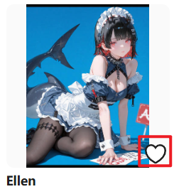
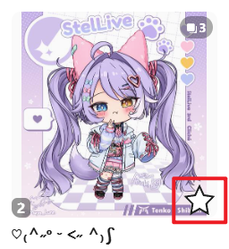
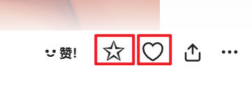
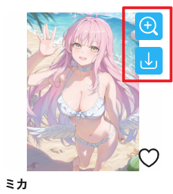
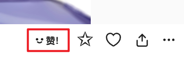
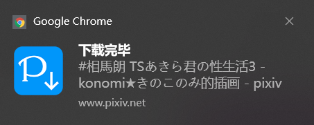
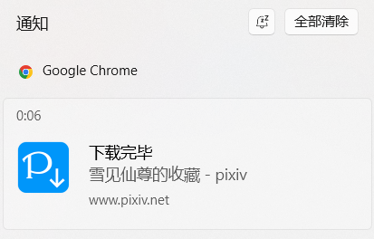

## 同时下载数量

<div class="option settingsPanel_optionCard" data-no="51" data-pin-bound="true" style="display: flex;">
  <a href="http://localhost:3000/#/zh-cn/设置-下载/下载行为?flag=51" target="_blank" class="settingNameStyle" data-bind-click="true">
    <span data-xztext="_同时下载数量">同时下载<span class="key">数量</span></span>
  </a>
  <input type="text" name="downloadThread" class="has_tip setinput_style blue" data-xztip="_下载线程的说明" value="3" data-tip="你可以输入 1-6 之间的数字，设置同时下载的数量">
</div>


你可以输入 1-6 之间的数字，设置同时下载的数量。默认值是 3。

**提醒：**

- 同时下载多个文件有助于提高下载速度。
- 如果你下载的速度慢，可以减少同时下载的数量，比如设置为 2。否则可能有一些下载进度超时，导致下载失败。
- 如果你的下载速度比较快，可以增加同时下载的数量。

!>当你下载大量文件时，如果下载速度很快（例如每秒可以下载 5 个文件），建议设置较小的同时下载数量，例如 1。这是因为太过频繁的下载会增加你的账号被封禁的风险。

怎样查看下载速度呢？以 Chrome 浏览器为例，按 `Shift` + `Esc` 键打开它的任务管理器，然后找到进行下载的页面，就可以看到它的下载速度。


如果下载速度达到 1 MB/s，一般就不会出现下载问题了。如果速度比较慢，建议把同时下载的数量设置的小一些。

## 自动开始下载

<div class="option settingsPanel_optionCard" data-no="52" data-pin-bound="true" style="display: flex;">
  <a href="http://localhost:3000/#/zh-cn/设置-下载/下载行为?flag=52" target="_blank" class="settingNameStyle" data-bind-click="true">
    <span data-xztext="_自动开始下载"><span class="key">自动</span>开始下载</span>
  </a>
  <input type="checkbox" name="autoStartDownload" class="need_beautify checkbox_switch" checked="">
  <span class="beautify_switch" tabindex="0"></span>
  <button type="button" class="gray1 textButton showMsgBtn" data-title="_自动开始下载" data-msg="_自动开始下载的帮助内容" data-xztext="_帮助">帮助</button>
</div>


当抓取完成后，可以开始下载时，下载器会自动开始下载。

如果关闭此选项，那么下载器在抓取完成之后不会自动开始下载，而是会显示设置面板。用户需要手动点击“开始下载”按钮才会开始下载。

?>有一种情况**不会**自动开始下载：

当你在**搜索页面**进行抓取，并且启用了 [预览搜索页面的筛选结果](/zh-cn/设置-更多-增强?id=预览搜索页面的筛选结果) 功能（默认启用），那么抓取完成后不会自动开始下载。这是为了让用户能够在抓取完成之后调整抓取结果，满意之后再开始下载。

?>一些**快捷下载**方式总是会自动开始下载（即使你关闭了这个选项），例如：

- 在作品页面里时，点击页面右侧的快速下载按钮
- 点击作品缩略图上的下载按钮
- 点击图片查看器里的下载按钮
- 预览作品时，按快捷键 `C` 或 `D` 下载作品
- 抓取手动选择的作品

## 下载之后收藏作品

<div class="option settingsPanel_optionCard" data-no="53" data-pin-bound="true" style="display: flex;">
  <a href="http://localhost:3000/#/zh-cn/设置-下载/下载行为?flag=53" target="_blank" class="has_tip settingNameStyle" data-xztip="_下载之后收藏作品的提示" data-tip="下载文件之后，自动收藏这个作品。" data-bind-click="true">
    <span data-xztext="_下载之后收藏作品">下载之后<span class="key">收藏</span>作品</span>
    <span class="gray1"> ? </span>
  </a>
  <input type="checkbox" name="bmkAfterDL" class="need_beautify checkbox_switch">
  <span class="beautify_switch" tabindex="0"></span>
</div>


启用这个选项之后，下载器每下载一个文件，就会收藏它所属的作品。

收藏作品的进度会显示在下载进度区域。格式如： `已收藏 1/3`


当你下载完毕之后，如果看到收藏进度的提示里的两个数字是相同的，如 `已收藏 3/3` 就说明收藏完了。如果不相同请等待收藏完毕。

**注意：** 

1. 如果一个作品因为“不下载重复文件”的设置而被跳过下载，那么它依然会被视为下载成功，所以也会进行收藏。
2. 一个作品可能有多个文件，但只会进行一次收藏。如果你看到的收藏数量比文件数量少，这是正常的，因为收藏数量是作品总数，而非文件总数。
3. 当你下载大量文件时，收藏进度可能增加的比较慢。这是因为下载器会每隔几秒收藏一个作品（使用 [减慢抓取速度](/zh-cn/设置-更多-抓取?id=减慢抓取速度) 里的间隔时间，而非快速、连续的收藏作品。这是为了减少触发 429 限制的可能性。

如果你想设置收藏作品时的公开状态，以及是否添加标签，请查看这个设置：[下载器的收藏功能 (✩)](/zh-cn/设置-更多-增强?id=下载器的收藏功能-✩)。

## 点击收藏按钮时下载作品

<div class="option settingsPanel_optionCard" data-no="54" data-pin-bound="true" style="display: flex;">
  <a href="http://localhost:3000/#/zh-cn/设置-下载/下载行为?flag=54" target="_blank" class="settingNameStyle" data-bind-click="true">
    <span data-xztext="_点击收藏按钮时下载作品">点击<span class="key">收藏</span>按钮时下载作品</span>
  </a>
  <input type="checkbox" name="downloadOnClickBookmark" class="need_beautify checkbox_switch">
  <span class="beautify_switch" tabindex="0"></span>
</div>

启用此功能之后，当你点击作品的收藏按钮时，下载器会自动下载这个作品。

主要有两种使用场景：

1. 点击作品右下角的收藏按钮：

 

2. 在作品页面内点击收藏按钮：



?> 虽然上面的截图是插画，但是该功能对小说作品也有效。

?> 必须**点击收藏按钮**才会触发此功能。下载器提供了一些批量收藏和快捷收藏的功能，但它们不需要点击收藏按钮，也就不会触发此功能。例如预览作品时按 B 可以收藏这个作品，此时不会触发此功能。

!> 在下载器不支持的页面类型里，这个功能不会生效，即使你手动点击收藏按钮也是如此。这是因为此功能需要下载器查找作品缩略图元素，但下载器在一些不常用的页面里不会执行这个动作。

下载器默认提供了这样的功能：



当你处于一个页面里时，把**鼠标放在插画缩略图上时**应该会看到右上角的按钮。

这说明下载器支持这个页面，也可以使用“点击收藏按钮时下载作品”功能。但如果下载器没有显示右上角的按钮，说明不支持该页面，此时也不能使用“点击收藏按钮时下载作品”的功能。

## 点击点赞按钮时下载作品

<div class="option settingsPanel_optionCard" data-no="55" data-pin-bound="true" style="display: flex;">
  <a href="http://localhost:3000/#/zh-cn/设置-下载/下载行为?flag=55" target="_blank" class="settingNameStyle" data-bind-click="true">
    <span data-xztext="_点击点赞按钮时下载作品">点击<span class="key">点赞</span>按钮时下载作品</span>
  </a>
  <input type="checkbox" name="downloadOnClickLike" class="need_beautify checkbox_switch">
  <span class="beautify_switch" tabindex="0"></span>
</div>

启用此功能之后，当你在作品页面里点赞时，下载器会自动下载这个作品。

点赞按钮：



?> 虽然上面的截图是插画，但是该功能对小说作品也有效。

## 下载间隔

<div class="option settingsPanel_optionCard" data-no="56" data-pin-bound="true" style="display: flex;">
  <a href="http://localhost:3000/#/zh-cn/设置-下载/下载行为?flag=56" target="_blank" class="has_tip settingNameStyle" data-xztip="_下载间隔的说明" data-tip="每隔一定时间开始一次下载。&lt;br&gt;
如果把间隔时间设置为 0，下载器就不会添加延迟时间。&lt;br&gt;
如果设置为 1 秒（默认值），那么每小时最多会下载 3600 个抓取结果（不计算附带下载的文件，例如小说的封面图片和内嵌的图片）。&lt;br&gt;
这是因为连续下载很多文件（特别是小说）时，你的 Pixiv 账号可能会被警告或封禁。设置间隔时间可以缓解此问题。&lt;br&gt;" data-bind-click="true">
    <span data-xztext="_下载间隔">下载<span class="key">间隔</span></span>
    <span class="gray1"> ? </span>
  </a>
  <input type="checkbox" name="downloadIntervalSwitch" class="need_beautify checkbox_switch">
  <span class="beautify_switch" tabindex="0"></span>
  <div class="subOptionWrap flexBasis100" data-show="downloadIntervalSwitch" style="display: inline-flex;">
    <div class="optionLine">
      <span data-xztext="_当文件数量大于">当文件数量超过指定数量时启用：</span>
      <input type="text" name="downloadIntervalOnWorksNumber" class="setinput_style blue" value="150">
    </div>
    <div class="optionLine">
      <span data-xztext="_间隔时间">间隔时间：</span>
      <input type="text" name="downloadInterval" class="setinput_style blue" value="1">
      <span data-xztext="_秒">秒</span>
    </div>
  </div>
</div>

你可以设置每隔多少秒允许下载器开始一次下载。

?> 这个设置的目的是在大量下载时可以主动降低下载频率，以减少账号被 pixiv 封禁的可能性。

?> 你可以在下载途中修改此设置（例如修改间隔时间、启用或取消限制），修改会立即生效。

### 当文件数量超过指定数量时启用

如果本次**抓取结果里**的作品数量大于设置值，才会启用此设置。默认值是 `150`。

注意判断的是抓取结果数量，也就是一共需要下载多少个文件，而不是剩余多少个文件。假如抓取到了 150 个文件（符合条件），使此设置生效，那么就会始终保持，即使最后只剩下 1 个文件时，依然是生效的。

### 间隔时间

每当下载器**开始**下载一个文件时，都会设置一个计时器，经过间隔时间之后才会允许下一次下载。

**对工作方式的详细说明：**

- 如果设置为 `0`，下载器就不会添加延迟时间，此时这个设置不会生效。
- 如果设置为 `1` 秒钟（默认值），那么每小时最多会从 Pixiv 下载 3600 个文件。

如果你每天只下载几百个文件，默认的间隔时间通常是安全的。如果你经常下载更多文件，可以加大间隔时间，例如 `2`、`3` 等。设置为 `4` 几乎是绝对安全的，但通常不需要使用这么大的间隔时间。

----------

间隔时间不受下载所需时间的影响：

如果上一个文件花费的时间超过了 1 秒钟，下载器不会等待它，而是在倒计时结束时开始下载下一个文件。也就是可能会同时下载多个文件。

如果一个文件在 1 秒钟之内就下载完了，下载器会继续等待，直到倒计时结束时才会开始下一次下载。当文件的下载用时都很短时，看起来是单线程下载，因为同时只有 1 个文件在下载。

## 文件下载顺序

<div class="option settingsPanel_optionCard" data-no="57" data-pin-bound="true" style="display: flex;">
  <a href="http://localhost:3000/#/zh-cn/设置-下载/下载行为?flag=57" target="_blank" class="settingNameStyle" data-xztext="_文件下载顺序" data-bind-click="true">文件下载<span class="key">顺序</span></a>
  <input type="checkbox" name="setFileDownloadOrder" class="need_beautify checkbox_switch">
  <span class="beautify_switch" tabindex="0"></span>
  <div class="subOptionWrap flexBasis100" data-show="setFileDownloadOrder" style="display: none;">
    <div class="optionLine">
      <span class="settingNameStyle" data-xztext="_排序依据">排序依据</span>
      <input type="radio" name="downloadOrderSortBy" id="downloadOrderSortBy1" class="need_beautify radio" value="ID" checked="">
      <span class="beautify_radio" tabindex="0"></span>
      <label for="downloadOrderSortBy1" data-xztext="_作品ID" class="active">作品 ID</label>
      <input type="radio" name="downloadOrderSortBy" id="downloadOrderSortBy2" class="need_beautify radio" value="bookmarkCount">
      <span class="beautify_radio" tabindex="0"></span>
      <label for="downloadOrderSortBy2" data-xztext="_收藏数量2">收藏数量</label>
      <input type="radio" name="downloadOrderSortBy" id="downloadOrderSortBy3" class="need_beautify radio" value="bookmarkID">
      <span class="beautify_radio" tabindex="0"></span>
      <label for="downloadOrderSortBy3" data-xztext="_收藏时间">收藏时间</label>
    </div>
    <div class="optionLine">
      <span class="settingNameStyle" data-xztext="_排序方式">排序方式</span>
      <input type="radio" name="downloadOrder" id="downloadOrder1" class="need_beautify radio" value="desc" checked="">
      <span class="beautify_radio" tabindex="0"></span>
      <label for="downloadOrder1" data-xztext="_降序" class="active">降序</label>
      <input type="radio" name="downloadOrder" id="downloadOrder2" class="need_beautify radio" value="asc">
      <span class="beautify_radio" tabindex="0"></span>
      <label for="downloadOrder2" data-xztext="_升序">升序</label>
    </div>
  </div>
</div>

有些用户希望下载器按照某种顺序下载文件，这样他们在资源管理器里按照**修改时间**排序时，文件是有规律的。

如果你有需要的话可以启用这个设置，但通常没有必要。我不推荐按照修改时间来对作品排序，因为这个方式并不可靠，特别是有些文件被重复下载时，它的修改时间会刷新，导致排序不再符合预期。

**使用特定命名标记**，并且按照文件名排序可以实现相同的效果，并且更可靠，因为文件名与修改时间无关，在重复下载时不会受影响。

- 如果你想按照 `作品 ID` 排序的话，可以在文件名开头使用 `{id}`。
- 如果你想按照 `收藏数量` 排序的话，可以在文件名开头使用 `{bmk}`。
- 如果你想按照 `收藏时间` 排序的话，可以在文件名开头使用 `{bmk_id}`。

请参考：[使用命名标记排序](/zh-cn/设置-下载?id=使用命名标记排序)。

-----------------

这个设置有 2 个子选项：
1. **排序依据**：指示下载器如何对文件进行排序。
2. **排序方式**：指示下载器如何下载文件。如果设置为 `降序`，下载器会先下载数值大的文件，后下载数值小的文件。`升序` 则相反。

---------

**注意：** 启用此设置可能会增加下载完成所需要的时间。

这是因为当下载器同时下载多个文件时，后面的文件可能比前面的文件更早完成下载。为了保持下载顺序，下载器会让后面的文件等待一段时间。

例如同时下载数量是 5，下载的文件的顺序编号是 1、2、3、4、5，但是 5 可能最先下载完。此时下载器会等待 1、2、3、4 全部下载并保存到硬盘上之后，才会保存 5。这就导致 5 需要等待一段时间，所以这有可能导致下载时间增加。

当下载的文件中有动图时，等待时间很容易进一步增加。假如一个动图下载后开始转换（甚至假设它是第一个，还没下载完，更没有开始转换），此时后面的图片已经下载完了，但是由于动图没转换完，所以后面的图片都要等待这个动图转换完成。也就是说其他文件被这个动图阻塞了。由于动图转换花费的时间可能会比较久，所以等待时间也会更多。

---------

小知识：

在默认情况下，这个设置是没有启用的，此时下载器只会在部分页面类型里对抓取结果排序：

- 在用户主页、关注页面（following）里，下载器会按照作品 ID 倒序排列，这样可以优先下载新发表的作品，后下载旧的作品。
- 在搜索页面里，下载器会按照收藏数量倒序排列。这样可以优先下载收藏数量高的作品。
- 在其他页面里，不会对抓取结果进行排序。

如果你没有启用这个设置，下载器不会保证文件是严格按照顺序保存到硬盘上的，因为每个文件的下载时间可能不一样，这会导致下载顺序发生变化。

## 优先下载动图

<div class="option settingsPanel_optionCard" data-no="58" data-pin-bound="true" style="display: flex;">
  <a href="http://localhost:3000/#/zh-cn/设置-下载/下载行为?flag=58" target="_blank" class="settingNameStyle" data-bind-click="true">
    <span data-xztext="_优先下载动图">优先下载<span class="key">动图</span></span>
  </a>
  <input type="checkbox" name="downloadUgoiraFirst" class="need_beautify checkbox_switch">
  <span class="beautify_switch" tabindex="0"></span>
</div>

如果你启用了这个设置，那么下载器在开始下载之前会对抓取结果进行排序，把动图排到最前面，以优先下载动图。

注意：如果你同时启用了“文件下载顺序”和“优先下载动图”，它们会按顺序生效，所以动图总是会排在最前面。

## 文件体积限制

<div class="option settingsPanel_optionCard" data-no="59" data-pin-bound="true" style="display: flex;">
  <a href="http://localhost:3000/#/zh-cn/设置-下载/下载行为?flag=59" target="_blank" class="has_tip settingNameStyle" data-xztip="_文件体积限制的说明" data-tip="如果一个文件的体积不符合要求，下载器就不会下载它。" data-bind-click="true">
    <span data-xztext="_文件体积限制">文件<span class="key">体积</span>限制</span>
    <span class="gray1"> ? </span>
  </a>
  <input type="checkbox" name="sizeSwitch" class="need_beautify checkbox_switch">
  <span class="beautify_switch" tabindex="0"></span>
  <div class="subOptionWrap" data-show="sizeSwitch" style="display: none;">
    <input type="text" name="sizeMin" class="setinput_style blue" value="0">MiB &nbsp;-&nbsp;
    <input type="text" name="sizeMax" class="setinput_style blue" value="100">MiB
  </div>
</div>

如果你对文件体积有要求，可以设置一个范围。

?>这里可以输入带小数点的数字，例如 `0.5`。

当下载器开始下载一个文件时，能够获取它的体积。如果它不符合你设置的条件，下载器会取消下载它，并显示一条日志：

<span class="log" style="color: rgb(210, 126, 0);"><a href="https://www.pixiv.net/i/133950803#3" target="_blank">133950803_p2</a> 没有被保存，因为它的体积不符合设定。<br></span>

?> 这个检查发生在下载阶段。抓取时不会检查这个设置。

## 把文件保存到用户上次选择的位置

<div class="option settingsPanel_optionCard" data-no="60" data-pin-bound="true" style="display: flex;">
  <a href="http://localhost:3000/#/zh-cn/设置-下载/下载行为?flag=60" target="_blank" class="has_tip settingNameStyle" data-xztip="_使用前请先查看提示" data-tip="使用前请先查看提示" data-bind-click="true">
    <span data-xztext="_把文件保存到用户上次选择的位置">把文件保存到用户上次<span class="key">选择</span>的位置</span>
    <span class="gray1"> ? </span>
  </a>
  <input type="checkbox" name="rememberTheLastSaveLocation" class="need_beautify checkbox_switch">
  <span class="beautify_switch" tabindex="0"></span>
  <button type="button" class="gray1 textButton showMsgBtn" data-title="_把文件保存到用户上次选择的位置" data-msg="_把文件保存到用户上次选择的位置的说明" data-xztext="_帮助">帮助</button>
</div>

这个设置是为喜欢**手动保存文件**的用户设计的，他们喜欢使用“另存为”对话框来保存文件，并希望下载器能记住上次保存的位置。

如果你想使用这个功能，需要注意：

- 要让这个设置正确工作，必须在浏览器的下载设置里启用“每次下载文件时都询问保存位置”，否则浏览器不会显示另存为对话框，并且文件会保存到浏览器设置里的保存位置（而非上次选择的位置）。
- 如果你关闭了浏览器的“每次下载文件时都询问保存位置”设置，那么也应该关闭这个设置。
- 如果你启用了这个设置，下载器不会创建文件夹，只会设置文件名。这是因为实现“记住上次保存位置”的效果需要使用 a 标签的 download 属性来下载文件，此时不能创建文件夹。
- 如果你启用了这个设置，下载器总是默认这个文件下载成功（即使你取消保存这个文件也是如此）。这是为了简化处理。

**技术细节：**

当此设置关闭时（默认），下载器会使用浏览器的 API 来下载文件，例如：

```js
browser.downloads.download({
  url,
  filename,
  conflictAction: 'overwrite',
  saveAs: false,
})
```

下载器设置了 `saveAs: false` 尝试直接保存文件。

如果你在浏览器的下载设置里启用了“每次下载文件时都询问保存位置”，浏览器依然会显示另存为对话框。但此时对话框打开的文件夹总是默认的下载位置，而非你上次手动保存的位置。

如果你启用了这个设置，下载器会使用 a 标签的 download 属性来下载文件，此时另存为对话框打开的是你上次手动保存的位置。代码如下所示：

```js
const a = document.createElement('a')
a.href = url
a.download = fileName
a.click()
```

## 下载完成后显示通知

<div class="option settingsPanel_optionCard" data-no="61" data-pin-bound="true" style="display: flex;">
  <a href="http://localhost:3000/#/zh-cn/设置-下载/下载行为?flag=61" target="_blank" class="has_tip settingNameStyle" data-xztip="_下载完成后显示通知的说明" data-tip="当所有文件下载完成后显示一条系统通知。可能会请求通知权限。" data-bind-click="true">
    <span data-xztext="_下载完成后显示通知">下载完成后显示<span class="key">通知</span></span>
    <span class="gray1"> ? </span>
  </a>
  <input type="checkbox" name="showNotificationAfterDownloadComplete" class="need_beautify checkbox_switch">
  <span class="beautify_switch" tabindex="0"></span>
</div>


如果启用这个选项，下载器会在下载完所有文件后显示一条系统通知（可能会请求通知权限），还可能会有提示音（取决于操作系统设置）。

通知的样式根据操作系统而有所不同。Windows 10 可能会在屏幕右下角显示一条类似这样的通知：



如果你开启了勿扰模式，通知会被收纳进通知中心，此时不会在右下角显示（但可能依然会有提示音）。




