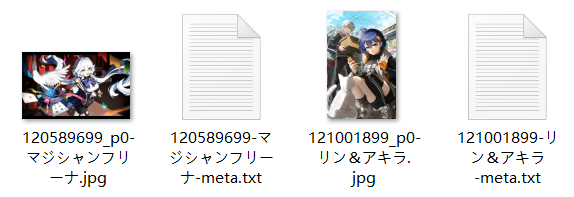
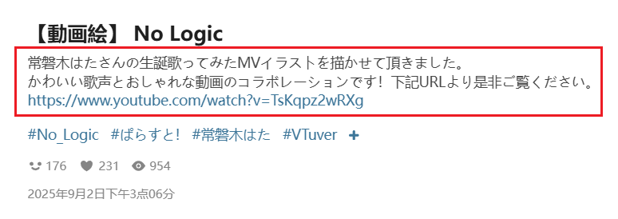
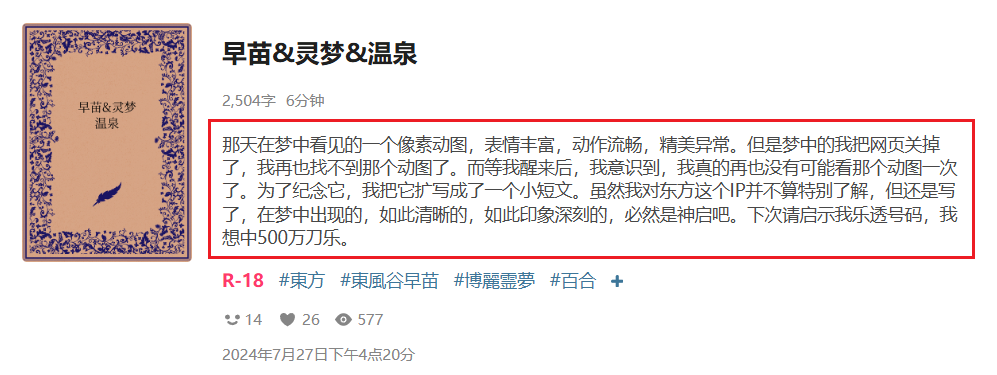
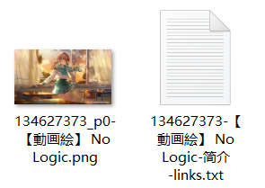

## 保存作品的元数据

<div class="option settingsPanel_optionCard" data-no="73" data-pin-bound="true" style="display: flex;">
  <a href="http://localhost:3000/#/zh-cn/设置-下载/元数据?flag=73" target="_blank" class="has_tip settingNameStyle" data-xztip="_保存作品的元数据说明" data-tip="下载器可以为每个作品生成一个同名文件（但扩展名不同），保存它的元数据。&lt;br&gt;
你可以选择为哪些类型的作品生成元数据文件，并且可以选择 TXT 格式或（和）JSON 格式。&lt;br&gt;
TXT 格式易于阅读，但只包含比较常用的数据。&lt;br&gt;
JSON 格式是下载器的内部数据，保存了更多的数据。" data-bind-click="true">
    <span data-xztext="_保存作品的元数据">保存作品的<span class="key">元数据</span></span>
    <span class="gray1"> ? </span>
  </a>
  <div class="optionLine">
    <span class="mb4" data-xztext="_作品类型带冒号">作品类型：</span>
    <input type="checkbox" name="saveMetaType0" id="setSaveMetaType0" class="need_beautify checkbox_common">
    <span class="beautify_checkbox" tabindex="0"></span>
    <label for="setSaveMetaType0" data-xztext="_插画">插画</label>
    <input type="checkbox" name="saveMetaType1" id="setSaveMetaType1" class="need_beautify checkbox_common">
    <span class="beautify_checkbox" tabindex="0"></span>
    <label for="setSaveMetaType1" data-xztext="_漫画">漫画</label>
    <input type="checkbox" name="saveMetaType2" id="setSaveMetaType2" class="need_beautify checkbox_common">
    <span class="beautify_checkbox" tabindex="0"></span>
    <label for="setSaveMetaType2" data-xztext="_动图">动图</label>
    <input type="checkbox" name="saveMetaType3" id="setSaveMetaType3" class="need_beautify checkbox_common">
    <span class="beautify_checkbox" tabindex="0"></span>
    <label for="setSaveMetaType3" data-xztext="_小说">小说</label>
  </div>
  <div class="optionLine">
    <span class="mb4" data-xztext="_文件格式">文件格式：</span>
    <input type="checkbox" name="saveMetaFormatTXT" id="saveMetaFormatTXT" class="need_beautify checkbox_common" checked="">
    <span class="beautify_checkbox" tabindex="0"></span>
    <label for="saveMetaFormatTXT" class="active"> TXT </label>
    <input type="checkbox" name="saveMetaFormatJSON" id="saveMetaFormatJSON" class="need_beautify checkbox_common" checked="">
    <span class="beautify_checkbox" tabindex="0"></span>
    <label for="saveMetaFormatJSON"> JSON </label>
  </div>
</div>

下载器在下载时，可以为每个作品生成一个文件来保存它的一些数据。

示例：



?> 元数据的文件名的末尾有 `meta` 标记。

### 作品类型

分为`插画`、`漫画`、`动图`、`小说`。

如果下载的文件类型符合你勾选的类型，下载器才会为它创建元数据文件。

?> 小说作品有一个单独的设置用于保存元数据：[在小说里保存元数据](/zh-cn/设置-更多-下载?id=在小说里保存元数据)，它会在小说的开头保存一些元数据，无须创建单独的 TXT 文件，使用起来更方便。但是它所保存的元数据比较少。如果你已经启用了“在小说里保存元数据”，通常就不需要在这里为小说保存元数据文件。

### 文件格式

有两种格式可以选择，并且可以都选中：
- `TXT` 格式易于阅读，但只包含比较常用的数据。
- `JSON` 格式是下载器的内部数据，保留了更多的数据。

#### TXT 格式

对于图像作品（插画、漫画、动图），下载器保存的元数据示例如下：

```
ID
120589699

URL
https://www.pixiv.net/i/120589699

Original
https://i.pximg.net/img-original/img/2024/07/16/19/51/00/120589699_p0.jpg

Thumbnail
https://i.pximg.net/c/250x250_80_a2/custom-thumb/img/2024/07/16/19/51/00/120589699_p0_custom1200.jpg

xRestrict
AllAges

AI
No

User
愛田乃彩

UserID
91879154

Title
マジシャンフリーナ

Description
(Twitter) https://twitter.com/aida_noa_
無断転載・使用禁止/All rights reserved.

Tags
#原神
#GenshinImpact
#フリーナ
#Furina
#女の子
#イラスト

Size
4096 x 2537

Bookmark
814

Date
2024-07-16T10:51:00+00:00
```

小说的 TXT 元数据文件里的内容大致相同，但是没有 `Original` 和 `Size`。此外，小说的 `Thumbnail` 就是它的封面图片的 URL。

#### JSON 格式

JSON 文件的内容是下载器的内部数据（即该作品的抓取结果）。如果你想知道各个属性的含义，可以查看源代码里的注释（只有中文）：[StoreType.d.ts](https://github.com/xuejianxianzun/PixivBatchDownloader/blob/master/src/ts/store/StoreType.d.ts)。

JSON 格式的元数据文件内容示例如下：

```json
{
  "aiType": 1,
  "idNum": 120589699,
  "id": "120589699_p0",
  "original": "https://i.pximg.net/img-original/img/2024/07/16/19/51/00/120589699_p0.jpg",
  "thumb": "https://i.pximg.net/c/250x250_80_a2/custom-thumb/img/2024/07/16/19/51/00/120589699_p0_custom1200.jpg",
  "regular": "https://i.pximg.net/img-master/img/2024/07/16/19/51/00/120589699_p0_master1200.jpg",
  "small": "https://i.pximg.net/c/540x540_70/img-master/img/2024/07/16/19/51/00/120589699_p0_master1200.jpg",
  "title": "マジシャンフリーナ",
  "description": "(Twitter) <strong><a href=\"https://twitter.com/aida_noa_\" target=\"_blank\">twitter/aida_noa_</a></strong><br />無断転載・使用禁止/All rights reserved.",
  "pageCount": 1,
  "index": 0,
  "tags": [
    "原神",
    "GenshinImpact",
    "フリーナ",
    "Furina",
    "女の子",
    "イラスト"
  ],
  "tagsWithTransl": [
    "原神",
    "GenshinImpact",
    "フリーナ",
    "Furina",
    "女の子",
    "イラスト",
    "芙宁娜",
    "女孩子",
    "插画"
  ],
  "tagsTranslOnly": [
    "原神",
    "GenshinImpact",
    "芙宁娜",
    "Furina",
    "女孩子",
    "插画"
  ],
  "user": "愛田乃彩",
  "userId": "91879154",
  "fullWidth": 4096,
  "fullHeight": 2537,
  "ext": "jpg",
  "bmk": 868,
  "bookmarked": false,
  "bmkId": "",
  "date": "2024-07-16T10:51:00+00:00",
  "uploadDate": "2024-07-16T10:51:00+00:00",
  "type": 0,
  "rank": null,
  "ugoiraInfo": null,
  "seriesTitle": "",
  "seriesOrder": null,
  "seriesId": null,
  "novelMeta": null,
  "likeCount": 452,
  "viewCount": 4703,
  "commentCount": 3,
  "xRestrict": 0,
  "sl": 2
}
```

## 保存作品简介

<div class="option settingsPanel_optionCard" data-no="74" data-pin-bound="true" style="display: flex;">
  <a href="http://localhost:3000/#/zh-cn/设置-下载/元数据?flag=74" target="_blank" class="has_tip settingNameStyle" data-xztip="_保存作品简介的说明" data-tip="生成 TXT 文件保存作品简介" data-bind-click="true">
    <span data-xztext="_保存作品的简介">保存作品<span class="key">简介</span></span>
    <span class="gray1"> ? </span>
  </a>
  <input type="checkbox" name="saveWorkDescription" class="need_beautify checkbox_switch">
  <span class="beautify_switch" tabindex="0"></span>
  <div class="subOptionWrap flexBasis100" data-show="saveWorkDescription" style="display: none;">
    <div class="optionLine">
      <label for="saveEachDescription" data-xztext="_每个作品分别保存" class="has_tip active" data-xztip="_简介的Links标记" data-tip="把每个作品的简介保存到单独的 TXT 文件里。&lt;br&gt;如果作品简介里含有超链接，下载器会在文件名末尾添加 'links' 标记">每个作品分别保存</label>
      <span class="gray1"> ? &nbsp;</span>
      <input type="checkbox" name="saveEachDescription" id="saveEachDescription" class="need_beautify checkbox_switch">
      <span class="beautify_switch" tabindex="0"></span>
    </div>
    <div class="optionLine">
      <label for="summarizeDescription" data-xztext="_汇总到一个文件">汇总到一个文件</label>
      <input type="checkbox" name="summarizeDescription" id="summarizeDescription" class="need_beautify checkbox_switch">
      <span class="beautify_switch" tabindex="0"></span>
    </div>
  </div>
</div>

如果你启用了这个功能，下载器会为每个作品创建一个 TXT 文件，保存它的简介。

作品的简介指标题下面的介绍文字。例如：





下载器保存的 TXT 简介文件：



TXT 简介文件的文件名里可能有 2 个标记：
1. 必定有`简介`标记。这个标记由下载器的语言设置决定，例如使用英语时，该标记是 `description`。
2. 如果简介里含有网址链接，下载器会添加 `links` 标记。

?>有些作品没有简介，此时下载器不会为其创建 TXT 简介文件。

这个设置有两个子选项，并且可以同时启用：

### 每个作品分别保存

为每个作品创建一个 TXT 简介文件。当你下载多个作品时，下载器会生成多个简介文件。

### 汇总到一个文件

当抓取完成时，下载器会生成一个 TXT 文件，汇总所有作品的简介。

这个文件的**保存位置**有两种情况：

1. 如果汇总文件里的简介数据来自多个不同用户的作品，它会直接保存到浏览器的下载目录里。因为此时它不属于某一个用户，不应该将其放入用户名的文件夹里。

2. 如果简介数据来自同一个用户：
- 如果命名规则里的某个文件夹里含有 `{user}`，下载器会把汇总文件保存到这个文件夹里。对于默认的命名规则，下载器会将其保存到 `pixiv/{user}-{user_id}/` 里。
- 如果命名规则里的文件夹都不包含 `{user}`，下载器会将其直接保存到浏览器的下载目录里。

汇总文件的**文件名**包含多个部分：
1. `简介汇总` 标记，会根据下载器的语言而变化。
2. `user` 标记，附带用户名。只有当汇总文件里的数据全部来自同一个用户时才有这个标记。
3. 当前网页标题
4. 时间和日期

例如：

```
简介汇总-user 飞天卷饼猫-#女の子 星极（重制版） - 飞天卷饼猫的插画 - pixiv-2025／9／2 22：47：38.txt
```

