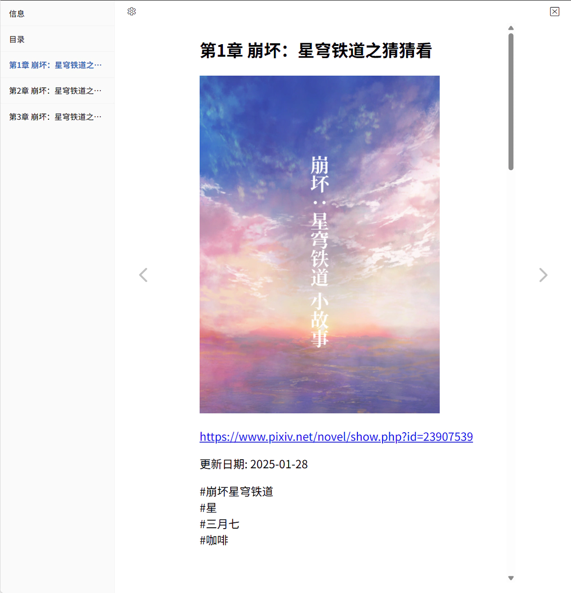
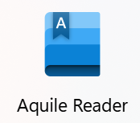
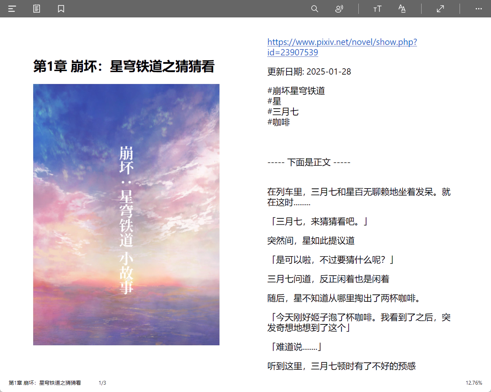
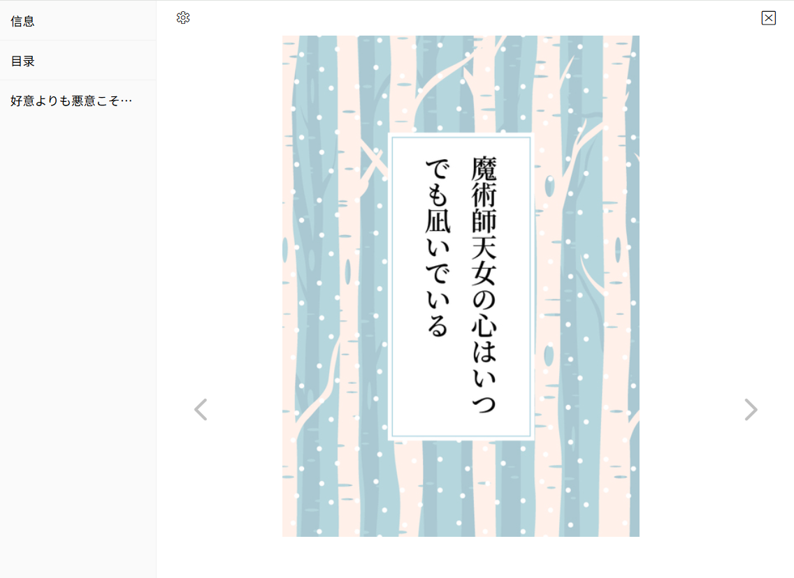
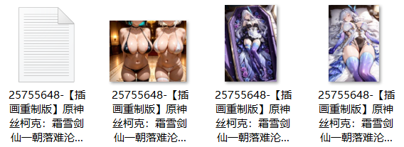
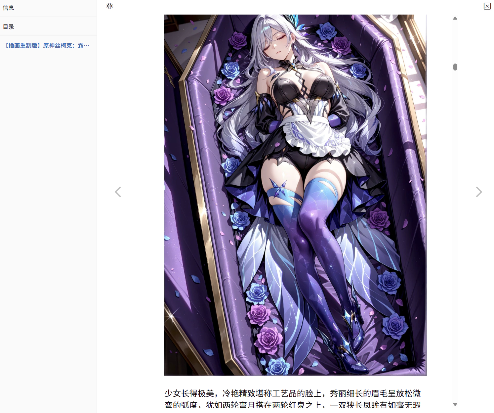

## 小说保存格式

<div class="option settingsPanel_optionCard" data-no="67" data-pin-bound="true" style="display: flex;">
  <a href="http://localhost:3000/#/zh-cn/设置-下载/小说?flag=67" target="_blank" class="has_tip settingNameStyle" data-xztip="_小说保存格式的说明" data-tip="TXT 是纯文本文件。选择 TXT 格式时，小说里的图片会单独保存。&lt;br&gt;EPUB 是电子书格式，小说里的图片会内嵌到 EPUB 文件里。" data-bind-click="true">
    <span data-xztext="_小说保存格式"><span class="key">小说</span>保存格式</span>
    <span class="gray1"> ? </span>
  </a>
  <input type="radio" name="novelSaveAs" id="novelSaveAs2" class="need_beautify radio" value="epub" checked="">
  <span class="beautify_radio" tabindex="0"></span>
  <label for="novelSaveAs2"> EPUB </label>
  <input type="radio" name="novelSaveAs" id="novelSaveAs1" class="need_beautify radio" value="txt">
  <span class="beautify_radio" tabindex="0"></span>
  <label for="novelSaveAs1" class="active"> TXT </label>
</div>

你可以选择把小说保存为 TXT 或者 EPUB 格式。默认格式是 EPUB。

EPUB 是电子书的格式，可以显示富文本样式，支持章节目录，并且可以在内部保存封面图片和插图。

?> 下载器生成的 EPUB 文件是 EPUB `2.0` 标准。有些软件不能正确打开它，例如 WPS。请使用小说阅读器打开。

PS：相比 EPUB 格式，TXT 格式存在一些缺点：
- TXT 文件的内容是纯文字，不能显示富文本样式（例如文字样式、超链接等）。
- TXT 文件里没有统一的标题级别标记，当含有多篇小说（即多个章节）时，很多阅读器都不能正确识别章节格式。
- TXT 文件无法保存小说里的插画，所以只能把图片保存成单独的文件。有时一个 TXT 文件可能有十几个相关图片，非常杂乱。

### 一些阅读器

**在线阅读**：https://epub-reader.online/



**Windows**：Aquile Reader



你可以从 Microsoft Store 安装它。



**Android**：（静读天下）Moon+ Reader


## 在小说里保存元数据

<div class="option settingsPanel_optionCard" data-no="68" data-pin-bound="true" style="display: flex;">
  <a href="http://localhost:3000/#/zh-cn/设置-下载/小说?flag=68" target="_blank" class="has_tip settingNameStyle" data-xztip="_在小说里保存元数据提示" data-tip="把小说的标题、作者、标签等信息保存到小说开头。" data-bind-click="true">
    <span data-xztext="_在小说里保存元数据">在小说里保存<span class="key">元数据</span></span>
    <span class="gray1"> ? </span>
  </a>
  <input type="checkbox" name="saveNovelMeta" class="need_beautify checkbox_switch">
  <span class="beautify_switch" tabindex="0"></span>
</div>

如果你启用了这个选项，本程序会在小说内容的开头保存以下信息：

- 小说标题
- 作者名字
- 小说网址
- 小说简介
- 小说标签

例如：

```
好意よりも悪意こそが信用の証である

切由

https://www.pixiv.net/novel/show.php?id=25731985

2025-08-28

土井先生追い討ちのターンです。胃薬もらいに行きましょうね。

#RKRN夢
#忍玉-夢
#rkrn夢
#RKRNプラス
#久々知兵助
#土井半助
#中在家長次
#SAN値チェックのお時間です
#逆方向の信用…
```

?> 不管小说保存成 TXT 还是 EPUB 格式，都会应用这个设置。

## 下载小说的封面图片

<div class="option settingsPanel_optionCard" data-no="69" data-pin-bound="true" style="display: flex;">
  <a href="http://localhost:3000/#/zh-cn/设置-下载/小说?flag=69" target="_blank" class="settingNameStyle" data-xztext="_下载小说的封面图片" data-bind-click="true">下载小说的<span class="key">封面</span>图片</a>
  <input type="checkbox" name="downloadNovelCoverImage" class="need_beautify checkbox_switch" checked="">
  <span class="beautify_switch" tabindex="0"></span>
</div>

下载器会单独保存小说的封面图片，其文件名和小说的文件名一致，以便排列在一起。

示例：


如果你不想保存封面图片，可以关闭这个选项。

如果你把小说保存为 EPUB 格式，下载器还会为其添加内嵌的封面图片，例如：



目前不管你是否启用这个选项，下载器都始终会添加内嵌的封面。以后我打算让内嵌的封面也遵从这个设置，也就是如果你关闭了这个选项，下载器就不会添加内嵌的封面。

## 下载小说里的内嵌图片

<div class="option settingsPanel_optionCard" data-no="70" data-pin-bound="true" style="display: flex;">
  <a href="http://localhost:3000/#/zh-cn/设置-下载/小说?flag=70" target="_blank" class="settingNameStyle" data-xztext="_下载小说里的内嵌图片" data-bind-click="true">下载小说里的<span class="key">内嵌</span>图片</a>
  <input type="checkbox" name="downloadNovelEmbeddedImage" class="need_beautify checkbox_switch" checked="">
  <span class="beautify_switch" tabindex="0"></span>
</div>

有些小说的正文里插入了图片（主要是 R-18 小说），这就是内嵌图片。

下载器默认会保存内嵌的图片。根据小说保存格式的不同，会有一些区别。

当小说保存为 TXT 时，图片会单独保存，其文件名和小说的文件名一致。例如：



当小说保存为 EPUB 时，图片不会单独保存，而是保存在 EPUB 里面。例如：



!> 对于体积比较大的 PNG 格式内嵌图片，有些小说阅读器可能只会显示一部分。这是阅读器的问题，和下载器无关。

## 自动合并系列小说

<div class="option settingsPanel_optionCard" data-no="71" data-pin-bound="true" style="display: flex;">
  <a href="http://localhost:3000/#/zh-cn/设置-下载/小说?flag=71" target="_blank" class="has_tip settingNameStyle" data-xztip="_自动合并系列小说的说明" data-tip="抓取作品时，如果一个小说属于某个系列，就自动抓取这个系列里的所有小说并且合并。" data-bind-click="true">
    <span data-xztext="_自动合并系列小说">自动<span class="key">合并</span>系列小说</span>
    <span class="gray1"> ? </span>
  </a>
  <input type="checkbox" name="autoMergeNovel" class="need_beautify checkbox_switch">
  <span class="beautify_switch" tabindex="0"></span>
  <div class="subOptionWrap" data-show="autoMergeNovel" style="display: none;">
    <label for="skipNovelsInSeriesWhenAutoMerge" data-xztext="_不再单独下载系列里的小说" class="has_tip active" data-xztip="_不再单独下载系列里的小说的说明" data-tip="当你启用了“自动合并系列小说”时，通常没有必要单独下载系列里的小说，因为它们已经包含在合并后的小说文件里了。&lt;br&gt;如果你仍然想下载它们，可以取消选择这个子设置项。">不再单独下载系列里的小说</label>
    <span class="gray1"> ? &nbsp;</span>
    <input type="checkbox" name="skipNovelsInSeriesWhenAutoMerge" id="skipNovelsInSeriesWhenAutoMerge" class="need_beautify checkbox_switch" checked="">
    <span class="beautify_switch" tabindex="0"></span>
  </div>
</div>

抓取作品时，如果一个小说属于某个系列，下载器可以自动抓取这个系列里的所有小说并且合并。

该功能默认未启用，你可以在需要时自行启用。

-----------

子选项：

### 不再单独下载系列里的小说

该选项默认启用。

该选项生效的前提是你已经启用了“自动合并系列小说”功能。

在一次抓取里，如果一个小说属于一个系列，下载器会合并它所在的系列，并且不再单独下载这个小说，因为它们已经包含在合并后的小说文件里了。

该功能可能会导致抓取结果变少。例如：在 30 个小说里，有 20 个小说属于系列，其余 10 个小说是单独的，那么最后只有 10 个抓取结果。

如果你仍然想单独下载这些小说，可以把这个子选项改成未启用。

-----------

下面是对“自动合并系列小说”功能的一些详细说明，并假设你已经启用了该功能。

### 详细说明

**建议使用 EPUB 格式：**

在合并系列小说时，一个文件里会含有多篇小说（多个章节），但很多阅读器无法识别 TXT 里的章节标记，所以我强烈建议你使用 EPUB 格式。

**工作时机：**

虽然这个设置属于“下载”分类，但它实际上是在抓取阶段工作的。

在抓取作品时，如果某个小说属于一个系列，下载器就会自动开始合并这个系列小说。原本的抓取进度会暂停，直到这个系列小说合并完成。也就是说，抓取作品和合并小说会交替进行，而不是同时进行。这是为了避免同时发送太多请求。

**增加请求数量：**

使用此功能时，下载器可能会额外抓取一些小说，导致请求数量增加。

例如：一开始有 30 篇小说，它们属于 10 个系列，而这 10 个系列里一共有 100 篇小说，那么下载器就需要抓取系列里的 100 篇小说。

**关联性：**

当你搜索某个标签并合并系列小说时，需要知道的一点是：系列里的一些小说可能并不属于当前标签，也就是关联性不强。

例如：当我搜索“ブルーアーカイブ”时，有一个系列含有 411 篇小说，但其中只有 89 篇含有“ブルーアーカイブ”：
https://www.pixiv.net/novel/series/1368392

**可能会重复下载：**

在合并系列小说时，下载器不会检查它是否下载过。也就是说它不受“不下载重复文件”功能的影响。在两次抓取中，如果含有同一个系列小说，它就会被合并和下载两次。

**单次抓取里不会重复合并：**

在同一次抓取任务里，每个系列只会被合并一次。例如：如果有 10 篇小说属于同一个系列，下载器只会合并一次，而非 10 次。

**分割大文件：**

有些系列小说里可能含有大量的插画，导致体积很大。当小说的保存格式是 EPUB 时，下载器会把体积很大的小说分割成多个部分，生成多个 EPUB 文件，每个文件的体积通常会比 200 MB 大一些。

### 间隔时间

由于每个系列里都可能含有多篇小说，每个小说又有封面图和（或）插画，所以下载器可能会发送很多请求。

为了避免触发 Pixiv 的警告，下载器在合并小说时**总是**会添加间隔时间，以降低发送请求的频率。即使你没有启用“减慢抓取速度”或“下载间隔”设置，下载器也依然会在执行此功能时添加间隔时间。

**详细说明：**
- 在抓取小说的数据时，下载器默认使用 `2400` ms 的间隔时间。这是最小值。如果你在“减慢抓取速度”里设置的“间隔时间”大于这个值，下载器会使用你设置的间隔时间。
- 在下载小说的图片时，下载器默认使用 `2000` ms 的间隔时间。这是最小值。如果你在“下载间隔”里设置的“间隔时间”大于这个值，下载器会使用你设置的间隔时间。

现在的间隔时间是我经过几次大量抓取的测试才确定下来的。如果你不经常抓取大量小说，通常没有必要使用更大的间隔时间。如果你在使用此功能时担心被 Pixiv 警告，可以在上面提到的两个设置里加大间隔时间，例如设置为 `3000` ms 或 `3` 秒，任务完成后再改回去。

### 一些测试数据

在制作这个功能的过程中，我进行了几次大量抓取的测试，每次抓取 900 个或更多小说（最多的一次是 3000 个）。按照平均数据来看，如果每次抓取 1000 个小说，当抓取完毕时，一些数据如下：
- 有 50% - 60% 的小说属于系列小说
- 有 150 - 200 个系列小说
- 大概会发送 7000 - 10000 个请求。这些请求主要有：获取系列资料、设定资料、小说的数据；下载小说的封面图、下载小说里的插画。

上面的数据量比较少，仅作参考，有大致的概念就行。

由于请求数量太多，我被 Pixiv 警告了几次，有一个账号还被封禁了。所以我逐渐加大了间隔时间，以降低被警告的可能性。

## 合并系列小说时的分割阈值

<div class="option settingsPanel_optionCard new" data-no="72" data-pin-bound="true" style="display: flex;">
  <a href="http://localhost:3000/#/zh-cn/设置-下载/小说?flag=72" target="_blank" class="settingNameStyle" data-bind-click="true">
    <span data-xztext="_合并系列小说时的分割阈值">合并系列小说时的<span class="key">分割</span>阈值</span>
  </a>
  <input type="text" name="singleEPUBFileSizeLimit" class="setinput_style blue" value="200">
  <span>MiB</span>
  <button type="button" class="gray1 textButton showMsgBtn" data-title="_合并系列小说时的分割阈值" data-msg="_合并系列小说时的分割阈值的帮助" data-xztext="_帮助">帮助</button>
<span class="settingsPanel_newBadge" aria-hidden="true">
    <svg class="icon settingsPanel_newBadgeIcon" aria-hidden="true">
      <use xlink:href="#new"></use>
    </svg>
    </span></div>


有些系列小说里的图片非常多，甚至可能会超过 4 GB。如果单个 EPUB 文件的体积太大，可能会导致下载失败，而且一些阅读器也可能无法打开它。所以下载器在合并系列小说时会使用这个设置来分割文件。

如果分割阈值设置为 200 MB，那么下载器在合并总体积为 1 GB 的系列小说时，会把它分割成 5 - 6 个文件。

**提示：**
- 这个设置只在合并系列小说时生效。如果小说是单独下载的，就不会被分割。
- 最小值是 100 MiB，最大值是 1000 MiB（不建议）。
- 下载器在分割 EPUB 文件时不会截断章节内容。实际上下载器在每次添加一个章节之后才会检查体积是否达到阈值，所以分割时这个章节必然是完整的。
