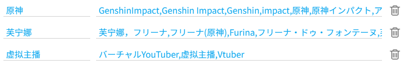
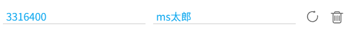

## 标签别名

  <a href="/#/zh-cn/设置-命名/别名?flag=44" target="_blank" class="settingNameStyle" data-bind-click="true">
    标签别名
  </a>
  <label for="useTagAliasForTagsNamingRule" data-xztext="_应用到文件名里的tags系列标记">应用到文件名里的 {tags} 系列标记</label>
  <input type="checkbox" name="useTagAliasForTagsNamingRule" id="useTagAliasForTagsNamingRule" class="need_beautify checkbox_switch">
  
  <button type="button" class="gray1 textButton showMsgBtn" data-title="_标签别名" data-msg="_标签别名的帮助" data-xztext="_帮助">帮助</button>
  <slot data-name="setTagAliasSlot">
    
    0
      <button type="button" class="textButton expand" data-xztext="_收起">收起</button>
      <button type="button" class="textButton showAdd" data-xztext="_添加">添加</button>
    
    

      

        

          别名
          <input type="text" class="setinput_style blue addUidInput w100">
        

        

          标签列表
          <input type="text" class="setinput_style blue addNameInput w100" placeholder="tag1,tag2,tag3">
        

        

          <button type="button" class="textButton add" data-xztitle="_添加" title="添加">
            <svg class="icon" aria-hidden="true">
              <use xlink:href="#yes_submit"></use>
            </svg>
          </button>
          <button type="button" class="textButton cancel" data-xztitle="_取消" title="取消">
            <svg class="icon" aria-hidden="true">
              <use xlink:href="#close_cancel"></use>
            </svg>
          </button>
        

      

    

    

  </slot>

如果一个标签有多种变体，你可以为它们设置一个自定义的别名，示例：

这个别名可以用于“使用第一个匹配的标签建立文件夹”和命名规则里的 `{tags}` 系列标签里。

该设置右侧有个帮助按钮，点击它可以查看具体使用说明（在 Wiki 里点击没有效果）。

## 自定义用户名

  <a href="/#/zh-cn/设置-命名/别名?flag=45" target="_blank" class="has_tip settingNameStyle" data-xztip="_自定义用户名的说明" data-tip="有些用户可能会改名，如果你想使用他原来的名字，你可以在这里手动设置他的名字。&lt;br&gt;
    你也可以为用户设置别名。&lt;br&gt;
    当你在命名规则中使用 {user} 标记时，下载器会优先使用你设置的名字。" data-bind-click="true">
    自定义用户名
     ? 
  </a>
  <slot data-name="setUserNameSlot">
    
    0
      <button type="button" class="textButton expand" data-xztext="_收起">收起</button>
      <button type="button" class="textButton showAdd" data-xztext="_添加">添加</button>
    
    

      

        

          用户 ID（数字）
          <input type="text" class="setinput_style blue addUidInput" data-xzplaceholder="_必须是数字" placeholder="必须是数字">
        

        

          用户名字
          <input type="text" class="setinput_style blue addNameInput">
        

        

          <button type="button" class="textButton add" data-xztitle="_添加" title="添加">
            <svg class="icon" aria-hidden="true">
              <use xlink:href="#yes_submit"></use>
            </svg>
          </button>
          <button type="button" class="textButton cancel" data-xztitle="_取消" title="取消">
            <svg class="icon" aria-hidden="true">
              <use xlink:href="#close_cancel"></use>
            </svg>
          </button>
        

      

    

    

  </slot>

你可以在这里添加用户的 ID，并为其设置一个名字。这会影响 `{user}` 命名标记。

例如 https://www.pixiv.net/users/3316400 的用户名是 `MだSたろう`，如果我想为他设置一个自定义名字，可以输入用户 ID 为 `3316400`，用户名为自定义的 `ms太郎`，然后保存。

当我下载他的作品时，`{user}` 会忽略他原本的名字，输出我设置的名字 `ms太郎`。

当你添加一条规则之后，下载器会这样显示：

如果有需要，你可以在这里修改设置（例如修改用户名），然后点击右侧的刷新按钮来更新这条规则。你也可以删除这条规则。

-----------

**使用场景 1：**防止用户改名。

有些用户可能会经常改名，如果你想使用他原来的名字，可以在这里手动设置他的名字。

常见的情况是用户名后面有 @ 符号，例如：

- Anmi@画集発売中
- 奥馬@skeb募集中
- さしみなす@依頼募集中

虽然前面的 [移除用户名中的 @ 和后续字符](/zh-cn/设置-更多-命名?id=移除用户名中的-和后续字符) 功能可以解决此问题，但是有些用户的名字里可能不使用 @，例如：

- いの字/inoji
- 焔すばる★２日目 東C17a
- 送り萬都 🔞仕事募集中
- しりー＊C99木曜東A21b
- ショーンC99木東ユ40b
- オムレットマト西ぬ31b

你可以在这里为他们设置一个固定的名字。

-----------

**使用场景 2：**为用户设置别名，也就是昵称。

例如一个用户的名字是日语，但我不会输入日语，不方便在本机上搜索。如果我为他设置一个中文别名（或者我能够使用的其他语言），就可以方便的搜索了。

如果一个用户的名字很难记住，你也可以为他设置一个容易记住的别名。

