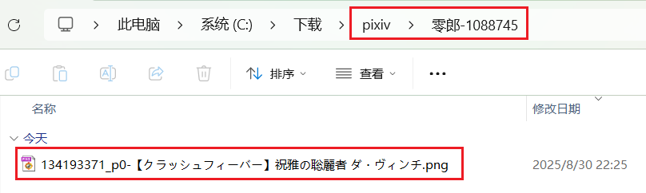
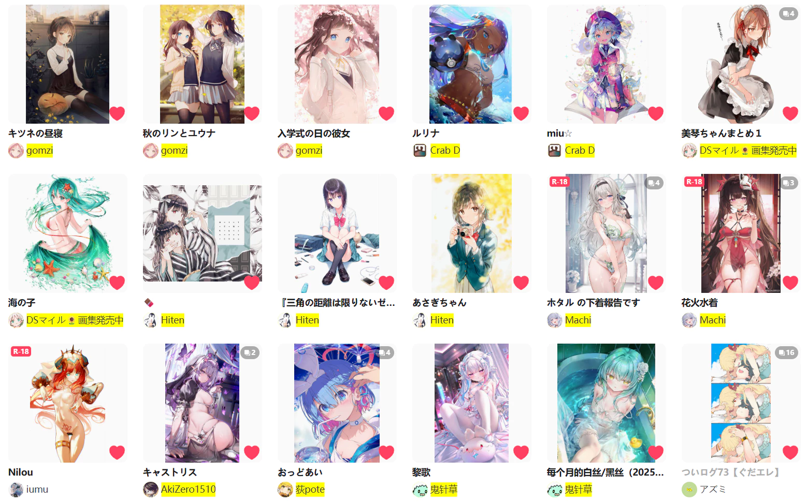
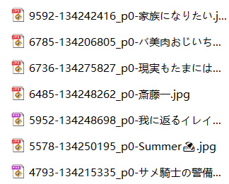
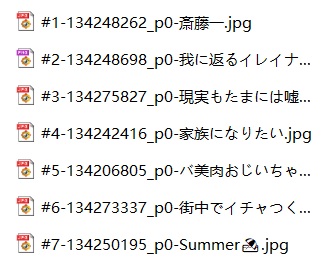

## 图像作品的命名规则

<div class="option settingsPanel_optionCard" data-no="32" data-pin-bound="true" style="display: flex;">
  <span class="fileNameRuleLine1">
    <a href="http://localhost:3000/#/zh-cn/设置-命名/文件夹和文件的名字?flag=32" target="_blank" class="settingNameStyle optionName" data-xztext="_图像作品的命名规则" data-bind-click="true">图像作品的<span class="key">命名</span>规则</a>
    <span class="fileNameRuleBtnsArea">
      <slot data-name="saveNamingRuleForArtwork"><div class="saveNamingRuleWrap theme-white">
    <button class="nameSave textButton has_tip" type="button" data-xztip="_保存命名规则提示" data-xztext="_保存" data-tip="保存命名规则，最多 20 个">保存</button>
    <button class="nameLoad textButton" type="button" data-xztext="_加载">加载</button>
  </div></slot>
      <button type="button" class="showFileNameTip textButton toggleArea" data-toggle-target="#fileNameTip" data-for-no="32" data-xztext="_提示">提示</button>
      &nbsp;
      <select name="fileNameSelect" class="beautify_scrollbar">
        <option value="default">…</option>
        <option value="{id}">{id}</option>
<option value="{pid}">{pid}</option>
<option value="{p}">{p}</option>
<option value="{user}">{user}</option>
<option value="{user_id}">{user_id}</option>
<option value="{title}">{title}</option>
<option value="{page_title}">{page_title}</option>
<option value="{tags}">{tags}</option>
<option value="{tags_translate}">{tags_translate}</option>
<option value="{tags_transl_only}">{tags_transl_only}</option>
<option value="{page_tag}">{page_tag}</option>
<option value="{type}">{type}</option>
<option value="{type_illust}">{type_illust}</option>
<option value="{type_manga}">{type_manga}</option>
<option value="{type_ugoira}">{type_ugoira}</option>
<option value="{type_novel}">{type_novel}</option>
<option value="{AI}">{AI}</option>
<option value="{age}">{age}</option>
<option value="{age_r}">{age_r}</option>
<option value="{like}">{like}</option>
<option value="{bmk}">{bmk}</option>
<option value="{bmk_1000}">{bmk_1000}</option>
<option value="{bmk_id}">{bmk_id}</option>
<option value="{view}">{view}</option>
<option value="{rank}">{rank}</option>
<option value="{date}">{date}</option>
<option value="{upload_date}">{upload_date}</option>
<option value="{task_date}">{task_date}</option>
<option value="{px}">{px}</option>
<option value="{char_count}">{char_count}</option>
<option value="{series_title}">{series_title}</option>
<option value="{series_order}">{series_order}</option>
<option value="{series_id}">{series_id}</option>
<option value="{sl}">{sl}</option>
<option value="{multi_image_folder}">{multi_image_folder}</option>
<option value="{r18_g_folder}">{r18_g_folder}</option>
<option value="{match_tag_folder1}">{match_tag_folder1}</option>
<option value="{match_tag_folder2}">{match_tag_folder2}</option>
      </select>
    </span>
  </span>
  <ul class="namingRuleList artwork"><li>
      <span class="rule">pixiv/{user}-{user_id}/{id}-{title}</span>
      <button class="delete textButton" type="button" data-index="0">×</button>
    </li><li>
      <span class="rule">pixiv/书签-{task_date}/{bmk_id}-{id}-{title}</span>
      <button class="delete textButton" type="button" data-index="1">×</button>
    </li></ul>
  <textarea class="centerPanelTextArea beautify_scrollbar grow fileNameRule" name="userSetName" rows="1" placeholder="pixiv/{user}-{user_id}/{id}-{title}">pixiv/{user}-{user_id}/{id}-{title}</textarea>
  <p class="tip fileNameTip namingTipArea" id="fileNameTip">
    <span data-xztext="_命名标记的提示">命名规则用来设置文件夹和文件的名字。一个命名规则可以由 3 部分组成：<br>
- 特殊标记，例如 <span class="blue name" data-bind-copy="true">{id}</span>、<span class="blue name" data-bind-copy="true">{user}</span>、<span class="blue name" data-bind-copy="true">{title}</span> 等，每个标记都可能会输出一些字符。标记的含义在下面有说明。<br>
- 斜线 <span class="blue name" data-bind-copy="true">/</span> 用来建立文件夹。每个斜线前面的内容都是文件夹的名字，最后一个斜线之后的部分是文件名。你可以添加多层文件夹，也可以自由的组织文件夹结构。<br>
- 普通字符和符号。你可以在标记之间添加普通字符，例如 <span class="blue">pixiv/{id}-title {title}-user {user}</span><br>
<br>
建立文件夹的说明：<br>
- 如果你想为每个作品建立一层文件夹，可以在文件名前面添加一层文件夹。使用作品 ID <span class="blue name" data-bind-copy="true">{pid}</span> 作为文件夹名字是一个通用的选择，例如 <span class="blue">pixiv/{user}/{pid}/{id}</span>。当然你也可以根据自己的需要使用对应的标记。<br>
- 如果你想把 AI 生成的作品放到单独的文件夹里，可以使用 <span class="blue name" data-bind-copy="true">{AI}</span> 标记，例如：<span class="blue">pixiv/{user}/{AI}/{id}</span><br>
- 如果你想根据作品类型建立文件夹，可以使用 <span class="blue name" data-bind-copy="true">{type}</span> 标记，例如：<span class="blue">pixiv/{user}/{type}/{id}</span><br>
<br>
提示：<br>
- * 有些标记并不总是可用，有时它们会是空字符串，下载器会忽略它们。<br>
-  如果你想在文件夹里使用作品的 id，应该使用 <span class="blue name" data-bind-copy="true">{pid}</span> 而不是 <span class="blue name" data-bind-copy="true">{id}</span>。因为每张图片的 id 都不一样，使用 <span class="blue name" data-bind-copy="true">{id}</span> 会导致每张图片都产生一个文件夹。<br>
- 为了防止文件名重复，文件名里必须含有 <span class="blue name" data-bind-copy="true">{id}</span>。如果你不想使用 <span class="blue name" data-bind-copy="true">{id}</span>，就必须同时包含 <span class="blue name" data-bind-copy="true">{pid}</span> 和 <span class="blue name" data-bind-copy="true">{p}</span>。<br>
<br>
命名标记列表：<br>
提示：点击标记的名字就可以复制它。<br></span>
    <span class="blue name" data-bind-copy="true">{id}</span>
      <span data-xztext="_命名标记id">每个文件的 ID。图片文件会附带序号，如 <span class="blue">85633671_p0</span>；小说文件没有序号。注意：这不是作品 ID，而是文件 ID。如果一个作品里含有多张图片，每张图片的 {id} 都是不同的，例如 <span class="blue">85633671_p1</span>、<span class="blue">85633671_p2</span>。</span>
      <br>
<span class="blue name" data-bind-copy="true">{pid}</span>
      <span data-xztext="_命名标记pid">作品的数字 ID，不包括序号，例如 <span class="blue">85633671</span>。</span>
      <br>
* <span class="blue name" data-bind-copy="true">{p}</span>
      <span data-xztext="_命名标记p">图片在作品内的序号，例如 <span class="blue">0</span>、<span class="blue">1</span>、<span class="blue">2</span> …… 每个作品都会重新计数。小说作品没有这个属性，下载器会忽略它。</span>
      <br>
<span class="blue name" data-bind-copy="true">{user}</span>
      <span data-xztext="_命名标记user">用户名字</span>
      <br>
<span class="blue name" data-bind-copy="true">{user_id}</span>
      <span data-xztext="_用户id">用户 ID（数字）</span>
      <br>
<span class="blue name" data-bind-copy="true">{title}</span>
      <span data-xztext="_命名标记title">作品标题</span>
      <br>
<span class="blue name" data-bind-copy="true">{page_title}</span>
      <span data-xztext="_命名标记page_title">开始抓取时的页面标题</span>
      <br>
<span class="blue name" data-bind-copy="true">{tags}</span>
      <span data-xztext="_命名标记tags">作品的标签列表</span>
      <br>
<span class="blue name" data-bind-copy="true">{tags_translate}</span>
      <span data-xztext="_命名标记tags_trans">作品的标签列表，没有附带翻译后的标签</span>
      <br>
<span class="blue name" data-bind-copy="true">{tags_transl_only}</span>
      <span data-xztext="_命名标记tags_transl_only">翻译后的标签列表</span>
      <br>
* <span class="blue name" data-bind-copy="true">{page_tag}</span>
      <span data-xztext="_文件夹标记page_tag">如果页面里的作品属于同一个标签，下载器会输出这个标签，否则忽略它。通常当你处于这些页面里时有值：搜索某个标签、在用户主页里查看某个标签分类下的作品、在自己的收藏里查看某个标签分类下的作品。</span>
      <br>
<span class="blue name" data-bind-copy="true">{type}</span>
      <span data-xztext="_命名标记type">输出作品类型。插画输出 <span class="blue">Illustration</span>, 漫画输出 <span class="blue">Manga</span>, 动图输出 <span class="blue">Ugoira</span>, 小说输出 <span class="blue">Novel</span>。</span>
      <br>
* <span class="blue name" data-bind-copy="true">{type_illust}</span>
      <span data-xztext="_命名标记type_illust">仅当作品是插画时，输出 <span class="blue">Illustration</span>。</span>
      <br>
* <span class="blue name" data-bind-copy="true">{type_manga}</span>
      <span data-xztext="_命名标记type_manga">仅当作品是漫画时，输出 <span class="blue">Manga</span>。</span>
      <br>
* <span class="blue name" data-bind-copy="true">{type_ugoira}</span>
      <span data-xztext="_命名标记type_ugoira">仅当作品是动图时，输出 <span class="blue">Ugoira</span>。</span>
      <br>
* <span class="blue name" data-bind-copy="true">{type_novel}</span>
      <span data-xztext="_命名标记type_novel">仅当作品是小说时，输出 <span class="blue">Novel</span>。</span>
      <br>
* <span class="blue name" data-bind-copy="true">{AI}</span>
      <span data-xztext="_命名标记AI">如果作品是由 AI 生成的，则输出 <span class="blue">AI</span>，否则忽略它。</span>
      <br>
<span class="blue name" data-bind-copy="true">{age}</span>
      <span data-xztext="_命名标记age">作品的年龄限制，分为：<span class="blue">All Ages</span>、<span class="blue">R-18</span>、<span class="blue">R-18G</span></span>
      <br>
* <span class="blue name" data-bind-copy="true">{age_r}</span>
      <span data-xztext="_命名标记age_r">仅当作品为限制级时，输出它的年龄限制，分为：<span class="blue">R-18</span>、<span class="blue">R-18G</span>，否则忽略它。</span>
      <br>
<span class="blue name" data-bind-copy="true">{like}</span>
      <span data-xztext="_命名标记like">Like count，作品的点赞数。</span>
      <br>
<span class="blue name" data-bind-copy="true">{bmk}</span>
      <span data-xztext="_命名标记bmk">Bookmark count，作品的收藏数。把它放在最前面可以让文件按收藏数排序。</span>
      <br>
<span class="blue name" data-bind-copy="true">{bmk_1000}</span>
      <span data-xztext="_命名标记bmk_1000">作品收藏数的简化显示。例如：<span class="blue">0+</span>、<span class="blue">1000+</span>、<span class="blue">2000+</span>、<span class="blue">3000+</span> ……</span>
      <br>
<span class="blue name" data-bind-copy="true">{bmk_id}</span>
      <span data-xztext="_命名标记bmk_id">Bookmark ID。你收藏的每一个作品都会有一个 Bookmark ID。收藏的时间越晚，Bookmark ID 就越大。当你下载你的收藏时，可以使用 {bmk_id} 作为排序依据。</span>
      <br>
<span class="blue name" data-bind-copy="true">{view}</span>
      <span data-xztext="_命名标记view">View count，作品的浏览量。</span>
      <br>
* <span class="blue name" data-bind-copy="true">{rank}</span>
      <span data-xztext="_命名标记rank">作品在排行榜中的排名。如 <span class="blue">#1</span>、<span class="blue">#2</span> …… 只能在排行榜页面中使用，在其他页面里会被忽略。</span>
      <br>
<span class="blue name" data-bind-copy="true">{date}</span>
      <span data-xztext="_命名标记date">作品的创建时间。如 <span class="blue">2019-08-29</span>。</span>
      <br>
<span class="blue name" data-bind-copy="true">{upload_date}</span>
      <span data-xztext="_命名标记upload_date">作品内容最后一次被修改的时间。如 <span class="blue">2019-08-30</span>。</span>
      <br>
<span class="blue name" data-bind-copy="true">{task_date}</span>
      <span data-xztext="_命名标记taskDate">本次任务抓取完成时的时间。例如：<span class="blue">2020-10-21</span>。</span>
      <br>
* <span class="blue name" data-bind-copy="true">{px}</span>
      <span data-xztext="_命名标记px">原图的宽度和高度。例如：<span class="blue">600x900</span>。小说作品没有这个属性，下载器会忽略它。</span>
      <br>
* <span class="blue name" data-bind-copy="true">{char_count}</span>
      <span data-xztext="_命名标记char_count">小说的字数或单词数（取决于小说的语言），是数字。当作品不是小说时会被忽略。</span>
      <br>
* <span class="blue name" data-bind-copy="true">{series_title}</span>
      <span data-xztext="_命名标记seriesTitle">系列标题。当作品属于一个系列时可用。</span>
      <br>
* <span class="blue name" data-bind-copy="true">{series_order}</span>
      <span data-xztext="_命名标记seriesOrder">作品在系列中的序号，如 <span class="blue">#1</span> <span class="blue">#2</span>。 当作品属于一个系列时可用。</span>
      <br>
* <span class="blue name" data-bind-copy="true">{series_id}</span>
      <span data-xztext="_命名标记seriesId">系列 ID，是数字。当作品属于一个系列时可用。</span>
      <br>
* <span class="blue name" data-bind-copy="true">{sl}</span>
      <span data-xztext="_命名标记_sl">图像作品的 sanity_level 属性，值是以下数字之一：<span class="blue">0</span>、<span class="blue">2</span>、<span class="blue">4</span>、<span class="blue">6</span>。小说作品没有这个属性，会忽略这个标记。</span>
      <br>
* <span class="blue name" data-bind-copy="true">{multi_image_folder}</span>
      <span data-xztext="_命名标记_multi_image_folder">它代表“为多图作品添加一层文件夹”里设置的文件夹规则。如果你启用了这个设置，那么下载器在为多图作品创建文件名时，会把它替换为你设置的文件夹规则。非多图作品会忽略这个标记。</span>
      <br>
* <span class="blue name" data-bind-copy="true">{r18_g_folder}</span>
      <span data-xztext="_命名标记_r18_g_folder">它代表“为 R-18(G) 作品添加一层文件夹”里设置的文件夹规则。如果你启用了这个设置，下载器在为 R-18(G) 作品生成文件名时，会把它替换为你设置的文件夹规则。非 R-18(G) 作品会忽略这个标记。</span>
      <br>
* <span class="blue name" data-bind-copy="true">{match_tag_folder1}</span>
      <span data-xztext="_命名标记_match_tag_folder1">它是"使用第一个匹配的标签建立文件夹"里第一个标签列表的匹配结果。如果你启用了这个设置，并且匹配到了你设置的标签，它就会输出这个标签；否则会被忽略。</span>
      <br>
* <span class="blue name" data-bind-copy="true">{match_tag_folder2}</span>
      <span data-xztext="_命名标记_match_tag_folder2">它是"使用第一个匹配的标签建立文件夹"里第二个标签列表的匹配结果。如果你启用了这个设置，并且匹配到了你设置的标签，它就会输出这个标签；否则会被忽略。</span>
      <br>
  </p>
</div>


这是很重要的功能，你可以在这里设置下载器保存的**文件名**，也可以**建立文件夹**来分类。

下载器在保存文件时会替换命名规则里的标记并生成文件名。例如 `{id}` 会被替换成作品 ID，形式如 `75863159_p0`。

?> 你可以根据需要修改命名规则。只有 `{id}` 是必须的，因为它是每个文件的唯一标记。

**一些功能按钮：**

`保存` 按钮可以保存当前命名规则；`加载` 按钮则会显示保存过的命名规则。使用这两个按钮，你可以保存多个常用的命名标记，并方便的切换。

`提示` 按钮：点击它可以查看所有标记及其说明。不过这里是 Wiki，所以没有效果。

下拉选择框：点击它会显示所有标记，点击一个标记即可把它插入到光标位置。不过这里是 Wiki，所以没有效果。

### 建立文件夹

你可以使用斜线 `/` 建立文件夹。有需要的话，可以使用多个斜线`/` 建立多层文件夹。

默认的命名规则 `pixiv/{user}-{user_id}/{id}-{title}` 会建立两层文件夹：
- 先建立 `pixiv` 文件夹
- 在里面建立用户名和用户 ID 的文件夹
- 在里面保存作品，文件名为作品 ID 和标题。

效果示例：



?>`/` 并不是必须的，如果你不想建立文件夹，也可以不使用 `/`。例如把命名规则设置为 `{id}` 的话，文件会直接保存到浏览器的下载目录里，不会建立子文件夹。

### 附加说明

- 你可以使用多个标记；多个标记之间建议添加分割符号，如 `{id}-{tags}-{user}`，以免多个标记的内容挨在一起，难以分辨。分割符号没有固定要求，随你喜欢就好。
- 除了预设的标记，你也可以输入自定义文字，例如 `标题 {title} 标签 {tags}`。这些非预设标记的文字会原样保留。
- 没有后缀名标记，因为后缀名是下载器自动添加到文件末尾的。
- 如果生成的文件名里含有不能作为文件名的特殊字符，会被替换成近似的全角符号。例如一些标签里含有斜线 `/`，但斜线不能用在文件名里，所以下载器会把它替换成全角的 `／`。
- 如果你使用了 `{tags_translate}`，就没有必要使用 `{tags}`，因为前者包含它。翻译的内容根据你在 pixiv 的语言设置有所不同。例如，如果你的 pixiv 界面是中文的，那么标签的翻译一般也是中文的。
- `{tags_transl_only}` 只保存翻译后的标签，不保存原本的日文标签。但是如果某个标签没有翻译，则会保存原本的日文标签。
- 文件名里必须要含有作品的**唯一标记**，用于防止文件名重复。文件名重复会导致下载的文件互相覆盖，或者出现另存为窗口。
- 默认命名规则里的 `{id}` 就是唯一标记。有些用户可能想去掉 `{id}`，使用 `{pid}` 和 `{p}` 代替。这是可以的，但必须同时使用，也就是同时包含 `{pid}` 和 `{p}`，不能只使用其中一个。这是因为多图作品里有多张图片，它们的 `{pid}` 是相同的，必须加上 `{p}` 才能使它们的名字不同。
- `{bmk_1000}` 不会显示具体的收藏数量，而是以 1000 为计算单位，显示一个整数，并在最后显示一个加号 `+`（1000 以下会显示为 `0+`）。这样可以让收藏数显得不那么杂乱。
- 保存文件时，如果已存在同名文件，下载器会让浏览器覆盖文件，而不是在后面添加序号。PC 上的浏览器都会这样做，但是 Android 上的 Edge canary 不会覆盖旧文件，而是会添加序号。
- 文件名的长度有可能会超出操作系统允许的长度限制。这经常是由于文件名里含有作品的标签导致的，比如 `{tags}`。如果文件名超长，这个文件可能无法自动保存，此时浏览器会弹出另存为对话框，让用户手动操作。如果你遇到了文件名超长的问题，可以启用下载器的“更多”标签页里“命名”分类下的“文件名长度限制”功能。
- 当文件名超长时，浏览器可能会自动截断超出的部分，使文件可以正常保存。但这是分情况的。据我所知，Windows 上的 Chrome 浏览器会这样做，但 Linux 和 Android 上的浏览器可能不会这样做。另外如果你把文件保存到远程位置（如网络驱动器），浏览器可能也不会截断文件名（即便是 Chrome 也会如此）。

### 一些示例

#### 去掉 {id} 里的 p 标记

`{id}` 带有序号，例如 `44920385_p0`。如果你想移除 `_p`，可以把 `{id}` 替换为 `{pid} {p}`，这样生成的字符是 `44920385 0`。

?>注意：如果你想替换 `{id}`，那么命名规则里必须同时含有 `{pid}` 和 `{p}`，这是为了防止文件名重复。

#### 去掉每个作品第一张图片里的序号

如果你觉得第一张图片不需要序号，想把 `44920385_p0` 变成 `44920385`，可以启用 [第一张图不带序号](/zh-cn/设置-更多-命名?id=第一张图不带序号) 的选项。

#### 其他人使用的命名规则

以下是一些用户使用的命名规则，你可以参考：

```
{user}/{title}{id}
{user}/{title}{date}/{id}
{user_id}_{user}/{type}/{date} {title}/{id}
{user_id}-{user}/{title}-{id}
{user} (id={user_id})/{id}
{user} {user_id}/{id} {title} {upload_date}
{user}_{date}_{title}_{id}
{id}_{title}_{user_id}_{user}
{id}{user}-{user_id}-{title}{tags}{tags_translate}{page_tag}-{like}-{bmk}-{upload_date}
```

**注意：**最后一个命名规则不是个好主意，因为它生成的文件名很容易超长（大于 256 个字符），并导致文件名被截断，所以实际的文件名可能只有前半部分。

有些作品的标签列表字数很多，所以在文件名中使用 `{tags}`、`{tags_translate}`、`{tags_transl_only}` 的话可能会导致文件名超长。如果你想使用这些命名标记，建议把它们放在文件名的末尾，以避免其他命名标记的内容被截断。

### 使用命名标记排序

有些命名标记是有规律的，如果把它们设置为文件名的**第一部分**，就可以在资源管理器里按文件名排序。

#### 反映时间顺序的标记

在大部分页面里，作品都是按照作品 ID 倒序排序的。越晚发表的作品，其 ID 越大，并且显示在最前面。

`{id}`（作品 ID）是递增的。在文件名的开头使用 `{id}`，并把文件按照 ID 大小倒序排序，就可以使其与网页上显示的顺序一致。例如：


`{date}`（作品发布时间）也有类似的作用。

--------

`{bmk_id}` 可以反映你收藏作品的时间顺序。把它放在文件名开头，如 `{bmk_id}-{id}`，并按文件名倒序排列，就可以让你文件顺序与你的收藏保持一致。

例如这是网页上的顺序：



这是使用 `{bmk_id}` 排序的效果：


#### 反映数量多少的标记

有些标记是数字，例如 `{like}`、`{view} `、`{bmk}`、`{bmk_1000}`、`{rank}`。

示例：把作品按照 `{bmk}`（收藏数量）顺序倒序排列，可以把高质量作品排在前面：



示例：在排行榜页面里下载时，可以按照 `{rank}` 顺序：



## 小说的命名规则

<div class="option settingsPanel_optionCard new" data-no="33" data-pin-bound="true" style="display: flex;">
  <span class="fileNameRuleLine1">
    <a href="http://localhost:3000/#/zh-cn/设置-命名/文件夹和文件的名字?flag=33" target="_blank" class="settingNameStyle optionName" data-xztext="_小说的命名规则" data-bind-click="true">小说的<span class="key">命名</span>规则</a>
    <span class="fileNameRuleBtnsArea">
      <slot data-name="saveNamingRuleForNovel"><div class="saveNamingRuleWrap theme-white">
    <button class="nameSave textButton has_tip" type="button" data-xztip="_保存命名规则提示" data-xztext="_保存" data-tip="保存命名规则，最多 20 个">保存</button>
    <button class="nameLoad textButton" type="button" data-xztext="_加载">加载</button>
  </div></slot>
      <button type="button" class="showFileNameTip textButton toggleArea" data-toggle-target="#fileNameTipForNovel" data-for-no="33" data-xztext="_提示">提示</button>
      &nbsp;
      <select name="fileNameSelectForNovel" class="beautify_scrollbar">
        <option value="default">…</option>
        <option value="{id}">{id}</option>
<option value="{pid}">{pid}</option>
<option value="{p}">{p}</option>
<option value="{user}">{user}</option>
<option value="{user_id}">{user_id}</option>
<option value="{title}">{title}</option>
<option value="{page_title}">{page_title}</option>
<option value="{tags}">{tags}</option>
<option value="{tags_translate}">{tags_translate}</option>
<option value="{tags_transl_only}">{tags_transl_only}</option>
<option value="{page_tag}">{page_tag}</option>
<option value="{type}">{type}</option>
<option value="{type_illust}">{type_illust}</option>
<option value="{type_manga}">{type_manga}</option>
<option value="{type_ugoira}">{type_ugoira}</option>
<option value="{type_novel}">{type_novel}</option>
<option value="{AI}">{AI}</option>
<option value="{age}">{age}</option>
<option value="{age_r}">{age_r}</option>
<option value="{like}">{like}</option>
<option value="{bmk}">{bmk}</option>
<option value="{bmk_1000}">{bmk_1000}</option>
<option value="{bmk_id}">{bmk_id}</option>
<option value="{view}">{view}</option>
<option value="{rank}">{rank}</option>
<option value="{date}">{date}</option>
<option value="{upload_date}">{upload_date}</option>
<option value="{task_date}">{task_date}</option>
<option value="{px}">{px}</option>
<option value="{char_count}">{char_count}</option>
<option value="{series_title}">{series_title}</option>
<option value="{series_order}">{series_order}</option>
<option value="{series_id}">{series_id}</option>
<option value="{sl}">{sl}</option>
<option value="{multi_image_folder}">{multi_image_folder}</option>
<option value="{r18_g_folder}">{r18_g_folder}</option>
<option value="{match_tag_folder1}">{match_tag_folder1}</option>
<option value="{match_tag_folder2}">{match_tag_folder2}</option>
        <option value="{follow_artwork}">{follow_artwork}</option>
      </select>
    </span>
  </span>
  <ul class="namingRuleList novel"><li>
      <span class="rule">{follow_artwork}</span>
      <button class="delete textButton" type="button" data-index="0">×</button>
    </li></ul>
  <textarea class="centerPanelTextArea beautify_scrollbar grow fileNameRule" name="userSetNameForNovel" rows="1" placeholder="{follow_artwork}">{follow_artwork}</textarea>
  <p class="tip fileNameTip namingTipArea" id="fileNameTipForNovel">
    <span data-xztext="_小说的命名标记的提示">小说可以使用的命名标记与图像作品相同，并且有一个特殊的标记：<br>
<span class="blue name" data-bind-copy="true">{follow_artwork}</span> 跟随图像作品的命名规则。它也是默认值，表示小说使用与图像作品相同的命名规则。如果你想为小说设置独立的命名规则，可以移除这个标记，并根据自己的需要设置命名规则。</span>
  </p>
<span class="settingsPanel_newBadge" aria-hidden="true">
    <svg class="icon settingsPanel_newBadgeIcon" aria-hidden="true">
      <use xlink:href="#new"></use>
    </svg>
    </span></div>

小说可以使用的命名标记与图像作品相同，并且有一个特殊的标记：

`{follow_artwork}` 跟随图像作品的命名规则。它也是默认值，表示小说使用与图像作品相同的命名规则。如果你想为小说设置独立的命名规则，可以移除这个标记，并根据自己的需要设置命名规则。

PS：这个设置只影响单篇小说的文件名，不会影响合并系列小说生成的合集文件的文件名。后者有个单独的命名设置。

## 在不同的页面类型中使用不同的命名规则

<div class="option settingsPanel_optionCard" data-no="34" data-pin-bound="true" style="display: flex;">
  <a href="http://localhost:3000/#/zh-cn/设置-命名/文件夹和文件的名字?flag=34" target="_blank" class="settingNameStyle" data-xztext="_在不同的页面类型中使用不同的命名规则" data-bind-click="true">在不同的页面类型中使用<span class="key">不同</span>的命名规则</a>
  <input type="checkbox" name="setNameRuleForEachPageType" class="need_beautify checkbox_switch">
  <span class="beautify_switch" tabindex="0"></span>
  <button type="button" class="gray1 textButton showMsgBtn" data-title="_在不同的页面类型中使用不同的命名规则" data-msg="_在不同的页面类型中使用不同的命名规则的帮助" data-xztext="_帮助">帮助</button>
</div>

上面的“命名规则”设置是对所有页面生效的，也就是所有页面类型里都会使用同一个命名规则。

如果你想为每个页面设置独立的命名规则，可以启用这个设置。

**应用场景示例：**

- 在用户主页下载时，设置为 `{user}/{id}`，使用用户名建立文件夹。
- 在搜索页面设置为 `{page_tag}/{id}`，使用这个页面的标签建立文件夹。
- 在排行榜页面设置为 `{rank}-{id}`，保存作品在排行榜中的排名。

**注意：**
- 启用这个设置之后，下载器会使用为该页面类型预设的规则覆盖当前命名规则。你可以把它们修改成你需要的规则。

- 启用这个设置之后，如果你在下载时切换了页面类型，可能会导致命名规则发生变化，从而导致文件名或文件夹名也发生变化。这可能不是预期的行为，所以在下载时，不要把当前页面切换到其他页面类型（但可以切换到同一页面类型）。

举个例子，如果你在用户主页下载，就不要使当前页面切换到搜索页面。如果你在作品页面内下载，就不要切换到用户主页或者搜索页面。

## 如果作品含有某些特定标签，则对这个作品使用另一种命名规则

<div class="option settingsPanel_optionCard" data-no="35" data-pin-bound="true">
  <a href="http://localhost:3000/#/zh-cn/设置-命名/文件夹和文件的名字?flag=35" target="_blank" class="settingNameStyle" data-xztext="_如果作品含有某些标签则对这个作品使用另一种命名规则" data-bind-click="true">如果作品含有某些<span class="key">特定标签</span>，则对这个作品使用另一种命名规则</a>
  <input type="checkbox" name="UseDifferentNameRuleIfWorkHasTagSwitch" class="need_beautify checkbox_switch">
  <span class="beautify_switch" tabindex="0"></span>
  <div class="subOptionWrap flexBasis100" data-show="UseDifferentNameRuleIfWorkHasTagSwitch" style="display: none;">
    <slot data-name="UseDifferentNameRuleIfWorkHasTagSlot"><div class="UseDifferentNameRuleIfWorkHasTagWarp theme-white">
    <span class="controlBar">
    <span class="total">0</span>
      <button type="button" class="textButton expand" data-xztext="_收起">收起</button>
      <button type="button" class="textButton showAdd" data-xztext="_添加">添加</button>
    </span>
    <div class="addWrap">
      <div class="settingItem addInputWrap">
        <div class="inputItem tags">
          <span class="label uidLabel">Tags</span>
          <input type="text" class="setinput_style blue addTagsInput" data-xzplaceholder="_tag用逗号分割" placeholder="多个标签使用英文逗号,分割">
        </div>
        <div class="inputItem rule">
          <span class="label nameLabel" data-xztext="_命名规则">命名规则</span>
          <input type="text" class="setinput_style blue addRuleInput">
        </div>
        <div class="btns">
          <button type="button" class="textButton add" data-xztitle="_添加" title="添加">
            <svg class="icon" aria-hidden="true">
              <use xlink:href="#yes_submit"></use>
            </svg>
          </button>
          <button type="button" class="textButton cancel" data-xztitle="_取消" title="取消">
            <svg class="icon" aria-hidden="true">
              <use xlink:href="#close_cancel"></use>
            </svg>
          </button>
        </div>
      </div>
    </div>
    <div class="listWrap" style="display: flex;"></div>
  </div></slot>
  </div>
</div>


这是一个隐藏设置。

你可以添加自定义规则，例如：


如果一个作品含有你设置的特定标签，下载器会使用命名规则里的文件夹部分，再加上这里设置的文件名部分，组合成一个新的命名规则使用。

由于这个设置是为某个用户定制的，所以它有一些特殊的规则：

1. 这个设置里的“命名规则”只应该输入**文件名**的规则。不应该包含文件夹，也就是不应该使用斜线 `/`，否则有时会造成预料之外的结果。
2. 这个设置里的“命名规则”必须以 `{id}` 开头。实际上，不管你是否以 `{id}` 开头，下载器在内部处理时都会把 `{id}` 添加到最前面。

## 合并系列小说时的命名规则

<div class="option settingsPanel_optionCard" data-no="36" data-pin-bound="true" style="display: flex;">
  <a href="http://localhost:3000/#/zh-cn/设置-命名/文件夹和文件的名字?flag=36" target="_blank" class="settingNameStyle" data-xztext="_合并系列小说时的命名规则" data-bind-click="true">合并系列小说时的<span class="key">命名</span>规则</a>
  <button type="button" class="showFileNameTip textButton toggleArea" data-toggle-target="#seriesNovelNameTip" data-for-no="36" data-xztext="_提示">提示</button>
  <div class="optionLine">
    <textarea class="centerPanelTextArea beautify_scrollbar" name="seriesNovelNameRule" rows="1">novel series/{page_tag}/{series_title}-{series_id}-{user}-{part}-{tags}.{ext}</textarea>
  </div>
  <p class="tip fileNameTip namingTipArea" id="seriesNovelNameTip">
    <span data-xztext="_系列小说的命名标记提醒">这个命名规则用于设置合集文件的名字，而非单个小说的名字。<br>
可以使用<span class="key">/</span>建立文件夹。<br>
你可以使用多个标记，也可以添加自定义文字。例如：novel series/title {series_title} id {series_id}<br>
为了防止文件名重复，建议你始终添加 {series_id}。</span>
    <br>
    <span class="blue name" data-bind-copy="true">{series_title}</span>
    <span data-xztext="_系列小说的命名标记_series_title">系列标题</span>
    <br>
    <span class="blue name" data-bind-copy="true">{series_id}</span>
    <span data-xztext="_系列小说的命名标记_series_id">系列 ID，是数字。</span>
    <br>
    <span class="blue name" data-bind-copy="true">{user}</span>
    <span data-xztext="_系列小说的命名标记_user">用户名（作者的名字）</span>
    <br>
    <span class="blue name" data-bind-copy="true">{user_id}</span>
    <span data-xztext="_系列小说的命名标记_user_id">用户（作者）的 ID，是数字</span>
    <br>
    * <span class="blue name" data-bind-copy="true">{part}</span>
    <span data-xztext="_系列小说的命名标记_part">如果小说的体积比较大，下载器可能会把它分割成多个文件，此时 {part} 是这个文件的编号，如 <span class="blue">1</span>、<span class="blue">2</span>、<span class="blue">3</span>…… 如果这个小说没有被分割，{part} 会被忽略。</span>
    <br>
    <span class="blue name" data-bind-copy="true">{ext}</span>
    <span data-xztext="_系列小说的命名标记_ext">小说的保存格式，可能是 <span class="blue">txt</span> 或 <span class="blue">epub</span></span>
    <br>
    <span class="blue name" data-bind-copy="true">{age}</span>
    <span data-xztext="_系列小说的命名标记_age">这个系列的年龄限制，分为：<span class="blue">All Ages</span>、<span class="blue">R-18</span>、<span class="blue">R-18G</span></span>
    <br>
    * <span class="blue name" data-bind-copy="true">{age_r}</span>
    <span data-xztext="_系列小说的命名标记_age_r">如果这个系列是限制级，则输出它的年龄限制，分为：<span class="blue">R-18</span>、<span class="blue">R-18G</span>，否则忽略这个标记。</span>
    <br>
    * <span class="blue name" data-bind-copy="true">{AI}</span>
    <span data-xztext="_系列小说的命名标记_AI">如果这个系列是 AI 生成的，则输出 <span class="blue">AI</span>，否则忽略这个标记。</span>
    <br>
    <span class="blue name" data-bind-copy="true">{lang}</span>
    <span data-xztext="_系列小说的命名标记_lang">这个系列的语言代码，例如 <span class="blue">zh-cn</span>、<span class="blue">ja</span>、<span class="blue">en</span> 等。注意：这并不总是准确的，因为有些作者没有设置正确的语言。</span>
    <br>
    <span class="blue name" data-bind-copy="true">{total}</span>
    <span data-xztext="_系列小说的命名标记_total">这个系列里一共含有多少篇小说，是数字。</span>
    <br>
    <span class="blue name" data-bind-copy="true">{char_count}</span>
    <span data-xztext="_系列小说的命名标记_char_count">这个系列里所有小说的总字数，是数字。</span>
    <br>
    <span class="blue name" data-bind-copy="true">{create_date}</span>
    <span data-xztext="_系列小说的命名标记_create_date">这个系列的创建时间，例如 <span class="blue">2025-01-01</span>。</span>
    <br>
    <span class="blue name" data-bind-copy="true">{last_date}</span>
    <span data-xztext="_系列小说的命名标记_last_date">这个系列里最新的一篇小说是何时添加的，例如 <span class="blue">2025-10-01</span>。</span>
    <br>
    <span class="blue name" data-bind-copy="true">{task_date}</span>
    <span data-xztext="_系列小说的命名标记_task_date">下载器开始合并这个系列小说时的时间，例如 <span class="blue">2025-11-25</span>。</span>
    <br>
    <span class="blue name" data-bind-copy="true">{first_id}</span>
    <span data-xztext="_系列小说的命名标记_first_id">这个系列里第一篇小说的 ID，是数字。</span>
    <br>
    <span class="blue name" data-bind-copy="true">{latest_id}</span>
    <span data-xztext="_系列小说的命名标记_latest_id">这个系列里最后一篇小说的 ID，是数字。</span>
    <br>
    <span class="blue name" data-bind-copy="true">{tags}</span>
    <span data-xztext="_系列小说的命名标记_tags">这个系列小说的标签列表。注意这是系列的标签，而非系列里每一篇小说的标签。</span>
    <br>
    * <span class="blue name" data-bind-copy="true">{page_tag}</span>
    <span data-xztext="_文件夹标记page_tag">如果页面里的作品属于同一个标签，下载器会输出这个标签，否则忽略它。通常当你处于这些页面里时有值：搜索某个标签、在用户主页里查看某个标签分类下的作品、在自己的收藏里查看某个标签分类下的作品。</span>
    <br>
    <span class="blue name" data-bind-copy="true">{page_title}</span>
    <span data-xztext="_系列小说的命名标记_page_title">当前页面的标题</span>
  </p>
</div>

你可以设置下载器合并系列小说时生成的合集文件的名字。

你可以在下载器面板里点击该设置的“提示”按钮查看详细说明，此处不再重复。

**注意：**
- 这个设置只会影响合集文件的名字，不会影响单篇小说的文件名。
- 如果这个合集有图片，那么图片的名字也会使用这个设置，使图片的名字与合集文件的名字保持一致。

例如：如果合集文件的名字是 `abcd.epub`，并且单独保存了封面图片，那么图片的名字可能是 `abcd.png`。

## 标签分隔符号

<div class="option settingsPanel_optionCard" data-no="37" data-pin-bound="true" style="display: flex;">
  <a href="http://localhost:3000/#/zh-cn/设置-命名/文件夹和文件的名字?flag=37" target="_blank" class="settingNameStyle" data-xztext="_标签分隔符号" data-bind-click="true">标签<span class="key">分隔</span>符号</a>
  <input type="text" name="tagsSeparator" class="setinput_style blue" value=",">
  <button type="button" class="gray1 textButton toggleArea" data-toggle-target="#tagsSeparatorTip" data-for-no="37" data-xztext="_提示">提示</button>
  <p class="tip" id="tagsSeparatorTip">
    <span data-xztext="_标签分隔符号提示">只会影响这些命名标记的结果：<span class="blue">{tags}</span>, <span class="blue">{tags_translate}</span>, <span class="blue">{tags_transl_only}</span>。<br>推荐符号<span class="blue"> , # ^ &amp; _</span></span>
  </p>
</div>


只会影响这些命名标记的结果：`{tags}`, `{tags_translate}`, `{tags_transl_only}`。

下载器默认使用 `,` 分割标签，所以上面的标记的输出结果会像是这样：`tag1,tag2,tag3`。如果你想使用其他符号，可以在这里修改。

如果你设置为 `#`，标签列表的输出结果会是 `tag1#tag2#tag3`。

下面是一些可能比较常用的分隔符：

```
,
#
&
_
-
```

?>分隔符不仅可以使用单个字符，也可以设置为多个字符（如果你有需要的话）。

## 日期和时间格式

<div class="option settingsPanel_optionCard" data-no="38" data-pin-bound="true" style="display: flex;">
  <a href="http://localhost:3000/#/zh-cn/设置-命名/文件夹和文件的名字?flag=38" target="_blank" class="settingNameStyle" data-xztext="_日期格式" data-bind-click="true">日期和时间<span class="key">格式</span></a>
  <input type="text" name="dateFormat" class="setinput_style blue" value="YYYY-MM-DD">
  <button type="button" class="gray1 textButton toggleArea" data-toggle-target="#dateFormatTip" data-for-no="38" data-xztext="_提示">提示</button>
  <p class="tip" id="dateFormatTip">
    <span data-xztext="_日期格式提示">你可以使用以下标记来设置日期和时间格式。这会影响命名规则里的 <span class="blue">{date}</span> 和 <span class="blue">{upload_date}</span> 和 <span class="blue">{task_date}</span>。<br>对于时间如 2021-04-30T06:40:08</span>
    <br>
    <span class="blue">YYYY</span> <span>2021</span>
    <br>
    <span class="blue">YY</span> <span>21</span>
    <br>
    <span class="blue">MM</span> <span>04</span>
    <br>
    <span class="blue">MMM</span> <span>Apr</span>
    <br>
    <span class="blue">MMMM</span> <span>April</span>
    <br>
    <span class="blue">DD</span> <span>30</span>
    <br>
    <span class="blue">hh</span> <span>06</span>
    <br>
    <span class="blue">mm</span> <span>40</span>
    <br>
    <span class="blue">ss</span> <span>08</span>
    <br>
  </p>
</div>


下载器的命名规则里有一些标记会生成日期和时间字符串：
- `{date}`
- ` {upload_date}`
- `{task_date}`

它们的默认格式是 `YYYY-MM-DD`（例如 `2021-04-30`），只包含日期，不包含时间。

如果你想修改它们的格式，可以修改这个设置。

对于时间如 `2021-04-30T06:40:08`，可用的标记以及输出结果如下（**区分大小写**）:


- `YYYY` 2021
- `YY` 21
- `MM` 04
- `MMM` Apr
- `MMMM` April
- `DD` 30
- `hh` 06
- `mm` 40
- `ss` 08

## 文件名长度限制

<div class="option settingsPanel_optionCard" data-no="39" data-pin-bound="true" style="display: flex;">
  <a href="http://localhost:3000/#/zh-cn/设置-命名/文件夹和文件的名字?flag=39" target="_blank" class="settingNameStyle" data-bind-click="true">
    <span data-xztext="_文件名长度限制">文件名<span class="key">长度</span>限制</span>
  </a>
  <input type="checkbox" name="fullNameLengthLimitSwitch" class="need_beautify checkbox_switch" checked="">
  <span class="beautify_switch" tabindex="0"></span>
  <div class="subOptionWrap" data-show="fullNameLengthLimitSwitch" style="display: inline-flex;">
    <input type="text" name="fullNameLengthLimit" class="setinput_style blue" value="210">
    <button type="button" class="gray1 textButton showMsgBtn" data-title="_文件名长度限制" data-msg="_文件名长度限制的说明" data-xztext="_帮助">帮助</button>
  </div>
</div>

你可以设置完整文件名的字符数量限制。完整的文件名包括：文件夹的名字、路径符号、文件名、扩展名。

默认值是 `210`，如果完整的文件名的字符数量超过设置值，下载器会优先截断文件名，使字符数量小于设置值。如果有必要，也会截断文件夹的名字。

**为什么文件名可能会超长？**

命名规则里的一些标签可能会输出很多文字，可能会导致文件名的长度超过操作系统允许的长度（通常不超过 256 个字符）。

有两种标签容易导致此问题：一种是标题，包括 `{title}`、`{page_title}`，因为某些小说的标题很长。另一种是标签列表，包括 `{tags}`、`{tags_translate}`、`{tags_transl_only}`、`{page_tag}`，因为有些标签的字数很多。

