## 高亮关注的用户

  <a href="/#/zh-cn/设置-增强/其他?flag=86" target="_blank" class="has_tip settingNameStyle" data-xztip="_高亮关注的用户的说明" data-tip="你关注（Following）的用户的名字会具有黄色背景，或者显示为黄色。&lt;br&gt;这便于你确认自己是否关注了某个用户。" data-bind-click="true">
    高亮关注的用户
     ? 
  </a>
  <input type="checkbox" name="highlightFollowingUsers" class="need_beautify checkbox_switch" checked="">
  

你关注（Following）的用户的名字会被高亮显示，这可以让你一眼就看出是否关注了某个用户。

其视觉效果会根据 Pixiv 页面的颜色模式而有所不同。

在默认（浅色）模式时，用户名会具有黄色背景：

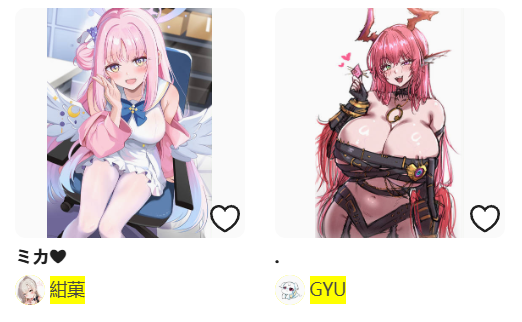

在夜间模式时，用户名会显示为黄色：

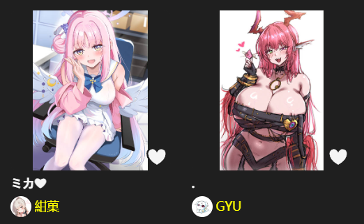

## 在下载过的作品上显示边框

  <a href="/#/zh-cn/设置-增强/其他?flag=87" target="_blank" class="settingNameStyle" data-xztext="_在下载过的作品上显示边框" data-bind-click="true">在下载过的作品上显示边框</a>
  <input type="checkbox" name="showBorderOnDownloadedWorks" class="need_beautify checkbox_switch">
  
  

    

      宽度
      <input type="text" name="borderWidth" class="setinput_style blue w30" value="3">
      px
    

    

      颜色 (Hex)
      <input type="text" name="borderColor" class="setinput_style blue w80" id="borderColor" value="#ff4060">
    

  

    <svg class="icon settingsPanel_newBadgeIcon" aria-hidden="true">
      <use xlink:href="#new"></use>
    </svg>
    

该功能依赖下载器自己保存的下载记录。

如果你希望能直观的查看一个作品是否下载过，可以启用这个设置。

下载器会在下载过的作品上显示边框，默认是红色的，如下图所示：

左边是没有下载过的，右边的是下载过的。

该设置有 2 个子选项，你可以设置边框的宽度和颜色。下面是边框宽度为 `4` px，颜色为 `#91e2df` 的效果：

已知问题：

为了不让边框被其他元素遮挡或裁剪，下载器把边框显示在了缩略图区域内部，所以它会遮挡住边缘区域。在图像作品上通常没有影响，但在部分页面的小说作品上，可能会遮挡住顶部文字：

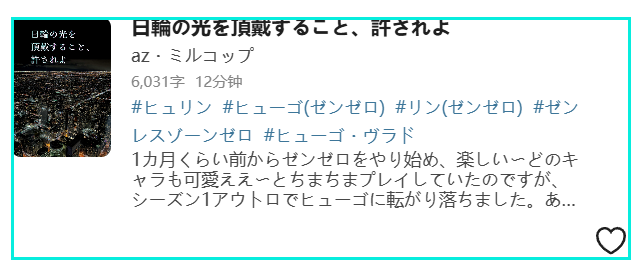

## 下载器的收藏功能 (✩)

  <a href="/#/zh-cn/设置-增强/其他?flag=88" target="_blank" class="has_tip settingNameStyle" data-xztip="_收藏设置的说明" data-tip="有时你会看到下载器添加的收藏按钮 (✩)，点击这个按钮可以收藏作品。&lt;br&gt;
    你可以选择是否附带作品的 tags，以及是否公开。&lt;br&gt;
    另外，使用下载器批量收藏作品时也会使用此设置。" data-bind-click="true">
    下载器的收藏功能 (✩)
     ? 
  </a>
  

    是否添加标签
    <input type="radio" name="widthTag" id="widthTag1" class="need_beautify radio" value="yes" checked="">
    
    <label for="widthTag1" data-xztext="_添加" class="active">添加</label>
    <input type="radio" name="widthTag" id="widthTag2" class="need_beautify radio" value="no">
    
    <label for="widthTag2" data-xztext="_不添加">不添加</label>
  

  

    是否公开
    <input type="radio" name="restrict" id="restrict1" class="need_beautify radio" value="no" checked="">
    
    <label for="restrict1" data-xztext="_公开" class="active">公开</label>
    <input type="radio" name="restrict" id="restrict2" class="need_beautify radio" value="yes">
    
    <label for="restrict2" data-xztext="_不公开">不公开</label>
  

你可以使用这个设置来控制下载器收藏作品时的行为。

?>Pixiv 原本的收藏按钮（心形）不受此设置影响。

**受此设置影响的功能：**

1. 作品页面里的快速收藏按钮（☆）：

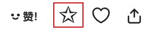

2. 搜索页面里，预览搜索结果时的快速收藏按钮（☆）：

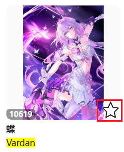

3. 预览作品时，使用快捷键 `B` 收藏作品。
4. 使用图片查看器时，点击底部的按钮（☆）收藏作品。
5. [下载之后收藏作品](/zh-cn/设置-下载/下载行为?id=下载之后收藏作品) 功能。
6. 在用户主页和搜索页面里，下载器的“更多”标签页里的“收藏本页面的所有作品”功能。

**不受此设置影响的功能：**

在收藏页面里的“给未分类的作品添加标签”按钮不受影响。因为这个功能必定会附带标签，并且会根据这个作品之前的收藏状态，自动设置公开或者不公开。

**子选项：**

当你使用受此设置影响的功能时，可以设置：

- 是否添加作品的标签
- 添加为公开或者非公开收藏

默认值是添加标签，并公开收藏。

?> 如果一个作品已经收藏过了，你依然可以再次收藏它。这不会改变它的收藏时间（所以也不会改变它在收藏页面里的顺序），但可以更新它的公开状态和标签列表。例如：有个作品之前是公开的，并且添加了标签。如果你有需要的话，可以把这个设置修改为不公开+不添加标签，然后让下载器再次收藏它。

## 复制按钮

  <a href="/#/zh-cn/设置-增强/其他?flag=89" target="_blank" class="has_tip settingNameStyle" data-xztip="_显示复制按钮的提示" data-tip="下载器会在作品缩略图上和作品页面内显示一个复制按钮，点击它就可以复制作品的图片和一些数据。
&lt;br&gt;
你可以自定义要复制的数据和格式。
&lt;br&gt;
在作品页面里，以及预览作品时，你可以按快捷键 &lt;span class=&quot;blue&quot;&gt;Alt + C&lt;/span&gt; 进行复制。" data-bind-click="true">
    复制按钮
     ? 
  </a>
  

    复制内容
    <input type="checkbox" name="copyFormatImage" id="setCopyFormatImage" class="need_beautify checkbox_common">
    
    <label for="setCopyFormatImage">image/png</label>
    <input type="checkbox" name="copyFormatText" id="setCopyFormatText" class="need_beautify checkbox_common" checked="">
    
    <label for="setCopyFormatText" class="active">text/plain</label>
    <input type="checkbox" name="copyFormatHtml" id="setCopyFormatHtml" class="need_beautify checkbox_common" checked="">
    
    <label for="setCopyFormatHtml" class="active">text/html</label>
    <button type="button" class="gray1 textButton showMsgBtn" data-title="_复制内容" data-msg="_对复制的内容的说明" data-xztext="_帮助">帮助</button>
  

  

    图片尺寸
    <input type="radio" name="copyImageSize" id="copyImageSize1" class="need_beautify radio" value="original">
    
    <label for="copyImageSize1" data-xztext="_原图" class="active">原图</label>
    <input type="radio" name="copyImageSize" id="copyImageSize2" class="need_beautify radio" value="regular" checked="">
    
    <label for="copyImageSize2" data-xztext="_普通">普通</label>
  

  

    文本格式
    <button type="button" class="gray1 textButton toggleArea" data-toggle-target="#copyWorkInfoFormatTip" data-for-no="89" data-xztext="_提示">提示</button>
    <textarea class="centerPanelTextArea beautify_scrollbar" name="copyWorkInfoFormat" rows="1" placeholder="id: {id}{n}title: {title}{n}tags: {tags}{n}url: {url}{n}user: {user}">id: {id}{n}title: {title}{n}tags: {tags}{n}url: {url}{n}user: {user}</textarea>
  

  

    你可以设置文字内容的格式，这会影响 text/plain 和 text/html 格式复制的内容。
 
你可以使用命名规则里的所有标签，也可以输入自定义字符，例如空格、下划线、每个标签的名称。
 
另外，你还可以使用这些标签：
     
    {url}
    这个作品的网址
     
    {n}
    换行
     
  

下载器会在作品缩略图上和作品页面内显示一个复制按钮，点击就可以复制作品的图片和一些数据。你可以粘贴到其他软件里保存，也可以分享给其他人。例如：

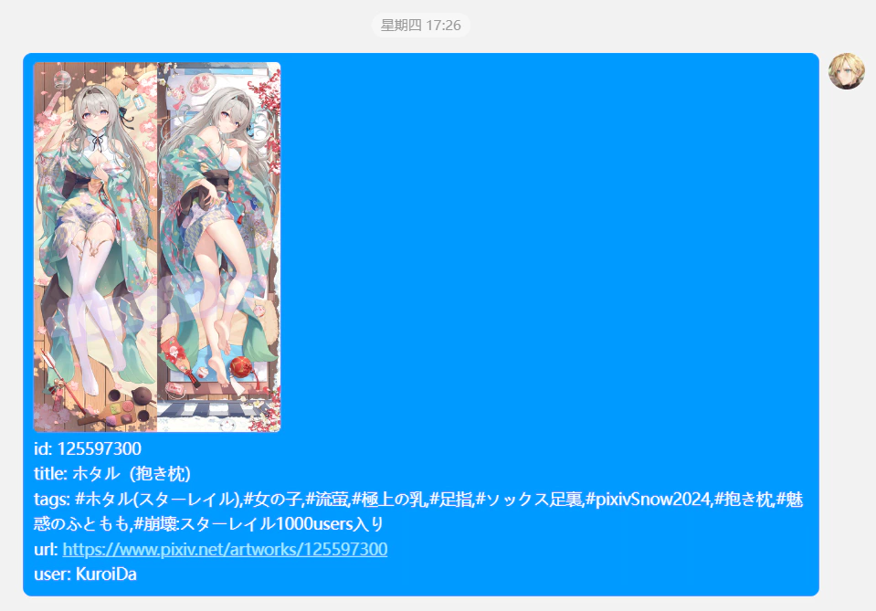

### 可以使用的场景

总体来说，有两种方式：
- 在有些场景里，下载器会显示复制按钮，点击它就可以进行复制。
- 有些场景里没有复制按钮，需要使用快捷键 `Alt` + `C`。

下面是详细说明：

#### 缩略图上的复制按钮

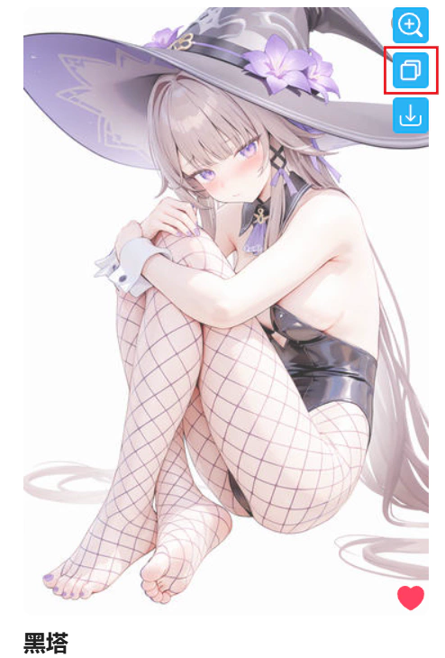

点击复制按钮即可复制。

此时下载器只会复制作品的第一张图片。

#### 作品页面里，图片下方的复制按钮

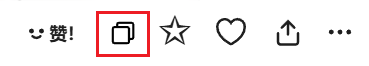

点击复制按钮即可复制。

此时下载器只会复制作品的第一张图片。

?>在作品页面里，可以按快捷键 `Alt` + `C` 来使用复制功能。

#### 预览作品的详细信息时

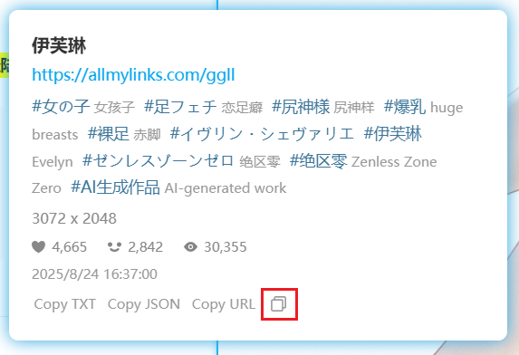

点击复制按钮即可复制。

此时下载器只会复制作品的第一张图片。

-----------

在下面的几种使用场景里，下载器都会复制当前查看的那张图片，而非固定为第一张。

#### 作品页面里，缩略图列表上的复制按钮

下载器会在多图作品页面里添加缩略图列表。点击复制按钮即可复制。

下载器会复制这张缩略图对应的图片，而非固定为第一张。

#### 预览作品时

按快捷键 `Alt` + `C` 即可复制当前查看的图片。

#### 在作品的缩略图上长按鼠标右键查看大图时

按快捷键 `Alt` + `C` 即可复制当前查看的图片。

#### 在图片查看器里

点击复制按钮，或者使用快捷键 `Alt` + `C` 即可复制当前查看的图片。

### 复制内容

你可以根据自己的需要选择复制的内容。

**每种格式的说明：**
- `image/png` 复制作品的图片。默认未选择，因为它在某些社交软件里的优先级太高，会导致 `text/html` 格式的内容被忽略。
你可以选择复制原图还是缩略图。
- `text/plain` 复制作品的文字信息。几乎所有应用程序都支持粘贴纯文本内容。
- `text/html` 同时复制作品的图片和文字信息。这是富文本格式，同时包含了上面两种内容。在 html 格式的文字内容里，下载器会为作品 ID、URL、作者名字添加超链接，但在粘贴时很多软件会移除超链接，只保留文字，所以粘贴后可能没有超链接。

**提示：**
- 这个功能在设计时的重点是同时复制图片和文字内容（`text/html`），以便于分享或存档，但实际效果取决于目标应用。有些应用可能不支持此格式，或者无法正确显示图片。
- 你可以同时选择多种格式，也就是同时复制多种内容。但是当你在应用程序里粘贴时，应用程序只会使用其中一种内容，也就是优先级最高的格式。其他格式的内容会被忽略。
- 在不同的应用程序里，优先级可能会不同。这与下载器无关。
- 例如：如果你同时复制了 `image/png` 和 `text/html` 内容，某些应用程序会使用前者，但某些应用程序可能会使用后者。如果粘贴的内容不符合你的预期，你可以取消选择其中一种格式。

### 图片尺寸

你可以选择复制的图片的尺寸：
- `原图`：默认值，下载器会复制图片的原图。需要注意的是：
- `普通`：下载器会复制图片的缩略图（最大尺寸为 1200px）。

**复制图片时的行为：**

- 下载器默认会复制原图。但是有些图片的原图比较大（例如超过 30 MiB），在某些应用程序里可能无法粘贴。如果你遇到了这种情况，可以修改“图片尺寸”为 `普通`。
- 对于插画、漫画作品，下载器会根据使用场景复制它的第一张图片，或者你查看的那张图片。
- 对于动图作品，下载器总是会复制它的静态缩略图。
- 对于小说作品，下载器总是会复制它的封面图。

### 文本格式

你可以设置下载器复制文字内容时的格式，这会影响 `text/plain` 和 `text/html` 生成的内容。

你可以使用命名规则里的所有标签，也可以输入自定义字符，例如空格、下划线、每个标签的名称。

另外，你还可以使用这些标签：

- `{url}` 这个作品的网址
- `{n}` 换行

-----------

默认的文本格式规则是 `id: {id}{n}title: {title}{n}tags: {tags}{n}url: {url}{n}user: {user}`，生成的文字内容示例如下：

id: [134304155](https://www.pixiv.net/i/134304155)

title: 黑塔

tags: #女の子,#崩壊スターレイル,#尻神様,#おっぱい,#裸足,#ヘルタ,#黑塔,#網タイツ,#AI生成作品,#崩坏星穹铁道

url: [https://www.pixiv.net/i/134304155](https://www.pixiv.net/i/134304155)

user: [光怪陆离](https://www.pixiv.net/users/95485582)

### 一些截图

我测试了粘贴的效果，PC 上的很多软件表现良好，但是在 Android 应用程序里效果不佳，所以我只建议你在 PC 上使用这个功能。

#### 浏览器

网页上的输入区域默认只能粘贴纯文本内容，也就是 `text/plain`。

某些网页应用程序可能有针对性优化，例如在 Discord 里你可以粘贴图片 `image/png`。

在 Gmail 里你可以同时粘贴图片和文字，也就是 `text/html`，例如：

#### Microsoft Word

Word 会优先采用 `text/html` 格式的内容，其次是 `image/png`，最后是 `text/plain`。例如：

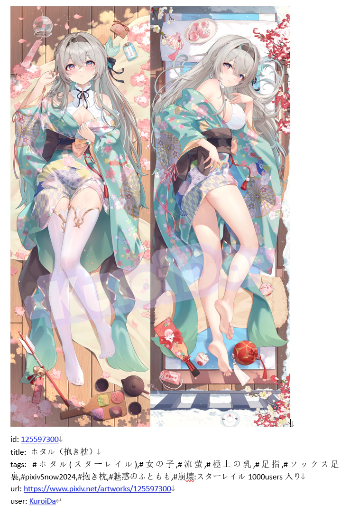

#### Telegram

Telegram 不支持 `text/html` 格式，所以你无法在 Telegram 里同时粘贴图片和文字。

其他格式的优先级是：`image/png`、`text/plain`。

如果你想在 Telegram 里粘贴图片，需要选择 `image/png` 格式，这样就可以在 Telegram 里粘贴图片了：

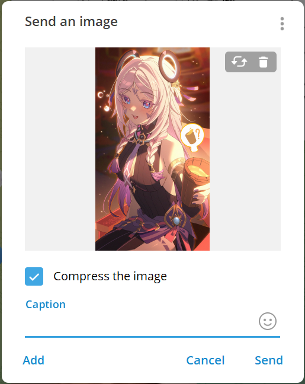

#### QQ

QQ 的优先级是：`image/png`、`text/html`、`text/plain`。

如果你想在 QQ 里同时粘贴图片和文字，应该选择 `text/html`，并且取消勾选 `image/png`，否则它只会粘贴图片。

#### 微信

微信的优先级和 QQ 相同。你可以同时粘贴图片和文字，不过微信在发送时会把它们拆分开。例如：

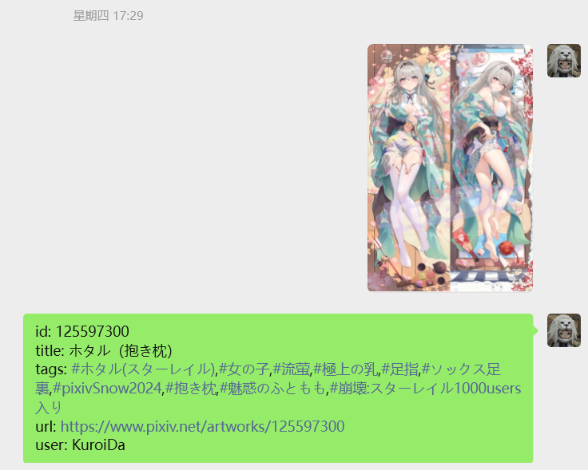

#### Android 应用

Android 上的某些应用虽然可以粘贴 `text/html` 内容，但图片可能无法显示：

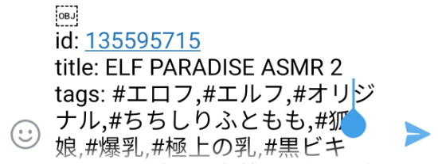

如果你想发送图片，需要选择 `image/png` 格式，并且取消选择其他格式。这样下载器只会复制图片，可以在一些应用里粘贴。

一些 Android 应用程序可以粘贴下载器复制的图片，例如 Telegram 和微信。但是在某些应用程序里无法粘贴图片，例如 QQ。

