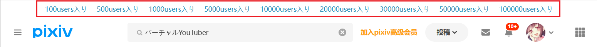

## 在搜索页面添加快捷搜索区域

<div class="option settingsPanel_optionCard" data-no="90" data-pin-bound="true" style="display: flex;">
  <a href="http://localhost:3000/#/zh-cn/设置-增强/搜索页面?flag=90" target="_blank" class="has_tip settingNameStyle" data-xztip="_在搜索页面添加快捷搜索区域的说明" data-tip="在搜索页面（/tags/）的顶部，下载器可以显示一些收藏数量标签，例如“10000users入り”，点击就可以把它添加到搜索的标签的后面。" data-bind-click="true">
    <span data-xztext="_在搜索页面添加快捷搜索区域">在搜索页面添加快捷<span class="key">搜索</span>区域</span>
    <span class="gray1"> ? </span>
  </a>
  <input type="checkbox" name="showFastSearchArea" class="need_beautify checkbox_switch" checked="">
  <span class="beautify_switch" tabindex="0"></span>
</div>


下载器会在搜索页面的顶部添加一些特定收藏数量的按钮，例如：



点击这些按钮时，下载器会在当前标签后面添加这个收藏数量的标签，并进行搜索。

例如在 `バーチャルYouTuber` 的页面里点击 `10000users入り` 按钮，下载器会自动搜索 `バーチャルYouTuber 10000users入り`。

?>这个功能对于非 Pixiv 高级会员（premium）的用户比较有用。

?> 这个功能不能保证准确。有些用户会在投稿时为作品添加 `10000users入り` 标签（实际上他的作品收藏数量很低），这是欺诈行为。

下载器添加的收藏数量按钮如下：

```
100users入り 500users入り 1000users入り 5000users入り 10000users入り 20000users入り 30000users入り 50000users入り  100000users入り
```

## 过滤搜索页面的作品

<div class="option settingsPanel_optionCard" data-no="91" data-pin-bound="true">
  <a href="http://localhost:3000/#/zh-cn/设置-增强/搜索页面?flag=91" target="_blank" class="settingNameStyle" data-bind-click="true">
    <span data-xztext="_过滤搜索页面的作品"><span class="key">过滤</span>搜索页面的作品</span>
  </a>
  <input type="checkbox" name="filterSearchResults" class="need_beautify checkbox_switch">
  <span class="beautify_switch" tabindex="0"></span>
  <button type="button" class="gray1 textButton showMsgBtn" data-title="_过滤搜索页面的作品" data-msg="_过滤搜索页面的作品的说明" data-xztext="_帮助">帮助</button>
</div>


该功能默认启用。当鼠标光标停留在作品的缩略图上时，下载器会显示更大尺寸的预览图，如图所示：


<!-- https://www.pixiv.net/artworks/134677173 -->

?>预览图会自适应可用区域，不会超出屏幕。

要**关闭预览图**的话，可以使用这些方法之一：
- 将鼠标光标移出缩略图区域
- 点击预览图
- 按下 `Esc` 键

## 在搜索页面里移除已关注用户的作品

<div class="option settingsPanel_optionCard" data-no="92" data-pin-bound="true" style="display: flex;">
  <a href="http://localhost:3000/#/zh-cn/设置-增强/搜索页面?flag=92" target="_blank" class="has_tip settingNameStyle" data-xztip="_在搜索页面里移除已关注用户的作品的说明" data-tip="这样只会显示未关注用户的作品，便于你发现新的喜欢的用户。&lt;br&gt;只在搜索页面（/tags/）里生效。" data-bind-click="true">
    <span data-xztext="_在搜索页面里移除已关注用户的作品">在搜索页面里<span class="key">移除</span>已关注用户的作品</span>
    <span class="gray1"> ? </span>
  </a>
  <input type="checkbox" name="removeWorksOfFollowedUsersOnSearchPage" class="need_beautify checkbox_switch">
  <span class="beautify_switch" tabindex="0"></span>
</div>


如果你启用了这个功能，那么当你处于搜索页面时，下载器会移除已关注的用户的作品。

当你想要发掘感兴趣的用户时，此功能可以让你只看到未关注的用户的作品，降低干扰，提高效率。

?> 这个功能不会影响抓取结果。即使你移除了已关注的用户的作品，下载器也依然会抓取它们。

## 预览搜索页面的筛选结果

<div class="option settingsPanel_optionCard" data-no="93" data-pin-bound="true" style="display: flex;">
  <a href="http://localhost:3000/#/zh-cn/设置-增强/搜索页面?flag=93" target="_blank" class="has_tip settingNameStyle" data-xztip="_预览搜索结果说明" data-tip="在搜索页面（/tags/）里抓取时，下载器可以把抓取到的作品显示在当前页面上，并且按照收藏数量从高到低排序。&lt;br&gt;
    启用预览功能时，下载器不会自动开始下载，这是为了让用户可以对抓取结果再次进行筛选。&lt;br&gt;
    你可以设置最多显示多少个预览。如果预览的数量太多，可能会导致页面崩溃。" data-bind-click="true">
    <span data-xztext="_预览搜索结果"><span class="key">预览</span>搜索页面的筛选结果</span>
    <span class="gray1"> ? </span>
  </a>
  <input type="checkbox" name="previewResult" class="need_beautify checkbox_switch" checked="">
  <span class="beautify_switch" tabindex="0"></span>
  <div class="subOptionWrap" data-show="previewResult" style="display: inline-flex;">
    <span class="settingNameStyle" data-xztext="_上限">上限</span>
    <input type="text" name="previewResultLimit" class="setinput_style blue w80" value="1000">
  </div>
</div>


