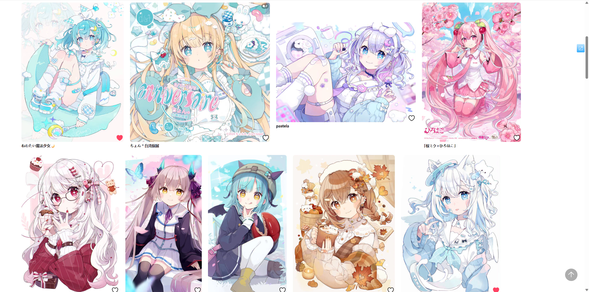
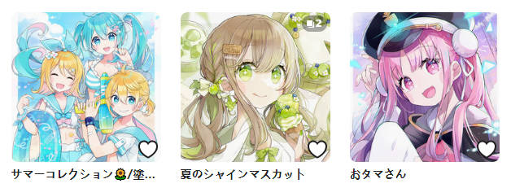
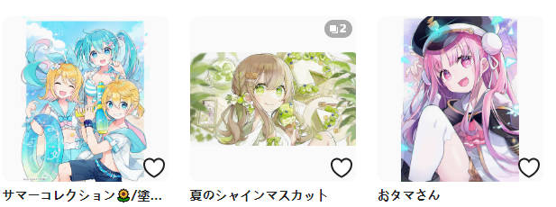
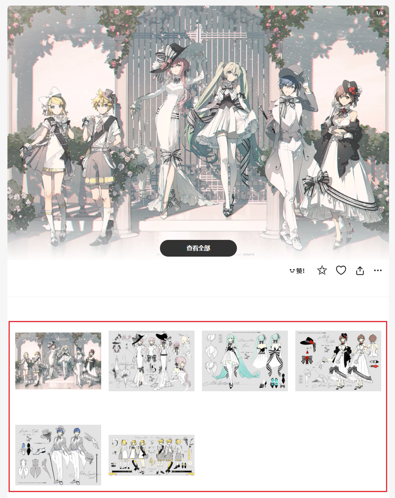
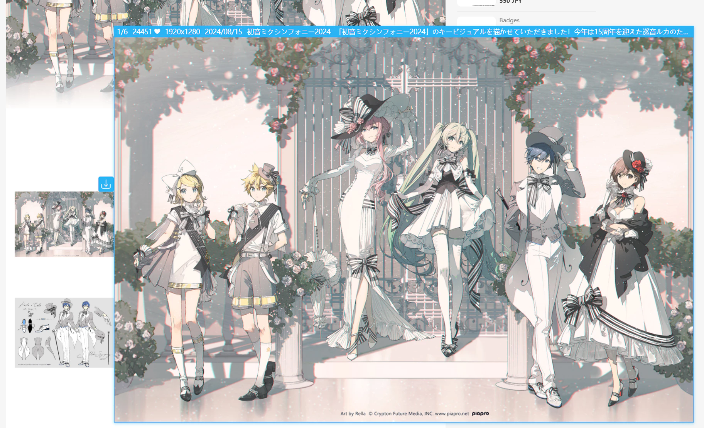
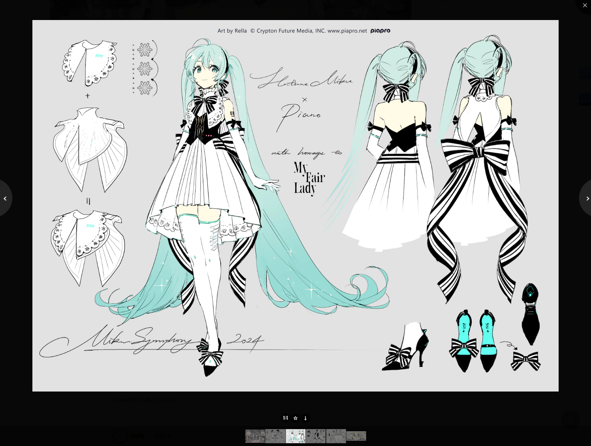

## 显示更大的缩略图

  <a href="/#/zh-cn/设置-增强/缩略图?flag=78" target="_blank" class="has_tip settingNameStyle" data-xztip="_显示更大的缩略图的说明" data-tip="Pixiv 默认的缩略图比较小，下载器可以显示更大的缩略图以方便预览。&lt;br&gt;这个功能不太稳定，因为 Pixiv 的代码更新可能会导致此功能部分失效。" data-bind-click="true">
    显示更大的缩略图
     ? 
  </a>
  <input type="checkbox" name="showLargerThumbnails" class="need_beautify checkbox_switch">
  

Pixiv 的作品缩略图比较小，大部分缩略图的尺寸都是 184 px。这是默认情况下的截图：

因为缩略图很小，看不清细节，所以我经常需要点进去查看大图才能知道自己喜不喜欢这张图片。

启用这个功能之后，下载器会加宽页面显示区域，并把缩略图的尺寸加大到 250 px。

如果启用了下面的“替换方形缩略图以显示图片比例”功能，缩略图的尺寸会增大到 540px，效果如下：

这样就能看得更清楚了，并且眼睛也会更轻松，不容易累。

?>根据屏幕分辨率和 DPI 缩放不同，一排显示的图片数量也会有所不同。

## 替换方形缩略图以显示图片比例

  <a href="/#/zh-cn/设置-增强/缩略图?flag=79" target="_blank" class="has_tip settingNameStyle" data-xztip="_替换方形缩略图以显示图片比例的说明" data-tip="Pixiv 的缩略图是正方形的，不能看到图片的全貌，也看不出是横图还是竖图。&lt;br&gt;下载器可以显示完整的缩略图，以显示图片比例。" data-bind-click="true">
    替换方形缩略图以显示图片比例
     ? 
  </a>
  <input type="checkbox" name="replaceSquareThumb" class="need_beautify checkbox_switch" checked="">
  

pixiv 的缩略图是 250 px 的正方形图片，看不出来图片的比例（横图还是竖图），而且还会裁剪掉边缘区域。例如：

启用这个功能之后，下载器会把方形缩略图替换为 540 px 的缩略图，这样用户可以看到图片的原始比例和全貌。例如：

## 在多图作品页面里显示缩略图列表

  <a href="/#/zh-cn/设置-增强/缩略图?flag=80" target="_blank" class="has_tip settingNameStyle" data-xztip="_在多图作品页面里显示缩略图列表的说明" data-tip="在多图作品页面里（/artworks/)，下载器可以显示每一张图片的预览图。" data-bind-click="true">
    在多图作品页面里显示缩略图列表
     ? 
  </a>
  <input type="checkbox" name="displayThumbnailListOnMultiImageWorkPage" class="need_beautify checkbox_switch" checked="">
  

当你位于**多图作品**页面里时（例如 [121525173](https://www.pixiv.net/artworks/121525173)），下载器可以显示每一张图片的缩略图。例如：

你可以预览、下载每张图片。

当你把鼠标放在缩略图上时，可以使用一些增强功能，例如：

这些功能包括：
- 预览作品（此时你依然可以使用快捷键 `C` 下载单张图片，使用 `D` 下载这个作品）
- 长按鼠标右键时查看大图
- 在作品缩略图上显示下载按钮（此时点击这个按钮只会下载它所在的这一张图片）
- 点击缩略图会打开图片查看器，例如：

## 把图片显示为灰色

  <a href="/#/zh-cn/设置-增强/缩略图?flag=81" target="_blank" class="settingNameStyle" data-bind-click="true">
    把图片显示为灰色
  </a>
  <input type="checkbox" name="imageToGray" class="need_beautify checkbox_switch">
  

这是一个隐藏设置。

