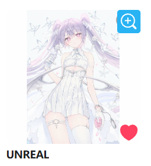
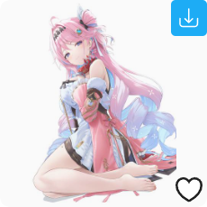

## 缩略图上按钮的位置

  <a href="http://localhost:3000/#/zh-cn/设置-增强/缩略图上的按钮?flag=82" target="_blank" class="settingNameStyle has_tip" data-xztip="_缩略图上按钮的位置的说明" data-tip="下载器会在作品缩略图上显示一些按钮，你可以设置它们显示在缩略图的左侧还是右侧。" data-bind-click="true">
    缩略图上按钮的位置
     ? 
  </a>
  <input type="radio" name="magnifierPosition" id="magnifierPosition1" class="need_beautify radio" value="left">
  
  <label for="magnifierPosition1" data-xztext="_左侧">左侧</label>
  <input type="radio" name="magnifierPosition" id="magnifierPosition2" class="need_beautify radio" value="right" checked="">
  
  <label for="magnifierPosition2" data-xztext="_右侧" class="active">右侧</label>

    <svg class="icon settingsPanel_newBadgeIcon" aria-hidden="true">
      <use xlink:href="#new"></use>
    </svg>
    

当你把鼠标放到缩略图上时，下载器会显示一些按钮，如下所示：

默认是显示在右侧的，如果你有需要的话可以改成显示在左侧。

## 在作品缩略图上显示放大按钮

  <a href="http://localhost:3000/#/zh-cn/设置-增强/缩略图上的按钮?flag=83" target="_blank" class="settingNameStyle" data-xztext="_在作品缩略图上显示放大按钮" data-bind-click="true">在作品缩略图上显示放大按钮</a>
  <input type="checkbox" name="magnifier" class="need_beautify checkbox_switch" checked>
  
  

    

      查看的图片尺寸
      <input type="radio" name="magnifierSize" id="magnifierSize1" class="need_beautify radio" value="original">
      
      <label for="magnifierSize1" data-xztext="_原图" class="active">原图</label>
      <input type="radio" name="magnifierSize" id="magnifierSize2" class="need_beautify radio" value="regular" checked="">
      
      <label for="magnifierSize2" data-xztext="_普通">普通</label>
    

  

当鼠标经过作品缩略图时，下载器会在缩略图上显示一个放大镜图标，如下图所示：

点击放大镜图标可以打开图片查看器，查看这个作品里的每一张图片。效果如下图所示：

你可以在这里查看图片查看器的详细说明：[图片查看器](/zh-cn/便捷功能?id=图片查看器)。

## 在作品缩略图上显示复制按钮

  <a href="http://localhost:3000/#/zh-cn/设置-增强/缩略图上的按钮?flag=84" target="_blank" class="settingNameStyle" data-xztext="_在缩略图上显示复制按钮" data-bind-click="true">在作品缩略图上显示复制按钮</a>
  <input type="checkbox" name="showCopyBtnOnThumb" class="need_beautify checkbox_switch" checked="">
  

当鼠标经过作品缩略图时，下载器会在缩略图上显示一个复制按钮，如下图所示：

点击它可以复制图片的原图和这个作品的一些信息。你可以在 [复制按钮](/zh-cn/设置-增强/其他?id=复制按钮) 里调整要复制的内容。

## 在作品缩略图上显示下载按钮

  <a href="http://localhost:3000/#/zh-cn/设置-增强/缩略图上的按钮?flag=85" target="_blank" class="settingNameStyle" data-xztext="_在作品缩略图上显示下载按钮" data-bind-click="true">在作品缩略图上显示下载按钮</a>
  <input type="checkbox" name="showDownloadBtnOnThumb" class="need_beautify checkbox_switch" checked="">
  

当鼠标经过作品缩略图时，下载器会在缩略图上显示一个下载按钮，点击下载按钮就可以下载这个作品。这个功能使下载作品变得更加便捷了。

