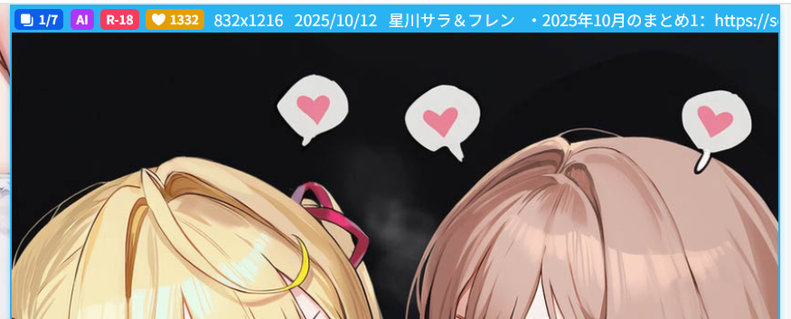
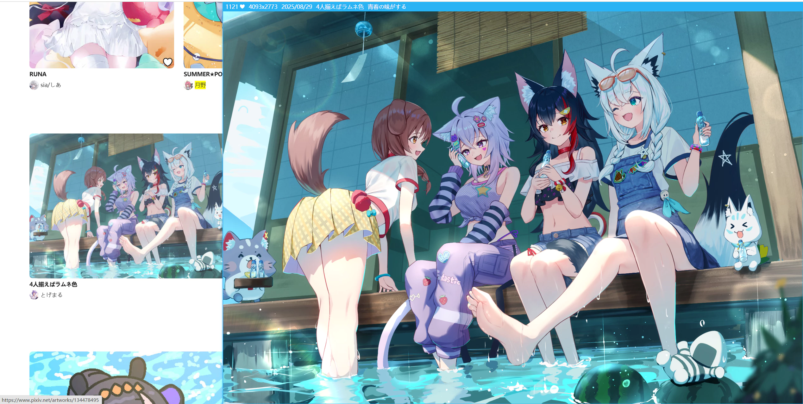
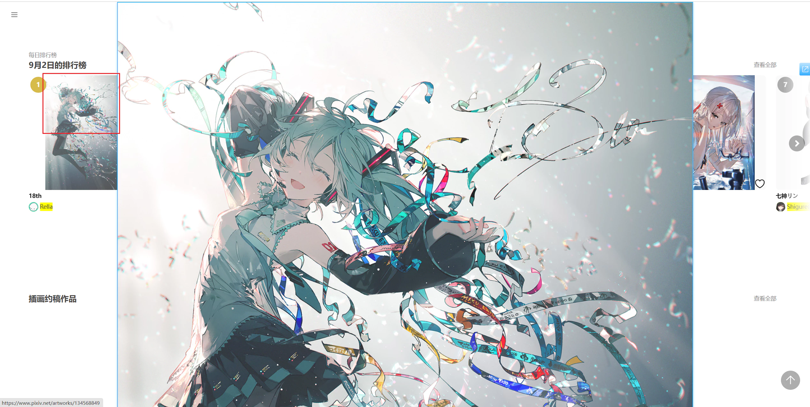
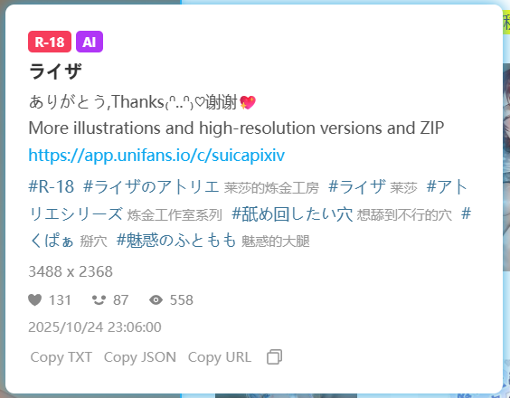

## 预览作品

  <a href="/#/zh-cn/设置-增强/预览?flag=75" target="_blank" class="has_tip settingNameStyle" data-xztip="_预览作品的说明" data-tip="当鼠标放在图片的缩略图上时，下载器可以显示更大的图片。" data-bind-click="true">
    预览作品
     ? 
  </a>
  <input type="checkbox" name="PreviewWork" class="need_beautify checkbox_switch" checked="">
  
  

    

      <input type="checkbox" name="previewSingleImageWork" id="previewSingleImageWork" class="need_beautify checkbox_common" checked="">
      
      <label for="previewSingleImageWork" data-xztext="_单图作品" class="active">单图作品</label>
      <input type="checkbox" name="previewMultiImageWork" id="previewMultiImageWork" class="need_beautify checkbox_common" checked="">
      
      <label for="previewMultiImageWork" data-xztext="_多图作品" class="active">多图作品</label>
      <input type="checkbox" name="previewUgoira" id="previewUgoira" class="need_beautify checkbox_common" checked="">
      
      <label for="previewUgoira" data-xztext="_动图" class="active">动图</label>
    

    

      <label for="checkBlockTagsForPreviewWork" data-xztext="_检查屏蔽的标签">检查屏蔽的标签</label>
      <input type="checkbox" name="checkBlockTagsForPreviewWork" id="checkBlockTagsForPreviewWork" class="need_beautify checkbox_switch">
      
      <button type="button" class="gray1 textButton showMsgBtn" data-title="_检查屏蔽的标签" data-msg="_检查屏蔽的标签的帮助" data-xztext="_帮助">帮助</button>
    

    

      <label for="wheelScrollSwitchImageOnPreviewWork" class="has_tip active" data-xztext="_使用鼠标滚轮切换作品里的图片" data-xztip="_这可能会阻止页面滚动" data-tip="这可能会阻止页面滚动">使用鼠标滚轮切换多图作品里的图片</label>
      <input type="checkbox" name="wheelScrollSwitchImageOnPreviewWork" id="wheelScrollSwitchImageOnPreviewWork" class="need_beautify checkbox_switch" checked="">
      
    

    

      <label for="swicthImageByKeyboard" class="has_tip active" data-xztext="_使用方向键和空格键切换图片" data-xztip="_使用方向键和空格键切换图片的提示" data-tip="← ↑ 上一张图片&lt;br&gt;→ ↓ 下一张图片&lt;br&gt;空格键 下一张图片">使用方向键和空格键切换图片</label>
      <input type="checkbox" name="swicthImageByKeyboard" id="swicthImageByKeyboard" class="need_beautify checkbox_switch" checked="">
      
    

    

      <label for="previewWorkWait" data-xztext="_等待时间">等待时间</label>
      <input type="text" name="previewWorkWait" id="previewWorkWait" class="setinput_style blue" value="400">
      ms
    

    

      <label for="showPreviewWorkTip" data-xztext="_显示摘要信息" class="active">显示摘要信息</label>
      <input type="checkbox" name="showPreviewWorkTip" id="showPreviewWorkTip" class="need_beautify checkbox_switch" checked="">
      
    

    

      查看的图片尺寸
      <input type="radio" name="prevWorkSize" id="prevWorkSize1" class="need_beautify radio" value="original">
      
      <label for="prevWorkSize1" data-xztext="_原图">原图</label>
      <input type="radio" name="prevWorkSize" id="prevWorkSize2" class="need_beautify radio" value="regular" checked="">
      
      <label for="prevWorkSize2" data-xztext="_普通" class="active">普通</label>
    

    

      <button type="button" class="gray1 textButton toggleArea" data-toggle-target="#previewWorkShortcutTip" data-for-no="75" data-xztext="_快捷键列表">快捷键列表</button>
    

  

  

    Alt + P 关闭/启用预览作品功能 
当你查看预览图时，可以使用如下快捷键： 
B(ookmark) 收藏预览的作品 
C(urrent) 下载当前预览的图片（如果这个作品里有多张图片，只会下载当前这一张） 
D(ownload) 下载当前预览的作品（如果这个作品里有多张图片，默认会全部下载） 
Alt + C 复制当前预览的图片和作品信息 
Esc 关闭预览图。另外，在预览图上点击鼠标左键也可以关闭预览图 
← ↑ 上一张图片 
→ ↓ 下一张图片 
空格键 下一张图片
  

该功能默认启用。当鼠标光标停留在作品的缩略图上时，下载器会显示更大尺寸的预览图，如图所示：

<!-- https://www.pixiv.net/artworks/134677173 -->

?>预览图会自适应可用区域，不会超出屏幕。

要**关闭预览图**的话，可以使用这些方法之一：
- 将鼠标光标移出缩略图区域
- 点击预览图
- 按下 `Esc` 键

### 快捷键列表

使用快捷键 `Alt` + `P` 可以关闭/启用预览作品的功能。

当你查看预览图时，可以使用如下快捷键：
- `B`ookmark 收藏预览的作品
- `C`urrent 下载当前预览的图片（如果这个作品里有多张图片，只会下载当前显示的这一张）
- `D`ownload 下载当前预览的作品（如果这个作品里有多张图片，会全部下载）
- `Alt` + `C` 复制当前预览的图片和作品信息
- `Esc` 关闭预览图。另外，在预览图上点击鼠标左键也可以关闭预览图
- `←` `↑` 上一张图片
- `→` `↓` 下一张图片
- `Space` 下一张图片

### 检查屏蔽的标签

该功能默认未启用。

如果你启用了这个设置，下载器会检查作品是否包含两种标签：
1. 你在下载器里设置的"不能含有标签"
2. 你在 Pixiv 账户设置里 Mute 的标签
如果作品匹配任意一种屏蔽条件，下载器就不会预览它。

### 使用鼠标滚轮切换多图作品里的图片 

该功能默认启用。

预览作品时，如果这个作品**含有多张图片**，你可以滚动鼠标滚轮来切换显示的图片。

- 鼠标向下滚动会显示下一张图片
- 鼠标向上滚动会显示上一张图片。

?> 如果鼠标滚动时需要切换图片，下载器会阻止页面滚动。因为页面滚动的话会导致鼠标离开作品缩略图区域，从而导致预览区域消失。

### 使用方向键和空格键切换图片

该功能默认启用。

它会使这些快捷键生效：

- `←` `↑` 上一张图片
- `→` `↓` 下一张图片
- `Space` 下一张图片

当下载器显示了预览区域，并且启用了此功能时，下载器会阻止这些按键的默认行为，所以它们不会使页面滚动。

如果你希望这些按键始终可以使页面滚动，可以关闭此功能。

### 等待时间  

当鼠标进入作品缩略图区域之后，如果在一定时间内没有移出缩略图区域，下载器就会准备显示预览图。

默认的等待时间是 `400` 毫秒，你可以根据需要修改。

### 显示摘要信息 

该功能默认启用。

下载器可以在预览图顶部会显示一些信息。以下图为例：

从左到右显示的信息依次是：

- 当前查看的图片编号和图片总数量，如 `1/7`。只有当作品里有多张图片时，才会显示此信息。
- `AI` 标记。只有当作品是由 AI 生成的时候，才会显示这个标记。
- `R-18` 或 `R-18G` 标记。全年龄的作品不会显示这个标记。
- 作品的收藏数量。
- 图片的宽高（总是显示第一张图片的宽高）
- 作品的发布日期
- 作品的标题
- 作品的简介（如果有）

### 查看的图片尺寸

你可以选择查看预览作品时，下载器加载哪种图片尺寸。

- `原图`：让下载器加载图片的原图。有些原图的体积可能比较大，所以加载速度会比较慢。
- `普通`：默认值，加载普通尺寸的图片。它的体积比较小，所以加载速度很快。

?> 这个选项只会影响预览时的图片尺寸，不会影响下载时的图片尺寸。

**不同尺寸的区别：**

- 如果原图的宽高大于 1200 px，那么普通尺寸的图片会是 1200 px。
- 如果原图的尺寸小于 1200 px，那么普通图片的尺寸会与之相同。例如原图是 500 x 500 px，那么缩略图的尺寸也是 500 x 500 px。

**显示区域的区别：**

当你选择“原图”时，如果它的尺寸大于 1200 px，并且其周围有足够的可用区域，那么下载器会显示更大的预览图。

下面是一个示例。这个作品的普通图片的宽度是 1200 px：

它的原图的宽度是 4093 px，所以显示区域更大：

?> 虽然原图有时可以显示的更大，并不总是如此。这是因为有时候缩略图周围的可用区域不够大，普通图片就差不多可以占满了，此时原图并不会显示的更大。

## 在缩略图上长按鼠标右键时显示大图

  <a href="/#/zh-cn/设置-增强/预览?flag=76" target="_blank" class="settingNameStyle" data-xztext="_长按右键显示大图" data-bind-click="true">在缩略图上长按鼠标右键时显示大图</a>
  <input type="checkbox" name="showOriginImage" class="need_beautify checkbox_switch" checked="">
  
  

    

      查看的图片尺寸
      <input type="radio" name="showOriginImageSize" id="showOriginImageSize1" class="need_beautify radio" value="original">
      
      <label for="showOriginImageSize1" data-xztext="_原图" class="active">原图</label>
      <input type="radio" name="showOriginImageSize" id="showOriginImageSize2" class="need_beautify radio" value="regular" checked="">
      
      <label for="showOriginImageSize2" data-xztext="_普通">普通</label>
    

    

      <button type="button" class="gray1 textButton toggleArea" data-toggle-target="#showOriginImageShortcutTip" data-for-no="76" data-xztext="_快捷键列表">快捷键列表</button>
    

  

  

    查看作品大图时，按快捷键 D 可以下载这个作品。
     
    按快捷键 C 仅下载当前显示的这张图片。
     
    Alt + C 复制当前预览的图片和作品信息。
     
    
  

当用户预览作品时，如果在缩略图上长按鼠标右键，下载器就会显示大图。

下载器默认会加载原图，并以原始尺寸（1:1）显示。如果原图的尺寸比较大，它可能会超出屏幕（这不是 BUG）。

例如在查看这个作品的原图时，它只显示了上半部分：

**提示：**

- 如果图片有超出屏幕的部分，你可以通过移动鼠标光标来查看全图。
- 你可以使用鼠标滚轮来缩放图片。
- 当你预览多图作品时，预览图显示的是哪张图片（如 `3/10`），此功能也会显示那张图片。

如果你想**关闭大图**，可以使用下面的方法之一：
- 点击鼠标左键。
- 按下 `Esc` 键。

### 快捷键列表

当下载器显示大图时，你可以使用如下快捷键：
- `C`urrent 下载当前显示的这张图片
- `D`ownload 下载这张图片所属的作品（如果这个作品里有多张图片，会全部下载）
- `Alt` + `C` 复制当前预览的图片和作品信息

### 查看的图片尺寸

你可以决定当下载器显示大图时，加载原图还是普通图片。默认是原图。

普通图片的宽高最大是 1200 px，原图的尺寸可能比它更大，所以 1:1 显示时也可能会更大。

## 预览作品的详细信息

  <a href="/#/zh-cn/设置-增强/预览?flag=77" target="_blank" class="has_tip settingNameStyle" data-xztip="_预览作品的详细信息的说明" data-tip="鼠标放在作品缩略图上即可查看作品数据" data-bind-click="true">
    预览作品的详细信息
     ? 
  </a>
  <input type="checkbox" name="PreviewWorkDetailInfo" class="need_beautify checkbox_switch">
  
  

    显示区域宽度&nbsp;
    <input type="text" name="PreviewDetailInfoWidth" class="setinput_style blue" value="400">
    &nbsp;px
  

原本我们只能在作品页面里查看详细信息，例如作品的简介、标签列表、浏览数量、点赞数量、收藏数量等。

如果你想不进入作品页面就能查看详细信息，可以启用这个功能。当你把鼠标放在缩略图上时，下载器会显示详细信息，例如：

这个面板上的链接是可以点击的，比如简介里的网址、标签的链接。

如果你想关闭详细信息面板，可以点击它，或者将鼠标移出其边界。

**底部按钮：**

面板的底部有一些按钮：

- `Copy TXT` 点击它，下载器会把一些元数据复制到剪贴板，内容与 [保存作品的元数据](/zh-cn/设置-下载/元数据?id=保存作品的元数据) 功能生成的 TXT 文件相同。
- `Copy JSON` 点击它，下载器会复制作品的 JSON 数据（未经处理的原始数据）。
- `Copy URL` 点击它，下载器会复制作品的网址。
- `复制按钮` 点击它，下载器会复制作品的第一张图片和文字摘要。

