# 设置-抓取

有些选项的后面有一个问号，把鼠标放到选项上会有简单的提示：

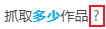

## 显示高级设置


控制是否显示高级设置。

默认未启用，也就是不会显示高级设置。这样会让界面更加简洁，避免用户因为选项过多而困扰。

?>被隐藏的设置只是在视觉上进行了隐藏，它们仍然会发挥作用。

## 抓取多少作品

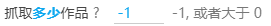

某些页面的下载以作品为单位，此时就会显示这个设置。你可以设置你要**下载多少个作品**。

在作品页面里，下载是从当前作品开始的（包含当前作品）。如果你设置作品数量为 1，那就是只抓取当前作品。

?>默认值的 -1 表示不限制抓取数量。

*这个设置的右侧会显示一些灰色文字，用来提示可输入的数字的范围。在不同的页面里，这些范围可能有所不同。*

## 抓取多少页面

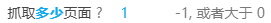

当你处于**列表页**时，会看到这个设置。你可以设置你要**下载多少页**。

列表页的下载是**从当前页面开始**（包含当前页面），向下抓取的。

如果你设置抓取的页面数量为 1，那就是只抓取当前页面。

如果你处于第 10 页，就会从第 10 页（含第 10 页）开始下载，而不是从第 1 页开始下载。

?>默认值的 -1 表示不限制抓取数量。

*这个设置的右侧会显示一些灰色文字，用来提示可输入的数字的范围。在不同的页面里，这些范围可能有所不同。*

## 作品类型


```
作品类型  ✓插画  ✓漫画  ✓动图  ✓小说
```

作品类型选项用来筛选你想要下载的作品类型。未被勾选的作品类型不会被下载。

## 年龄限制


```
年龄限制  ✓全年龄  ✓R-18  ✓R-18G 
```

你可以根据分级限制来筛选作品。

## AI 作品


```
AI 作品  ✓AI 生成  ✓非 AI 生成  ✓未知
```

你可以根据作品是否是 AI 生成的来筛选作品。

现在新投稿作品时，插画、漫画、动图必须选择是否为 AI 生成。小说投稿可选是否为 AI 生成。

所以下载器可以根据作品的这个标记判断作品是否是 AI 生成的。

但是有些作品没有这个标记，所以它们是 `未知` 的。这通常是早期作品，因为早期 AI 生成图像的技术没有广泛流传，当时 Pixiv 没有要求作品添加标记，下载器也就无法判断它是不是 AI 生成的。一般来说可以把“未知”当做非 AI 生成的作品来看待。

## 收藏状态


```
收藏状态  ✓未收藏  ✓已收藏
```

你可以根据作品的收藏状态来筛选作品。

## 图片色彩

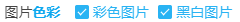

```
图片色彩  ✓彩色图片 ✓黑白图片
```

你可以根据图片的颜色来筛选作品。

如果你设置了过滤彩色或黑白图片，过滤器会检查图片的平均颜色，判断这个图片是彩色的还是黑白的。

下载器在抓取时和下载时都会检查此设置。

?>有些图片虽然大部分是黑白的，但还是带有一些彩色，这样的图片是彩色图片，不属于黑白图片。

?>如果下载时某个文件因为颜色而被排除，日志里会显示对应的提示。例如：

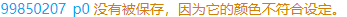

### 技术细节

下载器会把图片分成 4 部分，分别检查每个部分的颜色。

如果有一个部分是彩色，就判断这张图片为彩色图片。

如果所有部分都是黑白的，才会判断为黑白图片。

## 图片数量


```
图片数量  ✓单图作品  ✓多图作品
```

单图作品指只有一张图片的作品。多图作品是指包含有多张图片的作品。

## 多图作品只下载前几张图片

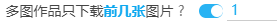

你可以只下载多图作品的前几张图片。

有些时候，多图作品的第一张图片是最有价值的。例如第一张图是彩色图片，后面是黑白图片。这时候就可以设置数字为 1，只下载第 1 张图片。

如果你想避免下载到太多的图片，也可以使用此设置。

?>如果设置的数字大于作品的图片数量，将会全部下载。等同于没有限制数量。

## 多图作品的图片数量上限


下载器在抓取作品时，如果某个多图作品里的图片数量超过了设置值，就不会抓取这个作品。

默认未启用。

## 收藏数量

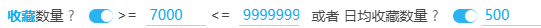

收藏数量指的是有多少个人收藏了这个作品。收藏数量越高，作品的价值也就越高。

这个设置有两种选项：

1. 收藏数量
2. 日均收藏数量

只要作品满足这两种选项中的**任意一种**，就会被下载。

默认只启用了收藏数量。你可以手动启用“日均收藏数量”。

### 日均收藏数量

日均收藏数量是 `收藏数 / 作品发布天数` 得到的，设计目的是优化对新发布的作品的抓取，尤其是发布时间不到一天的作品。

有一些近期投稿的作品，虽然质量高，但因为发布时间短，收藏数量比较低，就可以考虑使用这个设置来抓取。

例如一个作品发布了 6 个小时，有 500 收藏，日均收藏数量会被估算为 2000。如果你设置的日均收藏数量在 `2000` 左右，就可以抓取到它。

?>如果一个作品的发表时间小于 4 个小时，下载器不会估算它在 24 小时内的收藏数量，因为这很不准确。如果它在 4 小时内的收藏数量已经达到了“日均收藏数量”的要求，下载器就会保留它；否则就排除它。

“日均收藏数量”是一个可选的设置，它应该作为补充的设置，而不是唯一的设置。这是因为**日均收藏数量对发布时间比较长的作品不公平**。

作品的收藏数量增长是一个曲线。一般来说作品刚发布之后的一段时间内每日收藏数量增长较快；发布一段时间之后，每日收藏数量会降低。

设想如下情况：

- 作品 A 发布 1 天，收藏数量为 30。日均 30。
- 作品 B 发布 5 年，收藏数量 50000。日均 27。

在比较日均收藏数量时，高质量的作品 B 低于普通质量的作品 A。这可能不符合你的预期。

你可以通过某些方法单独使用“日均收藏数量”。首先把最小值、最大值设置为一个不可能的数字 `999999 - 9999999`，再设置“日均收藏数量”，这样实际上就是单独使用“日均收藏数量”。

?>除非你明白自己要做什么，否则不要单独使用“日均收藏数量”。

## 图片的宽高

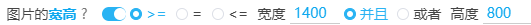

图片具有宽度（width）和高度（height）。这个选项设置你想要下载的图片的宽高条件，不符合此条件的图片不会下载。

**提示：**

- 要求图片的宽高 `>=` 或者 `=` 或者 `<=` 你设置的值。
- 第一个输入框设置宽度，第二个输入框设置高度。
- 选择 `并且`，表示图片的宽高要同时符合设置的宽高。
- 选择 `或者`，表示图片的宽高要只需要符合宽高设置中的任意一个。
- 宽度和高度的默认值都是 0，表示不限制。

?>例如，我们可以设置 `>= 宽度 1920 并且 高度 1080` 来筛选适合做电脑壁纸的图片。

## 图片的宽高比例

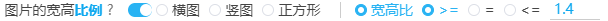

你可以设置下载指定形状的图片：

横图、竖图、正方形。

?>横图的宽度大于高度。竖图的宽度小于高度。

你也可以手动设置图片宽高比的范围。

?>宽高比是宽度除以高度得到的数字。宽高比小于 1 时，图片是竖图。宽高比大于 1 时，图片是横图。宽高比越大，图片越显得扁长。

## ID 范围


你可以设置只下载大于某个 id 的作品，或者小于某个 id 的作品。

?>作品的 id 是递增的，越早投稿的作品 id 越小。

这有助于进行增量更新。例如：

上次下载的文件里，最大的 id 是 65000000，想要下载在它之后投稿的作品，可以设置 id 范围大于 65000000，然后开始抓取。

## 投稿时间


你可以设置只下载某个时间范围里投稿的作品。

------

>pixiv 上的第一幅插画是 https://www.pixiv.net/artworks/20 ，发表时间是 `"2007-09-09T13:14:07+00:00"`

### 小技巧

这有助于进行增量更新。例如：

上次下载的文件的截至日期是 2020 年 1 月 1 日，当你在同一页面再次下载时，你可以设置投稿时间的起点为 2020 年 1 月 1 日，终点为现在（或者未来）的时间，就可以只下载这段时间里更新的作品。

------

如果你只想设置一个时间作为起点或者终点，那么另外一个时间应该怎么设置呢？

例如，我要下载 2010 年之前的作品。那么我们可以把起始时间设置为早于 pixiv 创建日期的时间。

```
2000 年 1 月 1 日 - 2010 年 1 月 1 日
```

如果我要下载 2020 年之后的作品，那么我们可以把终点设置为未来的时间。

```
2020 年 1 月 1 日 - 2100 年 1 月 1 日
```

## 必须含有标签


默认未启用。

你可以设置抓取的作品必须包含某些标签。没有这些标签的作品不会被抓取。

标签（或称“tag”）指的是作品简介下方的 Tag 列表：

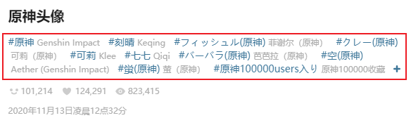

### 全部

如果你输入了多个标签，“全部”选项要求每个作品都必须同时含有这些标签。

### 任一

如果你输入了多个标签，“任一”选项表示要求每个作品只要含有其中一个标签即可。

**提醒：**

- 你可以添加多个标签，中间用**英文逗号** `,` 分割。
- **不区分大小写**。
-标签是严格的**全字匹配**。例如你设置了“東方Project”，而某个作品的标签里只有“東方”，那么它是不符合条件的。反过来也是如此。
- 如果设置了多个标签，下载器会根据“全部”或者“任一”设置来判断作品是否符合要求。
- 推荐使用日文（原本的）tag。不推荐使用翻译后的标签。

--------

举个例子，`东方 Project` 的作品有时候标签不一致，常见的可能有以下三种：

```東方Project,東方,東方プロジェクト```

有的作品可能只有其中一个标签，所以只搜索一个标签是不完整的。你可以把这三个标签全部填入，然后设置模式为“任一”，这样就不容易漏掉`东方 Project` 的作品了。

## 不能含有标签

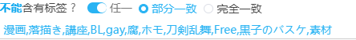

你可以设置抓取的作品里不能包含某些标签。如果作品有某个标签符合此条件，那么它就不会被抓取。

默认未启用。

**提醒：**

- 你可以添加多个标签，中间用**英文逗号** `,` 分割。
- 如果设置了多个标签，那么作品**只要符合其中任意一个**，就不会被下载。
- **不区分大小写**。
- “不能含有标签”的优先级高于“必须含有标签”。如果一个作品符合“必须含有标签”的条件，也符合“不能含有标签”的条件，那么它不会被下载。
- 推荐使用日文（原本的）tag。不推荐使用翻译后的标签。

### 匹配模式

匹配模式分为“部分一致”和“完全一致”。默认使用“完全一致”。

“完全一致”会使用作品的标签与用户设置的标签进行对比，要求两个标签完全相同。

“部分一致”只需要作品的标签里包含用户设置的标签即可，不需要完全相等。

举个例子：抓取结果中可能有一些腐向（BL）作品，如果你想排除它们，会有一些困难。因为腐向作品的标签有很多，而且还在不断增加中。

如果使用“完全一致”，你必须设置完整的标签，例如：

```
BL,腐向け,腐向けHQ,Free!,腐ree!,BL松,刀剣乱舞,刀剣乱腐,黒子のバスケ,鬼灯の腐向け,創作BL,◆A【腐】,腐術廻戦,dcst腐向け
```

如果使用“部分一致”，你只需要设置一些出现频率高的关键字，就能排除大部分腐向作品。如：

```
BL,腐
```

**注意：**

!>“部分一致”不是完全准确的，在某些情况下，会发生错误的排除。例如设置 `BL` 可能会导致含有 `blue`标签的作品被排除。

如果你很在意准确度，请使用“完全一致”模式。

---------

我常用的排除列表主要排除腐向作品。如下：

```
落描き,講座,BL,腐,ホモ,腐向け,腐向けHQ,Free!,腐ree!,BL松,刀剣乱舞,刀剣乱腐,黒子のバスケ,鬼灯の腐向け,創作BL,◆A【腐】
```

附带群内大佬提供的一个更加全面的列表，主要排除了腐向、讲座、素材的标签：

```
A腐リー,A腐リー1000users入り,BL,BLACKLAGOON,BLEACH,BLEACH1000users入り,BLEACH100users入り,BLEACH500users入り,BL松,BL松10000users入り,BL松1000users入り,BL松100users入り,BL松5000users入り,BL松500users入り,BL松派生,DBH【腐】,FGO(腐),Fate(腐),Fate(腐)1000users入り,Fate(腐)100users入り,Fate(腐)500users入り,Fate/GO(腐),Fate/GO(腐)10000users入り,Fate/GO(腐)1000users入り,Fate/GO(腐)100users入り,Fate/GO(腐)5000users入り,Fate/GO(腐)500users入り,Fate/GrandOrder(腐),Fate/Zero(腐),Fate/Zero(腐)1000users入り,Fate/zero(腐),HUNTER×HUNTER,HUNTER×HUNTER1000users入り,HUNTER×HUNTER100users入り,HUNTER×HUNTER500users入り,H×H【BL】1000users入り,H×H【腐】,JOJO【腐】,JOJO【腐】1000users入り,JOJO【腐】100users入り,JOJO【腐】250users入り,JOJO【腐】3000users入り,JOJO【腐】5000users入り,JOJO【腐】500users入り,K(腐),K(腐)/1000users入り,K(腐)/100users入り,K(腐)/500users入り,NARUTO,NARUTO10000users入り,NARUTO1000users入り,NARUTO100users入り,NARUTO5000users入り,NARUTO500users入り,NARUTO【腐】,NARUTO【腐】,NARUTO【腐】1000users入り,NARUTO【腐】1000users入り,NARUTO【腐】100users入り,NARUTO【腐】100users入り,NARUTO【腐】500users入り,NARUTO【腐】500users入り,ONEPIECE,TF腐向け,TIGER&BUNNY,YOI【腐】,dcst腐向け,futa,futanari,hrak【腐】,hrak【腐】10000users入り,hrak【腐】1000users入り,hrak【腐】100users入り,hrak【腐】3000users入り,hrak【腐】5000users入り,hrak【腐】500users入り,pkmn腐,pkmn腐1000users入り,pkmn腐5000users入り,◆A【腐】,◆A【腐】1000users入り,◆A【腐】100users入り,◆A【腐】500users入り,【玉鋼学園】男子生徒,【腐】A/Z,あんさんぶるスターズ,あんさんぶるスターズ!,あんさん腐るスターズ!,うたの☆プリンスさまっ♪,うた腐り,うた腐リ,おそ松,おそ松(長男),おそ松さん,おそ松さん10000users入り,おそ松さん1000users入り,おそ松さん100users入り,おそ松さん5000users入り,おそ松さん500users入り,おそ松兄さんマジ兄さん,おそ松総受け,なにこれイケメン,なにこれ男の子かわいい,ふた×男,ふたなり,ふたなりっ娘にお尻掘られたい,ふたゆり,まじコナ腐10000users入り,まじコナ腐1000users入り,まじコナ腐100users入り,まじコナ腐3000users入り,まじコナ腐5000users入り,まじコナ腐500users入り,まじコナ腐向け,アイドリッシュセ腐ン,アルミン・アルレルト,イケメン,イズ(仮面ライダーゼロワン),イナイレ[腐],イナギャラ[腐],イナゴ[腐],イナズマイレブン,イナズマイレブンGO,イナズマイレブンGOギャラクシー,イナズマイレブンGOクロノ・ストーン,イメージレスポンス用素材,エムマス【腐】,エムマス【腐】100users入り,オリジナルBL,カゲロウプロジェクト,カゲ腐ロ,ガチホモ,グラ腐ル,グラ腐ル1000users入り,グラ腐ル100users入り,グラ腐ル500users入り,ケモホモ,サ腐マス,シーメール,ジョジョ,ジョジョ10000users入り,ジョジョ1000users入り,ジョジョ100users入り,ジョジョ250users入り,ジョジョ5000users入り,ジョジョ500users入り,ジョジョの奇妙な冒険,ジョジョパロ,ジョジョ立ち,ス腐ラトゥーン,ダイヤのA,ダン戦[腐],ツイ腐テ,ツイ腐テ1000users入り,ツイ腐テ5000users入り,テイルズ【腐向け】1000users入り,テイルズ【腐向け】100users入り,テイルズ【腐向け】500users入り,テニスの王子様,テニ腐リ,テライケメン,ディズニー,ディズニー1000users入り,ディズニー100users入り,ディズニー5000users入り,ディズニー500users入り,デジモンアドベンチャー,ハイキュー,ハイキュー!!,ハイキュー!!10000users入り,ハイキュー!!1000users入り,ハイキュー!!100users入り,ハイキュー!!5000users入り,ハイキュー!!500users入り,ハリー・ポッター,ハンター,ハンターハンター,パンツ男子,ヒプノシスマイク,ヒロアカ【腐】,ヒ腐マイ,ヒ腐マイ10000users入り,ヒ腐マイ1000users入り,ヒ腐マイ100users入り,ヒ腐マイ5000users入り,ヒ腐マイ500users入り,ピカチュウ,ピクファンイケメン,フリー素材,フリー素材10000users入り,フリー素材1000users入り,フリー素材100users入り,フリー素材5000users入り,フリー素材500users入り,ブラシ素材,ヘタリア,ヘタリア10000users入り,ヘタリア1000users入り,ヘタリア100users入り,ヘタリア5000users入り,ヘタリア500users入り,ヘタリアMMD,ヘタリア★ハロウィン,ヘタリア三次創作,ヘタリア杯,ホモ,ホモと野獣,メイド少年,メガネ男子,メス男子,モンスターハンター,モンスターハンターワールド,モンハン,モンハン1000users入り,モンハン100users入り,モンハン500users入り,モンハンどうでしょう,モ腐サイコ100,モ腐サイコ1000users入り,モ腐サイコ100users入り,モ腐サイコ500users入り,ユーリ!!!onICE,リヴァイ班,ワートリ【腐】,ワートリ【腐】1000users入り,ワートリ【腐】100users入り,ワートリ【腐】500users入り,ヴァンガ【腐】,一撃男【腐】,一撃男【腐】1000users入り,一撃男【腐】100users入り,一撃男【腐】500users入り,一方通行,仮面ライダー,仮面ライダー1000users入り,仮面ライダー100users入り,仮面ライダー500users入り,仮面ライダー555,仮面ライダーOOO,仮面ライダーW,仮面ライダーウィザード,仮面ライダーエグゼイド,仮面ライダーオーズ,仮面ライダークウガ,仮面ライダーゴースト,仮面ライダージオウ,仮面ライダーゼロワン,仮面ライダーディケイド,仮面ライダードライブ,仮面ライダービルド,仮面ライダーフォーゼ,仮面ライダー剣,仮面ライダー鎧武,仮面ライダー電王,仮面ライダー龍騎,僕のヒーローアカデミア,僕のヒーローアカデミア10000users入り,僕のヒーローアカデミア1000users入り,僕のヒーローアカデミア100users入り,僕のヒーローアカデミア5000users入り,僕のヒーローアカデミア500users入り,兄貴,冥腐ヘヨゥコソ!,冨岡義勇,刀剣乱腐,刀剣乱腐10000users入り,刀剣乱腐1000users入り,刀剣乱腐100users入り,刀剣乱腐3000users入り,刀剣乱腐5000users入り,刀剣乱腐500users入り,刀剣乱舞,刀剣乱舞10000users入り,刀剣乱舞1000users入り,刀剣乱舞100users入り,刀剣乱舞3000users入り,刀剣乱舞5000users入り,刀剣乱舞500users入り,創作BL,創作BL10000users入り,創作BL1000users入り,創作BL100users入り,創作BL3000users入り,創作BL5000users入り,創作BL500users入り,創作男女,創作男女10000users入り,創作男女1000users入り,創作男女100users入り,創作男女5000users入り,創作男女500users入り,動物,動物の仔,名探偵コナン,商業BL,善炭,土方十四郎,土方歳三,土方歳三(Fate),地獄の仮面ライダー,地縛少年花子くん,夏目友人帳,夏目友人帳1000users入り,奥村燐,女装少年,女装男子,宇善,宇宙兄弟,家庭教師ヒットマンREBORN!,小説用フリー素材,少年,弱虫ペダル,弱虫ペダル10000users入り,弱虫ペダル1000users入り,弱虫ペダル100users入り,弱虫ペダル5000users入り,弱虫ペダル500users入り,弾丸論破【腐】,心象風景,忍玉-腐,忍玉-腐1000users入り,忍玉-腐100users入り,忍玉-腐5000users入り,忍玉-腐500users入り,忍玉‐腐,愛がなきゃ描けない,戦国BASARA,戦国BASARA1000users入り,戦国BASARA100users入り,戦国BASARA3,戦国BASARA500users入り,描き方,文アル【腐】,文スト【腐】,文スト【腐】1000users入り,新弾丸論破V3【腐】,新弾丸論破V3【腐】1000users入り,東京腐種,東京腐種1000users入り,東方旧作,東方耽美郷,東方集合絵,架空動物種,残念なイケメン,殺生丸,江戸川コナン,漫画素材,漫画素材工房,煉炭,牧春,特撮,獄変【腐】,男の娘,男の娘×女の子,男の娘キリト,男の子,男の潮吹き,男の肥満化,男子,男子おっぱい,男子高校生,男子高校生の日常,真選組,眼鏡男子,立ち絵素材,第腐人格,第腐人格1000users入り,素材,美L【腐】,美少年,美男子,義炭,耽美,背景素材,腐,腐ree!,腐ペダ,腐ロメア,腐ロメア1000users入り,腐向,腐向け,腐向けHQ,腐向けJG,腐向けヘタリア,腐向けヘタリア,腐女子,腐川冬子,腐滅の刃,腐滅の刃10000users入り,腐滅の刃1000users入り,腐滅の刃100users入り,腐滅の刃5000users入り,腐滅の刃500users入り,腐界戦線,腐界戦線1000users入り,腐界戦線100users入り,腐界戦線5000users入り,腐界戦線500users入り,腐術廻戦,自称初投稿兄貴,衛宮切嗣,講座,講座10000users入り,講座1000users入り,講座100users入り,講座5000users入り,講座500users入り,超弾丸論破2【腐】,超弾丸論破2【腐】1000users入り,超弾丸論破2【腐】100users入り,逢魔ヶ刻動物園,進撃の腐人,進撃の腐人10000users入り,進撃の腐人1000users入り,進撃の腐人100users入り,進撃の腐人3000users入り,進撃の腐人5000users入り,進撃の腐人500users入り,金カム腐,金カム腐1000users入り,金木研,鉄血のオル腐ェンズ,鉄血のオル腐ェンズ100users入り,長髪男子,雄っぱい,青の祓魔師,風景,風景10000users入り,風景1000users入り,風景100users入り,風景3000users入り,風景5000users入り,風景500users入り,風景画,食戟【腐】,鬼灯の冷徹,鬼灯の冷徹1000users入り,鬼灯の冷徹100users入り,鬼灯の冷徹500users入り,鬼灯の腐向け,鬼灯の腐向け1000users入り,鬼灯の腐向け100users入り,鬼灯の腐向け5000users入り,鬼灯の腐向け500users入り,鶴丸国永(刀剣乱舞),黒バス【腐】,黒子のバスケ
```
