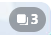

# 设置-抓取

下载器的**抓取**标签页用于设置抓取范围和过滤条件。

有些选项后面有一个问号，把鼠标放到选项上会显示简单的提示，例如：


## 显示高级设置

<p class="option" data-no="51" style="display: flex;">
    <span class="has_tip settingNameStyle1" data-xztip="_显示高级设置说明" data-tip="下载器默认隐藏了一些设置。点击以显示所有设置。&lt;br&gt;被隐藏的设置依然会生效。">
    <span data-xztext="_显示高级设置">显示<span class="key">高级</span>设置</span>
    <span class="gray1"> ? </span>
    </span>
    <input type="checkbox" name="showAdvancedSettings" class="need_beautify checkbox_switch">
    <span class="beautify_switch" tabindex="0"></span>
    </p>

控制是否显示高级设置。

默认未启用，也就是不会显示高级设置。

因为下载器的选项太多了，所以我默认隐藏了一些不太常用的选项，让界面更加简洁，并且避免新用户因为看到太多选项而无从下手。

?>被隐藏的设置仍然会正常发挥作用。

## 抓取多少作品

<p class="option" data-no="1" style="display: flex;">
    <span class="settingNameStyle1"><span class="setWantPageTip1 has_tip" data-xztip="_从本页开始下载提示" data-xztext="_抓取多少作品" data-tip="从当前页面开始下载。&lt;br&gt;如果要限制下载的页数，请输入从 1 开始的数字。&lt;br&gt;1 为仅下载本页，-1 为下载所有页面。">抓取<span class="key">多少</span>作品</span><span class="gray1"> ? </span>
    </span>
    <input type="text" name="setWantPage" class="setinput_style1 blue setWantPage" value="-1">
    &nbsp;
    <button class="textButton grayButton" type="button" id="setMin">1</button>
    &nbsp;
    <button class="textButton grayButton" type="button" id="setMax">-1</button>
    &nbsp;
    <span class="setWantPageTip2 gray1" data-xztext="_数字提示1">-1, 或者大于 0</span>
    </p>

某些页面的下载**以作品为单位**，此时就会显示这个设置。你可以设置下载多少个作品。

?>这个设置的右侧会显示一些灰色文字，用来提示可输入的数字的范围。在不同的页面里，这些范围可能有所不同。

- 在**插画或小说的作品页面**里，下载是从当前作品开始抓取的（包含当前作品）。设置为 1 只会抓取当前作品。设置为 -1 表示不限制抓取数量，下载器会从当前作品开始，抓取到最后一个作品。

- 在**其他页面**里（例如排行榜、关注的用户的新作品页面），下载器会从这一页的第一个作品开始抓取。设置为 1 只会抓取第 1 个作品。设置为 -1 表示抓取当前页面里的所有作品。

## 抓取多少页面

<p class="option" data-no="1" style="display: flex;">
    <span class="settingNameStyle1"><span class="setWantPageTip1 has_tip" data-xztip="_从本页开始下载提示" data-xztext="_抓取多少页面" data-tip="从当前页面开始下载。&lt;br&gt;如果要限制下载的页数，请输入从 1 开始的数字。&lt;br&gt;1 为仅下载本页，-1 为下载所有页面。">抓取<span class="key">多少</span>页面</span><span class="gray1"> ? </span>
    </span>
    <input type="text" name="setWantPage" class="setinput_style1 blue setWantPage" value="-1">
    &nbsp;
    <button class="textButton grayButton" type="button" id="setMin">1</button>
    &nbsp;
    <button class="textButton grayButton" type="button" id="setMax">-1</button>
    &nbsp;
    <span class="setWantPageTip2 gray1" data-xztext="_数字提示1">-1, 或者大于 0</span>
    </p>

当你处于一些**有页码的列表页**时，会看到这个设置。你可以设置你要下载多少页。

?>这个设置的右侧会显示一些灰色文字，用来提示可输入的数字的范围。在不同的页面里，这些范围可能有所不同。

下载器总是**从当前页面**（包含当前页面）开始抓取的。如果你在第 1 页，下载器就会从第 1 页开始抓取。如果你在第 2 页，下载器就会从第 2 页开始抓取。

- 设置为 1 只会抓取这一页里的作品。
- 设置为 2 会抓取这一页和下一页，以此类推。
- 设置为 -1 会使下载器从这一页抓取到最后一页。

### 小技巧：拆分任务

如果你需要抓取大量页面，可以考虑把这个任务拆分成多次，以减小意外情况带来的损失（例如抓取过程中意外关闭标签页，或者抓取卡住）。

假如你要抓取 1000 页，可以这样做：

1. 设置抓取的页数为 100，然后从第 1 页开始抓取。下载器会抓取第 0 - 100 页里的作品。
2. 下载完成后，跳转到第 101 页，开始下一次抓取。下载器会抓取第 101 - 200 页里的作品。
3. 以此类推。

## 作品类型

<p class="option" data-no="2" style="display: flex;">
    <span class="settingNameStyle1">
    <span data-xztext="_作品类型">作品<span class="key">类型</span></span>
    </span>
    <input type="checkbox" name="downType0" id="setWorkType0" class="need_beautify checkbox_common" checked="">
    <span class="beautify_checkbox" tabindex="0" aria-labelledby="setWorkType0"></span>
    <label for="setWorkType0" data-xztext="_插画" class="active">插画</label>
    <input type="checkbox" name="downType1" id="setWorkType1" class="need_beautify checkbox_common" checked="">
    <span class="beautify_checkbox" tabindex="0" data-xztitle="_漫画" title="漫画"></span>
    <label for="setWorkType1" data-xztext="_漫画" class="active">漫画</label>
    <input type="checkbox" name="downType2" id="setWorkType2" class="need_beautify checkbox_common" checked="">
    <span class="beautify_checkbox" tabindex="0"></span>
    <label for="setWorkType2" data-xztext="_动图" class="active">动图</label>
    <input type="checkbox" name="downType3" id="setWorkType3" class="need_beautify checkbox_common" checked="">
    <span class="beautify_checkbox" tabindex="0"></span>
    <label for="setWorkType3" data-xztext="_小说" class="active">小说</label>
    </p>

该设置可以筛选你想要下载的作品类型。

下载器在抓取时会检查每个作品的类型，排除不符合条件的作品。

## 年龄限制

<p class="option" data-no="44" style="display: flex;">
    <span class="settingNameStyle1">
    <span data-xztext="_年龄限制"><span class="key">年龄</span>限制</span>
    </span>
    <input type="checkbox" name="downAllAges" id="downAllAges" class="need_beautify checkbox_common" checked="">
    <span class="beautify_checkbox" tabindex="0"></span>
    <label for="downAllAges" data-xztext="_全年龄" class="active">全年龄</label>
    <input type="checkbox" name="downR18" id="downR18" class="need_beautify checkbox_common" checked="">
    <span class="beautify_checkbox" tabindex="0"></span>
    <label for="downR18" class="active"> R-18</label>
    <input type="checkbox" name="downR18G" id="downR18G" class="need_beautify checkbox_common" checked="">
    <span class="beautify_checkbox" tabindex="0"></span>
    <label for="downR18G" class="active"> R-18G</label>
    </p>

你可以根据分级限制来筛选作品。

下载器在抓取时会检查每个作品的年龄限制，排除不符合条件的作品。

## AI 作品

<p class="option" data-no="81" style="display: flex;">
    <span class="settingNameStyle1">
    <span data-xztext="_AI作品"><span class="key">AI</span> 作品</span>
    </span>
    <input type="checkbox" name="AIGenerated" id="AIGenerated" class="need_beautify checkbox_common" checked="">
    <span class="beautify_checkbox" tabindex="0"></span>
    <label for="AIGenerated" data-xztext="_AI生成" class="active">AI 生成</label>
    <input type="checkbox" name="notAIGenerated" id="notAIGenerated" class="need_beautify checkbox_common" checked="">
    <span class="beautify_checkbox" tabindex="0"></span>
    <label for="notAIGenerated" data-xztext="_非AI生成" class="active">非 AI 生成</label>
    <input type="checkbox" name="UnknownAI" id="UnknownAI" class="need_beautify checkbox_common" checked="">
    <span class="beautify_checkbox" tabindex="0"></span>
    <label for="UnknownAI" data-xztext="_未知" class="has_tip active" data-xztip="_AI未知作品的说明" data-tip="早期作品没有标记，无法判断">未知</label>
    </p>

你可以根据作品是否由 AI 生成来筛选作品。

下载器在抓取时会检查每个作品的 AI 标记，排除不符合条件的作品。

--------

现在新投稿作品时，插画、漫画、动图必须选择是否为 AI 生成。小说投稿可选是否为 AI 生成。所以下载器可以判断这些作品是否是 AI 生成的。

但是有些作品没有这个标记，所以它们是 `未知` 类型。这通常是早期作品，因为早期 AI 生成图像的技术没有广泛流传，当时 Pixiv 没有要求作品添加标记，下载器也就无法判断它是不是 AI 生成的。一般来说可以把“未知”当做非 AI 生成的作品来看待。

## 收藏状态

<p class="option" data-no="6" style="display: flex;">
    <span class="settingNameStyle1">
    <span data-xztext="_收藏状态"><span class="key">收藏</span>状态</span>
    </span>
    <input type="checkbox" name="downNotBookmarked" id="setDownNotBookmarked" class="need_beautify checkbox_common" checked="">
    <span class="beautify_checkbox" tabindex="0"></span>
    <label for="setDownNotBookmarked" data-xztext="_未收藏" class="active">未收藏</label>
    <input type="checkbox" name="downBookmarked" id="setDownBookmarked" class="need_beautify checkbox_common" checked="">
    <span class="beautify_checkbox" tabindex="0"></span>
    <label for="setDownBookmarked" data-xztext="_已收藏" class="active">已收藏</label>
    </p>

你可以根据作品的收藏状态来筛选作品。

下载器在抓取时会检查每个作品是否被你收藏，排除不符合条件的作品。

## 图片色彩

<p class="option" data-no="23" style="display: flex;">
    <span class="settingNameStyle1">
    <span data-xztext="_图片色彩">图片<span class="key">色彩</span></span>
    </span>
    <input type="checkbox" name="downColorImg" id="setDownColorImg" class="need_beautify checkbox_common" checked="">
    <span class="beautify_checkbox" tabindex="0"></span>
    <label for="setDownColorImg" data-xztext="_彩色图片" class="active">彩色图片</label>
    <input type="checkbox" name="downBlackWhiteImg" id="setDownBlackWhiteImg" class="need_beautify checkbox_common" checked="">
    <span class="beautify_checkbox" tabindex="0"></span>
    <label for="setDownBlackWhiteImg" data-xztext="_黑白图片" class="active">黑白图片</label>
    </p>

你可以根据图片的颜色来筛选作品。

如果你设置了过滤彩色或黑白图片，过滤器会检查图片的平均颜色，判断这个图片是彩色的还是黑白的。一个常见的适用场景是排除黑白的漫画图片。

下载器在抓取时和下载时都会检查此设置。

?>有些图片虽然大部分是黑白的，但还是带有一些彩色，这样的图片是彩色图片，不属于黑白图片。

下载时，如果某个文件因为颜色而被排除，日志里会显示对应的提示。例如：

<span class="log" style="color: rgb(210, 126, 0);"><a href="https://www.pixiv.net/i/134469561#1" target="_blank">134469561_p0</a> 没有被保存，因为它的颜色不符合设定。<br></span>

### 技术细节

下载器会把图片分成 4 部分，分别检查每个部分的颜色。如果有一个部分是彩色，就判断这张图片为彩色图片。如果所有部分都是黑白的，才会判断为黑白图片。

这是个粗略的方法，极端情况下偶尔会产生误判。

## 图片数量

<p class="option" data-no="21" style="display: flex;">
    <span class="settingNameStyle1">
    <span data-xztext="_图片数量">图片<span class="key">数量</span></span>
    </span>
    <input type="checkbox" name="downSingleImg" id="setDownSingleImg" class="need_beautify checkbox_common" checked="">
    <span class="beautify_checkbox" tabindex="0"></span>
    <label for="setDownSingleImg" data-xztext="_单图作品" class="active">单图作品</label>
    <input type="checkbox" name="downMultiImg" id="setDownMultiImg" class="need_beautify checkbox_common" checked="">
    <span class="beautify_checkbox" tabindex="0"></span>
    <label for="setDownMultiImg" data-xztext="_多图作品" class="active">多图作品</label>
    </p>

你可以根据图片数量来筛选作品。

下载器在抓取时会检查此设置，排除不符合条件的作品。

单图作品指只有一张图片的作品；多图作品是指包含有多张图片的作品，它们通常在右上角有标记，例如：



## 多图作品只下载前几张图片

<p class="option" data-no="3" style="display: flex;">
    <span class="has_tip settingNameStyle1" data-xztip="_必须大于0" data-tip="必须大于 0">
    <span data-xztext="_多图作品只下载前几张图片">多图作品只下载<span class="key">前几张</span>图片</span>
    <span class="gray1"> ? </span>
    </span>
    <input type="checkbox" name="firstFewImagesSwitch" class="need_beautify checkbox_switch">
    <span class="beautify_switch" tabindex="0"></span>
    <span class="subOptionWrap" data-show="firstFewImagesSwitch" style="display: none;">
    <input type="text" name="firstFewImages" class="setinput_style1 blue" value="1">
    </span>
    </p>

你可以只下载多图作品的前几张图片。

-------

有些多图作品的第一张图片是最有价值的。例如第一张图是彩色图片，后面是黑白图片或者宣传图。这时候就可以设置数字为 1，只下载第 1 张图片。

如果你想避免下载到太多的图片，也可以使用此设置。

?>如果设置的数字大于等于作品的图片数量，下载器会保存所有图片，等同于没有限制数量。

## 多图作品的图片数量上限

<p class="option" data-no="47" style="display: flex;">
    <span class="has_tip settingNameStyle1" data-xztip="_超出此限制的多图作品不会被下载" data-tip="超出此限制的多图作品不会被下载">
    <span data-xztext="_多图作品的图片数量上限">多图作品的图片<span class="key">数量</span>上限</span>
    <span class="gray1"> ? </span>
    </span>
    <input type="checkbox" name="multiImageWorkImageLimitSwitch" class="need_beautify checkbox_switch">
    <span class="beautify_switch" tabindex="0"></span>
    <span class="subOptionWrap" data-show="multiImageWorkImageLimitSwitch" style="display: none;">
    &lt;=&nbsp;
    <input type="text" name="multiImageWorkImageLimit" class="setinput_style1 blue" value="1">
    </span>
    </p>

如果某个多图作品里的图片数量大于设置的数字，下载器就不会抓取这个作品。

## 收藏数量

<p class="option" data-no="5" style="display: flex;">
    <span class="has_tip settingNameStyle1" data-xztip="_设置收藏数量的提示" data-tip="如果作品的收藏数小于设置的数字，作品不会被下载。">
    <span data-xztext="_收藏数量"><span class="key">收藏</span>数量</span>
    <span class="gray1"> ? </span>
    </span>
    <input type="checkbox" name="BMKNumSwitch" class="need_beautify checkbox_switch">
    <span class="beautify_switch" tabindex="0"></span>
    <span class="subOptionWrap" data-show="BMKNumSwitch" style="display: none;">
    &gt;=&nbsp;
    <input type="text" name="BMKNumMin" class="setinput_style1 blue bmkNum" value="0">
    &lt;=&nbsp;
    <input type="text" name="BMKNumMax" class="setinput_style1 blue bmkNum" value="9999999">
&nbsp;<span data-xztext="_或者"> 或者 </span>
    <span class="has_tip settingNameStyle1" data-xztip="_日均收藏数量的提示" data-tip="你可以设置作品的平均每日收藏数量。满足条件的作品会被下载。">
    <span data-xztext="_日均收藏数量">日均收藏数量</span>
    <span class="gray1"> ? </span>
    </span>
    <input type="checkbox" name="BMKNumAverageSwitch" class="need_beautify checkbox_switch">
    <span class="beautify_switch" tabindex="0"></span>
    <span class="subOptionWrap" data-show="BMKNumAverageSwitch" style="display: none;">
    &gt;=&nbsp;
    <input type="text" name="BMKNumAverage" class="setinput_style1 blue bmkNum" value="600">
    </span>
    </span>
    </p>

收藏数量是指有多少个人收藏了这个作品。收藏数量越高，作品的价值也就越高。

这个设置有两种选项：

1. 收藏数量（即总数）
2. 日均收藏数量

只要作品满足这两种选项中的**任意一种**，就会被下载。

### 日均收藏数量

日均收藏数量是 `收藏数量 / 作品发布天数` 得到的，设计目的是优化对新发布的作品的抓取，尤其是发布时间不到一天的作品。

有一些近期投稿的作品，虽然质量高，但因为发布时间短，收藏数量比较低，就可以考虑使用这个设置来抓取。

例如一个作品发布了 6 个小时，有 500 收藏，日均收藏数量会被估算为 2000。如果你设置的日均收藏数量在 `2000` 左右，就可以抓取到它。

?>如果一个作品的发表时间小于 4 个小时，下载器不会估算它在 24 小时内的收藏数量，因为这很不准确。如果它在 4 小时内的收藏数量已经达到了“日均收藏数量”的要求，下载器就会保留它；否则就排除它。

“日均收藏数量”是一个可选的设置，它应该作为补充的设置，而不是唯一的设置。这是因为**日均收藏数量对发布时间比较长的作品不公平**。

作品的收藏数量增长是一个曲线。一般来说作品刚发布之后的一段时间内每日收藏数量增长较快；发布一段时间之后，每日收藏数量会降低。

设想如下情况：

- 作品 A 发布 1 天，收藏数量为 30。日均 30。
- 作品 B 发布 5 年，收藏数量 50000。日均 27。

在比较日均收藏数量时，高质量的作品 B 低于普通质量的作品 A。这可能不符合你的预期。

?>除非你明白自己要做什么，否则不要单独使用“日均收藏数量”。

另外，如果你只想使用“日均收藏数量”，而不使用总数量，可以这么做：首先把收藏数量的最小值、最大值设置为一个不可能的数字 `999999 - 9999999`，再设置“日均收藏数量”，这样实际上就是单独使用“日均收藏数量”。

## 图片的宽高

<p class="option" data-no="7" style="display: flex;">
    <span class="has_tip settingNameStyle1" data-xztip="_筛选宽高的提示文字" data-tip="请输入最小宽度和最小高度，不会下载不符合要求的图片。">
    <span data-xztext="_图片的宽高">图片的<span class="key">宽高</span></span>
    <span class="gray1"> ? </span>
    </span>
    <input type="checkbox" name="setWHSwitch" class="need_beautify checkbox_switch">
    <span class="beautify_switch" tabindex="0"></span>
    <span class="subOptionWrap" data-show="setWHSwitch" style="display: none;">
    <input type="radio" name="widthHeightLimit" id="widthHeightLimit1" class="need_beautify radio" value="&gt;=" checked="">
    <span class="beautify_radio" tabindex="0"></span>
    <label for="widthHeightLimit1" class="active">&gt;=</label>
    <input type="radio" name="widthHeightLimit" id="widthHeightLimit2" class="need_beautify radio" value="=">
    <span class="beautify_radio" tabindex="0"></span>
    <label for="widthHeightLimit2">=</label>
    <input type="radio" name="widthHeightLimit" id="widthHeightLimit3" class="need_beautify radio" value="&lt;=">
    <span class="beautify_radio" tabindex="0"></span>
    <label for="widthHeightLimit3">&lt;=</label>
    <span data-xztext="_宽度">宽度</span>
    <input type="text" name="setWidth" class="setinput_style1 blue" value="0">
    <input type="radio" name="setWidthAndOr" id="setWidth_AndOr1" class="need_beautify radio" value="&amp;" checked="">
    <span class="beautify_radio" tabindex="0"></span>
    <label for="setWidth_AndOr1" data-xztext="_并且" class="active"> 并且 </label>
    <input type="radio" name="setWidthAndOr" id="setWidth_AndOr2" class="need_beautify radio" value="|">
    <span class="beautify_radio" tabindex="0"></span>
    <label for="setWidth_AndOr2" data-xztext="_或者"> 或者 </label>
    <span data-xztext="_高度">高度</span>
    <input type="text" name="setHeight" class="setinput_style1 blue" value="0">
    </span>
    </p>

你可以设置想要下载的图片的宽高条件，下载器不会下载不符合此条件的图片。

**提示：**

- `>=` 或者 `=` 或者 `<=` 的判断条件同时对宽度和高度生效。
- 第一个输入框设置宽度，第二个输入框设置高度。
- 选择 `并且`，表示图片的宽高要同时符合设置的宽高。
- 选择 `或者`，表示图片的宽高要只需要符合宽高设置中的任意一个。
- 宽度和高度的默认值都是 0，表示不限制。

?>例如，我们可以设置 `>= 宽度 1920 并且 高度 1080` 来筛选适合做电脑壁纸的图片。

## 图片的宽高比例

<p class="option" data-no="8" style="display: flex;">
    <span class="has_tip settingNameStyle1" data-xztip="_设置宽高比例Title" data-tip="设置宽高比例，也可以手动输入宽高比">
    <span data-xztext="_图片的宽高比例">图片的宽高<span class="key">比例</span></span>
    <span class="gray1"> ? </span>
    </span>
    <input type="checkbox" name="ratioSwitch" class="need_beautify checkbox_switch">
    <span class="beautify_switch" tabindex="0"></span>
    <span class="subOptionWrap" data-show="ratioSwitch" style="display: none;">
    <input type="radio" name="ratio" id="ratio1" class="need_beautify radio" value="horizontal" checked>
    <span class="beautify_radio" tabindex="0"></span>
    <label for="ratio1" data-xztext="_横图" class="active">横图</label>
    <input type="radio" name="ratio" id="ratio2" class="need_beautify radio" value="vertical">
    <span class="beautify_radio" tabindex="0"></span>
    <label for="ratio2" data-xztext="_竖图">竖图</label>
    <input type="radio" name="ratio" id="ratio0" class="need_beautify radio" value="square">
    <span class="beautify_radio" tabindex="0"></span>
    <label for="ratio0" data-xztext="_正方形">正方形</label>
    <input type="radio" name="ratio" id="ratio3" class="need_beautify radio" value="userSet">
    <span class="beautify_radio" tabindex="0"></span>
    <label for="ratio3" data-xztext="_宽高比">宽高比</label>
    <input type="radio" name="userRatioLimit" id="userRatioLimit1" class="need_beautify radio" value="&gt;=" checked="">
    <span class="beautify_radio" tabindex="0"></span>
    <label for="userRatioLimit1" class="active">&gt;=</label>
    <input type="radio" name="userRatioLimit" id="userRatioLimit2" class="need_beautify radio" value="=">
    <span class="beautify_radio" tabindex="0"></span>
    <label for="userRatioLimit2">=</label>
    <input type="radio" name="userRatioLimit" id="userRatioLimit3" class="need_beautify radio" value="&lt;=">
    <span class="beautify_radio" tabindex="0"></span>
    <label for="userRatioLimit3">&lt;=</label>
    <input type="text" name="userRatio" class="setinput_style1 blue" value="1.4">
    </span>
    </p>

你可以只下载指定形状的图片：

横图、竖图、正方形。

?>横图的宽度大于高度；竖图的宽度小于高度。

你也可以手动设置图片宽高比的范围。

?>宽高比是宽度除以高度得到的数字。宽高比小于 1 时，图片是竖图。宽高比大于 1 时，图片是横图。宽高比越大，图片越显得扁长。

## ID 范围

<p class="option" data-no="9" style="display: flex;">
    <span class="has_tip settingNameStyle1" data-xztip="_设置id范围提示" data-tip="您可以输入一个作品 id，抓取比它新或者比它旧的作品">
    <span data-xztext="_id范围"><span class="key">ID</span> 范围</span>
    <span class="gray1"> ? </span>
    </span>
    <input type="checkbox" name="idRangeSwitch" class="need_beautify checkbox_switch">
    <span class="beautify_switch" tabindex="0"></span>
    <span class="subOptionWrap" data-show="idRangeSwitch" style="display: none;">
    <input type="radio" name="idRange" id="idRange1" class="need_beautify radio" value="&gt;" checked="">
    <span class="beautify_radio" tabindex="0"></span>
    <label for="idRange1" class="active">&gt;</label>
    <input type="radio" name="idRange" id="idRange2" class="need_beautify radio" value="&lt;">
    <span class="beautify_radio" tabindex="0"></span>
    <label for="idRange2">&lt;</label>
    <input type="text" name="idRangeInput" class="setinput_style1 w100 blue" value="0" placeholder="0">
    </span>
    </p>

你可以只下载大于某个 id 的作品，或者小于某个 id 的作品。

?>作品的 id 是递增的，越早投稿的作品 id 越小。

这有助于进行增量更新。例如：

上次下载的文件里，最大的 id 是 65000000，想要下载在它之后投稿的作品，可以设置 id 范围大于 65000000，然后开始抓取。

## 投稿时间

<p class="option" data-no="10" style="display: flex;">
    <span class="has_tip settingNameStyle1" data-xztip="_设置投稿时间提示" data-tip="您可以下载指定时间内发布的作品">
    <span data-xztext="_投稿时间">投稿<span class="key">时间</span></span>
    <span class="gray1"> ? </span>
    </span>
    <input type="checkbox" name="postDate" class="need_beautify checkbox_switch">
    <span class="beautify_switch" tabindex="0"></span>
    <span class="subOptionWrap" data-show="postDate" style="display: none;">
    <input type="datetime-local" name="postDateStart" placeholder="yyyy-MM-dd HH:mm" class="setinput_style1 postDate blue" value="2009-01-01T00:00">
    &nbsp;-&nbsp;
    <input type="datetime-local" name="postDateEnd" placeholder="yyyy-MM-dd HH:mm" class="setinput_style1 postDate blue" value="2030-01-01T00:00">
    </span>
    </p>

你可以只下载某个时间范围里投稿的作品。

?>pixiv 上的第一幅插画是 https://www.pixiv.net/artworks/20 ，发表时间是 `2007-09-09T13:14:07+00:00`

### 小技巧：增量更新

这有助于进行增量更新。例如：

上次下载的文件的截至日期是 2020 年 1 月 1 日，当你在同一页面再次下载时，你可以设置投稿时间的起点为 2020 年 1 月 1 日，终点为现在或者未来的时间，就可以只下载这段时间里更新的作品。

---

如果你只想设置一个时间作为起点或者终点，那么另外一个时间应该怎么设置呢？

例如，我要下载 2010 年之前的所有作品，可以把起始时间设置为早于 pixiv 创建日期的时间，例如：

`2000 年 1 月 1 日 - 2010 年 1 月 1 日`

如果我要下载 2020 年之后的所有作品，可以把结束时间设置为未来的时间，例如：

`2020 年 1 月 1 日 - 2100 年 1 月 1 日`

## 必须含有标签

<p class="option" data-no="11" style="display: flex;">
    <span class="has_tip settingNameStyle1" data-xztip="_必须tag的提示文字" data-tip="您可在下载前设置作品里必须包含的标签，不区分大小写；如需包含多个标签，请使用英文逗号分隔。">
    <span data-xztext="_必须含有tag"><span class="key">必须</span>含有标签</span>
    <span class="gray1"> ? </span>
    </span>
    <input type="checkbox" name="needTagSwitch" class="need_beautify checkbox_switch">
    <span class="beautify_switch" tabindex="0"></span>
    <span class="subOptionWrap" data-show="needTagSwitch" style="display: none;">
    <input type="radio" name="needTagMode" id="needTagMode1" class="need_beautify radio" value="all" checked="">
    <span class="beautify_radio" tabindex="0"></span>
    <label for="needTagMode1" data-xztext="_全部" class="active">全部</label>
    <input type="radio" name="needTagMode" id="needTagMode2" class="need_beautify radio" value="one">
    <span class="beautify_radio" tabindex="0"></span>
    <label for="needTagMode2" data-xztext="_任一">任一</label>
    <input type="text" name="needTag" class="setinput_style1 blue setinput_tag" placeholder="tag1,tag2,tag3">
    </span>
    </p>

你可以要求作品必须包含某些标签。没有这些标签的作品不会被抓取。

?>标签（tag）指的是作品简介下方的 Tag 列表，例如：


### 匹配模式

你可以选择两种匹配模式：
- 全部：默认的选择，要求每个作品都必须含有在这里设置的**所有**标签。
- 任一：每个作品只需要有**任意**一个标签符合这里设置的标签。

**提示：**
- 你可以添加多个标签，中间用**英文逗号** `,` 分割。
- 不区分大小写。 
- 标签是严格的**全等匹配**。如果你设置了`東方 Project`，而某个作品的标签里只有`東方`，那么它是不符合条件的。
- 如果你设置了多个标签，下载器会根据“全部”或者“任一”模式来判断作品是否符合要求。
- 推荐使用日文（原始）tag。不推荐使用翻译后的标签。

### 示例

`东方 Project` 的作品有时候标签不一致，常见的可能有以下三种：

`東方Project,東方,東方プロジェクト`

有些作品可能只有其中一个标签，所以只搜索一个标签是不完整的。你可以把这三个标签全部填入，然后设置模式为“任一”，这样就不容易漏掉`东方 Project` 的作品了。

## 不能含有标签

<p class="option" data-no="12" style="display: flex;">
    <span class="has_tip settingNameStyle1" data-xztip="_排除tag的提示文字" data-tip="您可在下载前设置要排除的标签，这样在下载时将不会下载含有这些标签的作品。&lt;br&gt;不区分大小写；如需排除多个标签，请使用英文逗号分隔。&lt;br&gt;请注意，要排除的标签的优先级大于要包含的标签的优先级。">
    <span data-xztext="_不能含有tag"><span class="key">不能</span>含有标签</span>
    <span class="gray1"> ? </span>
    </span>
    <input type="checkbox" name="notNeedTagSwitch" class="need_beautify checkbox_switch">
    <span class="beautify_switch" tabindex="0"></span>
    <span class="subOptionWrap" data-show="notNeedTagSwitch" style="display: none;">
    <span class="gray1" data-xztext="_任一">任一</span>
    <span class="verticalSplit"></span>
    <input type="radio" id="tagMatchMode1" class="need_beautify radio" name="tagMatchMode" value="partial" checked="">
    <span class="beautify_radio" tabindex="0"></span>
    <label for="tagMatchMode1" data-xztext="_部分一致">部分一致</label>
    <input type="radio" id="tagMatchMode2" class="need_beautify radio" name="tagMatchMode" value="whole" checked="">
    <span class="beautify_radio" tabindex="0"></span>
    <label for="tagMatchMode2" data-xztext="_完全一致" class="active">完全一致</label>
    <textarea class="centerPanelTextArea beautify_scrollbar" name="notNeedTag" rows="1" placeholder="tag1,tag2,tag3"></textarea>
    </span>
    </p>

你可以要求作品不能包含某些标签。如果作品有**任意一个**标签符合这里设置的标签，下载器就不会抓取它。

**提示：**

- 你可以添加多个标签，中间用**英文逗号** `,` 分割。
- 如果设置了多个标签，那么作品**只要符合其中任意一个**，就不会被下载。
- 不区分大小写。
- “不能含有标签”的**优先级**高于“必须含有标签”。如果一个作品同时符合这两个设置，下载器会排除它（也就是不会抓取和下载它）。
- 推荐使用日文（原始）tag。不推荐使用翻译后的标签。

### 匹配模式

你可以输入多个标签，但这个功能只有**任一**模式，没有**全部**模式。也就是说，只要作品有**任意一个**标签符合这里设置的标签，下载器就不会抓取它。

对于**每一个**输入的标签，你可以设置匹配方式：

- 部分一致：如果作品里的某个标签 **包含 或者 全等于** 某个输入的标签，就会被排除。例如你设置了 `abc` 标签，而作品里有 `abc` 或者 `abcd` 标签，那么这个作品就会被排除。
- 完全一致：默认的选择，要求**全等匹配**。如果你设置了 `abc` 标签，那么只有当作品里有完全相同的 `abc` 时才会被排除。

?>默认的“完全一致”准确度高，但不够灵活。“部分一致”允许更宽松的匹配效果，但有时会产生误判。

### 示例

抓取结果中可能有一些腐向（BL）作品，排除它们会比较困难，因为腐向作品的标签有很多，而且还在不断增加中。

如果使用“完全一致”，我必须设置完整的标签，例如：

```
BL,腐向け,腐向けHQ,Free!,腐ree!,BL松,刀剣乱舞,刀剣乱腐,黒子のバスケ,鬼灯の腐向け,創作BL,◆A【腐】,腐術廻戦,dcst腐向け
```

而如果使用“部分一致”，我只需要设置一些出现频率高的关键字，就能排除大部分腐向作品。如：

```
BL,腐
```

!>注意：“部分一致”模式不是完全准确的，在某些情况下会产生错误的排除。例如设置 `BL` 可能会导致含有 `blue`标签的作品被排除。如果你很在意准确度，请使用“完全一致”模式。

### 标签列表参考

*下面的排除列表是几年前的了，可能缺少一些较新的标签。*

我常用的排除列表主要排除腐向作品，如下：

```
落描き,講座,BL,腐,ホモ,腐向け,腐向けHQ,Free!,腐ree!,BL松,刀剣乱舞,刀剣乱腐,黒子のバスケ,鬼灯の腐向け,創作BL,◆A【腐】
```

另外群里大佬提供的一个更加全面的列表，主要排除了腐向、讲座、素材的标签：

```
A腐リー,A腐リー1000users入り,BL,BLACKLAGOON,BLEACH,BLEACH1000users入り,BLEACH100users入り,BLEACH500users入り,BL松,BL松10000users入り,BL松1000users入り,BL松100users入り,BL松5000users入り,BL松500users入り,BL松派生,DBH【腐】,FGO(腐),Fate(腐),Fate(腐)1000users入り,Fate(腐)100users入り,Fate(腐)500users入り,Fate/GO(腐),Fate/GO(腐)10000users入り,Fate/GO(腐)1000users入り,Fate/GO(腐)100users入り,Fate/GO(腐)5000users入り,Fate/GO(腐)500users入り,Fate/GrandOrder(腐),Fate/Zero(腐),Fate/Zero(腐)1000users入り,Fate/zero(腐),HUNTER×HUNTER,HUNTER×HUNTER1000users入り,HUNTER×HUNTER100users入り,HUNTER×HUNTER500users入り,H×H【BL】1000users入り,H×H【腐】,JOJO【腐】,JOJO【腐】1000users入り,JOJO【腐】100users入り,JOJO【腐】250users入り,JOJO【腐】3000users入り,JOJO【腐】5000users入り,JOJO【腐】500users入り,K(腐),K(腐)/1000users入り,K(腐)/100users入り,K(腐)/500users入り,NARUTO,NARUTO10000users入り,NARUTO1000users入り,NARUTO100users入り,NARUTO5000users入り,NARUTO500users入り,NARUTO【腐】,NARUTO【腐】,NARUTO【腐】1000users入り,NARUTO【腐】1000users入り,NARUTO【腐】100users入り,NARUTO【腐】100users入り,NARUTO【腐】500users入り,NARUTO【腐】500users入り,ONEPIECE,TF腐向け,TIGER&BUNNY,YOI【腐】,dcst腐向け,futa,futanari,hrak【腐】,hrak【腐】10000users入り,hrak【腐】1000users入り,hrak【腐】100users入り,hrak【腐】3000users入り,hrak【腐】5000users入り,hrak【腐】500users入り,pkmn腐,pkmn腐1000users入り,pkmn腐5000users入り,◆A【腐】,◆A【腐】1000users入り,◆A【腐】100users入り,◆A【腐】500users入り,【玉鋼学園】男子生徒,【腐】A/Z,あんさんぶるスターズ,あんさんぶるスターズ!,あんさん腐るスターズ!,うたの☆プリンスさまっ♪,うた腐り,うた腐リ,おそ松,おそ松(長男),おそ松さん,おそ松さん10000users入り,おそ松さん1000users入り,おそ松さん100users入り,おそ松さん5000users入り,おそ松さん500users入り,おそ松兄さんマジ兄さん,おそ松総受け,なにこれイケメン,なにこれ男の子かわいい,ふた×男,ふたなり,ふたなりっ娘にお尻掘られたい,ふたゆり,まじコナ腐10000users入り,まじコナ腐1000users入り,まじコナ腐100users入り,まじコナ腐3000users入り,まじコナ腐5000users入り,まじコナ腐500users入り,まじコナ腐向け,アイドリッシュセ腐ン,アルミン・アルレルト,イケメン,イズ(仮面ライダーゼロワン),イナイレ[腐],イナギャラ[腐],イナゴ[腐],イナズマイレブン,イナズマイレブンGO,イナズマイレブンGOギャラクシー,イナズマイレブンGOクロノ・ストーン,イメージレスポンス用素材,エムマス【腐】,エムマス【腐】100users入り,オリジナルBL,カゲロウプロジェクト,カゲ腐ロ,ガチホモ,グラ腐ル,グラ腐ル1000users入り,グラ腐ル100users入り,グラ腐ル500users入り,ケモホモ,サ腐マス,シーメール,ジョジョ,ジョジョ10000users入り,ジョジョ1000users入り,ジョジョ100users入り,ジョジョ250users入り,ジョジョ5000users入り,ジョジョ500users入り,ジョジョの奇妙な冒険,ジョジョパロ,ジョジョ立ち,ス腐ラトゥーン,ダイヤのA,ダン戦[腐],ツイ腐テ,ツイ腐テ1000users入り,ツイ腐テ5000users入り,テイルズ【腐向け】1000users入り,テイルズ【腐向け】100users入り,テイルズ【腐向け】500users入り,テニスの王子様,テニ腐リ,テライケメン,ディズニー,ディズニー1000users入り,ディズニー100users入り,ディズニー5000users入り,ディズニー500users入り,デジモンアドベンチャー,ハイキュー,ハイキュー!!,ハイキュー!!10000users入り,ハイキュー!!1000users入り,ハイキュー!!100users入り,ハイキュー!!5000users入り,ハイキュー!!500users入り,ハリー・ポッター,ハンター,ハンターハンター,パンツ男子,ヒプノシスマイク,ヒロアカ【腐】,ヒ腐マイ,ヒ腐マイ10000users入り,ヒ腐マイ1000users入り,ヒ腐マイ100users入り,ヒ腐マイ5000users入り,ヒ腐マイ500users入り,ピカチュウ,ピクファンイケメン,フリー素材,フリー素材10000users入り,フリー素材1000users入り,フリー素材100users入り,フリー素材5000users入り,フリー素材500users入り,ブラシ素材,ヘタリア,ヘタリア10000users入り,ヘタリア1000users入り,ヘタリア100users入り,ヘタリア5000users入り,ヘタリア500users入り,ヘタリアMMD,ヘタリア★ハロウィン,ヘタリア三次創作,ヘタリア杯,ホモ,ホモと野獣,メイド少年,メガネ男子,メス男子,モンスターハンター,モンスターハンターワールド,モンハン,モンハン1000users入り,モンハン100users入り,モンハン500users入り,モンハンどうでしょう,モ腐サイコ100,モ腐サイコ1000users入り,モ腐サイコ100users入り,モ腐サイコ500users入り,ユーリ!!!onICE,リヴァイ班,ワートリ【腐】,ワートリ【腐】1000users入り,ワートリ【腐】100users入り,ワートリ【腐】500users入り,ヴァンガ【腐】,一撃男【腐】,一撃男【腐】1000users入り,一撃男【腐】100users入り,一撃男【腐】500users入り,一方通行,仮面ライダー,仮面ライダー1000users入り,仮面ライダー100users入り,仮面ライダー500users入り,仮面ライダー555,仮面ライダーOOO,仮面ライダーW,仮面ライダーウィザード,仮面ライダーエグゼイド,仮面ライダーオーズ,仮面ライダークウガ,仮面ライダーゴースト,仮面ライダージオウ,仮面ライダーゼロワン,仮面ライダーディケイド,仮面ライダードライブ,仮面ライダービルド,仮面ライダーフォーゼ,仮面ライダー剣,仮面ライダー鎧武,仮面ライダー電王,仮面ライダー龍騎,僕のヒーローアカデミア,僕のヒーローアカデミア10000users入り,僕のヒーローアカデミア1000users入り,僕のヒーローアカデミア100users入り,僕のヒーローアカデミア5000users入り,僕のヒーローアカデミア500users入り,兄貴,冥腐ヘヨゥコソ!,冨岡義勇,刀剣乱腐,刀剣乱腐10000users入り,刀剣乱腐1000users入り,刀剣乱腐100users入り,刀剣乱腐3000users入り,刀剣乱腐5000users入り,刀剣乱腐500users入り,刀剣乱舞,刀剣乱舞10000users入り,刀剣乱舞1000users入り,刀剣乱舞100users入り,刀剣乱舞3000users入り,刀剣乱舞5000users入り,刀剣乱舞500users入り,創作BL,創作BL10000users入り,創作BL1000users入り,創作BL100users入り,創作BL3000users入り,創作BL5000users入り,創作BL500users入り,創作男女,創作男女10000users入り,創作男女1000users入り,創作男女100users入り,創作男女5000users入り,創作男女500users入り,動物,動物の仔,名探偵コナン,商業BL,善炭,土方十四郎,土方歳三,土方歳三(Fate),地獄の仮面ライダー,地縛少年花子くん,夏目友人帳,夏目友人帳1000users入り,奥村燐,女装少年,女装男子,宇善,宇宙兄弟,家庭教師ヒットマンREBORN!,小説用フリー素材,少年,弱虫ペダル,弱虫ペダル10000users入り,弱虫ペダル1000users入り,弱虫ペダル100users入り,弱虫ペダル5000users入り,弱虫ペダル500users入り,弾丸論破【腐】,心象風景,忍玉-腐,忍玉-腐1000users入り,忍玉-腐100users入り,忍玉-腐5000users入り,忍玉-腐500users入り,忍玉‐腐,愛がなきゃ描けない,戦国BASARA,戦国BASARA1000users入り,戦国BASARA100users入り,戦国BASARA3,戦国BASARA500users入り,描き方,文アル【腐】,文スト【腐】,文スト【腐】1000users入り,新弾丸論破V3【腐】,新弾丸論破V3【腐】1000users入り,東京腐種,東京腐種1000users入り,東方旧作,東方耽美郷,東方集合絵,架空動物種,残念なイケメン,殺生丸,江戸川コナン,漫画素材,漫画素材工房,煉炭,牧春,特撮,獄変【腐】,男の娘,男の娘×女の子,男の娘キリト,男の子,男の潮吹き,男の肥満化,男子,男子おっぱい,男子高校生,男子高校生の日常,真選組,眼鏡男子,立ち絵素材,第腐人格,第腐人格1000users入り,素材,美L【腐】,美少年,美男子,義炭,耽美,背景素材,腐,腐ree!,腐ペダ,腐ロメア,腐ロメア1000users入り,腐向,腐向け,腐向けHQ,腐向けJG,腐向けヘタリア,腐向けヘタリア,腐女子,腐川冬子,腐滅の刃,腐滅の刃10000users入り,腐滅の刃1000users入り,腐滅の刃100users入り,腐滅の刃5000users入り,腐滅の刃500users入り,腐界戦線,腐界戦線1000users入り,腐界戦線100users入り,腐界戦線5000users入り,腐界戦線500users入り,腐術廻戦,自称初投稿兄貴,衛宮切嗣,講座,講座10000users入り,講座1000users入り,講座100users入り,講座5000users入り,講座500users入り,超弾丸論破2【腐】,超弾丸論破2【腐】1000users入り,超弾丸論破2【腐】100users入り,逢魔ヶ刻動物園,進撃の腐人,進撃の腐人10000users入り,進撃の腐人1000users入り,進撃の腐人100users入り,進撃の腐人3000users入り,進撃の腐人5000users入り,進撃の腐人500users入り,金カム腐,金カム腐1000users入り,金木研,鉄血のオル腐ェンズ,鉄血のオル腐ェンズ100users入り,長髪男子,雄っぱい,青の祓魔師,風景,風景10000users入り,風景1000users入り,風景100users入り,風景3000users入り,風景5000users入り,風景500users入り,風景画,食戟【腐】,鬼灯の冷徹,鬼灯の冷徹1000users入り,鬼灯の冷徹100users入り,鬼灯の冷徹500users入り,鬼灯の腐向け,鬼灯の腐向け1000users入り,鬼灯の腐向け100users入り,鬼灯の腐向け5000users入り,鬼灯の腐向け500users入り,鶴丸国永(刀剣乱舞),黒バス【腐】,黒子のバスケ
```
