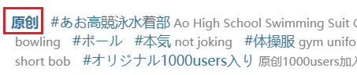
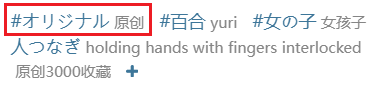

## 多图作品的图片数量上限

<div class="option settingsPanel_optionCard" data-no="20" data-pin-bound="true" style="display: flex;">
  <a href="http://localhost:3000/#/zh-cn/设置-抓取/多图作品?flag=20" target="_blank" class="has_tip settingNameStyle" data-xztip="_多图作品的图片数量上限提示" data-tip="如果一个多图作品里的图片数量大于设置的数字，下载器就不会抓取这个作品。" data-bind-click="true">
    <span data-xztext="_多图作品的图片数量上限">多图作品的图片<span class="key">数量</span>上限</span>
    <span class="gray1"> ? </span>
  </a>
  <input type="checkbox" name="multiImageWorkImageLimitSwitch" class="need_beautify checkbox_switch">
  <span class="beautify_switch" tabindex="0"></span>
  <div class="subOptionWrap" data-show="multiImageWorkImageLimitSwitch" style="display: none;">
    &lt;=&nbsp;
    <input type="text" name="multiImageWorkImageLimit" class="setinput_style blue" value="1">
  </div>
</div>

## 多图作品只抓取前几张图片

<div class="option settingsPanel_optionCard" data-no="21" data-pin-bound="true" style="display: flex;">
  <a href="http://localhost:3000/#/zh-cn/设置-抓取/多图作品?flag=21" target="_blank" class="settingNameStyle" data-bind-click="true">
    <span data-xztext="_多图作品只抓取前几张图片">多图作品只抓取<span class="key">前几张</span>图片</span>
  </a>
  <input type="checkbox" name="onlyCrawlFirstFewImagesSwitch" class="need_beautify checkbox_switch">
  <span class="beautify_switch" tabindex="0"></span>
  <div class="subOptionWrap noGrow" data-show="onlyCrawlFirstFewImagesSwitch" style="display: none;">
    <input type="text" name="onlyCrawlFirstFewImagesCount" class="setinput_style blue" value="1">
  </div>
  <button type="button" class="gray1 textButton showMsgBtn" data-title="_多图作品只抓取前几张图片" data-msg="_多图作品只抓取前几张图片的说明" data-xztext="_帮助">帮助</button>
</div>


你可以筛选原创作品和非原创作品。

**工作原理：**

用户在投稿时可以设置作品是不是原创的，这会成为作品的一个属性（`isOriginal`）。

对于原创作品，Pixiv 会在标签列表前面显示加粗的“原创”字样，例如：



如果不是原创作品，就没有加粗的“原创”字样。即使它含有原创相关的标签，它也**不是**原创作品，例如：



下载器会先检查作品的 `isOriginal` 属性来判断它是否为原创作品。如果 `isOriginal` 为 `true` 就是原创作品，否则就是非原创作品。

另外，下载器默认启用了 `宽松匹配` 规则：对于非原创作品，如果它含有任意一个特定标签，那么下载器在检查这个过滤时条件时，会把它视为原创作品。这些标签有：

```
原创,原創,創作,オリジナル,Original,original,Creation,creation,창작,오리지널,Asli,ออริจินัล,Оригинал
```

PS：如果你禁用了 `宽松匹配` 规则，那么下载器不会检查标签列表，所以非原创作品永远不会被视为原创作品。

## 多图作品只抓取后几张图片

<div class="option settingsPanel_optionCard new" data-no="22" data-pin-bound="true" style="display: flex;">
  <a href="http://localhost:3000/#/zh-cn/设置-抓取/多图作品?flag=22" target="_blank" class="settingNameStyle" data-bind-click="true">
    <span data-xztext="_多图作品只抓取后几张图片">多图作品只抓取<span class="key">后几张</span>图片</span>
  </a>
  <input type="checkbox" name="onlyCrawlLastFewImagesSwitch" class="need_beautify checkbox_switch">
  <span class="beautify_switch" tabindex="0"></span>
  <div class="subOptionWrap noGrow" data-show="onlyCrawlLastFewImagesSwitch" style="display: none;">
    <input type="text" name="onlyCrawlLastFewImagesCount" class="setinput_style blue" value="1">
  </div>
  <button type="button" class="gray1 textButton showMsgBtn" data-title="_多图作品只抓取后几张图片" data-msg="_多图作品只抓取后几张图片的说明" data-xztext="_帮助">帮助</button>
<span class="settingsPanel_newBadge" aria-hidden="true">
    <svg class="icon settingsPanel_newBadgeIcon" aria-hidden="true">
      <use xlink:href="#new"></use>
    </svg>
    </span></div>


你可以筛选原创作品和非原创作品。

**工作原理：**

用户在投稿时可以设置作品是不是原创的，这会成为作品的一个属性（`isOriginal`）。

对于原创作品，Pixiv 会在标签列表前面显示加粗的“原创”字样，例如：


如果不是原创作品，就没有加粗的“原创”字样。即使它含有原创相关的标签，它也**不是**原创作品，例如：


下载器会先检查作品的 `isOriginal` 属性来判断它是否为原创作品。如果 `isOriginal` 为 `true` 就是原创作品，否则就是非原创作品。

另外，下载器默认启用了 `宽松匹配` 规则：对于非原创作品，如果它含有任意一个特定标签，那么下载器在检查这个过滤时条件时，会把它视为原创作品。这些标签有：

```
原创,原創,創作,オリジナル,Original,original,Creation,creation,창작,오리지널,Asli,ออริจินัล,Оригинал
```

PS：如果你禁用了 `宽松匹配` 规则，那么下载器不会检查标签列表，所以非原创作品永远不会被视为原创作品。

## 多图作品不抓取前几张图片

<div class="option settingsPanel_optionCard new" data-no="23" data-pin-bound="true" style="display: flex;">
  <a href="http://localhost:3000/#/zh-cn/设置-抓取/多图作品?flag=23" target="_blank" class="settingNameStyle" data-bind-click="true">
    <span data-xztext="_多图作品不抓取前几张图片">多图作品不抓取<span class="key">前几张</span>图片</span>
  </a>
  <input type="checkbox" name="doNotCrawlFirstImagesSwitch" class="need_beautify checkbox_switch">
  <span class="beautify_switch" tabindex="0"></span>
  <div class="subOptionWrap noGrow" data-show="doNotCrawlFirstImagesSwitch" style="display: none;">
    <input type="text" name="doNotCrawlFirstImagesCount" class="setinput_style blue" value="1">
  </div>
  <button type="button" class="gray1 textButton showMsgBtn" data-title="_多图作品不抓取前几张图片" data-msg="_多图作品不抓取前几张图片的说明" data-xztext="_帮助">帮助</button>
<span class="settingsPanel_newBadge" aria-hidden="true">
    <svg class="icon settingsPanel_newBadgeIcon" aria-hidden="true">
      <use xlink:href="#new"></use>
    </svg>
    </span></div>


你可以筛选原创作品和非原创作品。

**工作原理：**

用户在投稿时可以设置作品是不是原创的，这会成为作品的一个属性（`isOriginal`）。

对于原创作品，Pixiv 会在标签列表前面显示加粗的“原创”字样，例如：


如果不是原创作品，就没有加粗的“原创”字样。即使它含有原创相关的标签，它也**不是**原创作品，例如：


下载器会先检查作品的 `isOriginal` 属性来判断它是否为原创作品。如果 `isOriginal` 为 `true` 就是原创作品，否则就是非原创作品。

另外，下载器默认启用了 `宽松匹配` 规则：对于非原创作品，如果它含有任意一个特定标签，那么下载器在检查这个过滤时条件时，会把它视为原创作品。这些标签有：

```
原创,原創,創作,オリジナル,Original,original,Creation,creation,창작,오리지널,Asli,ออริจินัล,Оригинал
```

PS：如果你禁用了 `宽松匹配` 规则，那么下载器不会检查标签列表，所以非原创作品永远不会被视为原创作品。

## 多图作品不抓取后几张图片

<div class="option settingsPanel_optionCard new" data-no="24" data-pin-bound="true" style="display: flex;">
  <a href="http://localhost:3000/#/zh-cn/设置-抓取/多图作品?flag=24" target="_blank" class="settingNameStyle" data-bind-click="true">
    <span data-xztext="_多图作品不抓取后几张图片">多图作品不抓取<span class="key">后几张</span>图片</span>
  </a>
  <input type="checkbox" name="doNotCrawlLastImagesSwitch" class="need_beautify checkbox_switch">
  <span class="beautify_switch" tabindex="0"></span>
  <div class="subOptionWrap noGrow" data-show="doNotCrawlLastImagesSwitch" style="display: none;">
    <input type="text" name="doNotCrawlLastImagesCount" class="setinput_style blue" value="1">
  </div>
  <button type="button" class="gray1 textButton showMsgBtn" data-title="_多图作品不抓取后几张图片" data-msg="_多图作品不抓取后几张图片的说明" data-xztext="_帮助">帮助</button>
<span class="settingsPanel_newBadge" aria-hidden="true">
    <svg class="icon settingsPanel_newBadgeIcon" aria-hidden="true">
      <use xlink:href="#new"></use>
    </svg>
    </span></div>


你可以筛选原创作品和非原创作品。

**工作原理：**

用户在投稿时可以设置作品是不是原创的，这会成为作品的一个属性（`isOriginal`）。

对于原创作品，Pixiv 会在标签列表前面显示加粗的“原创”字样，例如：


如果不是原创作品，就没有加粗的“原创”字样。即使它含有原创相关的标签，它也**不是**原创作品，例如：


下载器会先检查作品的 `isOriginal` 属性来判断它是否为原创作品。如果 `isOriginal` 为 `true` 就是原创作品，否则就是非原创作品。

另外，下载器默认启用了 `宽松匹配` 规则：对于非原创作品，如果它含有任意一个特定标签，那么下载器在检查这个过滤时条件时，会把它视为原创作品。这些标签有：

```
原创,原創,創作,オリジナル,Original,original,Creation,creation,창작,오리지널,Asli,ออริจินัล,Оригинал
```

PS：如果你禁用了 `宽松匹配` 规则，那么下载器不会检查标签列表，所以非原创作品永远不会被视为原创作品。

## 特定用户的多图作品不下载最后几张图片

<div class="option settingsPanel_optionCard" data-no="25" data-pin-bound="true">
  <a href="http://localhost:3000/#/zh-cn/设置-抓取/多图作品?flag=25" target="_blank" class="settingNameStyle" data-bind-click="true">
    <span data-xztext="_特定用户的多图作品不下载最后几张图片">特定用户的多图作品不下载<span class="key">最后几张</span>图片</span>
  </a>
  <slot data-name="DoNotDownloadLastFewImagesSlot"><span class="DoNotDownloadLastFewImagesWarp theme-white">
    <span class="controlBar">
    <span class="total">0</span>
      <button type="button" class="textButton expand" data-xztext="_展开">展开</button>
      <button type="button" class="textButton showAdd" data-xztext="_添加">添加</button>
    </span>
    <div class="addWrap">
      <div class="settingItem addInputWrap">
        <div class="inputItem uid">
          <span class="label uidLabel" data-xztext="_用户id">用户 ID（数字）</span>
          <input type="text" class="setinput_style blue addUidInput" data-xzplaceholder="_必须是数字" placeholder="必须是数字">
        </div>
        <div class="inputItem value">
          <span class="label nameLabel" data-xztext="_不下载最后几张图片">不下载最后几张图片</span>
          <input type="text" class="has_tip setinput_style blue addValueInput" data-xztip="_提示0表示不生效" data-tip="0 表示不生效">
        </div>
        <div class="btns">
          <button type="button" class="textButton add" data-xztitle="_添加" title="添加">
            <svg class="icon" aria-hidden="true">
              <use xlink:href="#yes_submit"></use>
            </svg>
          </button>
          
          <button type="button" class="textButton cancel" data-xztitle="_取消" title="取消">
            <svg class="icon" aria-hidden="true">
              <use xlink:href="#close_cancel"></use>
            </svg>
          </button>
        </div>
      </div>
    </div>
    <div class="listWrap" style="display: none;"></div>
  </span></slot>
</div>


