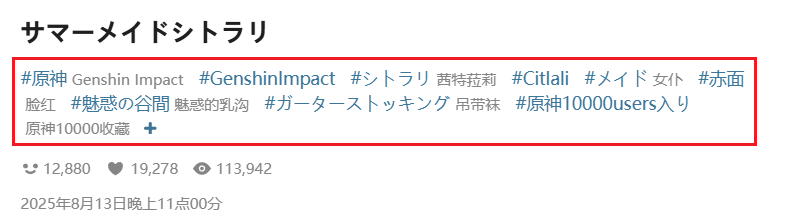

## 必须含有标签

  <a href="http://localhost:3000/#/zh-cn/设置-抓取/标签与标题?flag=15" target="_blank" class="has_tip settingNameStyle" data-xztip="_必须tag的提示文字" data-tip="您可在下载前设置作品里必须包含的标签，不区分大小写；如需包含多个标签，请使用英文逗号分隔。" data-bind-click="true">
    必须含有标签
     ? 
  </a>
  <input type="checkbox" name="needTagSwitch" class="need_beautify checkbox_switch">
  
  

    匹配模式：
    <input type="radio" name="needTagMode" id="needTagMode1" class="need_beautify radio" value="all" checked="">
    
    <label for="needTagMode1" data-xztext="_全部" class="active">全部</label>
    <input type="radio" name="needTagMode" id="needTagMode2" class="need_beautify radio" value="one">
    
    <label for="needTagMode2" data-xztext="_任一">任一</label>
    <textarea class="centerPanelTextArea beautify_scrollbar" name="needTag" rows="1" placeholder="tag1,tag2,tag3"></textarea>
  

你可以要求作品必须包含某些标签。没有这些标签的作品不会被抓取。

?>标签（tag）指的是作品简介下方的 Tag 列表，例如：

## 不能含有标签

  <a href="http://localhost:3000/#/zh-cn/设置-抓取/标签与标题?flag=16" target="_blank" class="has_tip settingNameStyle" data-xztip="_排除tag的提示文字" data-tip="您可在下载前设置要排除的标签，这样在下载时将不会下载含有这些标签的作品。&lt;br&gt;不区分大小写；如需排除多个标签，请使用英文逗号分隔。&lt;br&gt;请注意，要排除的标签的优先级大于要包含的标签的优先级。" data-bind-click="true">
    不能含有标签
     ? 
  </a>
  <input type="checkbox" name="notNeedTagSwitch" class="need_beautify checkbox_switch">
  
  

    匹配模式：
    任一
    
    <input type="radio" id="tagMatchMode1" class="need_beautify radio" name="tagMatchMode" value="partial" checked="">
    
    <label for="tagMatchMode1" data-xztext="_部分一致">部分一致</label>
    <input type="radio" id="tagMatchMode2" class="need_beautify radio" name="tagMatchMode" value="whole" checked="">
    
    <label for="tagMatchMode2" data-xztext="_完全一致" class="active">完全一致</label>
    <textarea class="centerPanelTextArea beautify_scrollbar" name="notNeedTag" rows="1" placeholder="tag1,tag2,tag3"></textarea>
  

你可以要求作品不能包含某些标签。如果作品有**任意一个**标签符合这里设置的标签，下载器就不会抓取它。

**提示：**

- 你可以添加多个标签，中间用**英文逗号** `,` 分割。
- 如果设置了多个标签，那么作品**只要符合其中任意一个**，就不会被下载。
- 不区分大小写。
- “不能含有标签”的**优先级**高于“必须含有标签”。如果一个作品同时符合这两个设置，下载器会排除它（也就是不会抓取和下载它）。
- 推荐使用日文（原始）tag。不推荐使用翻译后的标签。

## 针对特定用户屏蔽标签

  <a href="http://localhost:3000/#/zh-cn/设置-抓取/标签与标题?flag=17" target="_blank" class="has_tip settingNameStyle" data-xztip="_针对特定用户屏蔽tag的提示" data-tip="例如，抓取用户 123456 的作品时，排除特定的标签。" data-bind-click="true">
    针对特定用户屏蔽标签
     ? 
  </a>
  <input type="checkbox" name="blockTagsForSpecificUser" class="need_beautify checkbox_switch">
  
  

    <slot data-name="blockTagsForSpecificUser">

    

      0
      <button type="button" class="textButton expand" data-xztext="_收起">收起</button>
      <button type="button" class="textButton showAdd" data-xztext="_添加">添加</button>
    

    

      

        

          用户 ID（数字）
          <input type="text" class="setinput_style blue addUidInput" data-xzplaceholder="_必须是数字" placeholder="必须是数字">
        

        

          Tags
          <input type="text" class="setinput_style blue addTagsInput" data-xzplaceholder="_tag用逗号分割" placeholder="多个标签使用英文逗号,分割">
        

        

          <button type="button" class="textButton add" data-xztitle="_添加" title="添加">
            <svg class="icon" aria-hidden="true">
              <use xlink:href="#yes_submit"></use>
            </svg>
          </button>
          
          <button type="button" class="textButton cancel" data-xztitle="_取消" title="取消">
            <svg class="icon" aria-hidden="true">
              <use xlink:href="#close_cancel"></use>
            </svg>
          </button>
        

      

    

    

  
</slot>
  

## 标题必须含有

  <a href="http://localhost:3000/#/zh-cn/设置-抓取/标签与标题?flag=18" target="_blank" class="has_tip settingNameStyle" data-xztip="_标题必须含有的说明" data-tip="你可以要求作品的标题里必须含有特定字符。不区分大小写。&lt;br&gt;
你可以设置多条字符，每条之间使用逗号(,)分割。&lt;br&gt;
匹配模式是“任一”，即只要标题里含有任意一条设置的字符，下载器就会抓取它。" data-bind-click="true">
    标题必须含有
     ? 
  </a>
  <input type="checkbox" name="titleIncludeSwitch" class="need_beautify checkbox_switch">
  
  

    <textarea class="centerPanelTextArea beautify_scrollbar" name="titleIncludeList" rows="1" placeholder="word1,word2,word3"></textarea>
  

    <svg class="icon settingsPanel_newBadgeIcon" aria-hidden="true">
      <use xlink:href="#new"></use>
    </svg>
    

## 标题不能含有

  <a href="http://localhost:3000/#/zh-cn/设置-抓取/标签与标题?flag=19" target="_blank" class="has_tip settingNameStyle" data-xztip="_标题不能含有的说明" data-tip="你可以要求作品的标题里不能含有特定字符。不区分大小写。&lt;br&gt;
你可以设置多条字符，每条之间使用逗号(,)分割。&lt;br&gt;
匹配模式是“任一”，即只要标题里含有任意一条设置的字符，下载器就不会抓取它。&lt;br&gt;
排除的优先级大于包含的优先级。" data-bind-click="true">
    标题不能含有
     ? 
  </a>
  <input type="checkbox" name="titleExcludeSwitch" class="need_beautify checkbox_switch">
  
  

    <textarea class="centerPanelTextArea beautify_scrollbar" name="titleExcludeList" rows="1" placeholder="word1,word2,word3"></textarea>
    <label for="alsoCheckSeriesTitle" class="has_tip" data-xztext="_也检查系列标题" data-xztip="_也检查系列标题的说明" data-tip="如果作品属于一个系列，启用此设置可以同时检查系列标题是否符合条件。">也检查系列标题</label>
     ? 
    <input type="checkbox" name="alsoCheckSeriesTitle" id="alsoCheckSeriesTitle" class="need_beautify checkbox_switch" checked="">
    
  

    <svg class="icon settingsPanel_newBadgeIcon" aria-hidden="true">
      <use xlink:href="#new"></use>
    </svg>
    

