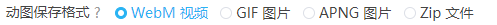
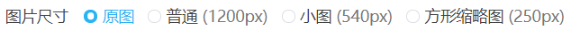
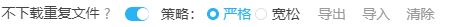

# 设置-更多-下载

## 动图保存格式



下载器在下载动图作品时，可以将其保存为 WebM 视频，或者 GIF 图片，或者 APNG 图片，或者 Zip 压缩包。

**各种格式的特点：**

-  WebM 视频画质高，体积小。是默认选项。但是在手机上使用可能不太方便。
-  GIF 格式是常用的动态图片格式。但是画质差，体积大。
-  APNG 格式是**无损**画质的动图格式。画质最佳，但是体积最大。
-  Zip 格式，不需要转换，但是没有动画效果。

**提醒：**

- 把动图转换为视频需要一些时间，如果下载动图时，进度条不动了，这是正常的，此时本程序在把动图转换为视频。
- 动图的源文件的体积越大，转换时的内存占用也越大。

### 转换动图时保持页面不被完全遮挡

下载器在转换动图时，如果当前页面被隐藏了，转换速度就会变得很慢。这是 Chrome 为了节省电量做出的限制。

转换动图时，如果你切换到了其他程序，请确保这个程序是窗口化的（不是最大化），让你**能够看到转换动图的页面的一部分**，这样就不会受到限制。

如果你要在转换期间切换到其他网页，可以先把转换动图的页面拖出来成为一个独立的窗口，然后把之前的浏览器窗口取消最大化，不要把转换的那个页面完全挡住。

---------

“隐藏”指这个页面被完全遮挡住，对用户来说是完全看不见的。例如：

- 用户切换到了另一个页面，导致页面看不到了
- 浏览器被最小化了，导致页面看不到了
- 浏览器被一个最大化的窗口遮挡了，导致页面看不到了

如果这个页面至少有一部分可以被用户看到，那么就不是隐藏状态。

## 同时转换多少个动图


默认值是 1，这是因为同时转换多个动图会增加资源占用。

**提醒：**

1. 如果资源占用太多，可能会导致页面崩溃。所以这个值不应该设置的太大。
2. 动图的同时转换数量不会超过下载线程数。也就是说同时下载几个，最多也就只能同时转换几个。

## 小说保存格式


你可以选择把小说保存为 txt 格式或者 epub 格式。

txt 格式通用性好，但是内容是纯文本，不能保存封面图片、超链接等数据。

epub 可以保存封面图片，保留文字的颜色，使用超链接。（前提是这个小说有这些数据）

epub 的阅读体验比较好，但是需要安装专门的软件才能打开查看。

## 在小说里保存元数据


如果你启用了这个选项，本程序会在小说内容的开头保存以下信息：

- 小说标题
- 作者
- 网址
- 简介
- 标签

如果你关闭了这个选项，那么小说内容里只有小说主体文本。

不管小说是保存成 txt 格式还是 epub ，都会应用这个设置。

## 下载小说的封面图片


该设置默认开启。

下载小说时，下载器会把封面图片单独保存。

封面图片的文件名和小说的文件名一致。

## 下载小说里的内嵌图片


该设置默认开启。

有些小说的正文里插入了图片，这就是内嵌图片。

下载器可以保存内嵌的图片。

下载的图片的文件名和小说的文件名一致。

- 如果小说的保存格式是 EPUB，图片会保存在 EPUB 里面。
- 如果小说的保存格式是 TXT，图片会单独保存。

对于体积比较大的 PNG 格式图片，有些小说阅读器可能不能完整显示图像。我在手机上的静读天下就出现了这个问题。这是小说阅读器的问题。

## 保存作品的元数据


```
保存作品的元数据 ?   插画   漫画   动图   小说 
```

如果用户勾选了对应的作品类型，下载器在下载这类作品时会为每一个作品建立一个 txt 文件，保存它的一些元数据，例如标题、简介、标签等。

效果图示例：


**提示：**

这个功能是会单独建立一个 txt 文件的，所以它适合保存图片作品的元数据，不太适合保存小说的元数据。

因为小说本来就是文本文件，如果再单独建立一个 txt 文件保存元数据，可能会导致混乱。小说的元数据还是建议使用“在小说里保存元数据”的设置。

## 图片尺寸



你可以选择下载的图片尺寸。

- 原图：原图尺寸
- 普通：最大尺寸为 1200*1200 px。如果原图比这个尺寸大，会按比例缩放到这个尺寸。
- 小图：最大尺寸为 540*540 px。如果原图比这个尺寸大，会按比例缩放到这个尺寸。
- 方形缩略图：尺寸为 250*250 px。总是正方形的。

?>这些尺寸的图片都是 Pixiv 自动生成的，不是下载器自己进行裁剪的结果。

注意：

方形缩略图总是正方形的，它不会保持图片原图的比例。

方形缩略图适合用作预览图、封面图，或者用来制作图标。

## 文件体积限制


当一个文件开始下载时，如果它的体积不在指定的范围内，下载器就会跳过下载这个文件。

默认未启用。

## 不下载重复文件



如果启用了“不下载重复文件”选项，那么下载器会跳过下载重复的文件。

?>查看视频教程：[不下载重复文件](https://www.youtube.com/watch?v=aTvwjjCz6rs&list=PLO2Mj4AiZzWEpN6x_lAG8mzeNyJzd478d&index=14':target=_blank')

### 原理

当成功下载了一个文件之后，下载器会在 IndexedDB 数据库里保存一条记录，包含作品的 id 、作品的修改日期、下载时的文件名。例如：

```
{
  "id": "85290993_p0",
  "d": "2021/05/22/13/07/51",
  "n": "85290993_p0-小日向ほしみ-原创,女孩子,原创,waitress,过膝袜.jpg"
}
```

在下载一个文件之前，下载器会查询记录，判断这个文件是不是重复文件。

**注意：**

1. 即使你没有开启这个功能，下载器也会生成下载记录，以备之后使用。
2. 如果你清除了浏览器数据中的“Cookie 及其他网站数据”，那么下载器的数据也被清空。
3. 下载器只会查询自己的下载记录，不会检查硬盘上的文件（因为没有这个权限）。所以这个方法并不完美。

假如你要下载的某个文件在硬盘上已存在，但是下载器没有记录，就仍然会下载它。

相反的，如果你之前下载过某个文件，之后在硬盘上把它删除了，但是在下载器里有记录，那么下载器就不会再次下载它（如果你没有开启此选项，则可以再次下载）。

### 严格策略

检查全部 3 个条件：

作品的 id 、作品的修改日期、下载时的文件名。

如果当前下载的这个文件存在下载记录，并且三个条件都完全一致（没有变化），则认为这个文件是重复文件。

### 宽松策略

检查 2 个条件：

作品的 id 、作品的修改日期。

不会比较文件名。

### 导出

点击导出按钮，可以导出所有下载记录，格式为 json 文件。

?>如果你清除了浏览器数据中的“Cookie 及其他网站数据”，那么下载器的数据也被清空。你可以先导出下载记录，以便之后进行恢复。

### 导入

点击导入按钮，你可以选择导出的下载记录文件，导入到下载器的下载记录里。

使用导入按钮，你只能导入 JSON 文件（下载器导出的记录文件）。

### 导入 id 列表

这是个隐藏功能，可以在页面上输入口令 `recordtxt` 使用。

本来，下载器只能导入自己导出的下载记录（JSON 文件），不支持导入其他格式的文件。

但是有用户想导入 txt 格式的 id 列表，如：

```
84334853_p0
84334853_p1
84334853_p2
```

所以我添加了这个隐藏功能。

txt 文件的内容必须是文件 ID（并且一定要带序号），否则即使导入了，和下载器内部的格式不一致，也是无法生效的。

**注意：** 导入 id 列表之后，只适合使用“宽松”策略。（因为这样只导入了 id，没有其他数据）

### 清除

清空下载器的所有下载记录。

即使你把下载到硬盘上的文件删除掉，但是下载器里依然会存在着它的下载记录。当你再次下载时，下载器会认为这个文件已经下载过了，导致下载器不会再下载它。

如果你遇到了这种情况，可以清除下载记录，或者关闭“不下载重复文件”的选项。

## 隐藏浏览器底部的下载栏


默认未启用。

启用之后，当浏览器下载文件时，不会在窗口底部显示下载栏。不仅本程序下载文件时不会显示下载栏，通过其他途径创建的下载任务也同样不会显示下载栏。
