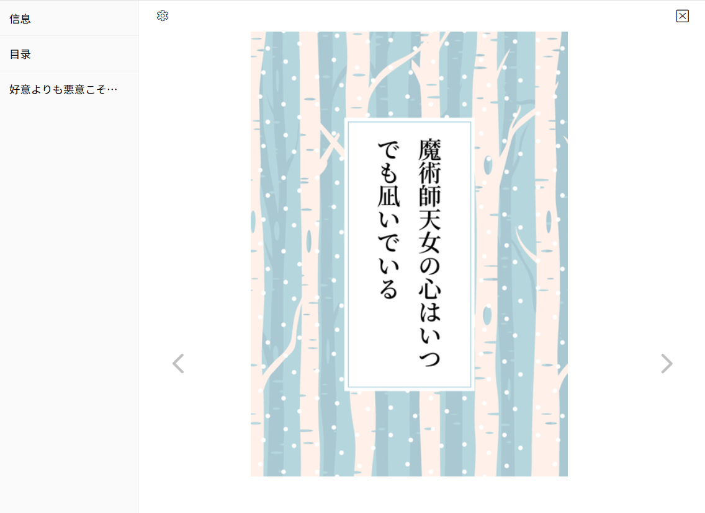

# 设置-更多-下载

## 下载完成后显示通知

<p class="option" data-no="52" style="display: flex;">
    <span class="has_tip settingNameStyle1" data-xztip="_下载完成后显示通知的说明" data-tip="当所有文件下载完成后显示一条系统通知。可能会请求通知权限。">
    <span data-xztext="_下载完成后显示通知">下载完成后显示<span class="key">通知</span></span>
    <span class="gray1"> ? </span>
    </span>
    <input type="checkbox" name="showNotificationAfterDownloadComplete" class="need_beautify checkbox_switch">
    <span class="beautify_switch" tabindex="0"></span>
    </p>

如果启用这个选项，下载器会在下载完所有文件后显示一条系统通知（可能会请求通知权限），还可能会有提示音（取决于操作系统设置）。

通知的样式根据操作系统而有所不同。Windows 10 可能会在屏幕右下角显示一条类似这样的通知：


如果你开启了勿扰模式，通知会被收纳进通知中心，此时不会在右下角显示（但可能依然会有提示音）。


## 下载间隔

<p class="option" data-no="90" style="display: flex;">
    <span class="has_tip settingNameStyle1" data-xztip="_下载间隔的说明" data-tip="每隔一定时间开始一次下载。&lt;br&gt;
默认值为 0，即无限制。&lt;br&gt;
如果设置为 1 秒钟，那么每小时最多会从 Pixiv 下载 3600 个文件。&lt;br&gt;
如果你担心因为下载文件太频繁导致账号被 Ban，可以设置大于 0 的数字，以缓解此问题。&lt;br&gt;">
    <span data-xztext="_下载间隔">下载<span class="key">间隔</span></span>
    <span class="gray1"> ? </span>
    </span>
    <span data-xztext="_当作品数量大于">当作品数量超过指定数量时启用：</span>
    <input type="text" name="downloadIntervalOnWorksNumber" class="setinput_style1 blue" value="120">
    <span class="verticalSplit"></span>
    <span data-xztext="_间隔时间">间隔时间：</span>
    <input type="text" name="downloadInterval" class="setinput_style1 blue" value="0">
    <span data-xztext="_秒">秒</span>
    </p>

你可以设置每隔多少秒，可以允许下载器开始一次下载。

?> 这个设置的目的是在大量下载时可以主动降低下载频率，以减少账号被 pixiv 封禁的可能性。

?> 你可以在下载途中修改此设置（例如修改间隔时间、启用或取消限制），修改会立即生效。

### 当作品数量超过指定数量时启用

如果本次**抓取结果里**的作品数量大于设置值，才会启用此设置。默认值是 `120`。

注意判断的是抓取结果数量，也就是一共需要下载多少个文件，而不是剩余多少个文件。假如抓取到了 120 个文件（符合条件），使此设置生效，那么就会始终保持，即使最后只剩下 1 个文件时，依然是生效的。

### 间隔时间

每当下载器**开始**下载一个文件时，都会设置一个计时器，经过间隔时间之后才会允许下一次下载。

?>这个设置在默认情况下不会产生作用，因为默认的间隔时间是 `0`，此时没有间隔时间。

**对工作方式的详细说明：**

如果设置为 `1` 秒钟，那么每小时最多会从 Pixiv 下载 3600 个文件。

间隔时间不受下载所需时间的影响：

如果上一个文件花费的时间超过了 1 秒钟，下载器不会等待它，而是在倒计时结束时开始下载下一个文件。也就是可能会同时下载多个文件。

如果一个文件在 1 秒钟之内就下载完了，下载器会继续等待，直到倒计时结束时才会开始下一次下载。当文件的下载用时都很短时，看起来是单线程下载，因为同时只有 1 个文件在下载。

## 点击收藏按钮时下载作品

<p class="option" data-no="76" style="display: flex;">
    <span class="settingNameStyle1">
    <span data-xztext="_点击收藏按钮时下载作品">点击<span class="key">收藏</span>按钮时下载作品</span>
    </span>
    <input type="checkbox" name="downloadOnClickBookmark" class="need_beautify checkbox_switch">
    <span class="beautify_switch" tabindex="0"></span>
    </p>

启用此功能之后，当你点击作品的收藏按钮时，下载器会自动下载这个作品。

主要有两种使用场景：

1. 点击作品右下角的收藏按钮：

 

2. 在作品页面内点击收藏按钮：


?> 虽然上面的截图是插画，但是该功能对小说作品也有效。

?> 必须**点击收藏按钮**才会触发此功能。下载器提供了一些批量收藏和快捷收藏的功能，但它们不需要点击收藏按钮，也就不会触发此功能。例如预览作品时按 B 可以收藏这个作品，此时不会触发此功能。

!> 在下载器不支持的页面类型里，这个功能不会生效，即使你手动点击收藏按钮也是如此。这是因为此功能需要下载器查找作品缩略图元素，但下载器在一些不常用的页面里不会执行这个动作。

下载器默认提供了这样的功能：


当你处于一个页面里时，把**鼠标放在插画缩略图上时**应该会看到右上角的按钮。

这说明下载器支持这个页面，也可以使用“点击收藏按钮时下载作品”功能。但如果下载器没有显示右上角的按钮，说明不支持该页面，此时也不能使用“点击收藏按钮时下载作品”的功能。

## 点击点赞按钮时下载作品

<p class="option" data-no="77" style="display: flex;">
    <span class="settingNameStyle1">
    <span data-xztext="_点击点赞按钮时下载作品">点击<span class="key">点赞</span>按钮时下载作品</span>
    </span>
    <input type="checkbox" name="downloadOnClickLike" class="need_beautify checkbox_switch">
    <span class="beautify_switch" tabindex="0"></span>
    </p>

启用此功能之后，当你在作品页面里点赞时，下载器会自动下载这个作品。

点赞按钮：


?> 虽然上面的截图是插画，但是该功能对小说作品也有效。

## 动图保存格式

<p class="option" data-no="4" style="display: flex;">
    <span class="has_tip settingNameStyle1" data-xztip="_动图保存格式的说明" data-tip="Pixiv 的动图的源文件是一个 Zip 压缩文件，里面包含了多张静态图片。下载器可以把它转换成其他格式。&lt;br&gt;
WebM 视频的体积最小，而且画质损失不明显。它是预设的选择。&lt;br&gt;
GIF 图片的兼容性最好，但是体积比较大，而且画质也比较差，不推荐。&lt;br&gt;
APNG 图片是无损压缩，画质最好，但体积通常是最大的。&lt;br&gt;
Zip 文件是源文件。">
    <span data-xztext="_动图保存格式"><span class="key">动图</span>保存格式</span>
    <span class="gray1"> ? </span>
    </span>
    <input type="radio" name="ugoiraSaveAs" id="ugoiraSaveAs1" class="need_beautify radio" value="webm" checked="">
    <span class="beautify_radio" tabindex="0"></span>
    <label for="ugoiraSaveAs1" data-xztext="_webmVideo" class="active">WebM 视频</label>
    <input type="radio" name="ugoiraSaveAs" id="ugoiraSaveAs3" class="need_beautify radio" value="gif"> 
    <span class="beautify_radio" tabindex="0"></span>
    <label for="ugoiraSaveAs3" data-xztext="_gif">GIF 图片</label>
    <input type="radio" name="ugoiraSaveAs" id="ugoiraSaveAs4" class="need_beautify radio" value="png"> 
    <span class="beautify_radio" tabindex="0"></span>
    <label for="ugoiraSaveAs4" class="has_tip" data-xztip="_无损" data-xztext="_apng" data-tip="无损">APNG 图片</label>
    <input type="radio" name="ugoiraSaveAs" id="ugoiraSaveAs2" class="need_beautify radio" value="zip"> 
    <span class="beautify_radio" tabindex="0"></span>
    <label for="ugoiraSaveAs2" data-xztext="_zipFile">Zip 文件</label>
    </p>

下载器在下载动图作品时，可以将其保存为多种格式，你可以根据需要选择其中一种。

**各种格式的特点：**

-  WebM 视频的画质高，并且体积也小，是默认选项。但是在手机上使用可能不太方便，因为它需要使用视频播放器打开。
-  GIF 图片是常用的动态图片格式，兼容性很好，但是画质差，体积也比较大。
-  APNG 图片是**无损**画质的动态图片格式。它的画质最佳，但是体积最大。另外它的兼容性也不太好，因为有些图片查看器或应用程序不支持播放 APNG 图片。
-  Zip 文件是动图的原始文件，未经转换。里面是多张静态图片，没有动画效果。

**提醒：**

- 把动图转换为其他格式需要一些时间，可能会花费几秒钟到几分钟，这取决于动图的原始尺寸、体积，以及转换的目标格式。
- 转换动图时，下载器的进度条可能不会变化，这是正常的，因为下载器在等待动图转换完成。
- 转换动图时会影响用户使用它所在的页面。此时页面可以滚动，但不能与页面上的元素进行交互。这是因为此时有一些同步代码会执行较长时间，阻塞了用户线程。

## 同时转换多少个动图

<p class="option" data-no="24" style="display: flex;">
    <span class="has_tip settingNameStyle1" data-xztip="_同时转换多少个动图的说明" data-tip="同时转换多个动图会增加资源占用。&lt;br&gt;
    建议不超过3。">
    <span data-xztext="_同时转换多少个动图">同时<span class="key">转换</span>多少个动图</span>
    <span class="gray1"> ? </span>
    </span>
    <input type="text" name="convertUgoiraThread" class="setinput_style1 blue" value="1">
    </p>

默认值是 1。

**说明：**

- 相较于下载静态图片，下载器在转换动图时会使用更多的 CPU 和内存资源。
- 同时转换多个动图会增加资源占用。如果一个页面的内存使用量太多，可能会导致页面崩溃，所以这个值不应该设置的太大。建议不超过 3。
- 动图的同时转换数量不会超过同时下载数量。如果下载器同时下载 3 个文件，那么同时最多也只会转换 3 个动图。

## 小说保存格式

<p class="option" data-no="26" style="display: flex;">
    <span class="has_tip settingNameStyle1" data-xztip="_小说保存格式的说明" data-tip="TXT 是纯文本文件。选择 TXT 格式时，小说里的图片会单独保存。&lt;br&gt;EPUB 是电子书格式，小说里的图片会内嵌到 EPUB 文件里。">
    <span data-xztext="_小说保存格式"><span class="key">小说</span>保存格式</span>
    <span class="gray1"> ? </span>
    </span>
    <input type="radio" name="novelSaveAs" id="novelSaveAs1" class="need_beautify radio" value="txt" checked="">
    <span class="beautify_radio" tabindex="0"></span>
    <label for="novelSaveAs1" class="active"> TXT </label>
    <input type="radio" name="novelSaveAs" id="novelSaveAs2" class="need_beautify radio" value="epub"> 
    <span class="beautify_radio" tabindex="0"></span>
    <label for="novelSaveAs2"> EPUB </label>
    </p>

你可以选择把小说保存为 TXT 或者 EPUB 格式。默认值是 TXT。

TXT 格式是纯文本，通用性好，但是不能显示富文本样式（例如文字样式、超链接等）。另外它也无法内嵌图片，所以下载器会单独保存小说的封面图和插图。

EPUB 是电子书格式，可以显示富文本样式，支持章节目录，并且可以在内部保存封面图片和插图。

虽然 EPUB 的阅读体验比较好，但是需要安装专门的软件才能查看，所以下载器的默认值是 TXT 格式。

## 在小说里保存元数据

<p class="option" data-no="27" style="display: flex;">
    <span class="has_tip settingNameStyle1" data-xztip="_在小说里保存元数据提示" data-tip="把小说的标题、作者、标签等信息保存到小说开头。">
    <span data-xztext="_在小说里保存元数据">在小说里保存<span class="key">元数据</span></span>
    <span class="gray1"> ? </span>
    </span>
    <input type="checkbox" name="saveNovelMeta" class="need_beautify checkbox_switch">
    <span class="beautify_switch" tabindex="0"></span>
    </p>

如果你启用了这个选项，本程序会在小说内容的开头保存以下信息：

- 小说标题
- 作者名字
- 小说网址
- 小说简介
- 小说标签

例如：

```
好意よりも悪意こそが信用の証である

切由

https://www.pixiv.net/novel/show.php?id=25731985

2025-08-28

土井先生追い討ちのターンです。胃薬もらいに行きましょうね。

#RKRN夢
#忍玉-夢
#rkrn夢
#RKRNプラス
#久々知兵助
#土井半助
#中在家長次
#SAN値チェックのお時間です
#逆方向の信用…
```

?> 不管小说保存成 TXT 还是 EPUB 格式，都会应用这个设置。

## 下载小说的封面图片

<p class="option" data-no="70" style="display: flex;">
    <span class="settingNameStyle1" data-xztext="_下载小说的封面图片">下载小说的<span class="key">封面</span>图片</span>
    <input type="checkbox" name="downloadNovelCoverImage" class="need_beautify checkbox_switch" checked="">
    <span class="beautify_switch" tabindex="0"></span>
    </p>

下载器会单独保存小说的封面图片，其文件名和小说的文件名一致，以便排列在一起。

示例：


如果你不想保存封面图片，可以关闭这个选项。

如果你把小说保存为 EPUB 格式，下载器还会为其添加内嵌的封面图片，例如：



目前不管你是否启用这个选项，下载器都始终会添加内嵌的封面。以后我打算让内嵌的封面也遵从这个设置，也就是如果你关闭了这个选项，下载器就不会添加内嵌的封面。

## 下载小说里的内嵌图片

<p class="option" data-no="72" style="display: flex;">
    <span class="settingNameStyle1" data-xztext="_下载小说里的内嵌图片">下载小说里的<span class="key">内嵌</span>图片</span>
    <input type="checkbox" name="downloadNovelEmbeddedImage" class="need_beautify checkbox_switch" checked="">
    <span class="beautify_switch" tabindex="0"></span>
    </p>

有些小说的正文里插入了图片（主要是 R-18 小说），这就是内嵌图片。

下载器默认会保存内嵌的图片。根据小说保存格式的不同，会有一些区别。

当小说保存为 TXT 时，图片会单独保存，其文件名和小说的文件名一致。例如：


当小说保存为 EPUB 时，图片不会单独保存，而是保存在 EPUB 里面。例如：


!> 对于体积比较大的 PNG 格式内嵌图片，有些小说阅读器可能只会显示一部分。这是阅读器的问题，和下载器无关。

## 保存作品的元数据

<p class="option" data-no="49" style="display: flex;">
    <span class="has_tip settingNameStyle1" data-xztip="_保存作品的元数据说明" data-tip="为每个作品生成一个 TXT 文件，保存它的元数据。">
    <span data-xztext="_保存作品的元数据">保存作品的<span class="key">元数据</span></span>
    <span class="gray1"> ? </span>
    </span>
    <input type="checkbox" name="saveMetaType0" id="setSaveMetaType0" class="need_beautify checkbox_common">
    <span class="beautify_checkbox" tabindex="0"></span>
    <label for="setSaveMetaType0" data-xztext="_插画">插画</label>
    <input type="checkbox" name="saveMetaType1" id="setSaveMetaType1" class="need_beautify checkbox_common">
    <span class="beautify_checkbox" tabindex="0"></span>
    <label for="setSaveMetaType1" data-xztext="_漫画">漫画</label>
    <input type="checkbox" name="saveMetaType2" id="setSaveMetaType2" class="need_beautify checkbox_common">
    <span class="beautify_checkbox" tabindex="0"></span>
    <label for="setSaveMetaType2" data-xztext="_动图">动图</label>
    <input type="checkbox" name="saveMetaType3" id="setSaveMetaType3" class="need_beautify checkbox_common">
    <span class="beautify_checkbox" tabindex="0"></span>
    <label for="setSaveMetaType3" data-xztext="_小说">小说</label>
    </p>

如果你选中了某些作品类型，下载器会在下载时为这些作品创建一个 TXT 文件，用来保存它的一些元数据。

示例：


?> 元数据的文件名的末尾有 `meta` 标记。

对于图像作品（插画、漫画、动图），下载器保存的元数据示例如下：

```
ID
120589699

URL
https://www.pixiv.net/i/120589699

Original
https://i.pximg.net/img-original/img/2024/07/16/19/51/00/120589699_p0.jpg

Thumbnail
https://i.pximg.net/c/250x250_80_a2/custom-thumb/img/2024/07/16/19/51/00/120589699_p0_custom1200.jpg

xRestrict
AllAges

AI
No

User
愛田乃彩

UserID
91879154

Title
マジシャンフリーナ

Description
(Twitter) https://twitter.com/aida_noa_
無断転載・使用禁止/All rights reserved.

Tags
#原神
#GenshinImpact
#フリーナ
#Furina
#女の子
#イラスト

Size
4096 x 2537

Bookmark
814

Date
2024-07-16T10:51:00+00:00
```

小说的元数据大致相同，但是没有 `Original` 和 `Size`。此外，小说的 `Thumbnail` 就是它的封面图片的 URL。

?> 小说作品有一个单独的设置用于保存元数据：[在小说里保存元数据](/zh-cn/设置-更多-下载?id=在小说里保存元数据)，它会在小说的开头保存一些元数据，无须创建单独的 TXT 文件，使用起来更方便。但是它所保存的元数据比较少。如果你已经启用了“在小说里保存元数据”，通常就不需要选择这个选项里的“小说”类型。

## 保存作品的简介

<p class="option" data-no="89" style="display: flex;">
    <span class="has_tip settingNameStyle1" data-xztip="_保存作品简介的说明" data-tip="生成 TXT 文件保存作品简介">
    <span data-xztext="_保存作品的简介">保存作品<span class="key">简介</span></span>
    <span class="gray1"> ? </span>
    </span>
    <input type="checkbox" name="saveWorkDescription" class="need_beautify checkbox_switch">
    <span class="beautify_switch" tabindex="0"></span>
    <span class="subOptionWrap" data-show="saveWorkDescription" style="display: none;">
    <label for="saveEachDescription" data-xztext="_每个作品分别保存" class="has_tip active" data-xztip="_简介的Links标记" data-tip="把每个作品的简介保存到单独的 TXT 文件里。&lt;br&gt;如果作品简介里含有超链接，下载器会在文件名末尾添加 'links' 标记">每个作品分别保存</label>
    <span class="gray1"> ? &nbsp;</span>
    <input type="checkbox" name="saveEachDescription" id="saveEachDescription" class="need_beautify checkbox_switch" checked> 
    <span class="beautify_switch" tabindex="0"></span>
    <span class="verticalSplit"></span>
    <label for="summarizeDescription" data-xztext="_汇总到一个文件">汇总到一个文件</label>
    <input type="checkbox" name="summarizeDescription" id="summarizeDescription" class="need_beautify checkbox_switch">
    <span class="beautify_switch" tabindex="0"></span>
    </span>
    </p>

如果你启用了这个功能，下载器会为每个作品创建一个 TXT 文件，保存它的简介。

作品的简介指标题下面的介绍文字。例如：


下载器保存的 TXT 简介文件：


TXT 简介文件的文件名里可能有 2 个标记：
1. 必定有`简介`标记。这个标记由下载器的语言设置决定，例如使用英语时，该标记是 `description`。
2. 如果简介里含有网址链接，下载器会添加 `links` 标记。

?>有些作品没有简介，此时下载器不会为其创建 TXT 简介文件。

这个设置有两个子选项，并且可以同时启用：

### 每个作品分别保存

为每个作品创建一个 TXT 简介文件。当你下载多个作品时，下载器会生成多个简介文件。

### 汇总到一个文件

当抓取完成时，下载器会生成一个 TXT 文件，汇总所有作品的简介。

这个文件的**保存位置**有两种情况：

1. 如果汇总文件里的简介数据来自多个不同用户的作品，它会直接保存到浏览器的下载目录里。因为此时它不属于某一个用户，不应该将其放入用户名的文件夹里。

2. 如果简介数据来自同一个用户，此时下载器会将其保存到命名规则的**第一个**文件夹里。对于默认的命名规则 `pixiv/{user}-{user_id}/{id}-{title}`，下载器会把这个文件保存到 `pixiv` 目录里：


但在之后的版本里，我打算对第 2 种情况进行优化：
- 如果命名规则里的某个文件夹里含有 `{user}`，下载器会把汇总文件保存到这个文件夹里。对于默认的命名规则，下载器会将其保存到 `pixiv/{user}-{user_id}/` 里。
- 如果命名规则里的文件夹都不包含 `{user}`，下载器会将其直接保存到浏览器的下载目录里。

汇总文件的**文件名**包含多个部分：
1. `简介汇总` 标记，会根据下载器的语言而变化。
2. `user` 标记，附带用户名。只有当汇总文件里的数据全部来自同一个用户时才有这个标记。
3. 当前网页标题
4. 时间和日期

例如：

```
简介汇总-user 飞天卷饼猫-#女の子 星极（重制版） - 飞天卷饼猫的插画 - pixiv-2025／9／2 22：47：38.txt
```

## 图片尺寸

<p class="option" data-no="30" style="display: flex;">
    <span class="settingNameStyle1" data-xztext="_图片尺寸">图片<span class="key">尺寸</span></span>
    <input type="radio" name="imageSize" id="imageSize1" class="need_beautify radio" value="original" checked="">
    <span class="beautify_radio" tabindex="0"></span>
    <label for="imageSize1" data-xztext="_原图" class="active">原图</label>
    <input type="radio" name="imageSize" id="imageSize2" class="need_beautify radio" value="regular">
    <span class="beautify_radio" tabindex="0"></span>
    <label for="imageSize2" data-xztext="_普通">普通</label>
    <span class="gray1">(1200px)</span>
    <input type="radio" name="imageSize" id="imageSize3" class="need_beautify radio" value="small">
    <span class="beautify_radio" tabindex="0"></span>
    <label for="imageSize3" data-xztext="_小图">小图</label>
    <span class="gray1">(540px)</span>
    <input type="radio" name="imageSize" id="imageSize4" class="need_beautify radio" value="thumb">
    <span class="beautify_radio" tabindex="0"></span>
    <label for="imageSize4" data-xztext="_方形缩略图">方形缩略图</label>
    <span class="gray1">(250px)</span>
    </p>

下载图像作品（插画、漫画、动图）时，你可以选择下载的图片尺寸。

- 原图：下载原图
- 普通：下载中等大小的图片，最大尺寸为 1200*1200 px。Pixiv 的作品页面里显示的预览图就是这个尺寸。如果原图比这个尺寸大，会按比例缩放到这个尺寸。
- 小图：最大尺寸为 540*540 px。如果原图比这个尺寸大，会按比例缩放到这个尺寸。
- 方形缩略图：尺寸为 250*250 px。它总是正方形的，不会保持和原图一致的比例。

?>这些尺寸的图片都是 Pixiv 自动生成的。下载器不会对图片进行裁剪或转换。

?> 下载动图时，前 3 个选项是相同的，因为动图没有对应尺寸的图片，所以下载器都会下载动图的源文件。“方形缩略图”对动图则是有效的。

--------------

有时候也许你不需要下载原图，只是想要查看作品的缩略图，就可以选择更小的尺寸，以加快下载速度。

还有些其他的使用场景：

有时你可能想批量收藏一些作品，但是并不需要下载它们的原图。此时你可以启用“下载之后收藏作品”选项，并把图片尺寸设置为“方形缩略图”。最后下载这些作品即可。

!> 当你选择了较小的尺寸，并且**文件数量很多**时，下载频率可能会非常快，例如 1 秒钟可能下载接近 10 个图片。此时建议你设置 [下载间隔](/zh-cn/设置-更多-下载?id=下载间隔) 时间，主动降低下载频率，否则可能会被 Pixiv 警告。

## 文件体积限制

<p class="option" data-no="25" style="display: flex;">
    <span class="has_tip settingNameStyle1" data-xztip="_文件体积限制的说明" data-tip="如果一个文件的体积不符合要求，下载器就不会下载它。">
    <span data-xztext="_文件体积限制">文件<span class="key">体积</span>限制</span>
    <span class="gray1"> ? </span>
    </span>
    <input type="checkbox" name="sizeSwitch" class="need_beautify checkbox_switch">
    <span class="beautify_switch" tabindex="0"></span>
    <span class="subOptionWrap" data-show="sizeSwitch" style="display: none;">
    <input type="text" name="sizeMin" class="setinput_style1 blue" value="0">MiB
    &nbsp;-&nbsp;
    <input type="text" name="sizeMax" class="setinput_style1 blue" value="100">MiB
    </span>
    </p>

如果你对文件体积有要求，可以设置一个范围。

?>这里可以输入带小数点的数字，例如 `0.5`。

当下载器开始下载一个文件时，能够获取它的体积。如果它不符合你设置的条件，下载器会取消下载它，并显示一条日志：

<span class="log" style="color: rgb(210, 126, 0);"><a href="https://www.pixiv.net/i/133950803#3" target="_blank">133950803_p2</a> 没有被保存，因为它的体积不符合设定。<br></span>

?> 这个检查发生在下载阶段。抓取时不会检查这个设置。

## 文件下载顺序

<p class="option" data-no="82" style="display: flex;">
    <span class="settingNameStyle1" data-xztext="_文件下载顺序">文件下载<span class="key">顺序</span></span>
    <input type="checkbox" name="setFileDownloadOrder" class="need_beautify checkbox_switch">
    <span class="beautify_switch" tabindex="0"></span>
    <span class="subOptionWrap" data-show="setFileDownloadOrder" style="display: none;">
    <span class="settingNameStyle1" data-xztext="_排序依据">排序依据</span>
    <input type="radio" name="downloadOrderSortBy" id="downloadOrderSortBy1" class="need_beautify radio" value="ID" checked="">
    <span class="beautify_radio" tabindex="0"></span>
    <label for="downloadOrderSortBy1" data-xztext="_作品ID" class="active">作品 ID</label>
    <input type="radio" name="downloadOrderSortBy" id="downloadOrderSortBy2" class="need_beautify radio" value="bookmarkCount">
    <span class="beautify_radio" tabindex="0"></span>
    <label for="downloadOrderSortBy2" data-xztext="_收藏数量2">收藏数量</label>
    <input type="radio" name="downloadOrderSortBy" id="downloadOrderSortBy3" class="need_beautify radio" value="bookmarkID">
    <span class="beautify_radio" tabindex="0"></span>
    <label for="downloadOrderSortBy3" data-xztext="_收藏时间">收藏时间</label>
    <span class="verticalSplit"></span>
    <input type="radio" name="downloadOrder" id="downloadOrder1" class="need_beautify radio" value="desc" checked="">
    <span class="beautify_radio" tabindex="0"></span>
    <label for="downloadOrder1" data-xztext="_降序" class="active">降序</label>
    <input type="radio" name="downloadOrder" id="downloadOrder2" class="need_beautify radio" value="asc">
    <span class="beautify_radio" tabindex="0"></span>
    <label for="downloadOrder2" data-xztext="_升序">升序</label>
    </span>
    </p>

有些用户希望下载器按照某种顺序下载文件，这样他们在资源管理器里按照**修改时间**排序时，文件是有规律的。

如果你有需要的话可以启用这个设置，但通常没有必要。我不推荐按照修改时间来对作品排序，因为这个方式并不可靠，特别是有些文件被重复下载时，它的修改时间会刷新，导致排序不再符合预期。

这个设置有 2 个子选项：
1. **排序依据**：指示下载器如何对文件进行排序。
2. **排序方式**：指示下载器如何下载文件。如果设置为 `降序`，下载器会先下载数值大的文件，后下载数值小的文件。`升序` 则相反。

---------

**使用特定命名标记**，并且按照文件名排序可以实现相同的效果，并且更可靠，因为文件名与修改时间无关，在重复下载时不会受影响。

- 如果你想按照 `作品 ID` 排序的话，可以在文件名开头使用 `{id}`。
- 如果你想按照 `收藏数量` 排序的话，可以在文件名开头使用 `{bmk}`。
- 如果你想按照 `收藏时间` 排序的话，可以在文件名开头使用 `{bmk_id}`。

参考：[使用命名标记排序](/zh-cn/设置-下载?id=使用命名标记排序)。

-----------------

**注意：** 启用此设置可能会增加下载完成所需要的时间。

这是因为当下载器同时下载多个文件时，后面的文件可能比前面的文件更早完成下载。为了保持下载顺序，下载器会让后面的文件等待一段时间。

例如下载线程为 5，下载的文件的顺序编号是 1、2、3、4、5，但是 5 最先完成下载。下载器会让 5 等待 1、2、3、4 全部下载并保存到硬盘上之后，再保存 5。这就导致 5 需要等待一段时间，所以这有可能导致下载时间增加。

当下载的文件中有动图时，等待时间很容易进一步增加。假如一个动图下载后开始转换（甚至假设它是第一个，还没下载完，更没有开始转换），此时后面的图片已经下载完了，但是由于动图没转换完，所以后面的图片都要等待这个动图转换完成。也就是说其他下载线程被这个动图阻塞了。由于动图转换花费的时间可能会比较久，所以等待时间也会更多。

## 不下载重复文件

<p class="option" data-no="28" style="display: flex;">
    <span data-xztext="_不下载重复文件">不下载<span class="key">重复</span>文件</span>
    <input type="checkbox" name="deduplication" class="need_beautify checkbox_switch">
    <span class="beautify_switch" tabindex="0"></span>
    <span class="subOptionWrap" data-show="deduplication" style="display: none;">
    &nbsp; <span data-xztext="_策略">策略：</span>
    <input type="radio" name="dupliStrategy" id="dupliStrategy1" class="need_beautify radio" value="strict" checked="">
    <span class="beautify_radio" tabindex="0"></span>
    <label class="has_tip" for="dupliStrategy1" data-xztip="_严格模式说明" data-xztext="_严格" data-tip="判断条件：作品的 id、上传日期、文件名">严格</label>
    <input type="radio" name="dupliStrategy" id="dupliStrategy2" class="need_beautify radio" value="loose">
    <span class="beautify_radio" tabindex="0"></span>
    <label class="has_tip active" for="dupliStrategy2" data-xztip="_宽松模式说明" data-xztext="_宽松" data-tip="判断条件：作品的 id、上传日期">宽松</label>
    <button class="textButton gray1" type="button" id="exportDownloadRecord" data-xztext="_导出">导出</button>
    <button class="textButton gray1" type="button" id="importDownloadRecord" data-xztext="_导入">导入</button>
    <button class="textButton gray1" type="button" id="clearDownloadRecord" data-xztext="_清除">清除</button>
    </span>
    </p>

如果你启用了这个功能，那么下载器会跳过下载重复的文件。

### 工作原理

当下载器成功下载了一个文件之后，会在浏览器的 IndexedDB 数据库里保存一条下载记录，包含作品的 ID 、作品的修改日期、下载时的文件名。例如：

```
{
  "id": "85290993_p0",
  "d": "2021/05/22/13/07/51",
  "n": "85290993_p0-小日向ほしみ-原创,女孩子,原创,waitress,过膝袜.jpg"
}
```

?> 即使你没有启用这个功能，下载器也会保存下载记录，以备之后使用。

如果你启用了这个功能，下载器在下载每一个文件之前都会查询记录，判断这个文件是不是重复文件。

当下载器跳过了重复文件之后，会在顶部日志里显示文件 ID 列表，例如：

<span class="log" style="color: inherit;"><span style="color:#d27e00">因为不下载重复文件，跳过了 1 个文件 : </span><br><a href="https://www.pixiv.net/n/25755517" target="_blank">25755517</a><br></span>

### 注意事项

如果一个文件被跳过，那么它的一些附属任务也会被跳过，例如：
- 保存作品的元数据
- 保存作品简介
- 下载小说的封面图片
- 下载小说里的内嵌图片

不过“下载之后收藏作品”功能不受影响。

!>如果你清除了浏览器数据中的“Cookie 及其他网站数据”，会导致下载器保存的数据也被清空。如果你需要使用不下载重复文件的功能，请在清理数据之前使用“导出”按钮导出下载记录。

另外，这个方法**并不完全可靠**，因为下载器只能查询自己的下载记录，不能检查硬盘上的文件（因为没有这个权限）。

- 假如你要下载的某个文件在硬盘上已存在，但是下载器没有记录，就仍然会下载它。
- 反之，如果你之前下载过某个文件，之后在硬盘上把它删除了，但是在下载器里有记录，那么下载器就不会再次下载它（除非你关闭这个功能，或者修改策略，使其可以再次下载）。

### 严格策略

检查全部的 3 个条件： 作品的 ID、修改日期、下载时的文件名。

如果当前下载的这个文件存在下载记录，并且三个条件都完全一致，则认为这个文件是重复文件。

### 宽松策略

只检查 2 个条件：作品的 ID、修改日期。

不会检查文件名是否相同。

### 导出

点击导出按钮即可导出下载器的下载记录。这是一个 JSON 文件，直接保存在浏览器的下载目录里。

这可以用于备份，例如在清理浏览器数据之前导出下载记录。你也可以从一个浏览器里导出下载记录，然后在另一个浏览器里导入。

?>下载器会在页面顶部的日志里显示导出进度。如果下载记录很多，那么导出需要一些时间，请等待下载器提示导出完毕。

### 导入

点击导入按钮，你可以选择之前导出的下载记录（JSON 文件）进行导入。

导入数据时不会清空之前的下载记录，所以你可以导入多个下载记录文件（如果有），这些记录会合并到一起。

?>下载器会在页面顶部的日志里显示导入进度。如果下载记录很多，那么导入需要一些时间，请等待下载器提示导入完毕。

### 导入 ID 列表

这是个隐藏功能，可以在页面上输入口令 `recordtxt` 使用（在 pixiv 的网页上依次按下这几个按键即可）。

下载器的“导入”按钮只能导入 JSON 文件，但是有些用户想导入自己制作的 TXT 格式的 ID 列表，所以我添加了这个隐藏功能。

**适用场景：**
1. 你在使用这个下载器之前已经下载了很多文件，它们没有对应的下载记录，所以你想手动制作下载记录。
2. 你意外清除了下载器的下载记录，想在一定程度上重建下载记录。

你需要自行获取之前下载的作品的 ID 列表（例如使用 shell 命令生成文件列表），并保存到一个 TXT 文件里，以换行分割。格式如下所示：

```
84334853_p0
84334853_p1
84334853_p2
```

每行一个文件 ID。图像作品（插画、漫画、动图）的 ID 一定要带序号。小说作品则不需要带序号，因为它本来就没有序号。

?>导入 ID 列表之后，只适合使用“宽松”策略。因为这样只导入了 ID，没有其他数据，所以无法使用“严格”策略。

### 清除

清空下载器的所有下载记录。

即使你把下载到硬盘上的文件删除掉，但是下载器里依然会存在着它的下载记录。当你再次下载时，下载器会认为这个文件已经下载过了，导致下载器不会再下载它。

如果你遇到了这种情况，可以清除下载记录，或者关闭“不下载重复文件”的选项。

?>下载器会在页面顶部的日志里显示清除进度。如果下载记录很多，那么清除需要一些时间，请等待下载器提示清除完毕。
